# Antenna Surface Mount Ceramic Yageo ANT3216LL00R2400A 3216

`electronic_antenna_3216_surface_mount_ceramic_yageo_ant3216ll00r2400a`

Antenna Surface Mount Ceramic Yageo ANT3216LL00R2400A 3216 is an OOMP electronic antenna definition. It uses the 3216 package or form factor. Its nominal drawing size is 3.2 &#x00D7; 1.6 mm. The definition includes 2 documented pins.

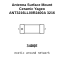

## At a glance

| Detail | Value |
| --- | --- |
| OOMP ID | `electronic_antenna_3216_surface_mount_ceramic_yageo_ant3216ll00r2400a` |
| Type | Antenna |
| Package / style | 3216 |
| Nominal size | 3.2 &#x00D7; 1.6 mm |
| Documented pins | 2 |

## Classification

| Level | Value |
| --- | --- |
| 1 | `electronic` |
| 2 | `antenna` |
| 3 | `3216` |
| 4 | `surface_mount` |
| 5 | `ceramic` |
| 14 | `yageo` |
| 15 | `ant3216ll00r2400a` |

## Nominal dimensions

| Measurement | Value |
| --- | ---: |
| Length | 3.2 mm |
| Width | 1.6 mm |

## Pins

| Pin | Name | Type |
| ---: | --- | --- |
| 1 | 1 | signal |
| 2 | 2 | signal |

## Used in projects

| Project | Quantity | References | Explore |
| --- | ---: | --- | --- |
| [Project electrolama/oshcamp23-badge OSHCamp 2023 Badge current](https://github.com/electrolama/oshcamp23-badge/tree/main/oomp/version_current/working) | 2 | ANT1, ANT2 | [Board explorer](https://oomlout.github.io/oomp_electronic_version_5/parts/oomp_project_github_electrolama_oshcamp23_badge_oshcamp23_badge_current/board_explorer.html) · [OOMP project](https://github.com/oomlout/oomp_electronic_version_5/tree/main/parts/oomp_project_github_electrolama_oshcamp23_badge_oshcamp23_badge_current) |

## Files

[KiCad symbol, machine-solder and hand-solder footprints](data/kicad/README.md) · [Availability and source masters](data/kicad/manifest.yaml)

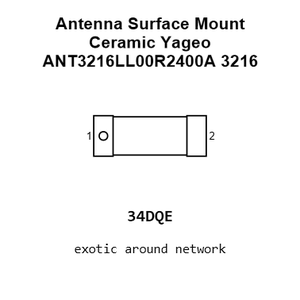

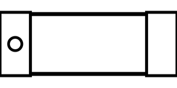

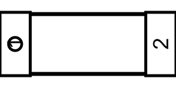

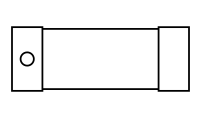

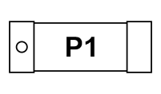

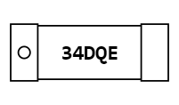

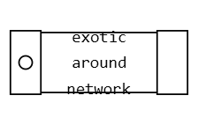

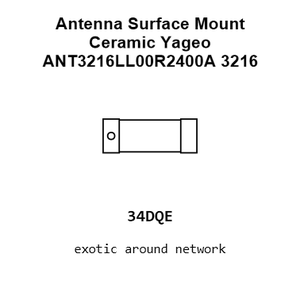

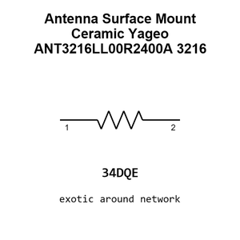

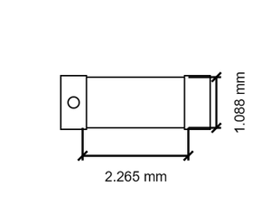

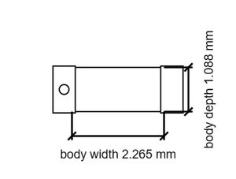

[View this part on GitHub](https://github.com/oomlout/oomp_electronic_version_5/tree/main/parts/electronic_antenna_3216_surface_mount_ceramic_yageo_ant3216ll00r2400a)

[Browse this category](../../navigation/electronic/antenna/3216/surface_mount/ceramic/yageo/README.md)

---

This page is generated from the OOMP part definition by a Roboclick Jinja template. Edit the source taxonomy or template rather than this generated file.