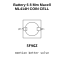
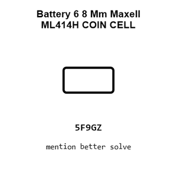
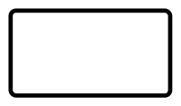
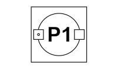
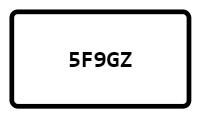
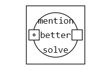
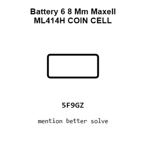
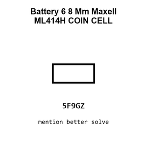
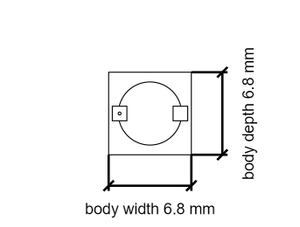

# Battery 6 8 Mm Maxell ML414H COIN CELL

`electronic_battery_coin_cell_6_8_mm_maxell_ml414h`

Battery 6 8 Mm Maxell ML414H COIN CELL is an OOMP electronic battery definition. It uses the coin cell package or form factor. Its nominal drawing size is 6.8 &#x00D7; 6.8 mm. The definition includes 2 documented pins.

## At a glance

| Detail | Value |
| --- | --- |
| OOMP ID | `electronic_battery_coin_cell_6_8_mm_maxell_ml414h` |
| Type | Battery |
| Package / style | coin cell |
| Nominal size | 6.8 &#x00D7; 6.8 mm |
| Documented pins | 2 |

## Classification

| Level | Value |
| --- | --- |
| 1 | `electronic` |
| 2 | `battery` |
| 3 | `coin_cell` |
| 4 | `6_8_mm` |
| 14 | `maxell` |
| 15 | `ml414h` |

## Nominal dimensions

| Measurement | Value |
| --- | ---: |
| Length | 6.8 mm |
| Width | 6.8 mm |

## Pins

| Pin | Name | Type |
| ---: | --- | --- |
| 1 | + | signal |
| 2 | - | signal |

## Files

[KiCad symbol, machine-solder and hand-solder footprints](data/kicad/README.md) · [Availability and source masters](data/kicad/manifest.yaml)

[View this part on GitHub](https://github.com/oomlout/oomp_electronic_version_5/tree/main/parts/electronic_battery_coin_cell_6_8_mm_maxell_ml414h)

[Browse this category](../../navigation/electronic/battery/coin_cell/6_8_mm/maxell/README.md)

---

This page is generated from the OOMP part definition by a Roboclick Jinja template. Edit the source taxonomy or template rather than this generated file.