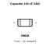
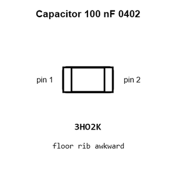
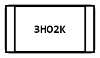
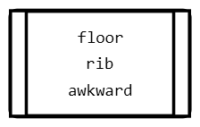
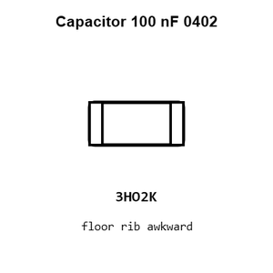
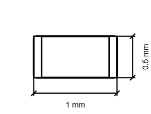
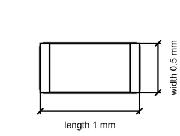

# Capacitor 100 nF 0402

`electronic_capacitor_0402_100_nano_farad`

Capacitor 100 nF 0402 is an OOMP electronic capacitor definition. It uses the 0402 package or form factor. Its nominal drawing size is 1.0 &#x00D7; 0.5 mm.

## At a glance

| Detail | Value |
| --- | --- |
| OOMP ID | `electronic_capacitor_0402_100_nano_farad` |
| Type | Capacitor |
| Package / style | 0402 |
| Nominal size | 1.0 &#x00D7; 0.5 mm |

## Classification

| Level | Value |
| --- | --- |
| 1 | `electronic` |
| 2 | `capacitor` |
| 3 | `0402` |
| 4 | `100_nano_farad` |

## Nominal dimensions

| Measurement | Value |
| --- | ---: |
| Length | 1.0 mm |
| Width | 0.5 mm |

## Used in projects

| Project | Quantity | References | Explore |
| --- | ---: | --- | --- |
| [Project dangerousprototypes/buspirate5_hardware 5_rev10a](https://github.com/DangerousPrototypes/BusPirate5-hardware) | 58 | C103, C110, C111, C112, C113, C114, C115, C116, C117, C118, C121, C301, C302, C303, C304, C305, C306, C307, C308, C309, C310, C311, C312, C313, C314, C315, C316, C403, C406, C414, C415, C416, C501, C502, C503, C506, C508, C510, C602, C605, C701, C702, C703, C704, C705, C706, C707, C708, C710, C712, C713, C714, C715, C716, C717, C718, C719, C720 | [Board explorer](https://oomlout.github.io/oomp_electronic_version_5/parts/oomp_project_github_dangerousprototypes_buspirate5_hardware_5_rev10a/board_explorer.html) · [OOMP project](https://github.com/oomlout/oomp_electronic_version_5/tree/main/parts/oomp_project_github_dangerousprototypes_buspirate5_hardware_5_rev10a) |
| [Project electrolama/pt1 current](https://github.com/electrolama/pt1) | 5 | C2, C6, C9, C10, C14 | [Board explorer](https://oomlout.github.io/oomp_electronic_version_5/parts/oomp_project_github_electrolama_pt1_current/board_explorer.html) · [OOMP project](https://github.com/oomlout/oomp_electronic_version_5/tree/main/parts/oomp_project_github_electrolama_pt1_current) |
| [Project hanqaqa/easyduino ESP32 current](https://github.com/Hanqaqa/Easyduino/tree/master/ESP32) | 6 | C2, C3, C4, C6, C9, C10 | [Board explorer](https://oomlout.github.io/oomp_electronic_version_5/parts/oomp_project_github_hanqaqa_easyduino_esp32_current/board_explorer.html) · [OOMP project](https://github.com/oomlout/oomp_electronic_version_5/tree/main/parts/oomp_project_github_hanqaqa_easyduino_esp32_current) |

## Files

[KiCad symbol, machine-solder and hand-solder footprints](data/kicad/README.md) · [Availability and source masters](data/kicad/manifest.yaml)

[View this part on GitHub](https://github.com/oomlout/oomp_electronic_version_5/tree/main/parts/electronic_capacitor_0402_100_nano_farad)

[Browse this category](../../navigation/electronic/capacitor/0402/README.md)

---

This page is generated from the OOMP part definition by a Roboclick Jinja template. Edit the source taxonomy or template rather than this generated file.