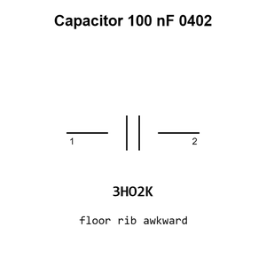

# Capacitor 100 nF 0402

`electronic_capacitor_0402_100_nano_farad`

Capacitor 100 nF 0402 is an OOMP electronic capacitor definition. It uses the 0402 package or form factor. Its nominal drawing size is 1.0 &#x00D7; 0.5 mm.

## At a glance

| Detail | Value |
| --- | --- |
| OOMP ID | `electronic_capacitor_0402_100_nano_farad` |
| Type | Capacitor |
| Package / style | 0402 |
| Nominal size | 1.0 &#x00D7; 0.5 mm |

## Classification

| Level | Value |
| --- | --- |
| 1 | `electronic` |
| 2 | `capacitor` |
| 3 | `0402` |
| 4 | `100_nano_farad` |

## Nominal dimensions

| Measurement | Value |
| --- | ---: |
| Length | 1.0 mm |
| Width | 0.5 mm |

## Identifiers

| Identifier | Value |
| --- | --- |
| Manufacturer part number | `CC0402KRX7R7BB104` |
| LCSC | [`C60474`](https://www.lcsc.com/product-detail/C60474.html) |
| LCSC | [`C1525`](https://www.lcsc.com/product-detail/C1525.html) |
| LCSC | [`C131394`](https://www.lcsc.com/product-detail/C131394.html) |

## Used in projects

| Project | Quantity | References | Explore |
| --- | ---: | --- | --- |
| [Project adafruit/Adafruit-Feather-RP2040-Adalogger-PCB Adafruit Feather RP2040 Adalogger current](https://github.com/adafruit/Adafruit-Feather-RP2040-Adalogger-PCB/blob/main/Adafruit%20Feather%20RP2040%20Adalogger.brd) | 7 | C6, C7, C9, C12, C13, C14, C18 | [Board explorer](https://oomlout.github.io/oomp_electronic_version_5/parts/oomp_project_github_adafruit_adafruit_feather_rp2040_adalogger_pcb_adafruit_feather_rp2040_adalogger_current/board_explorer.html) · [OOMP project](https://github.com/oomlout/oomp_electronic_version_5/tree/main/parts/oomp_project_github_adafruit_adafruit_feather_rp2040_adalogger_pcb_adafruit_feather_rp2040_adalogger_current) |
| [Project adafruit/Adafruit-Feather-RP2040-DVI-PCB Adafruit Feather RP2040 DVI current](https://github.com/adafruit/Adafruit-Feather-RP2040-DVI-PCB/blob/main/Adafruit%20Feather%20RP2040%20DVI.brd) | 7 | C6, C7, C9, C12, C13, C14, C18 | [Board explorer](https://oomlout.github.io/oomp_electronic_version_5/parts/oomp_project_github_adafruit_adafruit_feather_rp2040_dvi_pcb_adafruit_feather_rp2040_dvi_current/board_explorer.html) · [OOMP project](https://github.com/oomlout/oomp_electronic_version_5/tree/main/parts/oomp_project_github_adafruit_adafruit_feather_rp2040_dvi_pcb_adafruit_feather_rp2040_dvi_current) |
| [Project adafruit/Adafruit-Feather-RP2040-RFM-PCB Adafruit Feather RP2040 RFM current](https://github.com/adafruit/Adafruit-Feather-RP2040-RFM-PCB/blob/main/Adafruit%20Feather%20RP2040%20RFM.brd) | 7 | C6, C7, C9, C12, C13, C14, C18 | [Board explorer](https://oomlout.github.io/oomp_electronic_version_5/parts/oomp_project_github_adafruit_adafruit_feather_rp2040_rfm_pcb_adafruit_feather_rp2040_rfm_current/board_explorer.html) · [OOMP project](https://github.com/oomlout/oomp_electronic_version_5/tree/main/parts/oomp_project_github_adafruit_adafruit_feather_rp2040_rfm_pcb_adafruit_feather_rp2040_rfm_current) |
| [Project adafruit/Adafruit-Feather-RP2040-ThinkInk Adafruit Feather RP2040 Think Ink current](https://github.com/adafruit/Adafruit-Feather-RP2040-ThinkInk/blob/main/Adafruit%20Feather%20RP2040%20ThinkInk.brd) | 7 | C6, C7, C9, C12, C13, C14, C18 | [Board explorer](https://oomlout.github.io/oomp_electronic_version_5/parts/oomp_project_github_adafruit_adafruit_feather_rp2040_think_ink_adafruit_feather_rp2040_think_ink_current/board_explorer.html) · [OOMP project](https://github.com/oomlout/oomp_electronic_version_5/tree/main/parts/oomp_project_github_adafruit_adafruit_feather_rp2040_think_ink_adafruit_feather_rp2040_think_ink_current) |
| [Project adafruit/Adafruit-Feather-RP2040-USB-Host-PCB Adafruit Feather RP2040 USB Host current](https://github.com/adafruit/Adafruit-Feather-RP2040-USB-Host-PCB/blob/main/Adafruit%20Feather%20RP2040%20USB%20Host.brd) | 9 | C6, C7, C9, C12, C13, C14, C18, C26, C27 | [Board explorer](https://oomlout.github.io/oomp_electronic_version_5/parts/oomp_project_github_adafruit_adafruit_feather_rp2040_usb_host_pcb_adafruit_feather_rp2040_usb_host_current/board_explorer.html) · [OOMP project](https://github.com/oomlout/oomp_electronic_version_5/tree/main/parts/oomp_project_github_adafruit_adafruit_feather_rp2040_usb_host_pcb_adafruit_feather_rp2040_usb_host_current) |
| [Project adafruit/Adafruit-Feather-RP2350-PCB Adafruit Feather RP2350 current](https://github.com/adafruit/Adafruit-Feather-RP2350-PCB/blob/main/Adafruit%20Feather%20RP2350.brd) | 8 | C6, C7, C9, C12, C14, C16, C18, C22 | [Board explorer](https://oomlout.github.io/oomp_electronic_version_5/parts/oomp_project_github_adafruit_adafruit_feather_rp2350_pcb_adafruit_feather_rp2350_current/board_explorer.html) · [OOMP project](https://github.com/oomlout/oomp_electronic_version_5/tree/main/parts/oomp_project_github_adafruit_adafruit_feather_rp2350_pcb_adafruit_feather_rp2350_current) |
| [Project adafruit/Adafruit-ItsyBitsy-RP2040-PCB Adafruit Itsy Bitsy RP2040 current](https://github.com/adafruit/Adafruit-ItsyBitsy-RP2040-PCB/blob/main/Adafruit%20ItsyBitsy%20RP2040.brd) | 6 | C3, C4, C10, C12, C13, C16 | [Board explorer](https://oomlout.github.io/oomp_electronic_version_5/parts/oomp_project_github_adafruit_adafruit_itsy_bitsy_rp2040_pcb_adafruit_itsy_bitsy_rp2040_current/board_explorer.html) · [OOMP project](https://github.com/oomlout/oomp_electronic_version_5/tree/main/parts/oomp_project_github_adafruit_adafruit_itsy_bitsy_rp2040_pcb_adafruit_itsy_bitsy_rp2040_current) |
| [Project adafruit/Adafruit-KB2040-PCB Adafruit KB2040 current](https://github.com/adafruit/Adafruit-KB2040-PCB/blob/main/Adafruit%20KB2040.brd) | 7 | C7, C9, C11, C13, C14, C16, C17 | [Board explorer](https://oomlout.github.io/oomp_electronic_version_5/parts/oomp_project_github_adafruit_adafruit_kb2040_pcb_adafruit_kb2040_current/board_explorer.html) · [OOMP project](https://github.com/oomlout/oomp_electronic_version_5/tree/main/parts/oomp_project_github_adafruit_adafruit_kb2040_pcb_adafruit_kb2040_current) |
| [Project dangerousprototypes/buspirate5_hardware 5_rev10a](https://github.com/DangerousPrototypes/BusPirate5-hardware) | 58 | C103, C110, C111, C112, C113, C114, C115, C116, C117, C118, C121, C301, C302, C303, C304, C305, C306, C307, C308, C309, C310, C311, C312, C313, C314, C315, C316, C403, C406, C414, C415, C416, C501, C502, C503, C506, C508, C510, C602, C605, C701, C702, C703, C704, C705, C706, C707, C708, C710, C712, C713, C714, C715, C716, C717, C718, C719, C720 | [Board explorer](https://oomlout.github.io/oomp_electronic_version_5/parts/oomp_project_github_dangerousprototypes_buspirate5_hardware_5_rev10a/board_explorer.html) · [OOMP project](https://github.com/oomlout/oomp_electronic_version_5/tree/main/parts/oomp_project_github_dangerousprototypes_buspirate5_hardware_5_rev10a) |
| [Project dangerousprototypes/buspirate5_hardware current](https://github.com/DangerousPrototypes/BusPirate5-hardware) | 58 | C103, C110, C111, C112, C113, C114, C115, C116, C117, C118, C121, C301, C302, C303, C304, C305, C306, C307, C308, C309, C310, C311, C312, C313, C314, C315, C316, C403, C406, C414, C415, C416, C501, C502, C503, C506, C508, C510, C602, C605, C701, C702, C703, C704, C705, C706, C707, C708, C710, C712, C713, C714, C715, C716, C717, C718, C719, C720 | [Board explorer](https://oomlout.github.io/oomp_electronic_version_5/parts/oomp_project_github_dangerousprototypes_buspirate5_hardware_current/board_explorer.html) · [OOMP project](https://github.com/oomlout/oomp_electronic_version_5/tree/main/parts/oomp_project_github_dangerousprototypes_buspirate5_hardware_current) |
| [Project electrolama/oshcamp23-badge OSHCamp 2023 Badge current](https://github.com/electrolama/oshcamp23-badge/tree/main/oomp/version_current/working) | 15 | C4, C5, C6, C13, C15, C16, C17, C19, C20, C26, C28, C29, C30, C31, C32 | [Board explorer](https://oomlout.github.io/oomp_electronic_version_5/parts/oomp_project_github_electrolama_oshcamp23_badge_oshcamp23_badge_current/board_explorer.html) · [OOMP project](https://github.com/oomlout/oomp_electronic_version_5/tree/main/parts/oomp_project_github_electrolama_oshcamp23_badge_oshcamp23_badge_current) |
| [Project electrolama/pt1 current](https://github.com/electrolama/pt1) | 5 | C2, C6, C9, C10, C14 | [Board explorer](https://oomlout.github.io/oomp_electronic_version_5/parts/oomp_project_github_electrolama_pt1_current/board_explorer.html) · [OOMP project](https://github.com/oomlout/oomp_electronic_version_5/tree/main/parts/oomp_project_github_electrolama_pt1_current) |
| [Project electrolama/tpm-modules TPM Module 12 Pin SPI current](https://github.com/electrolama/tpm-modules/tree/main/tpm-module-12pin-spi/Revision%20A1) | 2 | C2, C3 | [Board explorer](https://oomlout.github.io/oomp_electronic_version_5/parts/oomp_project_github_electrolama_tpm_modules_tpm_module_12pin_spi_current/board_explorer.html) · [OOMP project](https://github.com/oomlout/oomp_electronic_version_5/tree/main/parts/oomp_project_github_electrolama_tpm_modules_tpm_module_12pin_spi_current) |
| [Project electrolama/tpm-modules TPM Module 14 Pin LPC current](https://github.com/electrolama/tpm-modules/tree/main/tpm-module-14pin-lpc/Revision%20A1) | 5 | C2, C3, C4, C5, C6 | [Board explorer](https://oomlout.github.io/oomp_electronic_version_5/parts/oomp_project_github_electrolama_tpm_modules_tpm_module_14pin_lpc_current/board_explorer.html) · [OOMP project](https://github.com/oomlout/oomp_electronic_version_5/tree/main/parts/oomp_project_github_electrolama_tpm_modules_tpm_module_14pin_lpc_current) |
| [Project hanqaqa/easyduino ATmega328P Arduino Nano current](https://github.com/Hanqaqa/Easyduino/tree/master/Atmega328p%20Arduino%20Nano) | 7 | C2, C3, C4, C5, C6, C7, C8 | [Board explorer](https://oomlout.github.io/oomp_electronic_version_5/parts/oomp_project_github_hanqaqa_easyduino_atmega328p_arduino_nano_current/board_explorer.html) · [OOMP project](https://github.com/oomlout/oomp_electronic_version_5/tree/main/parts/oomp_project_github_hanqaqa_easyduino_atmega328p_arduino_nano_current) |
| [Project hanqaqa/easyduino ESP32 current](https://github.com/Hanqaqa/Easyduino/tree/master/ESP32) | 6 | C2, C3, C4, C6, C9, C10 | [Board explorer](https://oomlout.github.io/oomp_electronic_version_5/parts/oomp_project_github_hanqaqa_easyduino_esp32_current/board_explorer.html) · [OOMP project](https://github.com/oomlout/oomp_electronic_version_5/tree/main/parts/oomp_project_github_hanqaqa_easyduino_esp32_current) |
| [Project hanqaqa/easyduino ESP32S3 current](https://github.com/Hanqaqa/Easyduino/tree/master/ESP32S3) | 6 | C2, C3, C4, C5, C8, C9 | [Board explorer](https://oomlout.github.io/oomp_electronic_version_5/parts/oomp_project_github_hanqaqa_easyduino_esp32s3_current/board_explorer.html) · [OOMP project](https://github.com/oomlout/oomp_electronic_version_5/tree/main/parts/oomp_project_github_hanqaqa_easyduino_esp32s3_current) |
| [Project hanqaqa/easyduino Raspberry Pi Pico 2040 current](https://github.com/Hanqaqa/Easyduino/tree/master/Raspberry%20Pi%20Pico%202040) | 11 | C1, C2, C5, C6, C7, C8, C9, C10, C11, C12, C15 | [Board explorer](https://oomlout.github.io/oomp_electronic_version_5/parts/oomp_project_github_hanqaqa_easyduino_raspberry_pi_pico_2040_current/board_explorer.html) · [OOMP project](https://github.com/oomlout/oomp_electronic_version_5/tree/main/parts/oomp_project_github_hanqaqa_easyduino_raspberry_pi_pico_2040_current) |
| [Project hanqaqa/easyduino STM32F103 Bluepill current](https://github.com/Hanqaqa/Easyduino/tree/master/STM32F103%20Bluepill) | 4 | C1, C2, C3, C9 | [Board explorer](https://oomlout.github.io/oomp_electronic_version_5/parts/oomp_project_github_hanqaqa_easyduino_stm32f103_bluepill_current/board_explorer.html) · [OOMP project](https://github.com/oomlout/oomp_electronic_version_5/tree/main/parts/oomp_project_github_hanqaqa_easyduino_stm32f103_bluepill_current) |
| [Project sparkfun/SparkFun_Triple_Axis_Acclerometer-LIS3DH LIS3DH Qwiic Micro current](https://github.com/sparkfun/SparkFun_Triple_Axis_Acclerometer-LIS3DH/tree/main/Hardware/Micro) | 1 | C3 | [Board explorer](https://oomlout.github.io/oomp_electronic_version_5/parts/oomp_project_github_sparkfun_spark_fun_triple_axis_acclerometer_lis3_dh_lis3dh_qwiic_micro_current/board_explorer.html) · [OOMP project](https://github.com/oomlout/oomp_electronic_version_5/tree/main/parts/oomp_project_github_sparkfun_spark_fun_triple_axis_acclerometer_lis3_dh_lis3dh_qwiic_micro_current) |

## Files

[KiCad symbol, machine-solder and hand-solder footprints](data/kicad/README.md) · [Availability and source masters](data/kicad/manifest.yaml)

[View this part on GitHub](https://github.com/oomlout/oomp_electronic_version_5/tree/main/parts/electronic_capacitor_0402_100_nano_farad)

[Browse this category](../../navigation/electronic/capacitor/0402/README.md)

---

This page is generated from the OOMP part definition by a Roboclick Jinja template. Edit the source taxonomy or template rather than this generated file.