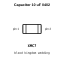
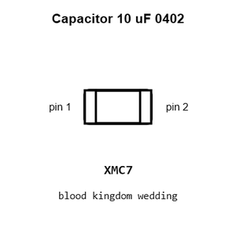
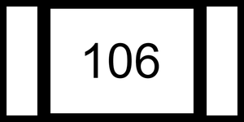
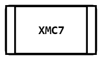
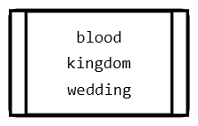
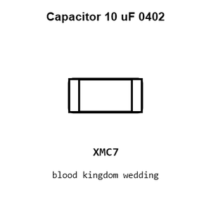
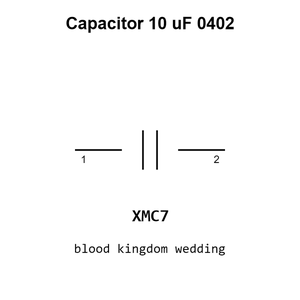

# Capacitor 10 uF 0402

`electronic_capacitor_0402_10_micro_farad`

Capacitor 10 uF 0402 is an OOMP electronic capacitor definition. It uses the 0402 package or form factor. Its nominal drawing size is 1.0 &#x00D7; 0.5 mm.

## At a glance

| Detail | Value |
| --- | --- |
| OOMP ID | `electronic_capacitor_0402_10_micro_farad` |
| Type | Capacitor |
| Package / style | 0402 |
| Nominal size | 1.0 &#x00D7; 0.5 mm |

## Classification

| Level | Value |
| --- | --- |
| 1 | `electronic` |
| 2 | `capacitor` |
| 3 | `0402` |
| 4 | `10_micro_farad` |

## Nominal dimensions

| Measurement | Value |
| --- | ---: |
| Length | 1.0 mm |
| Width | 0.5 mm |

## Identifiers

| Identifier | Value |
| --- | --- |
| Manufacturer part number | `CL05A106MQ5NUNC` |
| LCSC | [`C15525`](https://www.lcsc.com/product-detail/C15525.html) |
| LCSC | [`C7472949`](https://www.lcsc.com/product-detail/C7472949.html) |
| LCSC | [`C48543727`](https://www.lcsc.com/product-detail/C48543727.html) |

## Used in projects

| Project | Quantity | References | Explore |
| --- | ---: | --- | --- |
| [Project electrolama/pt1 current](https://github.com/electrolama/pt1) | 4 | C5, C11, C12, C13 | [Board explorer](https://oomlout.github.io/oomp_electronic_version_5/parts/oomp_project_github_electrolama_pt1_current/board_explorer.html) · [OOMP project](https://github.com/oomlout/oomp_electronic_version_5/tree/main/parts/oomp_project_github_electrolama_pt1_current) |
| [Project sparkfun/SparkFun_Triple_Axis_Acclerometer-LIS3DH LIS3DH Qwiic Micro current](https://github.com/sparkfun/SparkFun_Triple_Axis_Acclerometer-LIS3DH/tree/main/Hardware/Micro) | 1 | C4 | [Board explorer](https://oomlout.github.io/oomp_electronic_version_5/parts/oomp_project_github_sparkfun_spark_fun_triple_axis_acclerometer_lis3_dh_lis3dh_qwiic_micro_current/board_explorer.html) · [OOMP project](https://github.com/oomlout/oomp_electronic_version_5/tree/main/parts/oomp_project_github_sparkfun_spark_fun_triple_axis_acclerometer_lis3_dh_lis3dh_qwiic_micro_current) |

## Files

[KiCad symbol, machine-solder and hand-solder footprints](data/kicad/README.md) · [Availability and source masters](data/kicad/manifest.yaml)

[View this part on GitHub](https://github.com/oomlout/oomp_electronic_version_5/tree/main/parts/electronic_capacitor_0402_10_micro_farad)

[Browse this category](../../navigation/electronic/capacitor/0402/README.md)

---

This page is generated from the OOMP part definition by a Roboclick Jinja template. Edit the source taxonomy or template rather than this generated file.