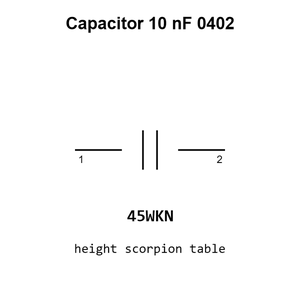

# Capacitor 10 nF 0402

`electronic_capacitor_0402_10_nano_farad`

Capacitor 10 nF 0402 is an OOMP electronic capacitor definition. It uses the 0402 package or form factor. Its nominal drawing size is 1.0 &#x00D7; 0.5 mm.

## At a glance

| Detail | Value |
| --- | --- |
| OOMP ID | `electronic_capacitor_0402_10_nano_farad` |
| Type | Capacitor |
| Package / style | 0402 |
| Nominal size | 1.0 &#x00D7; 0.5 mm |

## Classification

| Level | Value |
| --- | --- |
| 1 | `electronic` |
| 2 | `capacitor` |
| 3 | `0402` |
| 4 | `10_nano_farad` |

## Nominal dimensions

| Measurement | Value |
| --- | ---: |
| Length | 1.0 mm |
| Width | 0.5 mm |

## Identifiers

| Identifier | Value |
| --- | --- |
| Manufacturer part number | `CL05B103KB5NNNC` |
| LCSC | [`C15195`](https://www.lcsc.com/product-detail/C15195.html) |
| JLCPCB | [`C15195`](https://jlcpcb.com/partdetail/15869-CL05B103KB5NNNC/C15195) |

## Used in projects

| Project | Quantity | References | Explore |
| --- | ---: | --- | --- |
| [Project adafruit/Adafruit-QT-Py-ESP32-C3-PCB Adafruit QT Py ESP32 C3 current](https://github.com/adafruit/Adafruit-QT-Py-ESP32-C3-PCB/blob/main/Adafruit%20QT%20Py%20ESP32-C3.brd) | 1 | C16 | [Board explorer](https://oomlout.github.io/oomp_electronic_version_5/parts/oomp_project_github_adafruit_adafruit_qt_py_esp32_c3_pcb_adafruit_qt_py_esp32_c3_current/board_explorer.html) · [OOMP project](https://github.com/oomlout/oomp_electronic_version_5/tree/main/parts/oomp_project_github_adafruit_adafruit_qt_py_esp32_c3_pcb_adafruit_qt_py_esp32_c3_current) |
| [Project electrolama/pt1 current](https://github.com/electrolama/pt1) | 1 | C1 | [Board explorer](https://oomlout.github.io/oomp_electronic_version_5/parts/oomp_project_github_electrolama_pt1_current/board_explorer.html) · [OOMP project](https://github.com/oomlout/oomp_electronic_version_5/tree/main/parts/oomp_project_github_electrolama_pt1_current) |
| [Project sparkfun/LilyPad_MP3_Player Lily Pad MP3a current](https://github.com/sparkfun/LilyPad_MP3_Player/blob/master/hardware/LilyPad-MP3-v15a.brd) | 2 | C14, C15 | [Board explorer](https://oomlout.github.io/oomp_electronic_version_5/parts/oomp_project_github_sparkfun_lily_pad_mp3_player_lily_pad_mp3a_current/board_explorer.html) · [OOMP project](https://github.com/oomlout/oomp_electronic_version_5/tree/main/parts/oomp_project_github_sparkfun_lily_pad_mp3_player_lily_pad_mp3a_current) |
| [Project sparkfun/Lipo_Fuel_Gauge Spark Fun Lipo Fuel Gauge current](https://github.com/sparkfun/Lipo_Fuel_Gauge/blob/master/Hardware/SparkFun_Lipo_Fuel_Gauge.brd) | 1 | C2 | [Board explorer](https://oomlout.github.io/oomp_electronic_version_5/parts/oomp_project_github_sparkfun_lipo_fuel_gauge_spark_fun_lipo_fuel_gauge_current/board_explorer.html) · [OOMP project](https://github.com/oomlout/oomp_electronic_version_5/tree/main/parts/oomp_project_github_sparkfun_lipo_fuel_gauge_spark_fun_lipo_fuel_gauge_current) |
| [Project sparkfun/MicroMod_Artemis_Processor Micro Mod Artemis Processor Board current](https://github.com/sparkfun/MicroMod_Artemis_Processor/blob/master/Hardware/MicroMod-Artemis-ProcessorBoard.brd) | 1 | C17 | [Board explorer](https://oomlout.github.io/oomp_electronic_version_5/parts/oomp_project_github_sparkfun_micro_mod_artemis_processor_micro_mod_artemis_processor_board_current/board_explorer.html) · [OOMP project](https://github.com/oomlout/oomp_electronic_version_5/tree/main/parts/oomp_project_github_sparkfun_micro_mod_artemis_processor_micro_mod_artemis_processor_board_current) |
| [Project sparkfun/MicroMod_ESP32_Processor Spark Fun Micro Mod ESP32 current](https://github.com/sparkfun/MicroMod_ESP32_Processor/blob/master/Hardware/SparkFun_MicroMod_ESP32.brd) | 1 | C5 | [Board explorer](https://oomlout.github.io/oomp_electronic_version_5/parts/oomp_project_github_sparkfun_micro_mod_esp32_processor_spark_fun_micro_mod_esp32_current/board_explorer.html) · [OOMP project](https://github.com/oomlout/oomp_electronic_version_5/tree/main/parts/oomp_project_github_sparkfun_micro_mod_esp32_processor_spark_fun_micro_mod_esp32_current) |
| [Project sparkfun/MicroMod_Teensy_Processor Micro Mod Teensy current](https://github.com/sparkfun/MicroMod_Teensy_Processor/blob/main/Hardware/MicroMod-Teensy.brd) | 2 | C5, C16 | [Board explorer](https://oomlout.github.io/oomp_electronic_version_5/parts/oomp_project_github_sparkfun_micro_mod_teensy_processor_micro_mod_teensy_current/board_explorer.html) · [OOMP project](https://github.com/oomlout/oomp_electronic_version_5/tree/main/parts/oomp_project_github_sparkfun_micro_mod_teensy_processor_micro_mod_teensy_current) |
| [Project sparkfun/MicroMod_Teensy_Processor Micro Mod Teensy Lockable current](https://github.com/sparkfun/MicroMod_Teensy_Processor/blob/main/Hardware/Lockable/MicroMod-Teensy-Lockable.brd) | 2 | C5, C16 | [Board explorer](https://oomlout.github.io/oomp_electronic_version_5/parts/oomp_project_github_sparkfun_micro_mod_teensy_processor_micro_mod_teensy_lockable_current/board_explorer.html) · [OOMP project](https://github.com/oomlout/oomp_electronic_version_5/tree/main/parts/oomp_project_github_sparkfun_micro_mod_teensy_processor_micro_mod_teensy_lockable_current) |
| [Project sparkfun/MP3_Breakout-VS1063 Spark Fun MP3 Breakout VS1063 current](https://github.com/sparkfun/MP3_Breakout-VS1063/blob/master/Hardware/SparkFun_MP3_Breakout-VS1063.brd) | 4 | C10, C12, C23, C24 | [Board explorer](https://oomlout.github.io/oomp_electronic_version_5/parts/oomp_project_github_sparkfun_mp3_breakout_vs1063_spark_fun_mp3_breakout_vs1063_current/board_explorer.html) · [OOMP project](https://github.com/oomlout/oomp_electronic_version_5/tree/main/parts/oomp_project_github_sparkfun_mp3_breakout_vs1063_spark_fun_mp3_breakout_vs1063_current) |
| [Project sparkfun/OpenLog_Artemis Spark Fun Artemis Open Log current](https://github.com/sparkfun/OpenLog_Artemis/blob/main/Hardware/SparkFun_Artemis_OpenLog.brd) | 1 | C40 | [Board explorer](https://oomlout.github.io/oomp_electronic_version_5/parts/oomp_project_github_sparkfun_open_log_artemis_spark_fun_artemis_open_log_current/board_explorer.html) · [OOMP project](https://github.com/oomlout/oomp_electronic_version_5/tree/main/parts/oomp_project_github_sparkfun_open_log_artemis_spark_fun_artemis_open_log_current) |
| [Project sparkfun/SparkFun_Audio_Codec_Breakout_WM8960 Stereo Audio Codec Breakout WM8960 current](https://github.com/sparkfun/SparkFun_Audio_Codec_Breakout_WM8960/blob/main/Hardware/Stereo_Audio_Codec_Breakout_WM8960.brd) | 1 | C13 | [Board explorer](https://oomlout.github.io/oomp_electronic_version_5/parts/oomp_project_github_sparkfun_spark_fun_audio_codec_breakout_wm8960_stereo_audio_codec_breakout_wm8960_current/board_explorer.html) · [OOMP project](https://github.com/oomlout/oomp_electronic_version_5/tree/main/parts/oomp_project_github_sparkfun_spark_fun_audio_codec_breakout_wm8960_stereo_audio_codec_breakout_wm8960_current) |
| [Project sparkfun/SparkFun_DataLogger_IoT_9DoF Spark Fun Data Logger Io T 9 DOF current](https://github.com/sparkfun/SparkFun_DataLogger_IoT_9DoF/blob/main/Hardware/SparkFun_DataLogger_IoT_9DOF.brd) | 1 | C4 | [Board explorer](https://oomlout.github.io/oomp_electronic_version_5/parts/oomp_project_github_sparkfun_spark_fun_data_logger_io_t_9_do_f_spark_fun_data_logger_io_t_9_dof_current/board_explorer.html) · [OOMP project](https://github.com/oomlout/oomp_electronic_version_5/tree/main/parts/oomp_project_github_sparkfun_spark_fun_data_logger_io_t_9_do_f_spark_fun_data_logger_io_t_9_dof_current) |
| [Project sparkfun/SparkFun_MicroMod_Single_Pair_Ethernet_Function_Board_ADIN1110 Spark Fun Micro Mod Function ADIN1110 current](https://github.com/sparkfun/SparkFun_MicroMod_Single_Pair_Ethernet_Function_Board_ADIN1110/blob/main/Hardware/SparkFun_MicroMod_Function_ADIN1110.brd) | 3 | C12, C14, C17 | [Board explorer](https://oomlout.github.io/oomp_electronic_version_5/parts/oomp_project_github_sparkfun_spark_fun_micro_mod_single_pair_ethernet_function_board_adin1110_spark_fun_micro_mod_function_adin1110_current/board_explorer.html) · [OOMP project](https://github.com/oomlout/oomp_electronic_version_5/tree/main/parts/oomp_project_github_sparkfun_spark_fun_micro_mod_single_pair_ethernet_function_board_adin1110_spark_fun_micro_mod_function_adin1110_current) |
| [Project sparkfun/SparkFun_Thing_Plus_MGM240P Thing Plus MGM240 P current](https://github.com/sparkfun/SparkFun_Thing_Plus_MGM240P/blob/main/Hardware/Thing_Plus_MGM240P.brd) | 2 | C8, C9 | [Board explorer](https://oomlout.github.io/oomp_electronic_version_5/parts/oomp_project_github_sparkfun_spark_fun_thing_plus_mgm240_p_thing_plus_mgm240_p_current/board_explorer.html) · [OOMP project](https://github.com/oomlout/oomp_electronic_version_5/tree/main/parts/oomp_project_github_sparkfun_spark_fun_thing_plus_mgm240_p_thing_plus_mgm240_p_current) |
| [Project sparkfun/SparkFun_Tsunami_Super_WAV_Trigger_Qwiic Spark Fun Tsunami Qwiic current](https://github.com/sparkfun/SparkFun_Tsunami_Super_WAV_Trigger_Qwiic/blob/main/Hardware/SparkFun_Tsunami_Qwiic.brd) | 1 | C1 | [Board explorer](https://oomlout.github.io/oomp_electronic_version_5/parts/oomp_project_github_sparkfun_spark_fun_tsunami_super_wav_trigger_qwiic_spark_fun_tsunami_qwiic_current/board_explorer.html) · [OOMP project](https://github.com/oomlout/oomp_electronic_version_5/tree/main/parts/oomp_project_github_sparkfun_spark_fun_tsunami_super_wav_trigger_qwiic_spark_fun_tsunami_qwiic_current) |

## Files

[KiCad symbol, machine-solder and hand-solder footprints](data/kicad/README.md) · [Availability and source masters](data/kicad/manifest.yaml)

[View this part on GitHub](https://github.com/oomlout/oomp_electronic_version_5/tree/main/parts/electronic_capacitor_0402_10_nano_farad)

[Browse this category](../../navigation/electronic/capacitor/0402/README.md)

---

This page is generated from the OOMP part definition by a Roboclick Jinja template. Edit the source taxonomy or template rather than this generated file.