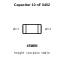
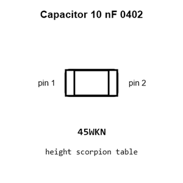
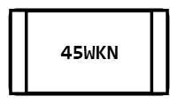
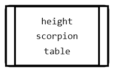
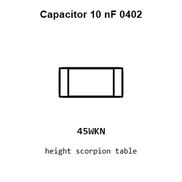

# Capacitor 10 nF 0402

`electronic_capacitor_0402_10_nano_farad`

Capacitor 10 nF 0402 is an OOMP electronic capacitor definition. It uses the 0402 package or form factor. Its nominal drawing size is 1.0 &#x00D7; 0.5 mm.

## At a glance

| Detail | Value |
| --- | --- |
| OOMP ID | `electronic_capacitor_0402_10_nano_farad` |
| Type | Capacitor |
| Package / style | 0402 |
| Nominal size | 1.0 &#x00D7; 0.5 mm |

## Classification

| Level | Value |
| --- | --- |
| 1 | `electronic` |
| 2 | `capacitor` |
| 3 | `0402` |
| 4 | `10_nano_farad` |

## Nominal dimensions

| Measurement | Value |
| --- | ---: |
| Length | 1.0 mm |
| Width | 0.5 mm |

## Used in projects

| Project | Quantity | References | Explore |
| --- | ---: | --- | --- |
| [Project electrolama/pt1 current](https://github.com/electrolama/pt1) | 1 | C1 | [Board explorer](https://oomlout.github.io/oomp_electronic_version_5/parts/oomp_project_github_electrolama_pt1_current/board_explorer.html) · [OOMP project](https://github.com/oomlout/oomp_electronic_version_5/tree/main/parts/oomp_project_github_electrolama_pt1_current) |

## Files

[KiCad symbol, machine-solder and hand-solder footprints](data/kicad/README.md) · [Availability and source masters](data/kicad/manifest.yaml)

[View this part on GitHub](https://github.com/oomlout/oomp_electronic_version_5/tree/main/parts/electronic_capacitor_0402_10_nano_farad)

[Browse this category](../../navigation/electronic/capacitor/0402/README.md)

---

This page is generated from the OOMP part definition by a Roboclick Jinja template. Edit the source taxonomy or template rather than this generated file.