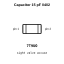
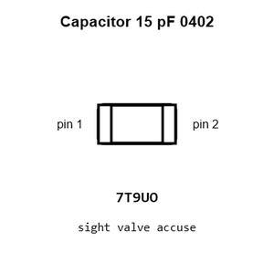
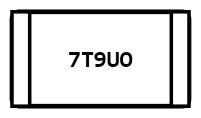
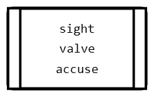
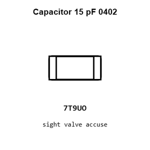
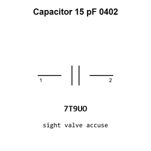

# Capacitor 15 pF 0402

`electronic_capacitor_0402_15_pico_farad`

Capacitor 15 pF 0402 is an OOMP electronic capacitor definition. It uses the 0402 package or form factor. Its nominal drawing size is 1.0 &#x00D7; 0.5 mm.

## At a glance

| Detail | Value |
| --- | --- |
| OOMP ID | `electronic_capacitor_0402_15_pico_farad` |
| Type | Capacitor |
| Package / style | 0402 |
| Nominal size | 1.0 &#x00D7; 0.5 mm |

## Classification

| Level | Value |
| --- | --- |
| 1 | `electronic` |
| 2 | `capacitor` |
| 3 | `0402` |
| 4 | `15_pico_farad` |

## Nominal dimensions

| Measurement | Value |
| --- | ---: |
| Length | 1.0 mm |
| Width | 0.5 mm |

## Identifiers

| Identifier | Value |
| --- | --- |
| Manufacturer part number | `0402CG150J500NT` |
| LCSC | [`C1548`](https://www.lcsc.com/product-detail/C1548.html) |
| LCSC | [`C106997`](https://www.lcsc.com/product-detail/C106997.html) |
| LCSC | [`C326803`](https://www.lcsc.com/product-detail/C326803.html) |
| JLCPCB | [`C1548`](https://jlcpcb.com/partdetail/1900-0402CG150J500NT/C1548) |

## Used in projects

| Project | Quantity | References | Explore |
| --- | ---: | --- | --- |
| [Project adafruit/Adafruit-Feather-RP2350-PCB Adafruit Feather RP2350 current](https://github.com/adafruit/Adafruit-Feather-RP2350-PCB/blob/main/Adafruit%20Feather%20RP2350.brd) | 2 | C2, C3 | [Board explorer](https://oomlout.github.io/oomp_electronic_version_5/parts/oomp_project_github_adafruit_adafruit_feather_rp2350_pcb_adafruit_feather_rp2350_current/board_explorer.html) · [OOMP project](https://github.com/oomlout/oomp_electronic_version_5/tree/main/parts/oomp_project_github_adafruit_adafruit_feather_rp2350_pcb_adafruit_feather_rp2350_current) |
| [Project dangerousprototypes/buspirate5_hardware 5_rev10a](https://github.com/DangerousPrototypes/BusPirate5-hardware) | 2 | C105, C106 | [Board explorer](https://oomlout.github.io/oomp_electronic_version_5/parts/oomp_project_github_dangerousprototypes_buspirate5_hardware_5_rev10a/board_explorer.html) · [OOMP project](https://github.com/oomlout/oomp_electronic_version_5/tree/main/parts/oomp_project_github_dangerousprototypes_buspirate5_hardware_5_rev10a) |
| [Project dangerousprototypes/buspirate5_hardware current](https://github.com/DangerousPrototypes/BusPirate5-hardware) | 2 | C105, C106 | [Board explorer](https://oomlout.github.io/oomp_electronic_version_5/parts/oomp_project_github_dangerousprototypes_buspirate5_hardware_current/board_explorer.html) · [OOMP project](https://github.com/oomlout/oomp_electronic_version_5/tree/main/parts/oomp_project_github_dangerousprototypes_buspirate5_hardware_current) |
| [Project sparkfun/MicroMod_Artemis_Processor Micro Mod Artemis Processor Board current](https://github.com/sparkfun/MicroMod_Artemis_Processor/blob/master/Hardware/MicroMod-Artemis-ProcessorBoard.brd) | 2 | C11, C13 | [Board explorer](https://oomlout.github.io/oomp_electronic_version_5/parts/oomp_project_github_sparkfun_micro_mod_artemis_processor_micro_mod_artemis_processor_board_current/board_explorer.html) · [OOMP project](https://github.com/oomlout/oomp_electronic_version_5/tree/main/parts/oomp_project_github_sparkfun_micro_mod_artemis_processor_micro_mod_artemis_processor_board_current) |
| [Project sparkfun/MicroMod_ESP32_Processor Spark Fun Micro Mod ESP32 current](https://github.com/sparkfun/MicroMod_ESP32_Processor/blob/master/Hardware/SparkFun_MicroMod_ESP32.brd) | 2 | C9, C26 | [Board explorer](https://oomlout.github.io/oomp_electronic_version_5/parts/oomp_project_github_sparkfun_micro_mod_esp32_processor_spark_fun_micro_mod_esp32_current/board_explorer.html) · [OOMP project](https://github.com/oomlout/oomp_electronic_version_5/tree/main/parts/oomp_project_github_sparkfun_micro_mod_esp32_processor_spark_fun_micro_mod_esp32_current) |
| [Project sparkfun/MicroMod_Processor-RP2040 Micro Mod RP2040 Processor Board current](https://github.com/sparkfun/MicroMod_Processor-RP2040/blob/main/Hardware/MicroMod-RP2040-ProcessorBoard.brd) | 2 | C11, C13 | [Board explorer](https://oomlout.github.io/oomp_electronic_version_5/parts/oomp_project_github_sparkfun_micro_mod_processor_rp2040_micro_mod_rp2040_processor_board_current/board_explorer.html) · [OOMP project](https://github.com/oomlout/oomp_electronic_version_5/tree/main/parts/oomp_project_github_sparkfun_micro_mod_processor_rp2040_micro_mod_rp2040_processor_board_current) |
| [Project sparkfun/MicroMod_STM32_Processor Micro Mod STM32 Processor current](https://github.com/sparkfun/MicroMod_STM32_Processor/blob/main/Hardware/MicroMod_STM32_Processor.brd) | 2 | C3, C4 | [Board explorer](https://oomlout.github.io/oomp_electronic_version_5/parts/oomp_project_github_sparkfun_micro_mod_stm32_processor_micro_mod_stm32_processor_current/board_explorer.html) · [OOMP project](https://github.com/oomlout/oomp_electronic_version_5/tree/main/parts/oomp_project_github_sparkfun_micro_mod_stm32_processor_micro_mod_stm32_processor_current) |
| [Project sparkfun/nRF52832_Breakout sparkfun nrf52832 breakout current](https://github.com/sparkfun/nRF52832_Breakout/blob/main/Hardware/sparkfun-nrf52832-breakout.brd) | 2 | C13, C14 | [Board explorer](https://oomlout.github.io/oomp_electronic_version_5/parts/oomp_project_github_sparkfun_n_rf52832_breakout_sparkfun_nrf52832_breakout_current/board_explorer.html) · [OOMP project](https://github.com/oomlout/oomp_electronic_version_5/tree/main/parts/oomp_project_github_sparkfun_n_rf52832_breakout_sparkfun_nrf52832_breakout_current) |
| [Project sparkfun/OpenLog_Artemis Spark Fun Artemis Open Log current](https://github.com/sparkfun/OpenLog_Artemis/blob/main/Hardware/SparkFun_Artemis_OpenLog.brd) | 2 | C29, C30 | [Board explorer](https://oomlout.github.io/oomp_electronic_version_5/parts/oomp_project_github_sparkfun_open_log_artemis_spark_fun_artemis_open_log_current/board_explorer.html) · [OOMP project](https://github.com/oomlout/oomp_electronic_version_5/tree/main/parts/oomp_project_github_sparkfun_open_log_artemis_spark_fun_artemis_open_log_current) |
| [Project sparkfun/RP2040_mikroBUS_Dev_Board RP2040 Mikro BUS current](https://github.com/sparkfun/RP2040_mikroBUS_Dev_Board/blob/main/Hardware/RP2040_MikroBUS.brd) | 2 | C5, C16 | [Board explorer](https://oomlout.github.io/oomp_electronic_version_5/parts/oomp_project_github_sparkfun_rp2040_mikro_bus_dev_board_rp2040_mikro_bus_current/board_explorer.html) · [OOMP project](https://github.com/oomlout/oomp_electronic_version_5/tree/main/parts/oomp_project_github_sparkfun_rp2040_mikro_bus_dev_board_rp2040_mikro_bus_current) |
| [Project sparkfun/SAMD21_Mini_Breakout sparkfun samd21 mini breakout current](https://github.com/sparkfun/SAMD21_Mini_Breakout/blob/master/Hardware/sparkfun-samd21-mini-breakout.brd) | 2 | C5, C6 | [Board explorer](https://oomlout.github.io/oomp_electronic_version_5/parts/oomp_project_github_sparkfun_samd21_mini_breakout_sparkfun_samd21_mini_breakout_current/board_explorer.html) · [OOMP project](https://github.com/oomlout/oomp_electronic_version_5/tree/main/parts/oomp_project_github_sparkfun_samd21_mini_breakout_sparkfun_samd21_mini_breakout_current) |
| [Project sparkfun/SAMD51_Thing_Plus SAMD51 Thing Plus current](https://github.com/sparkfun/SAMD51_Thing_Plus/blob/master/Hardware/SAMD51_Thing_Plus.brd) | 2 | C1, C2 | [Board explorer](https://oomlout.github.io/oomp_electronic_version_5/parts/oomp_project_github_sparkfun_samd51_thing_plus_samd51_thing_plus_current/board_explorer.html) · [OOMP project](https://github.com/oomlout/oomp_electronic_version_5/tree/main/parts/oomp_project_github_sparkfun_samd51_thing_plus_samd51_thing_plus_current) |
| [Project sparkfun/SparkFun_Pro_Micro-RP2040 Spark Fun Pro Micro RP2040 current](https://github.com/sparkfun/SparkFun_Pro_Micro-RP2040/blob/main/Hardware/SparkFun_ProMicro-RP2040.brd) | 2 | C11, C13 | [Board explorer](https://oomlout.github.io/oomp_electronic_version_5/parts/oomp_project_github_sparkfun_spark_fun_pro_micro_rp2040_spark_fun_pro_micro_rp2040_current/board_explorer.html) · [OOMP project](https://github.com/oomlout/oomp_electronic_version_5/tree/main/parts/oomp_project_github_sparkfun_spark_fun_pro_micro_rp2040_spark_fun_pro_micro_rp2040_current) |
| [Project sparkfun/SparkFun_Thing_Plus-RP2040 RP2040 Thing Plus current](https://github.com/sparkfun/SparkFun_Thing_Plus-RP2040/blob/main/Hardware/RP2040_Thing_Plus.brd) | 2 | C5, C16 | [Board explorer](https://oomlout.github.io/oomp_electronic_version_5/parts/oomp_project_github_sparkfun_spark_fun_thing_plus_rp2040_rp2040_thing_plus_current/board_explorer.html) · [OOMP project](https://github.com/oomlout/oomp_electronic_version_5/tree/main/parts/oomp_project_github_sparkfun_spark_fun_thing_plus_rp2040_rp2040_thing_plus_current) |

## Files

[KiCad symbol, machine-solder and hand-solder footprints](data/kicad/README.md) · [Availability and source masters](data/kicad/manifest.yaml)

[View this part on GitHub](https://github.com/oomlout/oomp_electronic_version_5/tree/main/parts/electronic_capacitor_0402_15_pico_farad)

[Browse this category](../../navigation/electronic/capacitor/0402/README.md)

---

This page is generated from the OOMP part definition by a Roboclick Jinja template. Edit the source taxonomy or template rather than this generated file.