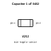
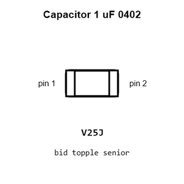
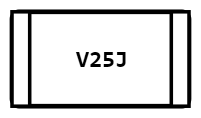
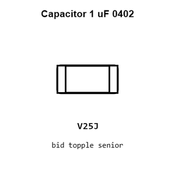
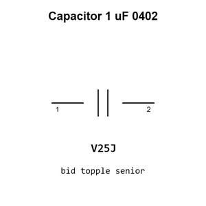

# Capacitor 1 uF 0402

`electronic_capacitor_0402_1_micro_farad`

Capacitor 1 uF 0402 is an OOMP electronic capacitor definition. It uses the 0402 package or form factor. Its nominal drawing size is 1.0 &#x00D7; 0.5 mm.

## At a glance

| Detail | Value |
| --- | --- |
| OOMP ID | `electronic_capacitor_0402_1_micro_farad` |
| Type | Capacitor |
| Package / style | 0402 |
| Nominal size | 1.0 &#x00D7; 0.5 mm |

## Classification

| Level | Value |
| --- | --- |
| 1 | `electronic` |
| 2 | `capacitor` |
| 3 | `0402` |
| 4 | `1_micro_farad` |

## Nominal dimensions

| Measurement | Value |
| --- | ---: |
| Length | 1.0 mm |
| Width | 0.5 mm |

## Identifiers

| Identifier | Value |
| --- | --- |
| Manufacturer part number | `CL05A105KA5NQNC` |
| LCSC | [`C52923`](https://www.lcsc.com/product-detail/C52923.html) |
| LCSC | [`C2887021`](https://www.lcsc.com/product-detail/C2887021.html) |
| LCSC | [`C29266`](https://www.lcsc.com/product-detail/C29266.html) |
| JLCPCB | [`C52923`](https://jlcpcb.com/partdetail/53938-CL05A105KA5NQNC/C52923) |

## Used in projects

| Project | Quantity | References | Explore |
| --- | ---: | --- | --- |
| [Project adafruit/Adafruit-CH552-QT-Py-PCB Adafruit CH552 QT Py current](https://github.com/adafruit/Adafruit-CH552-QT-Py-PCB/blob/main/Adafruit%20CH552%20QT%20Py.brd) | 3 | C2, C3, C4 | [Board explorer](https://oomlout.github.io/oomp_electronic_version_5/parts/oomp_project_github_adafruit_adafruit_ch552_qt_py_pcb_adafruit_ch552_qt_py_current/board_explorer.html) · [OOMP project](https://github.com/oomlout/oomp_electronic_version_5/tree/main/parts/oomp_project_github_adafruit_adafruit_ch552_qt_py_pcb_adafruit_ch552_qt_py_current) |
| [Project adafruit/Adafruit-Feather-RP2040-Adalogger-PCB Adafruit Feather RP2040 Adalogger current](https://github.com/adafruit/Adafruit-Feather-RP2040-Adalogger-PCB/blob/main/Adafruit%20Feather%20RP2040%20Adalogger.brd) | 5 | C8, C10, C11, C15, C17 | [Board explorer](https://oomlout.github.io/oomp_electronic_version_5/parts/oomp_project_github_adafruit_adafruit_feather_rp2040_adalogger_pcb_adafruit_feather_rp2040_adalogger_current/board_explorer.html) · [OOMP project](https://github.com/oomlout/oomp_electronic_version_5/tree/main/parts/oomp_project_github_adafruit_adafruit_feather_rp2040_adalogger_pcb_adafruit_feather_rp2040_adalogger_current) |
| [Project adafruit/Adafruit-Feather-RP2040-DVI-PCB Adafruit Feather RP2040 DVI current](https://github.com/adafruit/Adafruit-Feather-RP2040-DVI-PCB/blob/main/Adafruit%20Feather%20RP2040%20DVI.brd) | 6 | C8, C10, C11, C15, C17, C21 | [Board explorer](https://oomlout.github.io/oomp_electronic_version_5/parts/oomp_project_github_adafruit_adafruit_feather_rp2040_dvi_pcb_adafruit_feather_rp2040_dvi_current/board_explorer.html) · [OOMP project](https://github.com/oomlout/oomp_electronic_version_5/tree/main/parts/oomp_project_github_adafruit_adafruit_feather_rp2040_dvi_pcb_adafruit_feather_rp2040_dvi_current) |
| [Project adafruit/Adafruit-Feather-RP2040-RFM-PCB Adafruit Feather RP2040 RFM current](https://github.com/adafruit/Adafruit-Feather-RP2040-RFM-PCB/blob/main/Adafruit%20Feather%20RP2040%20RFM.brd) | 5 | C8, C10, C11, C15, C17 | [Board explorer](https://oomlout.github.io/oomp_electronic_version_5/parts/oomp_project_github_adafruit_adafruit_feather_rp2040_rfm_pcb_adafruit_feather_rp2040_rfm_current/board_explorer.html) · [OOMP project](https://github.com/oomlout/oomp_electronic_version_5/tree/main/parts/oomp_project_github_adafruit_adafruit_feather_rp2040_rfm_pcb_adafruit_feather_rp2040_rfm_current) |
| [Project adafruit/Adafruit-Feather-RP2040-ThinkInk Adafruit Feather RP2040 Think Ink current](https://github.com/adafruit/Adafruit-Feather-RP2040-ThinkInk/blob/main/Adafruit%20Feather%20RP2040%20ThinkInk.brd) | 12 | C8, C10, C11, C15, C17, C21, C22, C23, C24, C25, C26, C29 | [Board explorer](https://oomlout.github.io/oomp_electronic_version_5/parts/oomp_project_github_adafruit_adafruit_feather_rp2040_think_ink_adafruit_feather_rp2040_think_ink_current/board_explorer.html) · [OOMP project](https://github.com/oomlout/oomp_electronic_version_5/tree/main/parts/oomp_project_github_adafruit_adafruit_feather_rp2040_think_ink_adafruit_feather_rp2040_think_ink_current) |
| [Project adafruit/Adafruit-Feather-RP2040-USB-Host-PCB Adafruit Feather RP2040 USB Host current](https://github.com/adafruit/Adafruit-Feather-RP2040-USB-Host-PCB/blob/main/Adafruit%20Feather%20RP2040%20USB%20Host.brd) | 5 | C8, C10, C11, C15, C17 | [Board explorer](https://oomlout.github.io/oomp_electronic_version_5/parts/oomp_project_github_adafruit_adafruit_feather_rp2040_usb_host_pcb_adafruit_feather_rp2040_usb_host_current/board_explorer.html) · [OOMP project](https://github.com/oomlout/oomp_electronic_version_5/tree/main/parts/oomp_project_github_adafruit_adafruit_feather_rp2040_usb_host_pcb_adafruit_feather_rp2040_usb_host_current) |
| [Project adafruit/Adafruit-Feather-RP2350-PCB Adafruit Feather RP2350 current](https://github.com/adafruit/Adafruit-Feather-RP2350-PCB/blob/main/Adafruit%20Feather%20RP2350.brd) | 4 | C10, C11, C15, C17 | [Board explorer](https://oomlout.github.io/oomp_electronic_version_5/parts/oomp_project_github_adafruit_adafruit_feather_rp2350_pcb_adafruit_feather_rp2350_current/board_explorer.html) · [OOMP project](https://github.com/oomlout/oomp_electronic_version_5/tree/main/parts/oomp_project_github_adafruit_adafruit_feather_rp2350_pcb_adafruit_feather_rp2350_current) |
| [Project adafruit/Adafruit-Mini-Sparkle-Motion-PCB Adafruit Mini Sparkle Motion current](https://github.com/adafruit/Adafruit-Mini-Sparkle-Motion-PCB/blob/main/Adafruit%20Mini%20Sparkle%20Motion.brd) | 2 | C4, C10 | [Board explorer](https://oomlout.github.io/oomp_electronic_version_5/parts/oomp_project_github_adafruit_adafruit_mini_sparkle_motion_pcb_adafruit_mini_sparkle_motion_current/board_explorer.html) · [OOMP project](https://github.com/oomlout/oomp_electronic_version_5/tree/main/parts/oomp_project_github_adafruit_adafruit_mini_sparkle_motion_pcb_adafruit_mini_sparkle_motion_current) |
| [Project adafruit/Adafruit-QT-Py-CH32V203-PCB Adafruit QT Py CH32 V203 current](https://github.com/adafruit/Adafruit-QT-Py-CH32V203-PCB/blob/main/Adafruit%20QT%20Py%20CH32V203.brd) | 3 | C2, C3, C4 | [Board explorer](https://oomlout.github.io/oomp_electronic_version_5/parts/oomp_project_github_adafruit_adafruit_qt_py_ch32_v203_pcb_adafruit_qt_py_ch32_v203_current/board_explorer.html) · [OOMP project](https://github.com/oomlout/oomp_electronic_version_5/tree/main/parts/oomp_project_github_adafruit_adafruit_qt_py_ch32_v203_pcb_adafruit_qt_py_ch32_v203_current) |
| [Project adafruit/Adafruit-QT-Py-ESP32-C3-PCB Adafruit QT Py ESP32 C3 current](https://github.com/adafruit/Adafruit-QT-Py-ESP32-C3-PCB/blob/main/Adafruit%20QT%20Py%20ESP32-C3.brd) | 4 | C2, C3, C11, C15 | [Board explorer](https://oomlout.github.io/oomp_electronic_version_5/parts/oomp_project_github_adafruit_adafruit_qt_py_esp32_c3_pcb_adafruit_qt_py_esp32_c3_current/board_explorer.html) · [OOMP project](https://github.com/oomlout/oomp_electronic_version_5/tree/main/parts/oomp_project_github_adafruit_adafruit_qt_py_esp32_c3_pcb_adafruit_qt_py_esp32_c3_current) |
| [Project adafruit/Adafruit-QT-Py-ESP32-Pico-PCB Adafruit QT Py ESP32 Pico current](https://github.com/adafruit/Adafruit-QT-Py-ESP32-Pico-PCB/blob/main/Adafruit%20QT%20Py%20ESP32%20Pico.brd) | 3 | C2, C3, C12 | [Board explorer](https://oomlout.github.io/oomp_electronic_version_5/parts/oomp_project_github_adafruit_adafruit_qt_py_esp32_pico_pcb_adafruit_qt_py_esp32_pico_current/board_explorer.html) · [OOMP project](https://github.com/oomlout/oomp_electronic_version_5/tree/main/parts/oomp_project_github_adafruit_adafruit_qt_py_esp32_pico_pcb_adafruit_qt_py_esp32_pico_current) |
| [Project adafruit/Adafruit-QT-Py-ESP32-S3-PCB Adafruit QT Py ESP32 S3 current](https://github.com/adafruit/Adafruit-QT-Py-ESP32-S3-PCB/blob/main/Adafruit%20QT%20Py%20ESP32-S3.brd) | 7 | C2, C3, C5, C13, C15, C19, C20 | [Board explorer](https://oomlout.github.io/oomp_electronic_version_5/parts/oomp_project_github_adafruit_adafruit_qt_py_esp32_s3_pcb_adafruit_qt_py_esp32_s3_current/board_explorer.html) · [OOMP project](https://github.com/oomlout/oomp_electronic_version_5/tree/main/parts/oomp_project_github_adafruit_adafruit_qt_py_esp32_s3_pcb_adafruit_qt_py_esp32_s3_current) |
| [Project adafruit/Adafruit-RP2040-CAN-Bus-Feather-PCB Adafruit RP2040 CAN Bus Feather current](https://github.com/adafruit/Adafruit-RP2040-CAN-Bus-Feather-PCB/blob/main/Adafruit%20RP2040%20CAN%20Bus%20Feather.brd) | 6 | C8, C10, C11, C15, C17, C21 | [Board explorer](https://oomlout.github.io/oomp_electronic_version_5/parts/oomp_project_github_adafruit_adafruit_rp2040_can_bus_feather_pcb_adafruit_rp2040_can_bus_feather_current/board_explorer.html) · [OOMP project](https://github.com/oomlout/oomp_electronic_version_5/tree/main/parts/oomp_project_github_adafruit_adafruit_rp2040_can_bus_feather_pcb_adafruit_rp2040_can_bus_feather_current) |
| [Project adafruit/Adafruit-RP2040-Prop-Maker-Feather-PCB Adafruit Feather RP2040 Prop Maker current](https://github.com/adafruit/Adafruit-RP2040-Prop-Maker-Feather-PCB/blob/main/Adafruit%20Feather%20RP2040%20Prop-Maker.brd) | 5 | C8, C10, C11, C15, C17 | [Board explorer](https://oomlout.github.io/oomp_electronic_version_5/parts/oomp_project_github_adafruit_adafruit_rp2040_prop_maker_feather_pcb_adafruit_feather_rp2040_prop_maker_current/board_explorer.html) · [OOMP project](https://github.com/oomlout/oomp_electronic_version_5/tree/main/parts/oomp_project_github_adafruit_adafruit_rp2040_prop_maker_feather_pcb_adafruit_feather_rp2040_prop_maker_current) |
| [Project adafruit/kicad-libraries Ideal Diode current](https://github.com/adafruit/kicad-libraries/blob/main/design_blocks/Espressif.kicad_blocks/Ideal%20Diode.kicad_block/Ideal%20Diode.kicad_pcb) | 2 | C34, C35 | [Board explorer](https://oomlout.github.io/oomp_electronic_version_5/parts/oomp_project_github_adafruit_kicad_libraries_ideal_diode_current/board_explorer.html) · [OOMP project](https://github.com/oomlout/oomp_electronic_version_5/tree/main/parts/oomp_project_github_adafruit_kicad_libraries_ideal_diode_current) |
| [Project adafruit/PicoDVI picodvi current](https://github.com/adafruit/PicoDVI/blob/master/hardware/mini_board/picodvi.kicad_pcb) | 4 | C1, C3, C7, C11 | [Board explorer](https://oomlout.github.io/oomp_electronic_version_5/parts/oomp_project_github_adafruit_pico_dvi_mini_board_picodvi_current/board_explorer.html) · [OOMP project](https://github.com/oomlout/oomp_electronic_version_5/tree/main/parts/oomp_project_github_adafruit_pico_dvi_mini_board_picodvi_current) |
| [Project hanqaqa/easyduino ATmega328P Arduino Nano current](https://github.com/Hanqaqa/Easyduino/tree/master/Atmega328p%20Arduino%20Nano) | 3 | C1, C11, C12 | [Board explorer](https://oomlout.github.io/oomp_electronic_version_5/parts/oomp_project_github_hanqaqa_easyduino_atmega328p_arduino_nano_current/board_explorer.html) · [OOMP project](https://github.com/oomlout/oomp_electronic_version_5/tree/main/parts/oomp_project_github_hanqaqa_easyduino_atmega328p_arduino_nano_current) |
| [Project hanqaqa/easyduino ESP32 current](https://github.com/Hanqaqa/Easyduino/tree/master/ESP32) | 1 | C1 | [Board explorer](https://oomlout.github.io/oomp_electronic_version_5/parts/oomp_project_github_hanqaqa_easyduino_esp32_current/board_explorer.html) · [OOMP project](https://github.com/oomlout/oomp_electronic_version_5/tree/main/parts/oomp_project_github_hanqaqa_easyduino_esp32_current) |
| [Project hanqaqa/easyduino ESP32S3 current](https://github.com/Hanqaqa/Easyduino/tree/master/ESP32S3) | 1 | C1 | [Board explorer](https://oomlout.github.io/oomp_electronic_version_5/parts/oomp_project_github_hanqaqa_easyduino_esp32s3_current/board_explorer.html) · [OOMP project](https://github.com/oomlout/oomp_electronic_version_5/tree/main/parts/oomp_project_github_hanqaqa_easyduino_esp32s3_current) |
| [Project hanqaqa/easyduino Raspberry Pi Pico 2040 current](https://github.com/Hanqaqa/Easyduino/tree/master/Raspberry%20Pi%20Pico%202040) | 4 | C3, C4, C13, C14 | [Board explorer](https://oomlout.github.io/oomp_electronic_version_5/parts/oomp_project_github_hanqaqa_easyduino_raspberry_pi_pico_2040_current/board_explorer.html) · [OOMP project](https://github.com/oomlout/oomp_electronic_version_5/tree/main/parts/oomp_project_github_hanqaqa_easyduino_raspberry_pi_pico_2040_current) |
| [Project hanqaqa/easyduino STM32F103 Bluepill current](https://github.com/Hanqaqa/Easyduino/tree/master/STM32F103%20Bluepill) | 3 | C4, C5, C6 | [Board explorer](https://oomlout.github.io/oomp_electronic_version_5/parts/oomp_project_github_hanqaqa_easyduino_stm32f103_bluepill_current/board_explorer.html) · [OOMP project](https://github.com/oomlout/oomp_electronic_version_5/tree/main/parts/oomp_project_github_hanqaqa_easyduino_stm32f103_bluepill_current) |
| [Project sparkfun/ATmega128RFA1_Dev ATmega128 RFA1 Dev Board current](https://github.com/sparkfun/ATmega128RFA1_Dev/blob/master/hardware/ATmega128RFA1-DevBoard.brd) | 5 | C1, C2, C3, C4, C12 | [Board explorer](https://oomlout.github.io/oomp_electronic_version_5/parts/oomp_project_github_sparkfun_atmega128_rfa1_dev_atmega128_rfa1_dev_board_current/board_explorer.html) · [OOMP project](https://github.com/oomlout/oomp_electronic_version_5/tree/main/parts/oomp_project_github_sparkfun_atmega128_rfa1_dev_atmega128_rfa1_dev_board_current) |
| [Project sparkfun/Energy_Harvester_Breakout-LTC3588 Spark Fun Energy Harvester Breakout LTC3588 current](https://github.com/sparkfun/Energy_Harvester_Breakout-LTC3588/blob/master/Hardware/SparkFun_Energy_Harvester_Breakout-LTC3588.brd) | 1 | C3 | [Board explorer](https://oomlout.github.io/oomp_electronic_version_5/parts/oomp_project_github_sparkfun_energy_harvester_breakout_ltc3588_spark_fun_energy_harvester_breakout_ltc3588_current/board_explorer.html) · [OOMP project](https://github.com/oomlout/oomp_electronic_version_5/tree/main/parts/oomp_project_github_sparkfun_energy_harvester_breakout_ltc3588_spark_fun_energy_harvester_breakout_ltc3588_current) |
| [Project sparkfun/ESP32_Thing_Plus ESP32 Thing Plus current](https://github.com/sparkfun/ESP32_Thing_Plus/blob/master/Hardware/ESP32_Thing_Plus.brd) | 1 | C10 | [Board explorer](https://oomlout.github.io/oomp_electronic_version_5/parts/oomp_project_github_sparkfun_esp32_thing_plus_esp32_thing_plus_current/board_explorer.html) · [OOMP project](https://github.com/oomlout/oomp_electronic_version_5/tree/main/parts/oomp_project_github_sparkfun_esp32_thing_plus_esp32_thing_plus_current) |
| [Project sparkfun/FM_Tuner_Basic_Breakout-Si4703 Spark Fun FM Tuner Basic Breakout current](https://github.com/sparkfun/FM_Tuner_Basic_Breakout-Si4703/blob/master/Hardware/SparkFun_FM_Tuner_Basic_Breakout.brd) | 2 | C6, C7 | [Board explorer](https://oomlout.github.io/oomp_electronic_version_5/parts/oomp_project_github_sparkfun_fm_tuner_basic_breakout_si4703_spark_fun_fm_tuner_basic_breakout_current/board_explorer.html) · [OOMP project](https://github.com/oomlout/oomp_electronic_version_5/tree/main/parts/oomp_project_github_sparkfun_fm_tuner_basic_breakout_si4703_spark_fun_fm_tuner_basic_breakout_current) |
| [Project sparkfun/GPS_Evaluation_Board_GP-2106 Spark Fun GPS Evaluation Board GP 2106 current](https://github.com/sparkfun/GPS_Evaluation_Board_GP-2106/blob/master/Hardware/SparkFun_GPS_Evaluation_Board_GP-2106.brd) | 1 | C1 | [Board explorer](https://oomlout.github.io/oomp_electronic_version_5/parts/oomp_project_github_sparkfun_gps_evaluation_board_gp_2106_spark_fun_gps_evaluation_board_gp_2106_current/board_explorer.html) · [OOMP project](https://github.com/oomlout/oomp_electronic_version_5/tree/main/parts/oomp_project_github_sparkfun_gps_evaluation_board_gp_2106_spark_fun_gps_evaluation_board_gp_2106_current) |
| [Project sparkfun/Haptic_Motor_Driver Haptic Motor Driver DRV2605 L current](https://github.com/sparkfun/Haptic_Motor_Driver/blob/master/Hardware/Haptic_Motor_Driver_DRV2605L_v20.brd) | 2 | C1, C3 | [Board explorer](https://oomlout.github.io/oomp_electronic_version_5/parts/oomp_project_github_sparkfun_haptic_motor_driver_haptic_motor_driver_drv2605_l_current/board_explorer.html) · [OOMP project](https://github.com/oomlout/oomp_electronic_version_5/tree/main/parts/oomp_project_github_sparkfun_haptic_motor_driver_haptic_motor_driver_drv2605_l_current) |
| [Project sparkfun/LilyPad_MP3_Player Lily Pad MP3a current](https://github.com/sparkfun/LilyPad_MP3_Player/blob/master/hardware/LilyPad-MP3-v15a.brd) | 6 | C3, C13, C26, C27, C28, C29 | [Board explorer](https://oomlout.github.io/oomp_electronic_version_5/parts/oomp_project_github_sparkfun_lily_pad_mp3_player_lily_pad_mp3a_current/board_explorer.html) · [OOMP project](https://github.com/oomlout/oomp_electronic_version_5/tree/main/parts/oomp_project_github_sparkfun_lily_pad_mp3_player_lily_pad_mp3a_current) |
| [Project sparkfun/Lipo_Fuel_Gauge Spark Fun Lipo Fuel Gauge current](https://github.com/sparkfun/Lipo_Fuel_Gauge/blob/master/Hardware/SparkFun_Lipo_Fuel_Gauge.brd) | 1 | C1 | [Board explorer](https://oomlout.github.io/oomp_electronic_version_5/parts/oomp_project_github_sparkfun_lipo_fuel_gauge_spark_fun_lipo_fuel_gauge_current/board_explorer.html) · [OOMP project](https://github.com/oomlout/oomp_electronic_version_5/tree/main/parts/oomp_project_github_sparkfun_lipo_fuel_gauge_spark_fun_lipo_fuel_gauge_current) |
| [Project sparkfun/MicroMod_Artemis_Processor Micro Mod Artemis Processor Board current](https://github.com/sparkfun/MicroMod_Artemis_Processor/blob/master/Hardware/MicroMod-Artemis-ProcessorBoard.brd) | 1 | C3 | [Board explorer](https://oomlout.github.io/oomp_electronic_version_5/parts/oomp_project_github_sparkfun_micro_mod_artemis_processor_micro_mod_artemis_processor_board_current/board_explorer.html) · [OOMP project](https://github.com/oomlout/oomp_electronic_version_5/tree/main/parts/oomp_project_github_sparkfun_micro_mod_artemis_processor_micro_mod_artemis_processor_board_current) |
| [Project sparkfun/MicroMod_ESP32_Processor Spark Fun Micro Mod ESP32 current](https://github.com/sparkfun/MicroMod_ESP32_Processor/blob/master/Hardware/SparkFun_MicroMod_ESP32.brd) | 1 | C24 | [Board explorer](https://oomlout.github.io/oomp_electronic_version_5/parts/oomp_project_github_sparkfun_micro_mod_esp32_processor_spark_fun_micro_mod_esp32_current/board_explorer.html) · [OOMP project](https://github.com/oomlout/oomp_electronic_version_5/tree/main/parts/oomp_project_github_sparkfun_micro_mod_esp32_processor_spark_fun_micro_mod_esp32_current) |
| [Project sparkfun/MicroMod_STM32_Processor Micro Mod STM32 Processor current](https://github.com/sparkfun/MicroMod_STM32_Processor/blob/main/Hardware/MicroMod_STM32_Processor.brd) | 1 | C9 | [Board explorer](https://oomlout.github.io/oomp_electronic_version_5/parts/oomp_project_github_sparkfun_micro_mod_stm32_processor_micro_mod_stm32_processor_current/board_explorer.html) · [OOMP project](https://github.com/oomlout/oomp_electronic_version_5/tree/main/parts/oomp_project_github_sparkfun_micro_mod_stm32_processor_micro_mod_stm32_processor_current) |
| [Project sparkfun/MPL3115A2_Breakout MPL3115 A2 breakout current](https://github.com/sparkfun/MPL3115A2_Breakout/blob/master/hardware/MPL3115A2_breakout.brd) | 1 | C4 | [Board explorer](https://oomlout.github.io/oomp_electronic_version_5/parts/oomp_project_github_sparkfun_mpl3115_a2_breakout_mpl3115_a2_breakout_current/board_explorer.html) · [OOMP project](https://github.com/oomlout/oomp_electronic_version_5/tree/main/parts/oomp_project_github_sparkfun_mpl3115_a2_breakout_mpl3115_a2_breakout_current) |
| [Project sparkfun/nRF52832_Breakout sparkfun nrf52832 breakout current](https://github.com/sparkfun/nRF52832_Breakout/blob/main/Hardware/sparkfun-nrf52832-breakout.brd) | 1 | C6 | [Board explorer](https://oomlout.github.io/oomp_electronic_version_5/parts/oomp_project_github_sparkfun_n_rf52832_breakout_sparkfun_nrf52832_breakout_current/board_explorer.html) · [OOMP project](https://github.com/oomlout/oomp_electronic_version_5/tree/main/parts/oomp_project_github_sparkfun_n_rf52832_breakout_sparkfun_nrf52832_breakout_current) |
| [Project sparkfun/OBD-II_UART OBD II UART current](https://github.com/sparkfun/OBD-II_UART/blob/master/Hardware/OBD-II-UART.brd) | 5 | C1, C5, C6, C11, C17 | [Board explorer](https://oomlout.github.io/oomp_electronic_version_5/parts/oomp_project_github_sparkfun_obd_ii_uart_obd_ii_uart_current/board_explorer.html) · [OOMP project](https://github.com/oomlout/oomp_electronic_version_5/tree/main/parts/oomp_project_github_sparkfun_obd_ii_uart_obd_ii_uart_current) |
| [Project sparkfun/OpenLog_Artemis Spark Fun Artemis Open Log current](https://github.com/sparkfun/OpenLog_Artemis/blob/main/Hardware/SparkFun_Artemis_OpenLog.brd) | 4 | C1, C33, C53, C54 | [Board explorer](https://oomlout.github.io/oomp_electronic_version_5/parts/oomp_project_github_sparkfun_open_log_artemis_spark_fun_artemis_open_log_current/board_explorer.html) · [OOMP project](https://github.com/oomlout/oomp_electronic_version_5/tree/main/parts/oomp_project_github_sparkfun_open_log_artemis_spark_fun_artemis_open_log_current) |
| [Project sparkfun/Pro_Micro Spark Fun Pro Micro current](https://github.com/sparkfun/Pro_Micro/blob/main/Hardware/v20/SparkFun_Pro_Micro.brd) | 3 | C5, C6, C10 | [Board explorer](https://oomlout.github.io/oomp_electronic_version_5/parts/oomp_project_github_sparkfun_pro_micro_v20_spark_fun_pro_micro_current/board_explorer.html) · [OOMP project](https://github.com/oomlout/oomp_electronic_version_5/tree/main/parts/oomp_project_github_sparkfun_pro_micro_v20_spark_fun_pro_micro_current) |
| [Project sparkfun/ProtoSnap-LilyPad_Development_Board Lily Pad Dev current](https://github.com/sparkfun/ProtoSnap-LilyPad_Development_Board/blob/master/Hardware/LilyPad-Dev-v34.brd) | 1 | C3 | [Board explorer](https://oomlout.github.io/oomp_electronic_version_5/parts/oomp_project_github_sparkfun_proto_snap_lily_pad_development_board_lily_pad_dev_current/board_explorer.html) · [OOMP project](https://github.com/oomlout/oomp_electronic_version_5/tree/main/parts/oomp_project_github_sparkfun_proto_snap_lily_pad_development_board_lily_pad_dev_current) |
| [Project sparkfun/RedBoard_Artemis_Nano Red Board Artemis Nano current](https://github.com/sparkfun/RedBoard_Artemis_Nano/blob/master/Hardware/RedBoard-Artemis-Nano.brd) | 3 | C8, C9, C23 | [Board explorer](https://oomlout.github.io/oomp_electronic_version_5/parts/oomp_project_github_sparkfun_red_board_artemis_nano_red_board_artemis_nano_current/board_explorer.html) · [OOMP project](https://github.com/oomlout/oomp_electronic_version_5/tree/main/parts/oomp_project_github_sparkfun_red_board_artemis_nano_red_board_artemis_nano_current) |
| [Project sparkfun/RP2040_mikroBUS_Dev_Board RP2040 Mikro BUS current](https://github.com/sparkfun/RP2040_mikroBUS_Dev_Board/blob/main/Hardware/RP2040_MikroBUS.brd) | 1 | C8 | [Board explorer](https://oomlout.github.io/oomp_electronic_version_5/parts/oomp_project_github_sparkfun_rp2040_mikro_bus_dev_board_rp2040_mikro_bus_current/board_explorer.html) · [OOMP project](https://github.com/oomlout/oomp_electronic_version_5/tree/main/parts/oomp_project_github_sparkfun_rp2040_mikro_bus_dev_board_rp2040_mikro_bus_current) |
| [Project sparkfun/SparkFun_Artemis Spark Fun Artemis current](https://github.com/sparkfun/SparkFun_Artemis/blob/master/Hardware/SparkFun_Artemis.brd) | 5 | C4, C12, C13, C14, C15 | [Board explorer](https://oomlout.github.io/oomp_electronic_version_5/parts/oomp_project_github_sparkfun_spark_fun_artemis_spark_fun_artemis_current/board_explorer.html) · [OOMP project](https://github.com/oomlout/oomp_electronic_version_5/tree/main/parts/oomp_project_github_sparkfun_spark_fun_artemis_spark_fun_artemis_current) |
| [Project sparkfun/SparkFun_Audio_Codec_Breakout_WM8960 Stereo Audio Codec Breakout WM8960 current](https://github.com/sparkfun/SparkFun_Audio_Codec_Breakout_WM8960/blob/main/Hardware/Stereo_Audio_Codec_Breakout_WM8960.brd) | 7 | C12, C19, C20, C23, C24, C25, C26 | [Board explorer](https://oomlout.github.io/oomp_electronic_version_5/parts/oomp_project_github_sparkfun_spark_fun_audio_codec_breakout_wm8960_stereo_audio_codec_breakout_wm8960_current/board_explorer.html) · [OOMP project](https://github.com/oomlout/oomp_electronic_version_5/tree/main/parts/oomp_project_github_sparkfun_spark_fun_audio_codec_breakout_wm8960_stereo_audio_codec_breakout_wm8960_current) |
| [Project sparkfun/SparkFun_Clock_Generator_5P49V60 Spark Fun Clock Generator 5 PV49 V60 current](https://github.com/sparkfun/SparkFun_Clock_Generator_5P49V60/blob/master/Hardware/SparkFun_Clock_Generator_5PV49V60.brd) | 1 | C8 | [Board explorer](https://oomlout.github.io/oomp_electronic_version_5/parts/oomp_project_github_sparkfun_spark_fun_clock_generator_5_p49_v60_spark_fun_clock_generator_5_pv49_v60_current/board_explorer.html) · [OOMP project](https://github.com/oomlout/oomp_electronic_version_5/tree/main/parts/oomp_project_github_sparkfun_spark_fun_clock_generator_5_p49_v60_spark_fun_clock_generator_5_pv49_v60_current) |
| [Project sparkfun/SparkFun_Environmental_Combo_Breakout_ENS160_BME280_QWIIC Spark Fun ENS160 BME280 Breakout current](https://github.com/sparkfun/SparkFun_Environmental_Combo_Breakout_ENS160_BME280_QWIIC/blob/main/Hardware/SparkFun_ENS160_BME280_Breakout.brd) | 2 | C2, C5 | [Board explorer](https://oomlout.github.io/oomp_electronic_version_5/parts/oomp_project_github_sparkfun_spark_fun_environmental_combo_breakout_ens160_bme280_qwiic_spark_fun_ens160_bme280_breakout_current/board_explorer.html) · [OOMP project](https://github.com/oomlout/oomp_electronic_version_5/tree/main/parts/oomp_project_github_sparkfun_spark_fun_environmental_combo_breakout_ens160_bme280_qwiic_spark_fun_ens160_bme280_breakout_current) |
| [Project sparkfun/SparkFun_GNSS_Dead_Reckoning_ZED-F9K Spark Fun GPS ZED F9 K current](https://github.com/sparkfun/SparkFun_GNSS_Dead_Reckoning_ZED-F9K/blob/main/Hardware/SparkFun_GPS_ZED-F9K.brd) | 3 | C2, C9, C10 | [Board explorer](https://oomlout.github.io/oomp_electronic_version_5/parts/oomp_project_github_sparkfun_spark_fun_gnss_dead_reckoning_zed_f9_k_spark_fun_gps_zed_f9_k_current/board_explorer.html) · [OOMP project](https://github.com/oomlout/oomp_electronic_version_5/tree/main/parts/oomp_project_github_sparkfun_spark_fun_gnss_dead_reckoning_zed_f9_k_spark_fun_gps_zed_f9_k_current) |
| [Project sparkfun/SparkFun_GNSS_Timing-ZED-F9T Spark Fun GNSS Timing ZED F9 T current](https://github.com/sparkfun/SparkFun_GNSS_Timing-ZED-F9T/blob/main/Hardware/SparkFun_GNSS_Timing-ZED-F9T.brd) | 4 | C2, C10, C11, C13 | [Board explorer](https://oomlout.github.io/oomp_electronic_version_5/parts/oomp_project_github_sparkfun_spark_fun_gnss_timing_zed_f9_t_spark_fun_gnss_timing_zed_f9_t_current/board_explorer.html) · [OOMP project](https://github.com/oomlout/oomp_electronic_version_5/tree/main/parts/oomp_project_github_sparkfun_spark_fun_gnss_timing_zed_f9_t_spark_fun_gnss_timing_zed_f9_t_current) |
| [Project sparkfun/SparkFun_GPS_Dead_Reckoning_PHat_ZED-F9R Spark Fun ZED F9 R Phat current](https://github.com/sparkfun/SparkFun_GPS_Dead_Reckoning_PHat_ZED-F9R/blob/master/Hardware/SparkFun_ZED-F9R_Phat_v11.brd) | 3 | C1, C2, C10 | [Board explorer](https://oomlout.github.io/oomp_electronic_version_5/parts/oomp_project_github_sparkfun_spark_fun_gps_dead_reckoning_phat_zed_f9_r_spark_fun_zed_f9_r_phat_current/board_explorer.html) · [OOMP project](https://github.com/oomlout/oomp_electronic_version_5/tree/main/parts/oomp_project_github_sparkfun_spark_fun_gps_dead_reckoning_phat_zed_f9_r_spark_fun_zed_f9_r_phat_current) |
| [Project sparkfun/SparkFun_GPS_Dead_Reckoning_ZED-F9R Spark Fun ZED F9 R u FL current](https://github.com/sparkfun/SparkFun_GPS_Dead_Reckoning_ZED-F9R/blob/master/Hardware/UFL/SparkFun_ZED-F9R_v12_uFL.brd) | 3 | C2, C9, C10 | [Board explorer](https://oomlout.github.io/oomp_electronic_version_5/parts/oomp_project_github_sparkfun_spark_fun_gps_dead_reckoning_zed_f9_r_spark_fun_zed_f9_r_u_fl_current/board_explorer.html) · [OOMP project](https://github.com/oomlout/oomp_electronic_version_5/tree/main/parts/oomp_project_github_sparkfun_spark_fun_gps_dead_reckoning_zed_f9_r_spark_fun_zed_f9_r_u_fl_current) |
| [Project sparkfun/SparkFun_MicroMod_Single_Pair_Ethernet_Function_Board_ADIN1110 Spark Fun Micro Mod Function ADIN1110 current](https://github.com/sparkfun/SparkFun_MicroMod_Single_Pair_Ethernet_Function_Board_ADIN1110/blob/main/Hardware/SparkFun_MicroMod_Function_ADIN1110.brd) | 1 | C19 | [Board explorer](https://oomlout.github.io/oomp_electronic_version_5/parts/oomp_project_github_sparkfun_spark_fun_micro_mod_single_pair_ethernet_function_board_adin1110_spark_fun_micro_mod_function_adin1110_current/board_explorer.html) · [OOMP project](https://github.com/oomlout/oomp_electronic_version_5/tree/main/parts/oomp_project_github_sparkfun_spark_fun_micro_mod_single_pair_ethernet_function_board_adin1110_spark_fun_micro_mod_function_adin1110_current) |
| [Project sparkfun/SparkFun_Pro_Micro-RP2040 Spark Fun Pro Micro RP2040 current](https://github.com/sparkfun/SparkFun_Pro_Micro-RP2040/blob/main/Hardware/SparkFun_ProMicro-RP2040.brd) | 1 | C6 | [Board explorer](https://oomlout.github.io/oomp_electronic_version_5/parts/oomp_project_github_sparkfun_spark_fun_pro_micro_rp2040_spark_fun_pro_micro_rp2040_current/board_explorer.html) · [OOMP project](https://github.com/oomlout/oomp_electronic_version_5/tree/main/parts/oomp_project_github_sparkfun_spark_fun_pro_micro_rp2040_spark_fun_pro_micro_rp2040_current) |
| [Project sparkfun/SparkFun_Pulse_Oximeter_Heart_Rate_Sensor Spark Fun Pulse Oximeter Heart Rate Sensor current](https://github.com/sparkfun/SparkFun_Pulse_Oximeter_Heart_Rate_Sensor/blob/master/Hardware/SparkFun_Pulse_Oximeter_Heart-Rate_Sensor.brd) | 2 | C6, C7 | [Board explorer](https://oomlout.github.io/oomp_electronic_version_5/parts/oomp_project_github_sparkfun_spark_fun_pulse_oximeter_heart_rate_sensor_spark_fun_pulse_oximeter_heart_rate_sensor_current/board_explorer.html) · [OOMP project](https://github.com/oomlout/oomp_electronic_version_5/tree/main/parts/oomp_project_github_sparkfun_spark_fun_pulse_oximeter_heart_rate_sensor_spark_fun_pulse_oximeter_heart_rate_sensor_current) |
| [Project sparkfun/SparkFun_Qwiic_Current_Sensor_ADE7953 Qwiic Current Sensor ADE7953 current](https://github.com/sparkfun/SparkFun_Qwiic_Current_Sensor_ADE7953) | 5 | C1, C2, C3, C4, C5 | [Board explorer](https://oomlout.github.io/oomp_electronic_version_5/parts/oomp_project_github_sparkfun_spark_fun_qwiic_current_sensor_ade7953_qwiic_current_sensor_ade7953_current/board_explorer.html) · [OOMP project](https://github.com/oomlout/oomp_electronic_version_5/tree/main/parts/oomp_project_github_sparkfun_spark_fun_qwiic_current_sensor_ade7953_qwiic_current_sensor_ade7953_current) |
| [Project sparkfun/SparkFun_Thing_Plus_AW-CU488 Spark Fun Azure Wave Module Thing Plus AW CU488 current](https://github.com/sparkfun/SparkFun_Thing_Plus_AW-CU488/blob/main/Hardware/SparkFun_AzureWave_Module_Thing_Plus_AW-CU488.brd) | 2 | C7, C10 | [Board explorer](https://oomlout.github.io/oomp_electronic_version_5/parts/oomp_project_github_sparkfun_spark_fun_thing_plus_aw_cu488_spark_fun_azure_wave_module_thing_plus_aw_cu488_current/board_explorer.html) · [OOMP project](https://github.com/oomlout/oomp_electronic_version_5/tree/main/parts/oomp_project_github_sparkfun_spark_fun_thing_plus_aw_cu488_spark_fun_azure_wave_module_thing_plus_aw_cu488_current) |
| [Project sparkfun/SparkFun_Thing_Plus_ESP32_WROOM_C Spark Fun Thing Plus ESP32 WROOM C current](https://github.com/sparkfun/SparkFun_Thing_Plus_ESP32_WROOM_C/blob/main/Hardware/SparkFun_Thing_Plus_ESP32_WROOM_C.brd) | 3 | C3, C7, C10 | [Board explorer](https://oomlout.github.io/oomp_electronic_version_5/parts/oomp_project_github_sparkfun_spark_fun_thing_plus_esp32_wroom_c_spark_fun_thing_plus_esp32_wroom_c_current/board_explorer.html) · [OOMP project](https://github.com/oomlout/oomp_electronic_version_5/tree/main/parts/oomp_project_github_sparkfun_spark_fun_thing_plus_esp32_wroom_c_spark_fun_thing_plus_esp32_wroom_c_current) |
| [Project sparkfun/SparkFun_Thing_Plus_MGM240P Thing Plus MGM240 P current](https://github.com/sparkfun/SparkFun_Thing_Plus_MGM240P/blob/main/Hardware/Thing_Plus_MGM240P.brd) | 3 | C10, C11, C13 | [Board explorer](https://oomlout.github.io/oomp_electronic_version_5/parts/oomp_project_github_sparkfun_spark_fun_thing_plus_mgm240_p_thing_plus_mgm240_p_current/board_explorer.html) · [OOMP project](https://github.com/oomlout/oomp_electronic_version_5/tree/main/parts/oomp_project_github_sparkfun_spark_fun_thing_plus_mgm240_p_thing_plus_mgm240_p_current) |
| [Project sparkfun/SparkFun_Thing_Plus_NORA-W306 Spark Fun Thing Plus NORA W306 current](https://github.com/sparkfun/SparkFun_Thing_Plus_NORA-W306/blob/main/Hardware/SparkFun_Thing_Plus_NORA_W306.brd) | 2 | C7, C10 | [Board explorer](https://oomlout.github.io/oomp_electronic_version_5/parts/oomp_project_github_sparkfun_spark_fun_thing_plus_nora_w306_spark_fun_thing_plus_nora_w306_current/board_explorer.html) · [OOMP project](https://github.com/oomlout/oomp_electronic_version_5/tree/main/parts/oomp_project_github_sparkfun_spark_fun_thing_plus_nora_w306_spark_fun_thing_plus_nora_w306_current) |
| [Project sparkfun/SparkFun_Thing_Plus-RP2040 RP2040 Thing Plus current](https://github.com/sparkfun/SparkFun_Thing_Plus-RP2040/blob/main/Hardware/RP2040_Thing_Plus.brd) | 1 | C8 | [Board explorer](https://oomlout.github.io/oomp_electronic_version_5/parts/oomp_project_github_sparkfun_spark_fun_thing_plus_rp2040_rp2040_thing_plus_current/board_explorer.html) · [OOMP project](https://github.com/oomlout/oomp_electronic_version_5/tree/main/parts/oomp_project_github_sparkfun_spark_fun_thing_plus_rp2040_rp2040_thing_plus_current) |
| [Project sparkfun/SparkFun_Tsunami_Super_WAV_Trigger_Qwiic Spark Fun Tsunami Qwiic current](https://github.com/sparkfun/SparkFun_Tsunami_Super_WAV_Trigger_Qwiic/blob/main/Hardware/SparkFun_Tsunami_Qwiic.brd) | 12 | C30, C32, C38, C58, C60, C62, C63, C66, C69, C70, C71, C72 | [Board explorer](https://oomlout.github.io/oomp_electronic_version_5/parts/oomp_project_github_sparkfun_spark_fun_tsunami_super_wav_trigger_qwiic_spark_fun_tsunami_qwiic_current/board_explorer.html) · [OOMP project](https://github.com/oomlout/oomp_electronic_version_5/tree/main/parts/oomp_project_github_sparkfun_spark_fun_tsunami_super_wav_trigger_qwiic_spark_fun_tsunami_qwiic_current) |
| [Project sparkfun/UBW32 UBW32 MX460 current](https://github.com/sparkfun/UBW32/blob/master/Hardware/UBW32_MX460_v262.brd) | 4 | C2, C3, C12, C13 | [Board explorer](https://oomlout.github.io/oomp_electronic_version_5/parts/oomp_project_github_sparkfun_ubw32_hardware_ubw32_mx460_current/board_explorer.html) · [OOMP project](https://github.com/oomlout/oomp_electronic_version_5/tree/main/parts/oomp_project_github_sparkfun_ubw32_hardware_ubw32_mx460_current) |
| [Project sparkfun/USB_Serial_GPIO_Breakout-CP2103 Spark Fun CP2103 Breakout current](https://github.com/sparkfun/USB_Serial_GPIO_Breakout-CP2103/blob/master/Hardware/SparkFun_CP2103_Breakout.brd) | 1 | C1 | [Board explorer](https://oomlout.github.io/oomp_electronic_version_5/parts/oomp_project_github_sparkfun_usb_serial_gpio_breakout_cp2103_spark_fun_cp2103_breakout_current/board_explorer.html) · [OOMP project](https://github.com/oomlout/oomp_electronic_version_5/tree/main/parts/oomp_project_github_sparkfun_usb_serial_gpio_breakout_cp2103_spark_fun_cp2103_breakout_current) |

## Files

[KiCad symbol, machine-solder and hand-solder footprints](data/kicad/README.md) · [Availability and source masters](data/kicad/manifest.yaml)

[View this part on GitHub](https://github.com/oomlout/oomp_electronic_version_5/tree/main/parts/electronic_capacitor_0402_1_micro_farad)

[Browse this category](../../navigation/electronic/capacitor/0402/README.md)

---

This page is generated from the OOMP part definition by a Roboclick Jinja template. Edit the source taxonomy or template rather than this generated file.