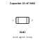
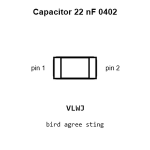
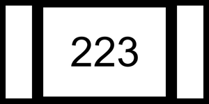
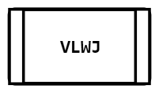
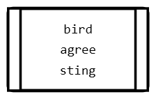
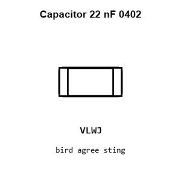
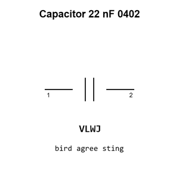
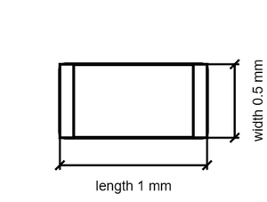

# Capacitor 22 nF 0402

`electronic_capacitor_0402_22_nano_farad`

Capacitor 22 nF 0402 is an OOMP electronic capacitor definition. It uses the 0402 package or form factor. Its nominal drawing size is 1.0 &#x00D7; 0.5 mm. The definition includes 2 documented pins.

## At a glance

| Detail | Value |
| --- | --- |
| OOMP ID | `electronic_capacitor_0402_22_nano_farad` |
| Type | Capacitor |
| Package / style | 0402 |
| Nominal size | 1.0 &#x00D7; 0.5 mm |
| Documented pins | 2 |

## Classification

| Level | Value |
| --- | --- |
| 1 | `electronic` |
| 2 | `capacitor` |
| 3 | `0402` |
| 4 | `22_nano_farad` |

## Nominal dimensions

| Measurement | Value |
| --- | ---: |
| Height | 0.5 mm |
| Length | 1.0 mm |
| Width | 0.5 mm |

## Identifiers

| Identifier | Value |
| --- | --- |
| Manufacturer part number | `0402B223K500NT` |
| LCSC | [`C1532`](https://www.lcsc.com/product-detail/C1532.html) |
| JLCPCB | [`C1532`](https://jlcpcb.com/partdetail/1884-0402B223K500NT/C1532) |

## Pins

| Pin | Name | Type |
| ---: | --- | --- |
| 1 | 1 | passive |
| 2 | 2 | passive |

## Datasheet

[View the datasheet](data/datasheet.pdf)

## Used in projects

| Project | Quantity | References | Explore |
| --- | ---: | --- | --- |
| [Project sparkfun/FM_Tuner_Basic_Breakout-Si4703 Spark Fun FM Tuner Basic Breakout current](https://github.com/sparkfun/FM_Tuner_Basic_Breakout-Si4703/blob/master/Hardware/SparkFun_FM_Tuner_Basic_Breakout.brd) | 1 | C2 | [Board explorer](https://oomlout.github.io/oomp_electronic_version_5/parts/oomp_project_github_sparkfun_fm_tuner_basic_breakout_si4703_spark_fun_fm_tuner_basic_breakout_current/board_explorer.html) · [OOMP project](https://github.com/oomlout/oomp_electronic_version_5/tree/main/parts/oomp_project_github_sparkfun_fm_tuner_basic_breakout_si4703_spark_fun_fm_tuner_basic_breakout_current) |
| [Project sparkfun/Si4707_Breakout Spark Fun Si4707 Breakout current](https://github.com/sparkfun/Si4707_Breakout/blob/master/hardware/SparkFun_Si4707_Breakout.brd) | 1 | C1 | [Board explorer](https://oomlout.github.io/oomp_electronic_version_5/parts/oomp_project_github_sparkfun_si4707_breakout_spark_fun_si4707_breakout_current/board_explorer.html) · [OOMP project](https://github.com/oomlout/oomp_electronic_version_5/tree/main/parts/oomp_project_github_sparkfun_si4707_breakout_spark_fun_si4707_breakout_current) |

## Files

[KiCad symbol, machine-solder and hand-solder footprints](data/kicad/README.md) · [Availability and source masters](data/kicad/manifest.yaml)

[View this part on GitHub](https://github.com/oomlout/oomp_electronic_version_5/tree/main/parts/electronic_capacitor_0402_22_nano_farad)

[Browse this category](../../navigation/electronic/capacitor/0402/README.md)

---

This page is generated from the OOMP part definition by a Roboclick Jinja template. Edit the source taxonomy or template rather than this generated file.