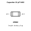
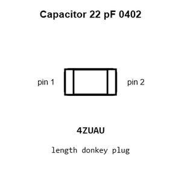
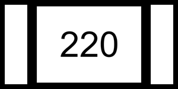
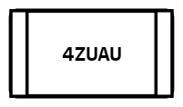
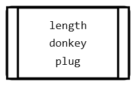
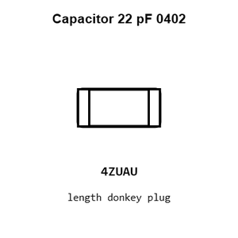
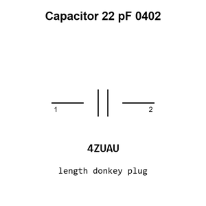

# Capacitor 22 pF 0402

`electronic_capacitor_0402_22_pico_farad`

Capacitor 22 pF 0402 is an OOMP electronic capacitor definition. It uses the 0402 package or form factor. Its nominal drawing size is 1.0 &#x00D7; 0.5 mm.

## At a glance

| Detail | Value |
| --- | --- |
| OOMP ID | `electronic_capacitor_0402_22_pico_farad` |
| Type | Capacitor |
| Package / style | 0402 |
| Nominal size | 1.0 &#x00D7; 0.5 mm |

## Classification

| Level | Value |
| --- | --- |
| 1 | `electronic` |
| 2 | `capacitor` |
| 3 | `0402` |
| 4 | `22_pico_farad` |

## Nominal dimensions

| Measurement | Value |
| --- | ---: |
| Length | 1.0 mm |
| Width | 0.5 mm |

## Identifiers

| Identifier | Value |
| --- | --- |
| Manufacturer part number | `CC0402JRNPO9BN220` |
| LCSC | [`C106203`](https://www.lcsc.com/product-detail/C106203.html) |
| LCSC | [`C1555`](https://www.lcsc.com/product-detail/C1555.html) |
| LCSC | [`C696857`](https://www.lcsc.com/product-detail/C696857.html) |

## Used in projects

| Project | Quantity | References | Explore |
| --- | ---: | --- | --- |
| [Project adafruit/Adafruit-Feather-RP2040-Adalogger-PCB Adafruit Feather RP2040 Adalogger current](https://github.com/adafruit/Adafruit-Feather-RP2040-Adalogger-PCB/blob/main/Adafruit%20Feather%20RP2040%20Adalogger.brd) | 2 | C2, C3 | [Board explorer](https://oomlout.github.io/oomp_electronic_version_5/parts/oomp_project_github_adafruit_adafruit_feather_rp2040_adalogger_pcb_adafruit_feather_rp2040_adalogger_current/board_explorer.html) · [OOMP project](https://github.com/oomlout/oomp_electronic_version_5/tree/main/parts/oomp_project_github_adafruit_adafruit_feather_rp2040_adalogger_pcb_adafruit_feather_rp2040_adalogger_current) |
| [Project adafruit/Adafruit-Feather-RP2040-DVI-PCB Adafruit Feather RP2040 DVI current](https://github.com/adafruit/Adafruit-Feather-RP2040-DVI-PCB/blob/main/Adafruit%20Feather%20RP2040%20DVI.brd) | 2 | C2, C3 | [Board explorer](https://oomlout.github.io/oomp_electronic_version_5/parts/oomp_project_github_adafruit_adafruit_feather_rp2040_dvi_pcb_adafruit_feather_rp2040_dvi_current/board_explorer.html) · [OOMP project](https://github.com/oomlout/oomp_electronic_version_5/tree/main/parts/oomp_project_github_adafruit_adafruit_feather_rp2040_dvi_pcb_adafruit_feather_rp2040_dvi_current) |
| [Project adafruit/Adafruit-Feather-RP2040-RFM-PCB Adafruit Feather RP2040 RFM current](https://github.com/adafruit/Adafruit-Feather-RP2040-RFM-PCB/blob/main/Adafruit%20Feather%20RP2040%20RFM.brd) | 2 | C2, C3 | [Board explorer](https://oomlout.github.io/oomp_electronic_version_5/parts/oomp_project_github_adafruit_adafruit_feather_rp2040_rfm_pcb_adafruit_feather_rp2040_rfm_current/board_explorer.html) · [OOMP project](https://github.com/oomlout/oomp_electronic_version_5/tree/main/parts/oomp_project_github_adafruit_adafruit_feather_rp2040_rfm_pcb_adafruit_feather_rp2040_rfm_current) |
| [Project adafruit/Adafruit-Feather-RP2040-ThinkInk Adafruit Feather RP2040 Think Ink current](https://github.com/adafruit/Adafruit-Feather-RP2040-ThinkInk/blob/main/Adafruit%20Feather%20RP2040%20ThinkInk.brd) | 2 | C2, C3 | [Board explorer](https://oomlout.github.io/oomp_electronic_version_5/parts/oomp_project_github_adafruit_adafruit_feather_rp2040_think_ink_adafruit_feather_rp2040_think_ink_current/board_explorer.html) · [OOMP project](https://github.com/oomlout/oomp_electronic_version_5/tree/main/parts/oomp_project_github_adafruit_adafruit_feather_rp2040_think_ink_adafruit_feather_rp2040_think_ink_current) |
| [Project adafruit/Adafruit-Feather-RP2040-USB-Host-PCB Adafruit Feather RP2040 USB Host current](https://github.com/adafruit/Adafruit-Feather-RP2040-USB-Host-PCB/blob/main/Adafruit%20Feather%20RP2040%20USB%20Host.brd) | 2 | C2, C3 | [Board explorer](https://oomlout.github.io/oomp_electronic_version_5/parts/oomp_project_github_adafruit_adafruit_feather_rp2040_usb_host_pcb_adafruit_feather_rp2040_usb_host_current/board_explorer.html) · [OOMP project](https://github.com/oomlout/oomp_electronic_version_5/tree/main/parts/oomp_project_github_adafruit_adafruit_feather_rp2040_usb_host_pcb_adafruit_feather_rp2040_usb_host_current) |
| [Project adafruit/Adafruit-ItsyBitsy-RP2040-PCB Adafruit Itsy Bitsy RP2040 current](https://github.com/adafruit/Adafruit-ItsyBitsy-RP2040-PCB/blob/main/Adafruit%20ItsyBitsy%20RP2040.brd) | 2 | C19, C20 | [Board explorer](https://oomlout.github.io/oomp_electronic_version_5/parts/oomp_project_github_adafruit_adafruit_itsy_bitsy_rp2040_pcb_adafruit_itsy_bitsy_rp2040_current/board_explorer.html) · [OOMP project](https://github.com/oomlout/oomp_electronic_version_5/tree/main/parts/oomp_project_github_adafruit_adafruit_itsy_bitsy_rp2040_pcb_adafruit_itsy_bitsy_rp2040_current) |
| [Project adafruit/Adafruit-KB2040-PCB Adafruit KB2040 current](https://github.com/adafruit/Adafruit-KB2040-PCB/blob/main/Adafruit%20KB2040.brd) | 2 | C19, C20 | [Board explorer](https://oomlout.github.io/oomp_electronic_version_5/parts/oomp_project_github_adafruit_adafruit_kb2040_pcb_adafruit_kb2040_current/board_explorer.html) · [OOMP project](https://github.com/oomlout/oomp_electronic_version_5/tree/main/parts/oomp_project_github_adafruit_adafruit_kb2040_pcb_adafruit_kb2040_current) |
| [Project hanqaqa/easyduino ATmega328P Arduino Nano current](https://github.com/Hanqaqa/Easyduino/tree/master/Atmega328p%20Arduino%20Nano) | 2 | C9, C10 | [Board explorer](https://oomlout.github.io/oomp_electronic_version_5/parts/oomp_project_github_hanqaqa_easyduino_atmega328p_arduino_nano_current/board_explorer.html) · [OOMP project](https://github.com/oomlout/oomp_electronic_version_5/tree/main/parts/oomp_project_github_hanqaqa_easyduino_atmega328p_arduino_nano_current) |

## Files

[KiCad symbol, machine-solder and hand-solder footprints](data/kicad/README.md) · [Availability and source masters](data/kicad/manifest.yaml)

[View this part on GitHub](https://github.com/oomlout/oomp_electronic_version_5/tree/main/parts/electronic_capacitor_0402_22_pico_farad)

[Browse this category](../../navigation/electronic/capacitor/0402/README.md)

---

This page is generated from the OOMP part definition by a Roboclick Jinja template. Edit the source taxonomy or template rather than this generated file.