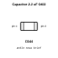
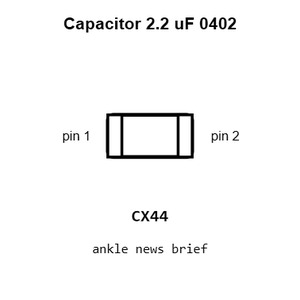
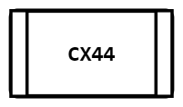
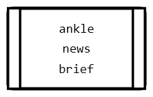
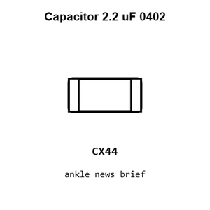
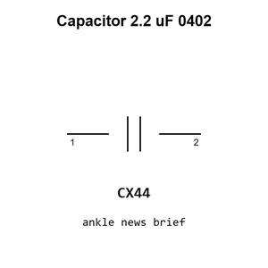

# Capacitor 2.2 uF 0402

`electronic_capacitor_0402_2_2_micro_farad`

Capacitor 2.2 uF 0402 is an OOMP electronic capacitor definition. It uses the 0402 package or form factor. Its nominal drawing size is 1.0 &#x00D7; 0.5 mm.

## At a glance

| Detail | Value |
| --- | --- |
| OOMP ID | `electronic_capacitor_0402_2_2_micro_farad` |
| Type | Capacitor |
| Package / style | 0402 |
| Nominal size | 1.0 &#x00D7; 0.5 mm |

## Classification

| Level | Value |
| --- | --- |
| 1 | `electronic` |
| 2 | `capacitor` |
| 3 | `0402` |
| 4 | `2_2_micro_farad` |

## Nominal dimensions

| Measurement | Value |
| --- | ---: |
| Length | 1.0 mm |
| Width | 0.5 mm |

## Identifiers

| Identifier | Value |
| --- | --- |
| Manufacturer part number | `CL05A225MQ5NSNC` |
| LCSC | [`C12530`](https://www.lcsc.com/product-detail/C12530.html) |
| LCSC | [`C20539421`](https://www.lcsc.com/product-detail/C20539421.html) |
| LCSC | [`C326606`](https://www.lcsc.com/product-detail/C326606.html) |

## Used in projects

| Project | Quantity | References | Explore |
| --- | ---: | --- | --- |
| [Project adafruit/Adafruit-Feather-RP2350-PCB Adafruit Feather RP2350 current](https://github.com/adafruit/Adafruit-Feather-RP2350-PCB/blob/main/Adafruit%20Feather%20RP2350.brd) | 2 | C19, C21 | [Board explorer](https://oomlout.github.io/oomp_electronic_version_5/parts/oomp_project_github_adafruit_adafruit_feather_rp2350_pcb_adafruit_feather_rp2350_current/board_explorer.html) · [OOMP project](https://github.com/oomlout/oomp_electronic_version_5/tree/main/parts/oomp_project_github_adafruit_adafruit_feather_rp2350_pcb_adafruit_feather_rp2350_current) |
| [Project dangerousprototypes/buspirate5_hardware 5_rev10a](https://github.com/DangerousPrototypes/BusPirate5-hardware) | 10 | C104, C107, C108, C109, C405, C413, C504, C507, C509, C601 | [Board explorer](https://oomlout.github.io/oomp_electronic_version_5/parts/oomp_project_github_dangerousprototypes_buspirate5_hardware_5_rev10a/board_explorer.html) · [OOMP project](https://github.com/oomlout/oomp_electronic_version_5/tree/main/parts/oomp_project_github_dangerousprototypes_buspirate5_hardware_5_rev10a) |
| [Project dangerousprototypes/buspirate5_hardware current](https://github.com/DangerousPrototypes/BusPirate5-hardware) | 10 | C104, C107, C108, C109, C405, C413, C504, C507, C509, C601 | [Board explorer](https://oomlout.github.io/oomp_electronic_version_5/parts/oomp_project_github_dangerousprototypes_buspirate5_hardware_current/board_explorer.html) · [OOMP project](https://github.com/oomlout/oomp_electronic_version_5/tree/main/parts/oomp_project_github_dangerousprototypes_buspirate5_hardware_current) |
| [Project sparkfun/SparkFun_Particulate_Matter_Sensor_Breakout_BMV080 Particulate Matter Sensor BMV080 current](https://github.com/sparkfun/SparkFun_Particulate_Matter_Sensor_Breakout_BMV080) | 4 | C1, C2, C3, C4 | [Board explorer](https://oomlout.github.io/oomp_electronic_version_5/parts/oomp_project_github_sparkfun_spark_fun_particulate_matter_sensor_breakout_bmv080_particulate_matter_bmv080_current/board_explorer.html) · [OOMP project](https://github.com/oomlout/oomp_electronic_version_5/tree/main/parts/oomp_project_github_sparkfun_spark_fun_particulate_matter_sensor_breakout_bmv080_particulate_matter_bmv080_current) |

## Files

[KiCad symbol, machine-solder and hand-solder footprints](data/kicad/README.md) · [Availability and source masters](data/kicad/manifest.yaml)

[View this part on GitHub](https://github.com/oomlout/oomp_electronic_version_5/tree/main/parts/electronic_capacitor_0402_2_2_micro_farad)

[Browse this category](../../navigation/electronic/capacitor/0402/README.md)

---

This page is generated from the OOMP part definition by a Roboclick Jinja template. Edit the source taxonomy or template rather than this generated file.