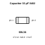
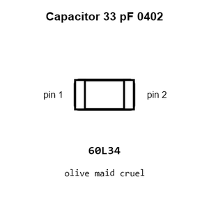
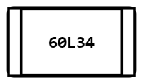
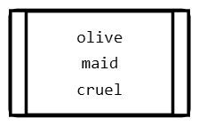
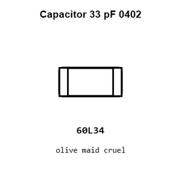
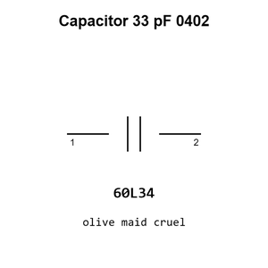

# Capacitor 33 pF 0402

`electronic_capacitor_0402_33_pico_farad`

Capacitor 33 pF 0402 is an OOMP electronic capacitor definition. It uses the 0402 package or form factor. Its nominal drawing size is 1.0 &#x00D7; 0.5 mm.

## At a glance

| Detail | Value |
| --- | --- |
| OOMP ID | `electronic_capacitor_0402_33_pico_farad` |
| Type | Capacitor |
| Package / style | 0402 |
| Nominal size | 1.0 &#x00D7; 0.5 mm |

## Classification

| Level | Value |
| --- | --- |
| 1 | `electronic` |
| 2 | `capacitor` |
| 3 | `0402` |
| 4 | `33_pico_farad` |

## Nominal dimensions

| Measurement | Value |
| --- | ---: |
| Length | 1.0 mm |
| Width | 0.5 mm |

## Identifiers

| Identifier | Value |
| --- | --- |
| Manufacturer part number | `0402CG330J500NT` |
| LCSC | [`C1562`](https://www.lcsc.com/product-detail/C1562.html) |
| JLCPCB | [`C1562`](https://jlcpcb.com/partdetail/1914-0402CG330J500NT/C1562) |

## Used in projects

| Project | Quantity | References | Explore |
| --- | ---: | --- | --- |
| [Project sparkfun/SparkFun_LTE_GNSS_Breakout_SARA-R510M8S Spark Fun LTE GNSS Breakout SARA R510 M8 S current](https://github.com/sparkfun/SparkFun_LTE_GNSS_Breakout_SARA-R510M8S/blob/main/Hardware/SparkFun_LTE_GNSS_Breakout_SARA-R510M8S.brd) | 1 | C18 | [Board explorer](https://oomlout.github.io/oomp_electronic_version_5/parts/oomp_project_github_sparkfun_spark_fun_lte_gnss_breakout_sara_r510_m8_s_spark_fun_lte_gnss_breakout_sara_r510_m8_s_current/board_explorer.html) · [OOMP project](https://github.com/oomlout/oomp_electronic_version_5/tree/main/parts/oomp_project_github_sparkfun_spark_fun_lte_gnss_breakout_sara_r510_m8_s_spark_fun_lte_gnss_breakout_sara_r510_m8_s_current) |
| [Project sparkfun/SparkFun_MicroMod_LTE_GNSS_Function_Board_u-blox_SARA-R5 Spark Fun Micro Mod Function SARA R5 current](https://github.com/sparkfun/SparkFun_MicroMod_LTE_GNSS_Function_Board_u-blox_SARA-R5/blob/main/Hardware/SparkFun_MicroMod_Function_SARA-R5.brd) | 1 | C33 | [Board explorer](https://oomlout.github.io/oomp_electronic_version_5/parts/oomp_project_github_sparkfun_spark_fun_micro_mod_lte_gnss_function_board_u_blox_sara_r5_spark_fun_micro_mod_function_sara_r5_current/board_explorer.html) · [OOMP project](https://github.com/oomlout/oomp_electronic_version_5/tree/main/parts/oomp_project_github_sparkfun_spark_fun_micro_mod_lte_gnss_function_board_u_blox_sara_r5_spark_fun_micro_mod_function_sara_r5_current) |
| [Project sparkfun/SparkFun_Qwiic_Current_Sensor_ADE7953 Qwiic Current Sensor ADE7953 current](https://github.com/sparkfun/SparkFun_Qwiic_Current_Sensor_ADE7953) | 4 | C6, C7, C8, C9 | [Board explorer](https://oomlout.github.io/oomp_electronic_version_5/parts/oomp_project_github_sparkfun_spark_fun_qwiic_current_sensor_ade7953_qwiic_current_sensor_ade7953_current/board_explorer.html) · [OOMP project](https://github.com/oomlout/oomp_electronic_version_5/tree/main/parts/oomp_project_github_sparkfun_spark_fun_qwiic_current_sensor_ade7953_qwiic_current_sensor_ade7953_current) |

## Files

[KiCad symbol, machine-solder and hand-solder footprints](data/kicad/README.md) · [Availability and source masters](data/kicad/manifest.yaml)

[View this part on GitHub](https://github.com/oomlout/oomp_electronic_version_5/tree/main/parts/electronic_capacitor_0402_33_pico_farad)

[Browse this category](../../navigation/electronic/capacitor/0402/README.md)

---

This page is generated from the OOMP part definition by a Roboclick Jinja template. Edit the source taxonomy or template rather than this generated file.