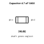
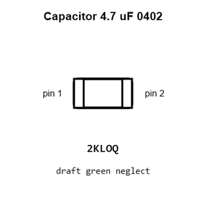
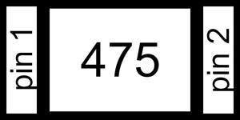
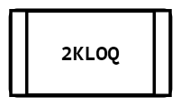
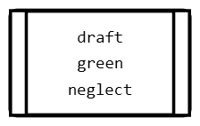
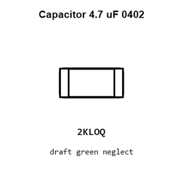
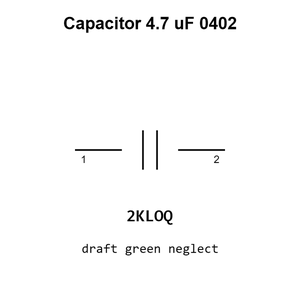

# Capacitor 4.7 uF 0402

`electronic_capacitor_0402_4_7_micro_farad`

Capacitor 4.7 uF 0402 is an OOMP electronic capacitor definition. It uses the 0402 package or form factor. Its nominal drawing size is 1.0 &#x00D7; 0.5 mm.

## At a glance

| Detail | Value |
| --- | --- |
| OOMP ID | `electronic_capacitor_0402_4_7_micro_farad` |
| Type | Capacitor |
| Package / style | 0402 |
| Nominal size | 1.0 &#x00D7; 0.5 mm |

## Classification

| Level | Value |
| --- | --- |
| 1 | `electronic` |
| 2 | `capacitor` |
| 3 | `0402` |
| 4 | `4_7_micro_farad` |

## Nominal dimensions

| Measurement | Value |
| --- | ---: |
| Length | 1.0 mm |
| Width | 0.5 mm |

## Identifiers

| Identifier | Value |
| --- | --- |
| Manufacturer part number | `CL05A475KP5NRNC` |
| LCSC | [`C368809`](https://www.lcsc.com/product-detail/C368809.html) |
| LCSC | [`C318563`](https://www.lcsc.com/product-detail/C318563.html) |
| LCSC | [`C23733`](https://www.lcsc.com/product-detail/C23733.html) |

## Used in projects

| Project | Quantity | References | Explore |
| --- | ---: | --- | --- |
| [Project dangerousprototypes/buspirate5_hardware 5_rev10a](https://github.com/DangerousPrototypes/BusPirate5-hardware) | 6 | C201, C202, C401, C402, C404, C407 | [Board explorer](https://oomlout.github.io/oomp_electronic_version_5/parts/oomp_project_github_dangerousprototypes_buspirate5_hardware_5_rev10a/board_explorer.html) · [OOMP project](https://github.com/oomlout/oomp_electronic_version_5/tree/main/parts/oomp_project_github_dangerousprototypes_buspirate5_hardware_5_rev10a) |
| [Project dangerousprototypes/buspirate5_hardware current](https://github.com/DangerousPrototypes/BusPirate5-hardware) | 6 | C201, C202, C401, C402, C404, C407 | [Board explorer](https://oomlout.github.io/oomp_electronic_version_5/parts/oomp_project_github_dangerousprototypes_buspirate5_hardware_current/board_explorer.html) · [OOMP project](https://github.com/oomlout/oomp_electronic_version_5/tree/main/parts/oomp_project_github_dangerousprototypes_buspirate5_hardware_current) |
| [Project electrolama/oshcamp23-badge OSHCamp 2023 Badge current](https://github.com/electrolama/oshcamp23-badge/tree/main/oomp/version_current/working) | 4 | C12, C14, C25, C27 | [Board explorer](https://oomlout.github.io/oomp_electronic_version_5/parts/oomp_project_github_electrolama_oshcamp23_badge_oshcamp23_badge_current/board_explorer.html) · [OOMP project](https://github.com/oomlout/oomp_electronic_version_5/tree/main/parts/oomp_project_github_electrolama_oshcamp23_badge_oshcamp23_badge_current) |
| [Project electrolama/tpm-modules TPM Module 12 Pin SPI current](https://github.com/electrolama/tpm-modules/tree/main/tpm-module-12pin-spi/Revision%20A1) | 1 | C1 | [Board explorer](https://oomlout.github.io/oomp_electronic_version_5/parts/oomp_project_github_electrolama_tpm_modules_tpm_module_12pin_spi_current/board_explorer.html) · [OOMP project](https://github.com/oomlout/oomp_electronic_version_5/tree/main/parts/oomp_project_github_electrolama_tpm_modules_tpm_module_12pin_spi_current) |
| [Project electrolama/tpm-modules TPM Module 14 Pin LPC current](https://github.com/electrolama/tpm-modules/tree/main/tpm-module-14pin-lpc/Revision%20A1) | 1 | C1 | [Board explorer](https://oomlout.github.io/oomp_electronic_version_5/parts/oomp_project_github_electrolama_tpm_modules_tpm_module_14pin_lpc_current/board_explorer.html) · [OOMP project](https://github.com/oomlout/oomp_electronic_version_5/tree/main/parts/oomp_project_github_electrolama_tpm_modules_tpm_module_14pin_lpc_current) |
| [Project sparkfun/Energy_Harvester_Breakout-LTC3588 Spark Fun Energy Harvester Breakout LTC3588 current](https://github.com/sparkfun/Energy_Harvester_Breakout-LTC3588/blob/master/Hardware/SparkFun_Energy_Harvester_Breakout-LTC3588.brd) | 1 | C1 | [Board explorer](https://oomlout.github.io/oomp_electronic_version_5/parts/oomp_project_github_sparkfun_energy_harvester_breakout_ltc3588_spark_fun_energy_harvester_breakout_ltc3588_current/board_explorer.html) · [OOMP project](https://github.com/oomlout/oomp_electronic_version_5/tree/main/parts/oomp_project_github_sparkfun_energy_harvester_breakout_ltc3588_spark_fun_energy_harvester_breakout_ltc3588_current) |
| [Project sparkfun/LilyPad_MP3_Player Lily Pad MP3a current](https://github.com/sparkfun/LilyPad_MP3_Player/blob/master/hardware/LilyPad-MP3-v15a.brd) | 2 | C9, C10 | [Board explorer](https://oomlout.github.io/oomp_electronic_version_5/parts/oomp_project_github_sparkfun_lily_pad_mp3_player_lily_pad_mp3a_current/board_explorer.html) · [OOMP project](https://github.com/oomlout/oomp_electronic_version_5/tree/main/parts/oomp_project_github_sparkfun_lily_pad_mp3_player_lily_pad_mp3a_current) |
| [Project sparkfun/MicroMod_ESP32_Processor Spark Fun Micro Mod ESP32 current](https://github.com/sparkfun/MicroMod_ESP32_Processor/blob/master/Hardware/SparkFun_MicroMod_ESP32.brd) | 1 | C7 | [Board explorer](https://oomlout.github.io/oomp_electronic_version_5/parts/oomp_project_github_sparkfun_micro_mod_esp32_processor_spark_fun_micro_mod_esp32_current/board_explorer.html) · [OOMP project](https://github.com/oomlout/oomp_electronic_version_5/tree/main/parts/oomp_project_github_sparkfun_micro_mod_esp32_processor_spark_fun_micro_mod_esp32_current) |
| [Project sparkfun/MicroMod_STM32_Processor Micro Mod STM32 Processor current](https://github.com/sparkfun/MicroMod_STM32_Processor/blob/main/Hardware/MicroMod_STM32_Processor.brd) | 1 | C10 | [Board explorer](https://oomlout.github.io/oomp_electronic_version_5/parts/oomp_project_github_sparkfun_micro_mod_stm32_processor_micro_mod_stm32_processor_current/board_explorer.html) · [OOMP project](https://github.com/oomlout/oomp_electronic_version_5/tree/main/parts/oomp_project_github_sparkfun_micro_mod_stm32_processor_micro_mod_stm32_processor_current) |
| [Project sparkfun/MicroMod_Teensy_Processor Micro Mod Teensy current](https://github.com/sparkfun/MicroMod_Teensy_Processor/blob/main/Hardware/MicroMod-Teensy.brd) | 5 | C2, C14, C18, C26, C27 | [Board explorer](https://oomlout.github.io/oomp_electronic_version_5/parts/oomp_project_github_sparkfun_micro_mod_teensy_processor_micro_mod_teensy_current/board_explorer.html) · [OOMP project](https://github.com/oomlout/oomp_electronic_version_5/tree/main/parts/oomp_project_github_sparkfun_micro_mod_teensy_processor_micro_mod_teensy_current) |
| [Project sparkfun/MicroMod_Teensy_Processor Micro Mod Teensy Lockable current](https://github.com/sparkfun/MicroMod_Teensy_Processor/blob/main/Hardware/Lockable/MicroMod-Teensy-Lockable.brd) | 5 | C2, C14, C18, C26, C27 | [Board explorer](https://oomlout.github.io/oomp_electronic_version_5/parts/oomp_project_github_sparkfun_micro_mod_teensy_processor_micro_mod_teensy_lockable_current/board_explorer.html) · [OOMP project](https://github.com/oomlout/oomp_electronic_version_5/tree/main/parts/oomp_project_github_sparkfun_micro_mod_teensy_processor_micro_mod_teensy_lockable_current) |
| [Project sparkfun/OBD-II_UART OBD II UART current](https://github.com/sparkfun/OBD-II_UART/blob/master/Hardware/OBD-II-UART.brd) | 1 | C8 | [Board explorer](https://oomlout.github.io/oomp_electronic_version_5/parts/oomp_project_github_sparkfun_obd_ii_uart_obd_ii_uart_current/board_explorer.html) · [OOMP project](https://github.com/oomlout/oomp_electronic_version_5/tree/main/parts/oomp_project_github_sparkfun_obd_ii_uart_obd_ii_uart_current) |
| [Project sparkfun/OpenLog_Artemis Spark Fun Artemis Open Log current](https://github.com/sparkfun/OpenLog_Artemis/blob/main/Hardware/SparkFun_Artemis_OpenLog.brd) | 2 | C3, C4 | [Board explorer](https://oomlout.github.io/oomp_electronic_version_5/parts/oomp_project_github_sparkfun_open_log_artemis_spark_fun_artemis_open_log_current/board_explorer.html) · [OOMP project](https://github.com/oomlout/oomp_electronic_version_5/tree/main/parts/oomp_project_github_sparkfun_open_log_artemis_spark_fun_artemis_open_log_current) |
| [Project sparkfun/ProtoSnap-LilyPad_Development_Board Lily Pad Dev current](https://github.com/sparkfun/ProtoSnap-LilyPad_Development_Board/blob/master/Hardware/LilyPad-Dev-v34.brd) | 2 | C9, C10 | [Board explorer](https://oomlout.github.io/oomp_electronic_version_5/parts/oomp_project_github_sparkfun_proto_snap_lily_pad_development_board_lily_pad_dev_current/board_explorer.html) · [OOMP project](https://github.com/oomlout/oomp_electronic_version_5/tree/main/parts/oomp_project_github_sparkfun_proto_snap_lily_pad_development_board_lily_pad_dev_current) |
| [Project sparkfun/RP2040_mikroBUS_Dev_Board RP2040 Mikro BUS current](https://github.com/sparkfun/RP2040_mikroBUS_Dev_Board/blob/main/Hardware/RP2040_MikroBUS.brd) | 2 | C7, C10 | [Board explorer](https://oomlout.github.io/oomp_electronic_version_5/parts/oomp_project_github_sparkfun_rp2040_mikro_bus_dev_board_rp2040_mikro_bus_current/board_explorer.html) · [OOMP project](https://github.com/oomlout/oomp_electronic_version_5/tree/main/parts/oomp_project_github_sparkfun_rp2040_mikro_bus_dev_board_rp2040_mikro_bus_current) |
| [Project sparkfun/SparkFun_Artemis Spark Fun Artemis current](https://github.com/sparkfun/SparkFun_Artemis/blob/master/Hardware/SparkFun_Artemis.brd) | 1 | C2 | [Board explorer](https://oomlout.github.io/oomp_electronic_version_5/parts/oomp_project_github_sparkfun_spark_fun_artemis_spark_fun_artemis_current/board_explorer.html) · [OOMP project](https://github.com/oomlout/oomp_electronic_version_5/tree/main/parts/oomp_project_github_sparkfun_spark_fun_artemis_spark_fun_artemis_current) |
| [Project sparkfun/SparkFun_Audio_Codec_Breakout_WM8960 Stereo Audio Codec Breakout WM8960 current](https://github.com/sparkfun/SparkFun_Audio_Codec_Breakout_WM8960/blob/main/Hardware/Stereo_Audio_Codec_Breakout_WM8960.brd) | 2 | C8, C9 | [Board explorer](https://oomlout.github.io/oomp_electronic_version_5/parts/oomp_project_github_sparkfun_spark_fun_audio_codec_breakout_wm8960_stereo_audio_codec_breakout_wm8960_current/board_explorer.html) · [OOMP project](https://github.com/oomlout/oomp_electronic_version_5/tree/main/parts/oomp_project_github_sparkfun_spark_fun_audio_codec_breakout_wm8960_stereo_audio_codec_breakout_wm8960_current) |
| [Project sparkfun/SparkFun_Thing_Plus_AW-CU488 Spark Fun Azure Wave Module Thing Plus AW CU488 current](https://github.com/sparkfun/SparkFun_Thing_Plus_AW-CU488/blob/main/Hardware/SparkFun_AzureWave_Module_Thing_Plus_AW-CU488.brd) | 3 | C3, C6, C19 | [Board explorer](https://oomlout.github.io/oomp_electronic_version_5/parts/oomp_project_github_sparkfun_spark_fun_thing_plus_aw_cu488_spark_fun_azure_wave_module_thing_plus_aw_cu488_current/board_explorer.html) · [OOMP project](https://github.com/oomlout/oomp_electronic_version_5/tree/main/parts/oomp_project_github_sparkfun_spark_fun_thing_plus_aw_cu488_spark_fun_azure_wave_module_thing_plus_aw_cu488_current) |
| [Project sparkfun/SparkFun_Thing_Plus_ESP32_WROOM_C Spark Fun Thing Plus ESP32 WROOM C current](https://github.com/sparkfun/SparkFun_Thing_Plus_ESP32_WROOM_C/blob/main/Hardware/SparkFun_Thing_Plus_ESP32_WROOM_C.brd) | 1 | C6 | [Board explorer](https://oomlout.github.io/oomp_electronic_version_5/parts/oomp_project_github_sparkfun_spark_fun_thing_plus_esp32_wroom_c_spark_fun_thing_plus_esp32_wroom_c_current/board_explorer.html) · [OOMP project](https://github.com/oomlout/oomp_electronic_version_5/tree/main/parts/oomp_project_github_sparkfun_spark_fun_thing_plus_esp32_wroom_c_spark_fun_thing_plus_esp32_wroom_c_current) |
| [Project sparkfun/SparkFun_Thing_Plus_MGM240P Thing Plus MGM240 P current](https://github.com/sparkfun/SparkFun_Thing_Plus_MGM240P/blob/main/Hardware/Thing_Plus_MGM240P.brd) | 3 | C12, C15, C16 | [Board explorer](https://oomlout.github.io/oomp_electronic_version_5/parts/oomp_project_github_sparkfun_spark_fun_thing_plus_mgm240_p_thing_plus_mgm240_p_current/board_explorer.html) · [OOMP project](https://github.com/oomlout/oomp_electronic_version_5/tree/main/parts/oomp_project_github_sparkfun_spark_fun_thing_plus_mgm240_p_thing_plus_mgm240_p_current) |
| [Project sparkfun/SparkFun_Thing_Plus-RP2040 RP2040 Thing Plus current](https://github.com/sparkfun/SparkFun_Thing_Plus-RP2040/blob/main/Hardware/RP2040_Thing_Plus.brd) | 2 | C7, C10 | [Board explorer](https://oomlout.github.io/oomp_electronic_version_5/parts/oomp_project_github_sparkfun_spark_fun_thing_plus_rp2040_rp2040_thing_plus_current/board_explorer.html) · [OOMP project](https://github.com/oomlout/oomp_electronic_version_5/tree/main/parts/oomp_project_github_sparkfun_spark_fun_thing_plus_rp2040_rp2040_thing_plus_current) |
| [Project sparkfun/SparkFun_Tsunami_Super_WAV_Trigger_Qwiic Spark Fun Tsunami Qwiic current](https://github.com/sparkfun/SparkFun_Tsunami_Super_WAV_Trigger_Qwiic/blob/main/Hardware/SparkFun_Tsunami_Qwiic.brd) | 1 | C14 | [Board explorer](https://oomlout.github.io/oomp_electronic_version_5/parts/oomp_project_github_sparkfun_spark_fun_tsunami_super_wav_trigger_qwiic_spark_fun_tsunami_qwiic_current/board_explorer.html) · [OOMP project](https://github.com/oomlout/oomp_electronic_version_5/tree/main/parts/oomp_project_github_sparkfun_spark_fun_tsunami_super_wav_trigger_qwiic_spark_fun_tsunami_qwiic_current) |

## Files

[KiCad symbol, machine-solder and hand-solder footprints](data/kicad/README.md) · [Availability and source masters](data/kicad/manifest.yaml)

[View this part on GitHub](https://github.com/oomlout/oomp_electronic_version_5/tree/main/parts/electronic_capacitor_0402_4_7_micro_farad)

[Browse this category](../../navigation/electronic/capacitor/0402/README.md)

---

This page is generated from the OOMP part definition by a Roboclick Jinja template. Edit the source taxonomy or template rather than this generated file.