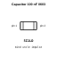
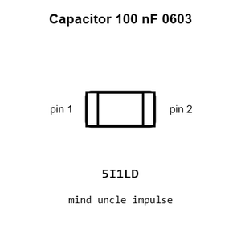
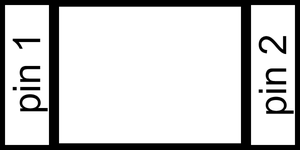
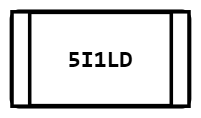
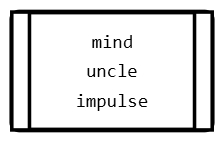
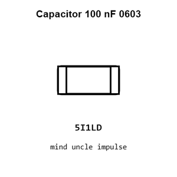
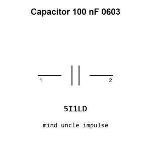
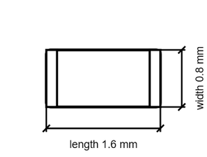

# Capacitor 100 nF 0603

`electronic_capacitor_0603_100_nano_farad`

Capacitor 100 nF 0603 is an OOMP electronic capacitor definition. It uses the 0603 package or form factor. Its nominal drawing size is 1.6 &#x00D7; 0.8 mm.

## At a glance

| Detail | Value |
| --- | --- |
| OOMP ID | `electronic_capacitor_0603_100_nano_farad` |
| Type | Capacitor |
| Package / style | 0603 |
| Nominal size | 1.6 &#x00D7; 0.8 mm |

## Classification

| Level | Value |
| --- | --- |
| 1 | `electronic` |
| 2 | `capacitor` |
| 3 | `0603` |
| 4 | `100_nano_farad` |

## Nominal dimensions

| Measurement | Value |
| --- | ---: |
| Length | 1.6 mm |
| Width | 0.8 mm |

## Identifiers

| Identifier | Value |
| --- | --- |
| Manufacturer part number | `CC0603KRX7R9BB104` |
| LCSC | [`C14663`](https://www.lcsc.com/product-detail/C14663.html) |
| LCSC | [`C30926`](https://www.lcsc.com/product-detail/C30926.html) |
| LCSC | [`C1591`](https://www.lcsc.com/product-detail/C1591.html) |

## Used in projects

| Project | Quantity | References | Explore |
| --- | ---: | --- | --- |
| [Project hanqaqa/easyduino ATmega328P Arduino Uno current](https://github.com/Hanqaqa/Easyduino/tree/master/Atmega328p%20Arduino%20Uno) | 7 | C1, C2, C3, C4, C5, C6, C7 | [Board explorer](https://oomlout.github.io/oomp_electronic_version_5/parts/oomp_project_github_hanqaqa_easyduino_atmega328p_arduino_uno_current/board_explorer.html) · [OOMP project](https://github.com/oomlout/oomp_electronic_version_5/tree/main/parts/oomp_project_github_hanqaqa_easyduino_atmega328p_arduino_uno_current) |
| [Project soldered_electronics/Accelerometer---Gyroscope---Magnetometer-LSM9DS1TR-breakout-hardware-design LSM9DS1TR IMU current](https://github.com/SolderedElectronics/Accelerometer---Gyroscope---Magnetometer-LSM9DS1TR-breakout-hardware-design) | 3 | C1, C2, C5 | [Board explorer](https://oomlout.github.io/oomp_electronic_version_5/parts/oomp_project_github_soldered_electronics_accelerometer_gyroscope_magnetometer_lsm9_ds1_tr_breakout_hardware_design_sensor_imu_lsm9ds1tr_current/board_explorer.html) · [OOMP project](https://github.com/oomlout/oomp_electronic_version_5/tree/main/parts/oomp_project_github_soldered_electronics_accelerometer_gyroscope_magnetometer_lsm9_ds1_tr_breakout_hardware_design_sensor_imu_lsm9ds1tr_current) |
| [Project soldered_electronics/Air-quality-sensor-MQ135-breakout-hardware-design MQ135 Breakout current](https://github.com/SolderedElectronics/Air-quality-sensor-MQ135-breakout-hardware-design) | 2 | C1, C2 | [Board explorer](https://oomlout.github.io/oomp_electronic_version_5/parts/oomp_project_github_soldered_electronics_air_quality_sensor_mq135_breakout_hardware_design_sensor_gas_mq135_breakout_current/board_explorer.html) · [OOMP project](https://github.com/oomlout/oomp_electronic_version_5/tree/main/parts/oomp_project_github_soldered_electronics_air_quality_sensor_mq135_breakout_hardware_design_sensor_gas_mq135_breakout_current) |
| [Project soldered_electronics/Air-quality-sensor-MQ135-breakout-qwiic-hardware-design MQ135 Breakout qwiic current](https://github.com/SolderedElectronics/Air-quality-sensor-MQ135-breakout-qwiic-hardware-design) | 1 | C4 | [Board explorer](https://oomlout.github.io/oomp_electronic_version_5/parts/oomp_project_github_soldered_electronics_air_quality_sensor_mq135_breakout_qwiic_hardware_design_sensor_gas_mq135_qwiic_current/board_explorer.html) · [OOMP project](https://github.com/oomlout/oomp_electronic_version_5/tree/main/parts/oomp_project_github_soldered_electronics_air_quality_sensor_mq135_breakout_qwiic_hardware_design_sensor_gas_mq135_qwiic_current) |
| [Project soldered_electronics/Air-quality-sensor-MQ135-breakout-with-easyC-hardware-design MQ135 Breakout easyC current](https://github.com/SolderedElectronics/Air-quality-sensor-MQ135-breakout-with-easyC-hardware-design) | 1 | C4 | [Board explorer](https://oomlout.github.io/oomp_electronic_version_5/parts/oomp_project_github_soldered_electronics_air_quality_sensor_mq135_breakout_with_easy_c_hardware_design_sensor_gas_mq135_easyc_current/board_explorer.html) · [OOMP project](https://github.com/oomlout/oomp_electronic_version_5/tree/main/parts/oomp_project_github_soldered_electronics_air_quality_sensor_mq135_breakout_with_easy_c_hardware_design_sensor_gas_mq135_easyc_current) |
| [Project soldered_electronics/Alcohol--Ethanol-sensor-MQ3-breakout-hardware-design MQ3 Breakout current](https://github.com/SolderedElectronics/Alcohol--Ethanol-sensor-MQ3-breakout-hardware-design) | 2 | C1, C2 | [Board explorer](https://oomlout.github.io/oomp_electronic_version_5/parts/oomp_project_github_soldered_electronics_alcohol_ethanol_sensor_mq3_breakout_hardware_design_sensor_gas_mq3_breakout_current/board_explorer.html) · [OOMP project](https://github.com/oomlout/oomp_electronic_version_5/tree/main/parts/oomp_project_github_soldered_electronics_alcohol_ethanol_sensor_mq3_breakout_hardware_design_sensor_gas_mq3_breakout_current) |
| [Project soldered_electronics/Alcohol--Ethanol-sensor-MQ3-breakout-qwiic-hardware-design MQ3 Breakout qwiic current](https://github.com/SolderedElectronics/Alcohol--Ethanol-sensor-MQ3-breakout-qwiic-hardware-design) | 1 | C4 | [Board explorer](https://oomlout.github.io/oomp_electronic_version_5/parts/oomp_project_github_soldered_electronics_alcohol_ethanol_sensor_mq3_breakout_qwiic_hardware_design_sensor_gas_mq3_qwiic_current/board_explorer.html) · [OOMP project](https://github.com/oomlout/oomp_electronic_version_5/tree/main/parts/oomp_project_github_soldered_electronics_alcohol_ethanol_sensor_mq3_breakout_qwiic_hardware_design_sensor_gas_mq3_qwiic_current) |
| [Project soldered_electronics/Alcohol--Ethanol-sensor-MQ3-breakout-with-easyC-hardware-design MQ3 Breakout easyC current](https://github.com/SolderedElectronics/Alcohol--Ethanol-sensor-MQ3-breakout-with-easyC-hardware-design) | 1 | C4 | [Board explorer](https://oomlout.github.io/oomp_electronic_version_5/parts/oomp_project_github_soldered_electronics_alcohol_ethanol_sensor_mq3_breakout_with_easy_c_hardware_design_sensor_gas_mq3_easyc_current/board_explorer.html) · [OOMP project](https://github.com/oomlout/oomp_electronic_version_5/tree/main/parts/oomp_project_github_soldered_electronics_alcohol_ethanol_sensor_mq3_breakout_with_easy_c_hardware_design_sensor_gas_mq3_easyc_current) |
| [Project soldered_electronics/Ammonia-sensor-MQ137-breakout-hardware-design MQ137 Breakout current](https://github.com/SolderedElectronics/Ammonia-sensor-MQ137-breakout-hardware-design) | 2 | C1, C2 | [Board explorer](https://oomlout.github.io/oomp_electronic_version_5/parts/oomp_project_github_soldered_electronics_ammonia_sensor_mq137_breakout_hardware_design_sensor_gas_mq137_breakout_current/board_explorer.html) · [OOMP project](https://github.com/oomlout/oomp_electronic_version_5/tree/main/parts/oomp_project_github_soldered_electronics_ammonia_sensor_mq137_breakout_hardware_design_sensor_gas_mq137_breakout_current) |
| [Project soldered_electronics/Ammonia-sensor-MQ137-breakout-qwiic-hardware-design MQ137 Breakout qwiic current](https://github.com/SolderedElectronics/Ammonia-sensor-MQ137-breakout-qwiic-hardware-design) | 1 | C4 | [Board explorer](https://oomlout.github.io/oomp_electronic_version_5/parts/oomp_project_github_soldered_electronics_ammonia_sensor_mq137_breakout_qwiic_hardware_design_sensor_gas_mq137_qwiic_current/board_explorer.html) · [OOMP project](https://github.com/oomlout/oomp_electronic_version_5/tree/main/parts/oomp_project_github_soldered_electronics_ammonia_sensor_mq137_breakout_qwiic_hardware_design_sensor_gas_mq137_qwiic_current) |
| [Project soldered_electronics/Ammonia-sensor-MQ137-breakout-with-easyC-hardware-design MQ137 Breakout easyC current](https://github.com/SolderedElectronics/Ammonia-sensor-MQ137-breakout-with-easyC-hardware-design) | 1 | C4 | [Board explorer](https://oomlout.github.io/oomp_electronic_version_5/parts/oomp_project_github_soldered_electronics_ammonia_sensor_mq137_breakout_with_easy_c_hardware_design_sensor_gas_mq137_easyc_current/board_explorer.html) · [OOMP project](https://github.com/oomlout/oomp_electronic_version_5/tree/main/parts/oomp_project_github_soldered_electronics_ammonia_sensor_mq137_breakout_with_easy_c_hardware_design_sensor_gas_mq137_easyc_current) |
| [Project soldered_electronics/Benzene--Toluene--Acetone--Formaldehyde-sensor-MQ138-breakout-hardware-design MQ138 Breakout current](https://github.com/SolderedElectronics/Benzene--Toluene--Acetone--Formaldehyde-sensor-MQ138-breakout-hardware-design) | 2 | C1, C2 | [Board explorer](https://oomlout.github.io/oomp_electronic_version_5/parts/oomp_project_github_soldered_electronics_benzene_toluene_acetone_formaldehyde_sensor_mq138_breakout_hardware_design_sensor_gas_mq138_breakout_current/board_explorer.html) · [OOMP project](https://github.com/oomlout/oomp_electronic_version_5/tree/main/parts/oomp_project_github_soldered_electronics_benzene_toluene_acetone_formaldehyde_sensor_mq138_breakout_hardware_design_sensor_gas_mq138_breakout_current) |
| [Project soldered_electronics/Benzene--Toluene--Acetone--Formaldehyde-sensor-MQ138-breakout-with-easyC-hardware-design MQ138 Breakout easyC current](https://github.com/SolderedElectronics/Benzene--Toluene--Acetone--Formaldehyde-sensor-MQ138-breakout-with-easyC-hardware-design) | 1 | C4 | [Board explorer](https://oomlout.github.io/oomp_electronic_version_5/parts/oomp_project_github_soldered_electronics_benzene_toluene_acetone_formaldehyde_sensor_mq138_breakout_with_easy_c_hardware_design_sensor_gas_mq138_easyc_current/board_explorer.html) · [OOMP project](https://github.com/oomlout/oomp_electronic_version_5/tree/main/parts/oomp_project_github_soldered_electronics_benzene_toluene_acetone_formaldehyde_sensor_mq138_breakout_with_easy_c_hardware_design_sensor_gas_mq138_easyc_current) |
| [Project soldered_electronics/Butane--LPG---Smoke-sensor-MQ2-breakout-hardware-design MQ2 Breakout current](https://github.com/SolderedElectronics/Butane--LPG---Smoke-sensor-MQ2-breakout-hardware-design) | 2 | C1, C2 | [Board explorer](https://oomlout.github.io/oomp_electronic_version_5/parts/oomp_project_github_soldered_electronics_butane_lpg_smoke_sensor_mq2_breakout_hardware_design_sensor_gas_mq2_breakout_current/board_explorer.html) · [OOMP project](https://github.com/oomlout/oomp_electronic_version_5/tree/main/parts/oomp_project_github_soldered_electronics_butane_lpg_smoke_sensor_mq2_breakout_hardware_design_sensor_gas_mq2_breakout_current) |
| [Project soldered_electronics/Butane--LPG---Smoke-sensor-MQ2-breakout-qwiic-hardware-design MQ2 Breakout qwiic current](https://github.com/SolderedElectronics/Butane--LPG---Smoke-sensor-MQ2-breakout-qwiic-hardware-design) | 1 | C4 | [Board explorer](https://oomlout.github.io/oomp_electronic_version_5/parts/oomp_project_github_soldered_electronics_butane_lpg_smoke_sensor_mq2_breakout_qwiic_hardware_design_sensor_gas_mq2_qwiic_current/board_explorer.html) · [OOMP project](https://github.com/oomlout/oomp_electronic_version_5/tree/main/parts/oomp_project_github_soldered_electronics_butane_lpg_smoke_sensor_mq2_breakout_qwiic_hardware_design_sensor_gas_mq2_qwiic_current) |
| [Project soldered_electronics/Capacitive-soil-sensor-hardware-design Capacitive Soil Sensor current](https://github.com/SolderedElectronics/Capacitive-soil-sensor-hardware-design) | 3 | C3, C7, C8 | [Board explorer](https://oomlout.github.io/oomp_electronic_version_5/parts/oomp_project_github_soldered_electronics_capacitive_soil_sensor_hardware_design_sensor_capacitive_soil_current/board_explorer.html) · [OOMP project](https://github.com/oomlout/oomp_electronic_version_5/tree/main/parts/oomp_project_github_soldered_electronics_capacitive_soil_sensor_hardware_design_sensor_capacitive_soil_current) |
| [Project soldered_electronics/CO--flammable-gasses-sensor-MQ9-breakout-hardware-design MQ9 Breakout current](https://github.com/SolderedElectronics/CO--flammable-gasses-sensor-MQ9-breakout-hardware-design) | 2 | C1, C2 | [Board explorer](https://oomlout.github.io/oomp_electronic_version_5/parts/oomp_project_github_soldered_electronics_co_flammable_gasses_sensor_mq9_breakout_hardware_design_sensor_gas_mq9_breakout_current/board_explorer.html) · [OOMP project](https://github.com/oomlout/oomp_electronic_version_5/tree/main/parts/oomp_project_github_soldered_electronics_co_flammable_gasses_sensor_mq9_breakout_hardware_design_sensor_gas_mq9_breakout_current) |
| [Project soldered_electronics/CO--flammable-gasses-sensor-MQ9-breakout-qwiic-hardware-design MQ9 Breakout qwiic current](https://github.com/SolderedElectronics/CO--flammable-gasses-sensor-MQ9-breakout-qwiic-hardware-design) | 1 | C4 | [Board explorer](https://oomlout.github.io/oomp_electronic_version_5/parts/oomp_project_github_soldered_electronics_co_flammable_gasses_sensor_mq9_breakout_qwiic_hardware_design_sensor_gas_mq9_qwiic_current/board_explorer.html) · [OOMP project](https://github.com/oomlout/oomp_electronic_version_5/tree/main/parts/oomp_project_github_soldered_electronics_co_flammable_gasses_sensor_mq9_breakout_qwiic_hardware_design_sensor_gas_mq9_qwiic_current) |
| [Project soldered_electronics/CO--flammable-gasses-sensor-MQ9-breakout-with-easyC-hardware-design MQ9 Breakout easyC current](https://github.com/SolderedElectronics/CO--flammable-gasses-sensor-MQ9-breakout-with-easyC-hardware-design) | 1 | C4 | [Board explorer](https://oomlout.github.io/oomp_electronic_version_5/parts/oomp_project_github_soldered_electronics_co_flammable_gasses_sensor_mq9_breakout_with_easy_c_hardware_design_sensor_gas_mq9_easyc_current/board_explorer.html) · [OOMP project](https://github.com/oomlout/oomp_electronic_version_5/tree/main/parts/oomp_project_github_soldered_electronics_co_flammable_gasses_sensor_mq9_breakout_with_easy_c_hardware_design_sensor_gas_mq9_easyc_current) |
| [Project soldered_electronics/CO-sensor-MQ7-breakout-hardware-design MQ7 Breakout current](https://github.com/SolderedElectronics/CO-sensor-MQ7-breakout-hardware-design) | 2 | C1, C2 | [Board explorer](https://oomlout.github.io/oomp_electronic_version_5/parts/oomp_project_github_soldered_electronics_co_sensor_mq7_breakout_hardware_design_sensor_gas_mq7_breakout_current/board_explorer.html) · [OOMP project](https://github.com/oomlout/oomp_electronic_version_5/tree/main/parts/oomp_project_github_soldered_electronics_co_sensor_mq7_breakout_hardware_design_sensor_gas_mq7_breakout_current) |
| [Project soldered_electronics/CO-sensor-MQ7-breakout-qwiic-hardware-design MQ7 Breakout qwiic current](https://github.com/SolderedElectronics/CO-sensor-MQ7-breakout-qwiic-hardware-design) | 1 | C4 | [Board explorer](https://oomlout.github.io/oomp_electronic_version_5/parts/oomp_project_github_soldered_electronics_co_sensor_mq7_breakout_qwiic_hardware_design_sensor_gas_mq7_qwiic_current/board_explorer.html) · [OOMP project](https://github.com/oomlout/oomp_electronic_version_5/tree/main/parts/oomp_project_github_soldered_electronics_co_sensor_mq7_breakout_qwiic_hardware_design_sensor_gas_mq7_qwiic_current) |
| [Project soldered_electronics/CO-sensor-MQ7-breakout-with-easyC-hardware-design MQ7 Breakout easyC current](https://github.com/SolderedElectronics/CO-sensor-MQ7-breakout-with-easyC-hardware-design) | 1 | C4 | [Board explorer](https://oomlout.github.io/oomp_electronic_version_5/parts/oomp_project_github_soldered_electronics_co_sensor_mq7_breakout_with_easy_c_hardware_design_sensor_gas_mq7_easyc_current/board_explorer.html) · [OOMP project](https://github.com/oomlout/oomp_electronic_version_5/tree/main/parts/oomp_project_github_soldered_electronics_co_sensor_mq7_breakout_with_easy_c_hardware_design_sensor_gas_mq7_easyc_current) |
| [Project soldered_electronics/Current-sensor-30A-ACS712-breakout-hardware-design ACS712 30A current](https://github.com/SolderedElectronics/Current-sensor-30A-ACS712-breakout-hardware-design) | 4 | C2, C3, C5, C6 | [Board explorer](https://oomlout.github.io/oomp_electronic_version_5/parts/oomp_project_github_soldered_electronics_current_sensor_30_a_acs712_breakout_hardware_design_sensor_current_acs712_30a_current/board_explorer.html) · [OOMP project](https://github.com/oomlout/oomp_electronic_version_5/tree/main/parts/oomp_project_github_soldered_electronics_current_sensor_30_a_acs712_breakout_hardware_design_sensor_current_acs712_30a_current) |
| [Project soldered_electronics/Digital-light---proximity-sensor-LTR-507ALS-breakout-hardware-design LTR-507ALS Breakout current](https://github.com/SolderedElectronics/Digital-light---proximity-sensor-LTR-507ALS-breakout-hardware-design) | 1 | C2 | [Board explorer](https://oomlout.github.io/oomp_electronic_version_5/parts/oomp_project_github_soldered_electronics_digital_light_proximity_sensor_ltr_507_als_breakout_hardware_design_sensor_light_ltr507als_current/board_explorer.html) · [OOMP project](https://github.com/oomlout/oomp_electronic_version_5/tree/main/parts/oomp_project_github_soldered_electronics_digital_light_proximity_sensor_ltr_507_als_breakout_hardware_design_sensor_light_ltr507als_current) |
| [Project soldered_electronics/GNSS-GPS-L86-M33-breakout-hardware-design L86-M33 GNSS current](https://github.com/SolderedElectronics/GNSS-GPS-L86-M33-breakout-hardware-design) | 1 | C1 | [Board explorer](https://oomlout.github.io/oomp_electronic_version_5/parts/oomp_project_github_soldered_electronics_gnss_gps_l86_m33_breakout_hardware_design_sensor_gnss_l86m33_current/board_explorer.html) · [OOMP project](https://github.com/oomlout/oomp_electronic_version_5/tree/main/parts/oomp_project_github_soldered_electronics_gnss_gps_l86_m33_breakout_hardware_design_sensor_gnss_l86m33_current) |
| [Project soldered_electronics/GNSS-GPS-L86-M33-breakout-with-easyC-hardware-design L86-M33 GNSS easyC current](https://github.com/SolderedElectronics/GNSS-GPS-L86-M33-breakout-with-easyC-hardware-design) | 2 | C2, C5 | [Board explorer](https://oomlout.github.io/oomp_electronic_version_5/parts/oomp_project_github_soldered_electronics_gnss_gps_l86_m33_breakout_with_easy_c_hardware_design_sensor_gnss_l86m33_easyc_current/board_explorer.html) · [OOMP project](https://github.com/oomlout/oomp_electronic_version_5/tree/main/parts/oomp_project_github_soldered_electronics_gnss_gps_l86_m33_breakout_with_easy_c_hardware_design_sensor_gnss_l86m33_easyc_current) |
| [Project soldered_electronics/Hall-effect-sensor-breakout-with-analog-output---easyC-hardware-design Hall Effect Analog Output easyC current](https://github.com/SolderedElectronics/Hall-effect-sensor-breakout-with-analog-output---easyC-hardware-design) | 2 | C1, C2 | [Board explorer](https://oomlout.github.io/oomp_electronic_version_5/parts/oomp_project_github_soldered_electronics_hall_effect_sensor_breakout_with_analog_output_easy_c_hardware_design_sensor_hall_analog_easyc_current/board_explorer.html) · [OOMP project](https://github.com/oomlout/oomp_electronic_version_5/tree/main/parts/oomp_project_github_soldered_electronics_hall_effect_sensor_breakout_with_analog_output_easy_c_hardware_design_sensor_hall_analog_easyc_current) |
| [Project soldered_electronics/Hall-effect-sensor-breakout-with-analog-output-hardware-design Hall Effect Analog Output current](https://github.com/SolderedElectronics/Hall-effect-sensor-breakout-with-analog-output-hardware-design) | 1 | C1 | [Board explorer](https://oomlout.github.io/oomp_electronic_version_5/parts/oomp_project_github_soldered_electronics_hall_effect_sensor_breakout_with_analog_output_hardware_design_sensor_hall_analog_current/board_explorer.html) · [OOMP project](https://github.com/oomlout/oomp_electronic_version_5/tree/main/parts/oomp_project_github_soldered_electronics_hall_effect_sensor_breakout_with_analog_output_hardware_design_sensor_hall_analog_current) |
| [Project soldered_electronics/Hall-effect-sensor-breakout-with-analog-output---qwiic-hardware-design Hall Effect Analog Output qwiic current](https://github.com/SolderedElectronics/Hall-effect-sensor-breakout-with-analog-output---qwiic-hardware-design) | 2 | C1, C2 | [Board explorer](https://oomlout.github.io/oomp_electronic_version_5/parts/oomp_project_github_soldered_electronics_hall_effect_sensor_breakout_with_analog_output_qwiic_hardware_design_sensor_hall_analog_qwiic_current/board_explorer.html) · [OOMP project](https://github.com/oomlout/oomp_electronic_version_5/tree/main/parts/oomp_project_github_soldered_electronics_hall_effect_sensor_breakout_with_analog_output_qwiic_hardware_design_sensor_hall_analog_qwiic_current) |
| [Project soldered_electronics/Hall-effect-sensor-breakout-with-digital-output---easyC-hardware-design Hall Effect Digital Output easyC current](https://github.com/SolderedElectronics/Hall-effect-sensor-breakout-with-digital-output---easyC-hardware-design) | 2 | C1, C2 | [Board explorer](https://oomlout.github.io/oomp_electronic_version_5/parts/oomp_project_github_soldered_electronics_hall_effect_sensor_breakout_with_digital_output_easy_c_hardware_design_sensor_hall_digital_easyc_current/board_explorer.html) · [OOMP project](https://github.com/oomlout/oomp_electronic_version_5/tree/main/parts/oomp_project_github_soldered_electronics_hall_effect_sensor_breakout_with_digital_output_easy_c_hardware_design_sensor_hall_digital_easyc_current) |
| [Project soldered_electronics/Hall-effect-sensor-breakout-with-digital-output-hardware-design Hall Effect Digital Output current](https://github.com/SolderedElectronics/Hall-effect-sensor-breakout-with-digital-output-hardware-design) | 1 | C1 | [Board explorer](https://oomlout.github.io/oomp_electronic_version_5/parts/oomp_project_github_soldered_electronics_hall_effect_sensor_breakout_with_digital_output_hardware_design_sensor_hall_digital_current/board_explorer.html) · [OOMP project](https://github.com/oomlout/oomp_electronic_version_5/tree/main/parts/oomp_project_github_soldered_electronics_hall_effect_sensor_breakout_with_digital_output_hardware_design_sensor_hall_digital_current) |
| [Project soldered_electronics/Hall-effect-sensor-breakout-with-digital-output---qwiic-hardware-design Hall Effect Digital Output qwiic current](https://github.com/SolderedElectronics/Hall-effect-sensor-breakout-with-digital-output---qwiic-hardware-design) | 2 | C1, C2 | [Board explorer](https://oomlout.github.io/oomp_electronic_version_5/parts/oomp_project_github_soldered_electronics_hall_effect_sensor_breakout_with_digital_output_qwiic_hardware_design_sensor_hall_digital_qwiic_current/board_explorer.html) · [OOMP project](https://github.com/oomlout/oomp_electronic_version_5/tree/main/parts/oomp_project_github_soldered_electronics_hall_effect_sensor_breakout_with_digital_output_qwiic_hardware_design_sensor_hall_digital_qwiic_current) |
| [Project soldered_electronics/Hydrogen-sensor-MQ8-breakout-hardware-design MQ8 Breakout current](https://github.com/SolderedElectronics/Hydrogen-sensor-MQ8-breakout-hardware-design) | 2 | C1, C2 | [Board explorer](https://oomlout.github.io/oomp_electronic_version_5/parts/oomp_project_github_soldered_electronics_hydrogen_sensor_mq8_breakout_hardware_design_sensor_gas_mq8_breakout_current/board_explorer.html) · [OOMP project](https://github.com/oomlout/oomp_electronic_version_5/tree/main/parts/oomp_project_github_soldered_electronics_hydrogen_sensor_mq8_breakout_hardware_design_sensor_gas_mq8_breakout_current) |
| [Project soldered_electronics/Hydrogen-sensor-MQ8-breakout-qwiic-hardware-design MQ8 Breakout qwiic current](https://github.com/SolderedElectronics/Hydrogen-sensor-MQ8-breakout-qwiic-hardware-design) | 1 | C4 | [Board explorer](https://oomlout.github.io/oomp_electronic_version_5/parts/oomp_project_github_soldered_electronics_hydrogen_sensor_mq8_breakout_qwiic_hardware_design_sensor_gas_mq8_qwiic_current/board_explorer.html) · [OOMP project](https://github.com/oomlout/oomp_electronic_version_5/tree/main/parts/oomp_project_github_soldered_electronics_hydrogen_sensor_mq8_breakout_qwiic_hardware_design_sensor_gas_mq8_qwiic_current) |
| [Project soldered_electronics/Hydrogen-sensor-MQ8-breakout-with-easyC-hardware-design MQ8 Breakout easyC current](https://github.com/SolderedElectronics/Hydrogen-sensor-MQ8-breakout-with-easyC-hardware-design) | 1 | C4 | [Board explorer](https://oomlout.github.io/oomp_electronic_version_5/parts/oomp_project_github_soldered_electronics_hydrogen_sensor_mq8_breakout_with_easy_c_hardware_design_sensor_gas_mq8_easyc_current/board_explorer.html) · [OOMP project](https://github.com/oomlout/oomp_electronic_version_5/tree/main/parts/oomp_project_github_soldered_electronics_hydrogen_sensor_mq8_breakout_with_easy_c_hardware_design_sensor_gas_mq8_easyc_current) |
| [Project soldered_electronics/Hydrogen-Sulfide-sensor-MQ136-breakout-hardware-design MQ136 Breakout current](https://github.com/SolderedElectronics/Hydrogen-Sulfide-sensor-MQ136-breakout-hardware-design) | 2 | C1, C2 | [Board explorer](https://oomlout.github.io/oomp_electronic_version_5/parts/oomp_project_github_soldered_electronics_hydrogen_sulfide_sensor_mq136_breakout_hardware_design_sensor_gas_mq136_breakout_current/board_explorer.html) · [OOMP project](https://github.com/oomlout/oomp_electronic_version_5/tree/main/parts/oomp_project_github_soldered_electronics_hydrogen_sulfide_sensor_mq136_breakout_hardware_design_sensor_gas_mq136_breakout_current) |
| [Project soldered_electronics/Hydrogen-Sulfide-sensor-MQ136-breakout-with-easyC-hardware-design MQ136 Breakout easyC current](https://github.com/SolderedElectronics/Hydrogen-Sulfide-sensor-MQ136-breakout-with-easyC-hardware-design) | 1 | C4 | [Board explorer](https://oomlout.github.io/oomp_electronic_version_5/parts/oomp_project_github_soldered_electronics_hydrogen_sulfide_sensor_mq136_breakout_with_easy_c_hardware_design_sensor_gas_mq136_easyc_current/board_explorer.html) · [OOMP project](https://github.com/oomlout/oomp_electronic_version_5/tree/main/parts/oomp_project_github_soldered_electronics_hydrogen_sulfide_sensor_mq136_breakout_with_easy_c_hardware_design_sensor_gas_mq136_easyc_current) |
| [Project soldered_electronics/Load-cell-ampfilier-HX711-board-hardware-design HX711 Load Cell current](https://github.com/SolderedElectronics/Load-cell-ampfilier-HX711-board-hardware-design) | 4 | C1, C3, C4, C5 | [Board explorer](https://oomlout.github.io/oomp_electronic_version_5/parts/oomp_project_github_soldered_electronics_load_cell_ampfilier_hx711_board_hardware_design_sensor_load_cell_hx711_current/board_explorer.html) · [OOMP project](https://github.com/oomlout/oomp_electronic_version_5/tree/main/parts/oomp_project_github_soldered_electronics_load_cell_ampfilier_hx711_board_hardware_design_sensor_load_cell_hx711_current) |
| [Project soldered_electronics/Load-cell-ampfilier-HX711-board-qwiic-hardware-design HX711 Load Cell qwiic current](https://github.com/SolderedElectronics/Load-cell-amplifier-HX711-board-qwiic-hardware-design) | 5 | C1, C3, C4, C5, C7 | [Board explorer](https://oomlout.github.io/oomp_electronic_version_5/parts/oomp_project_github_soldered_electronics_load_cell_ampfilier_hx711_board_qwiic_hardware_design_sensor_load_cell_hx711_qwiic_current/board_explorer.html) · [OOMP project](https://github.com/oomlout/oomp_electronic_version_5/tree/main/parts/oomp_project_github_soldered_electronics_load_cell_ampfilier_hx711_board_qwiic_hardware_design_sensor_load_cell_hx711_qwiic_current) |
| [Project soldered_electronics/Load-cell-ampfilier-HX711-board-with-easy-C-hardware-design HX711 Load Cell easyC current](https://github.com/SolderedElectronics/Load-cell-ampfilier-HX711-board-with-easy-C-hardware-design) | 5 | C1, C3, C4, C5, C7 | [Board explorer](https://oomlout.github.io/oomp_electronic_version_5/parts/oomp_project_github_soldered_electronics_load_cell_ampfilier_hx711_board_with_easy_c_hardware_design_sensor_load_cell_hx711_easyc_current/board_explorer.html) · [OOMP project](https://github.com/oomlout/oomp_electronic_version_5/tree/main/parts/oomp_project_github_soldered_electronics_load_cell_ampfilier_hx711_board_with_easy_c_hardware_design_sensor_load_cell_hx711_easyc_current) |
| [Project soldered_electronics/LPG--Butane-sensor-MQ6-breakout-hardware-design MQ6 Breakout current](https://github.com/SolderedElectronics/LPG--Butane-sensor-MQ6-breakout-hardware-design) | 2 | C1, C2 | [Board explorer](https://oomlout.github.io/oomp_electronic_version_5/parts/oomp_project_github_soldered_electronics_lpg_butane_sensor_mq6_breakout_hardware_design_sensor_gas_mq6_breakout_current/board_explorer.html) · [OOMP project](https://github.com/oomlout/oomp_electronic_version_5/tree/main/parts/oomp_project_github_soldered_electronics_lpg_butane_sensor_mq6_breakout_hardware_design_sensor_gas_mq6_breakout_current) |
| [Project soldered_electronics/LPG--Butane-sensor-MQ6-breakout-qwiic-hardware-design MQ6 Breakout qwiic current](https://github.com/SolderedElectronics/LPG--Butane-sensor-MQ6-breakout-qwiic-hardware-design) | 1 | C4 | [Board explorer](https://oomlout.github.io/oomp_electronic_version_5/parts/oomp_project_github_soldered_electronics_lpg_butane_sensor_mq6_breakout_qwiic_hardware_design_sensor_gas_mq6_qwiic_current/board_explorer.html) · [OOMP project](https://github.com/oomlout/oomp_electronic_version_5/tree/main/parts/oomp_project_github_soldered_electronics_lpg_butane_sensor_mq6_breakout_qwiic_hardware_design_sensor_gas_mq6_qwiic_current) |
| [Project soldered_electronics/LPG--Butane-sensor-MQ6-breakout-with-easyC-hardware-design MQ6 Breakout easyC current](https://github.com/SolderedElectronics/LPG--Butane-sensor-MQ6-breakout-with-easyC-hardware-design) | 1 | C4 | [Board explorer](https://oomlout.github.io/oomp_electronic_version_5/parts/oomp_project_github_soldered_electronics_lpg_butane_sensor_mq6_breakout_with_easy_c_hardware_design_sensor_gas_mq6_easyc_current/board_explorer.html) · [OOMP project](https://github.com/oomlout/oomp_electronic_version_5/tree/main/parts/oomp_project_github_soldered_electronics_lpg_butane_sensor_mq6_breakout_with_easy_c_hardware_design_sensor_gas_mq6_easyc_current) |
| [Project soldered_electronics/Methane.-CNG-sensor-MQ4-breakout-hardware-design MQ4 Breakout current](https://github.com/SolderedElectronics/Methane.-CNG-sensor-MQ4-breakout-hardware-design) | 2 | C1, C2 | [Board explorer](https://oomlout.github.io/oomp_electronic_version_5/parts/oomp_project_github_soldered_electronics_methane_cng_sensor_mq4_breakout_hardware_design_sensor_gas_mq4_breakout_current/board_explorer.html) · [OOMP project](https://github.com/oomlout/oomp_electronic_version_5/tree/main/parts/oomp_project_github_soldered_electronics_methane_cng_sensor_mq4_breakout_hardware_design_sensor_gas_mq4_breakout_current) |
| [Project soldered_electronics/Methane--CNG-sensor-MQ4-breakout-qwiic-hardware-design MQ4 Breakout qwiic current](https://github.com/SolderedElectronics/Methane--CNG-sensor-MQ4-breakout-qwiic-hardware-design) | 1 | C4 | [Board explorer](https://oomlout.github.io/oomp_electronic_version_5/parts/oomp_project_github_soldered_electronics_methane_cng_sensor_mq4_breakout_qwiic_hardware_design_sensor_gas_mq4_qwiic_current/board_explorer.html) · [OOMP project](https://github.com/oomlout/oomp_electronic_version_5/tree/main/parts/oomp_project_github_soldered_electronics_methane_cng_sensor_mq4_breakout_qwiic_hardware_design_sensor_gas_mq4_qwiic_current) |
| [Project soldered_electronics/Methane--CNG-sensor-MQ4-breakout-with-easyC-hardware-design MQ4 Breakout easyC current](https://github.com/SolderedElectronics/Methane--CNG-sensor-MQ4-breakout-with-easyC-hardware-design) | 1 | C4 | [Board explorer](https://oomlout.github.io/oomp_electronic_version_5/parts/oomp_project_github_soldered_electronics_methane_cng_sensor_mq4_breakout_with_easy_c_hardware_design_sensor_gas_mq4_easyc_current/board_explorer.html) · [OOMP project](https://github.com/oomlout/oomp_electronic_version_5/tree/main/parts/oomp_project_github_soldered_electronics_methane_cng_sensor_mq4_breakout_with_easy_c_hardware_design_sensor_gas_mq4_easyc_current) |
| [Project soldered_electronics/Methane--Natural-gas-sensor-MQ214-breakout-hardware-design MQ214 Breakout current](https://github.com/SolderedElectronics/Methane--Natural-gas-sensor-MQ214-breakout-hardware-design) | 2 | C1, C2 | [Board explorer](https://oomlout.github.io/oomp_electronic_version_5/parts/oomp_project_github_soldered_electronics_methane_natural_gas_sensor_mq214_breakout_hardware_design_sensor_gas_mq214_breakout_current/board_explorer.html) · [OOMP project](https://github.com/oomlout/oomp_electronic_version_5/tree/main/parts/oomp_project_github_soldered_electronics_methane_natural_gas_sensor_mq214_breakout_hardware_design_sensor_gas_mq214_breakout_current) |
| [Project soldered_electronics/Methane--Natural-gas-sensor-MQ214-breakout-with-easyC-hardware-design MQ214 Breakout easyC current](https://github.com/SolderedElectronics/Methane--Natural-gas-sensor-MQ214-breakout-with-easyC-hardware-design) | 1 | C4 | [Board explorer](https://oomlout.github.io/oomp_electronic_version_5/parts/oomp_project_github_soldered_electronics_methane_natural_gas_sensor_mq214_breakout_with_easy_c_hardware_design_sensor_gas_mq214_easyc_current/board_explorer.html) · [OOMP project](https://github.com/oomlout/oomp_electronic_version_5/tree/main/parts/oomp_project_github_soldered_electronics_methane_natural_gas_sensor_mq214_breakout_with_easy_c_hardware_design_sensor_gas_mq214_easyc_current) |
| [Project soldered_electronics/Natural-gas--LPG-sensor-MQ5-breakout-hardware-design MQ5 Breakout current](https://github.com/SolderedElectronics/Natural-gas--LPG-sensor-MQ5-breakout-hardware-design) | 2 | C1, C2 | [Board explorer](https://oomlout.github.io/oomp_electronic_version_5/parts/oomp_project_github_soldered_electronics_natural_gas_lpg_sensor_mq5_breakout_hardware_design_sensor_gas_mq5_breakout_current/board_explorer.html) · [OOMP project](https://github.com/oomlout/oomp_electronic_version_5/tree/main/parts/oomp_project_github_soldered_electronics_natural_gas_lpg_sensor_mq5_breakout_hardware_design_sensor_gas_mq5_breakout_current) |
| [Project soldered_electronics/Natural-gas--LPG-sensor-MQ5-breakout-qwiic-hardware-design MQ5 Breakout qwiic current](https://github.com/SolderedElectronics/Natural-gas--LPG-sensor-MQ5-breakout-qwiic-hardware-design) | 1 | C4 | [Board explorer](https://oomlout.github.io/oomp_electronic_version_5/parts/oomp_project_github_soldered_electronics_natural_gas_lpg_sensor_mq5_breakout_qwiic_hardware_design_sensor_gas_mq5_qwiic_current/board_explorer.html) · [OOMP project](https://github.com/oomlout/oomp_electronic_version_5/tree/main/parts/oomp_project_github_soldered_electronics_natural_gas_lpg_sensor_mq5_breakout_qwiic_hardware_design_sensor_gas_mq5_qwiic_current) |
| [Project soldered_electronics/Natural-gas--LPG-sensor-MQ5-breakout-with-easyC-hardware-design MQ5 Breakout easyC current](https://github.com/SolderedElectronics/Natural-gas--LPG-sensor-MQ5-breakout-with-easyC-hardware-design) | 1 | C4 | [Board explorer](https://oomlout.github.io/oomp_electronic_version_5/parts/oomp_project_github_soldered_electronics_natural_gas_lpg_sensor_mq5_breakout_with_easy_c_hardware_design_sensor_gas_mq5_easyc_current/board_explorer.html) · [OOMP project](https://github.com/oomlout/oomp_electronic_version_5/tree/main/parts/oomp_project_github_soldered_electronics_natural_gas_lpg_sensor_mq5_breakout_with_easy_c_hardware_design_sensor_gas_mq5_easyc_current) |
| [Project soldered_electronics/Obstacle-sensor-qwiic-hardware-design Obstacle Sensor qwiic current](https://github.com/SolderedElectronics/Obstacle-sensor-qwiic-hardware-design) | 2 | C1, C2 | [Board explorer](https://oomlout.github.io/oomp_electronic_version_5/parts/oomp_project_github_soldered_electronics_obstacle_sensor_qwiic_hardware_design_sensor_obstacle_qwiic_current/board_explorer.html) · [OOMP project](https://github.com/oomlout/oomp_electronic_version_5/tree/main/parts/oomp_project_github_soldered_electronics_obstacle_sensor_qwiic_hardware_design_sensor_obstacle_qwiic_current) |
| [Project soldered_electronics/Obstacle-sensor-TCRT5000-breakout-hardware-design Obstacle Sensor TCRT5000 current](https://github.com/SolderedElectronics/Obstacle-sensor-TCRT5000-breakout-hardware-design) | 2 | C1, C2 | [Board explorer](https://oomlout.github.io/oomp_electronic_version_5/parts/oomp_project_github_soldered_electronics_obstacle_sensor_tcrt5000_breakout_hardware_design_sensor_obstacle_tcrt5000_current/board_explorer.html) · [OOMP project](https://github.com/oomlout/oomp_electronic_version_5/tree/main/parts/oomp_project_github_soldered_electronics_obstacle_sensor_tcrt5000_breakout_hardware_design_sensor_obstacle_tcrt5000_current) |
| [Project soldered_electronics/Obstacle-sensor-with-easyC-hardware-design Obstacle Sensor easyC current](https://github.com/SolderedElectronics/Obstacle-sensor-with-easyC-hardware-design) | 2 | C1, C2 | [Board explorer](https://oomlout.github.io/oomp_electronic_version_5/parts/oomp_project_github_soldered_electronics_obstacle_sensor_with_easy_c_hardware_design_sensor_obstacle_easyc_current/board_explorer.html) · [OOMP project](https://github.com/oomlout/oomp_electronic_version_5/tree/main/parts/oomp_project_github_soldered_electronics_obstacle_sensor_with_easy_c_hardware_design_sensor_obstacle_easyc_current) |
| [Project soldered_electronics/Ozone-sensor-MQ131-breakout-hardware-design MQ131 Breakout current](https://github.com/SolderedElectronics/Ozone-sensor-MQ131-breakout-hardware-design) | 2 | C1, C2 | [Board explorer](https://oomlout.github.io/oomp_electronic_version_5/parts/oomp_project_github_soldered_electronics_ozone_sensor_mq131_breakout_hardware_design_sensor_gas_mq131_breakout_current/board_explorer.html) · [OOMP project](https://github.com/oomlout/oomp_electronic_version_5/tree/main/parts/oomp_project_github_soldered_electronics_ozone_sensor_mq131_breakout_hardware_design_sensor_gas_mq131_breakout_current) |
| [Project soldered_electronics/Ozone-sensor-MQ131-breakout-qwiic-hardware-design MQ131 Breakout qwiic current](https://github.com/SolderedElectronics/Ozone-sensor-MQ131-breakout-qwiic-hardware-design) | 1 | C4 | [Board explorer](https://oomlout.github.io/oomp_electronic_version_5/parts/oomp_project_github_soldered_electronics_ozone_sensor_mq131_breakout_qwiic_hardware_design_sensor_gas_mq131_qwiic_current/board_explorer.html) · [OOMP project](https://github.com/oomlout/oomp_electronic_version_5/tree/main/parts/oomp_project_github_soldered_electronics_ozone_sensor_mq131_breakout_qwiic_hardware_design_sensor_gas_mq131_qwiic_current) |
| [Project soldered_electronics/Ozone-sensor-MQ131-breakout-with-easyC-hardware-design MQ131 Breakout easyC current](https://github.com/SolderedElectronics/Ozone-sensor-MQ131-breakout-with-easyC-hardware-design) | 1 | C4 | [Board explorer](https://oomlout.github.io/oomp_electronic_version_5/parts/oomp_project_github_soldered_electronics_ozone_sensor_mq131_breakout_with_easy_c_hardware_design_sensor_gas_mq131_easyc_current/board_explorer.html) · [OOMP project](https://github.com/oomlout/oomp_electronic_version_5/tree/main/parts/oomp_project_github_soldered_electronics_ozone_sensor_mq131_breakout_with_easy_c_hardware_design_sensor_gas_mq131_easyc_current) |
| [Project soldered_electronics/PIR-Movement-sensor-board-hardware-design PIR Movement Sensor current](https://github.com/SolderedElectronics/PIR-Movement-sensor-board-hardware-design) | 1 | C3 | [Board explorer](https://oomlout.github.io/oomp_electronic_version_5/parts/oomp_project_github_soldered_electronics_pir_movement_sensor_board_hardware_design_sensor_pir_movement_current/board_explorer.html) · [OOMP project](https://github.com/oomlout/oomp_electronic_version_5/tree/main/parts/oomp_project_github_soldered_electronics_pir_movement_sensor_board_hardware_design_sensor_pir_movement_current) |
| [Project soldered_electronics/PIR-Movement-sensor-board-qwiic-hardware-design PIR Movement Sensor qwiic current](https://github.com/SolderedElectronics/PIR-Movement-sensor-board-qwiic-hardware-design) | 1 | C3 | [Board explorer](https://oomlout.github.io/oomp_electronic_version_5/parts/oomp_project_github_soldered_electronics_pir_movement_sensor_board_qwiic_hardware_design_sensor_pir_movement_qwiic_current/board_explorer.html) · [OOMP project](https://github.com/oomlout/oomp_electronic_version_5/tree/main/parts/oomp_project_github_soldered_electronics_pir_movement_sensor_board_qwiic_hardware_design_sensor_pir_movement_qwiic_current) |
| [Project soldered_electronics/PIR-Movement-sensor-board-with-easyC-hardware-design PIR Movement Sensor easyC current](https://github.com/SolderedElectronics/PIR-Movement-sensor-board-with-easyC-hardware-design) | 1 | C3 | [Board explorer](https://oomlout.github.io/oomp_electronic_version_5/parts/oomp_project_github_soldered_electronics_pir_movement_sensor_board_with_easy_c_hardware_design_sensor_pir_movement_easyc_current/board_explorer.html) · [OOMP project](https://github.com/oomlout/oomp_electronic_version_5/tree/main/parts/oomp_project_github_soldered_electronics_pir_movement_sensor_board_with_easy_c_hardware_design_sensor_pir_movement_easyc_current) |
| [Project soldered_electronics/Pressure---temperature-sensor-BMP388-breakout-hardware-design BMP388 Breakout current](https://github.com/SolderedElectronics/Pressure---temperature-sensor-BMP388-breakout-hardware-design) | 2 | C1, C2 | [Board explorer](https://oomlout.github.io/oomp_electronic_version_5/parts/oomp_project_github_soldered_electronics_pressure_temperature_sensor_bmp388_breakout_hardware_design_sensor_pressure_temp_bmp388_current/board_explorer.html) · [OOMP project](https://github.com/oomlout/oomp_electronic_version_5/tree/main/parts/oomp_project_github_soldered_electronics_pressure_temperature_sensor_bmp388_breakout_hardware_design_sensor_pressure_temp_bmp388_current) |
| [Project soldered_electronics/Rotary-encoder-board-with-easyC-hardware-design Rotary Encoder easyC current](https://github.com/SolderedElectronics/Rotary-encoder-board-with-easyC-hardware-design) | 4 | C1, C2, C3, C4 | [Board explorer](https://oomlout.github.io/oomp_electronic_version_5/parts/oomp_project_github_soldered_electronics_rotary_encoder_board_with_easy_c_hardware_design_input_rotary_encoder_easyc_current/board_explorer.html) · [OOMP project](https://github.com/oomlout/oomp_electronic_version_5/tree/main/parts/oomp_project_github_soldered_electronics_rotary_encoder_board_with_easy_c_hardware_design_input_rotary_encoder_easyc_current) |
| [Project soldered_electronics/Simple-fire-sensor-board-hardware-design Simple Fire Sensor current](https://github.com/SolderedElectronics/Simple-fire-sensor-board-hardware-design) | 2 | C1, C2 | [Board explorer](https://oomlout.github.io/oomp_electronic_version_5/parts/oomp_project_github_soldered_electronics_simple_fire_sensor_board_hardware_design_sensor_fire_simple_current/board_explorer.html) · [OOMP project](https://github.com/oomlout/oomp_electronic_version_5/tree/main/parts/oomp_project_github_soldered_electronics_simple_fire_sensor_board_hardware_design_sensor_fire_simple_current) |
| [Project soldered_electronics/Simple-fire-sensor-board-qwiic-hardware-design Simple Fire Sensor qwiic current](https://github.com/SolderedElectronics/Simple-fire-sensor-board-qwiic-hardware-design) | 2 | C1, C2 | [Board explorer](https://oomlout.github.io/oomp_electronic_version_5/parts/oomp_project_github_soldered_electronics_simple_fire_sensor_board_qwiic_hardware_design_sensor_fire_simple_qwiic_current/board_explorer.html) · [OOMP project](https://github.com/oomlout/oomp_electronic_version_5/tree/main/parts/oomp_project_github_soldered_electronics_simple_fire_sensor_board_qwiic_hardware_design_sensor_fire_simple_qwiic_current) |
| [Project soldered_electronics/Simple-fire-sensor-board-with-easyC-hardware-design Simple Fire Sensor easyC current](https://github.com/SolderedElectronics/Simple-fire-sensor-board-with-easyC-hardware-design) | 2 | C1, C2 | [Board explorer](https://oomlout.github.io/oomp_electronic_version_5/parts/oomp_project_github_soldered_electronics_simple_fire_sensor_board_with_easy_c_hardware_design_sensor_fire_simple_easyc_current/board_explorer.html) · [OOMP project](https://github.com/oomlout/oomp_electronic_version_5/tree/main/parts/oomp_project_github_soldered_electronics_simple_fire_sensor_board_with_easy_c_hardware_design_sensor_fire_simple_easyc_current) |
| [Project soldered_electronics/Simple-light-sensor-board-hardware-design Simple Light Sensor current](https://github.com/SolderedElectronics/Simple-light-sensor-board-hardware-design) | 2 | C1, C2 | [Board explorer](https://oomlout.github.io/oomp_electronic_version_5/parts/oomp_project_github_soldered_electronics_simple_light_sensor_board_hardware_design_sensor_light_simple_current/board_explorer.html) · [OOMP project](https://github.com/oomlout/oomp_electronic_version_5/tree/main/parts/oomp_project_github_soldered_electronics_simple_light_sensor_board_hardware_design_sensor_light_simple_current) |
| [Project soldered_electronics/Simple-light-sensor-board-qwiic-hardware-design Simple Light Sensor qwiic current](https://github.com/SolderedElectronics/Simple-light-sensor-board-qwiic-hardware-design) | 2 | C1, C2 | [Board explorer](https://oomlout.github.io/oomp_electronic_version_5/parts/oomp_project_github_soldered_electronics_simple_light_sensor_board_qwiic_hardware_design_sensor_light_simple_qwiic_current/board_explorer.html) · [OOMP project](https://github.com/oomlout/oomp_electronic_version_5/tree/main/parts/oomp_project_github_soldered_electronics_simple_light_sensor_board_qwiic_hardware_design_sensor_light_simple_qwiic_current) |
| [Project soldered_electronics/Simple-light-sensor-board-with-easyC-hardware-design Simple Light Sensor easyC current](https://github.com/SolderedElectronics/Simple-light-sensor-board-with-easyC-hardware-design) | 2 | C1, C2 | [Board explorer](https://oomlout.github.io/oomp_electronic_version_5/parts/oomp_project_github_soldered_electronics_simple_light_sensor_board_with_easy_c_hardware_design_sensor_light_simple_easyc_current/board_explorer.html) · [OOMP project](https://github.com/oomlout/oomp_electronic_version_5/tree/main/parts/oomp_project_github_soldered_electronics_simple_light_sensor_board_with_easy_c_hardware_design_sensor_light_simple_easyc_current) |
| [Project soldered_electronics/Slider-potentiometer-breakout-hardware-design Slider Potentiometer current](https://github.com/SolderedElectronics/Slider-potentiometer-breakout-hardware-design) | 2 | C1, C2 | [Board explorer](https://oomlout.github.io/oomp_electronic_version_5/parts/oomp_project_github_soldered_electronics_slider_potentiometer_breakout_hardware_design_input_slider_potentiometer_current/board_explorer.html) · [OOMP project](https://github.com/oomlout/oomp_electronic_version_5/tree/main/parts/oomp_project_github_soldered_electronics_slider_potentiometer_breakout_hardware_design_input_slider_potentiometer_current) |
| [Project soldered_electronics/Slider-potentiometer-breakout-with-easyC-hardware-design Slider Potentiometer easyC current](https://github.com/SolderedElectronics/Slider-potentiometer-breakout-with-easyC-hardware-design) | 3 | C1, C2, C3 | [Board explorer](https://oomlout.github.io/oomp_electronic_version_5/parts/oomp_project_github_soldered_electronics_slider_potentiometer_breakout_with_easy_c_hardware_design_input_slider_potentiometer_easyc_current/board_explorer.html) · [OOMP project](https://github.com/oomlout/oomp_electronic_version_5/tree/main/parts/oomp_project_github_soldered_electronics_slider_potentiometer_breakout_with_easy_c_hardware_design_input_slider_potentiometer_easyc_current) |
| [Project soldered_electronics/Thermocouple-sensor-AD8495-breakout-hardware-design AD8495 Breakout current](https://github.com/SolderedElectronics/Thermocouple-sensor-AD8495-breakout-hardware-design) | 2 | C2, C4 | [Board explorer](https://oomlout.github.io/oomp_electronic_version_5/parts/oomp_project_github_soldered_electronics_thermocouple_sensor_ad8495_breakout_hardware_design_sensor_thermocouple_ad8495_current/board_explorer.html) · [OOMP project](https://github.com/oomlout/oomp_electronic_version_5/tree/main/parts/oomp_project_github_soldered_electronics_thermocouple_sensor_ad8495_breakout_hardware_design_sensor_thermocouple_ad8495_current) |
| [Project soldered_electronics/Ultrasonic-sensor-qwiic-hardware-design Ultrasonic Sensor qwiic current](https://github.com/SolderedElectronics/Ultrasonic-sensor-qwiic-hardware-design) | 1 | C1 | [Board explorer](https://oomlout.github.io/oomp_electronic_version_5/parts/oomp_project_github_soldered_electronics_ultrasonic_sensor_qwiic_hardware_design_sensor_ultrasonic_qwiic_current/board_explorer.html) · [OOMP project](https://github.com/oomlout/oomp_electronic_version_5/tree/main/parts/oomp_project_github_soldered_electronics_ultrasonic_sensor_qwiic_hardware_design_sensor_ultrasonic_qwiic_current) |
| [Project soldered_electronics/Ultrasonic-sensor-with-easyC-hardware-design Ultrasonic Sensor easyC current](https://github.com/SolderedElectronics/Ultrasonic-sensor-with-easyC-hardware-design) | 1 | C1 | [Board explorer](https://oomlout.github.io/oomp_electronic_version_5/parts/oomp_project_github_soldered_electronics_ultrasonic_sensor_with_easy_c_hardware_design_sensor_ultrasonic_easyc_current/board_explorer.html) · [OOMP project](https://github.com/oomlout/oomp_electronic_version_5/tree/main/parts/oomp_project_github_soldered_electronics_ultrasonic_sensor_with_easy_c_hardware_design_sensor_ultrasonic_easyc_current) |
| [Project soldered_electronics/VOC-sensor-MQ138-breakout-hardware-design MQ138 Breakout current](https://github.com/SolderedElectronics/VOC-sensor-MQ138-breakout-hardware-design) | 2 | C1, C2 | [Board explorer](https://oomlout.github.io/oomp_electronic_version_5/parts/oomp_project_github_soldered_electronics_voc_sensor_mq138_breakout_hardware_design_sensor_gas_mq138_breakout_current/board_explorer.html) · [OOMP project](https://github.com/oomlout/oomp_electronic_version_5/tree/main/parts/oomp_project_github_soldered_electronics_voc_sensor_mq138_breakout_hardware_design_sensor_gas_mq138_breakout_current) |
| [Project soldered_electronics/Voltage---current-sensor-INA219-breakout-hardware-design INA219 Breakout current](https://github.com/SolderedElectronics/Voltage---current-sensor-INA219-breakout-hardware-design) | 1 | C1 | [Board explorer](https://oomlout.github.io/oomp_electronic_version_5/parts/oomp_project_github_soldered_electronics_voltage_current_sensor_ina219_breakout_hardware_design_sensor_power_ina219_current/board_explorer.html) · [OOMP project](https://github.com/oomlout/oomp_electronic_version_5/tree/main/parts/oomp_project_github_soldered_electronics_voltage_current_sensor_ina219_breakout_hardware_design_sensor_power_ina219_current) |
| [Project sparkfun/SparkFun_Audio_Player_Breakout_MY1690X-16S Audio Player Breakout MY1690X-16S current](https://github.com/sparkfun/SparkFun_Audio_Player_Breakout_MY1690X-16S) | 2 | C3, C9 | [Board explorer](https://oomlout.github.io/oomp_electronic_version_5/parts/oomp_project_github_sparkfun_spark_fun_audio_player_breakout_my1690_x_16_s_audio_player_breakout_my1690x_16s_current/board_explorer.html) · [OOMP project](https://github.com/oomlout/oomp_electronic_version_5/tree/main/parts/oomp_project_github_sparkfun_spark_fun_audio_player_breakout_my1690_x_16_s_audio_player_breakout_my1690x_16s_current) |
| [Project sparkfun/SparkFun_Capacitive_Soil_Moisture_Sensor_CY8CMBR3102 Capacitive Soil Moisture Sensor CY8CMBR3102 current](https://github.com/sparkfun/SparkFun_Capacitive_Soil_Moisture_Sensor_CY8CMBR3102) | 2 | C1, C4 | [Board explorer](https://oomlout.github.io/oomp_electronic_version_5/parts/oomp_project_github_sparkfun_spark_fun_capacitive_soil_moisture_sensor_cy8_cmbr3102_capacitive_soil_moisture_cy8cmbr3102_current/board_explorer.html) · [OOMP project](https://github.com/oomlout/oomp_electronic_version_5/tree/main/parts/oomp_project_github_sparkfun_spark_fun_capacitive_soil_moisture_sensor_cy8_cmbr3102_capacitive_soil_moisture_cy8cmbr3102_current) |
| [Project sparkfun/SparkFun_GNSS_DAN-F10N GNSS DAN-F10N current](https://github.com/sparkfun/SparkFun_GNSS_DAN-F10N) | 4 | C1, C10, C14, C16 | [Board explorer](https://oomlout.github.io/oomp_electronic_version_5/parts/oomp_project_github_sparkfun_spark_fun_gnss_dan_f10_n_gnss_dan_f10n_current/board_explorer.html) · [OOMP project](https://github.com/oomlout/oomp_electronic_version_5/tree/main/parts/oomp_project_github_sparkfun_spark_fun_gnss_dan_f10_n_gnss_dan_f10n_current) |
| [Project sparkfun/SparkFun_GNSS_Flex_Breakout GNSS Flex Breakout current](https://github.com/sparkfun/SparkFun_GNSS_Flex_Breakout) | 4 | C4, C6, C8, C11 | [Board explorer](https://oomlout.github.io/oomp_electronic_version_5/parts/oomp_project_github_sparkfun_spark_fun_gnss_flex_breakout_gnss_flex_breakout_current/board_explorer.html) · [OOMP project](https://github.com/oomlout/oomp_electronic_version_5/tree/main/parts/oomp_project_github_sparkfun_spark_fun_gnss_flex_breakout_gnss_flex_breakout_current) |
| [Project sparkfun/SparkFun_Qwiic_ADC_ADS1219 Qwiic ADC ADS1219 current](https://github.com/sparkfun/SparkFun_Qwiic_ADC_ADS1219) | 2 | C2, C4 | [Board explorer](https://oomlout.github.io/oomp_electronic_version_5/parts/oomp_project_github_sparkfun_spark_fun_qwiic_adc_ads1219_qwiic_adc_ads1219_current/board_explorer.html) · [OOMP project](https://github.com/oomlout/oomp_electronic_version_5/tree/main/parts/oomp_project_github_sparkfun_spark_fun_qwiic_adc_ads1219_qwiic_adc_ads1219_current) |
| [Project sparkfun/SparkFun_Qwiic_Current_Sensor_INA2XX Qwiic Current Sensor INA2XX current](https://github.com/sparkfun/SparkFun_Qwiic_Current_Sensor_INA2XX) | 1 | C4 | [Board explorer](https://oomlout.github.io/oomp_electronic_version_5/parts/oomp_project_github_sparkfun_spark_fun_qwiic_current_sensor_ina2_xx_qwiic_current_sensor_ina2xx_current/board_explorer.html) · [OOMP project](https://github.com/oomlout/oomp_electronic_version_5/tree/main/parts/oomp_project_github_sparkfun_spark_fun_qwiic_current_sensor_ina2_xx_qwiic_current_sensor_ina2xx_current) |
| [Project sparkfun/SparkFun_Qwiic_Directional_Pad Qwiic Directional Pad current](https://github.com/sparkfun/SparkFun_Qwiic_Directional_Pad) | 1 | C1 | [Board explorer](https://oomlout.github.io/oomp_electronic_version_5/parts/oomp_project_github_sparkfun_spark_fun_qwiic_directional_pad_qwiic_directional_pad_current/board_explorer.html) · [OOMP project](https://github.com/oomlout/oomp_electronic_version_5/tree/main/parts/oomp_project_github_sparkfun_spark_fun_qwiic_directional_pad_qwiic_directional_pad_current) |
| [Project sparkfun/SparkFun_Qwiic_GNSS_SAM-M8Q Qwiic GNSS SAM-M8Q current](https://github.com/sparkfun/SparkFun_Qwiic_GNSS_SAM-M8Q) | 2 | C11, C14 | [Board explorer](https://oomlout.github.io/oomp_electronic_version_5/parts/oomp_project_github_sparkfun_spark_fun_qwiic_gnss_sam_m8_q_qwiic_gnss_sam_m8q_current/board_explorer.html) · [OOMP project](https://github.com/oomlout/oomp_electronic_version_5/tree/main/parts/oomp_project_github_sparkfun_spark_fun_qwiic_gnss_sam_m8_q_qwiic_gnss_sam_m8q_current) |
| [Project sparkfun/SparkFun_Qwiic_GNSS_SAM-M8Q Qwiic GNSS SAM-M8Q v0.1](https://github.com/sparkfun/SparkFun_Qwiic_GNSS_SAM-M8Q) | 2 | C11, C14 | [Board explorer](https://oomlout.github.io/oomp_electronic_version_5/parts/oomp_project_github_sparkfun_spark_fun_qwiic_gnss_sam_m8_q_qwiic_gnss_sam_m8q_v0_1/board_explorer.html) · [OOMP project](https://github.com/oomlout/oomp_electronic_version_5/tree/main/parts/oomp_project_github_sparkfun_spark_fun_qwiic_gnss_sam_m8_q_qwiic_gnss_sam_m8q_v0_1) |
| [Project sparkfun/SparkFun_Qwiic_Navigation_Switch Qwiic Navigation Switch current](https://github.com/sparkfun/SparkFun_Qwiic_Navigation_Switch) | 1 | C1 | [Board explorer](https://oomlout.github.io/oomp_electronic_version_5/parts/oomp_project_github_sparkfun_spark_fun_qwiic_navigation_switch_qwiic_navigation_switch_current/board_explorer.html) · [OOMP project](https://github.com/oomlout/oomp_electronic_version_5/tree/main/parts/oomp_project_github_sparkfun_spark_fun_qwiic_navigation_switch_qwiic_navigation_switch_current) |
| [Project sparkfun/SparkFun_u-blox_NEO-F10N u-blox NEO-F10N current](https://github.com/sparkfun/SparkFun_u-blox_NEO-F10N) | 6 | C1, C2, C4, C12, C13, C16 | [Board explorer](https://oomlout.github.io/oomp_electronic_version_5/parts/oomp_project_github_sparkfun_spark_fun_u_blox_neo_f10_n_ublox_neo_f10n_current/board_explorer.html) · [OOMP project](https://github.com/oomlout/oomp_electronic_version_5/tree/main/parts/oomp_project_github_sparkfun_spark_fun_u_blox_neo_f10_n_ublox_neo_f10n_current) |

## Files

[KiCad symbol, machine-solder and hand-solder footprints](data/kicad/README.md) · [Availability and source masters](data/kicad/manifest.yaml)

[View this part on GitHub](https://github.com/oomlout/oomp_electronic_version_5/tree/main/parts/electronic_capacitor_0603_100_nano_farad)

[Browse this category](../../navigation/electronic/capacitor/0603/README.md)

---

This page is generated from the OOMP part definition by a Roboclick Jinja template. Edit the source taxonomy or template rather than this generated file.