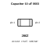
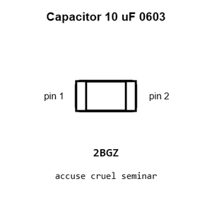
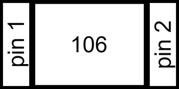
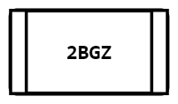
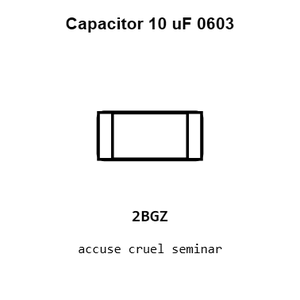
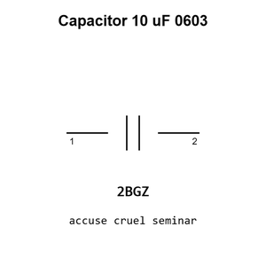

# Capacitor 10 uF 0603

`electronic_capacitor_0603_10_micro_farad`

Capacitor 10 uF 0603 is an OOMP electronic capacitor definition. It uses the 0603 package or form factor. Its nominal drawing size is 1.6 &#x00D7; 0.8 mm.

## At a glance

| Detail | Value |
| --- | --- |
| OOMP ID | `electronic_capacitor_0603_10_micro_farad` |
| Type | Capacitor |
| Package / style | 0603 |
| Nominal size | 1.6 &#x00D7; 0.8 mm |

## Classification

| Level | Value |
| --- | --- |
| 1 | `electronic` |
| 2 | `capacitor` |
| 3 | `0603` |
| 4 | `10_micro_farad` |

## Nominal dimensions

| Measurement | Value |
| --- | ---: |
| Length | 1.6 mm |
| Width | 0.8 mm |

## Identifiers

| Identifier | Value |
| --- | --- |
| Manufacturer part number | `CL10A106KP8NNNC` |
| LCSC | [`C19702`](https://www.lcsc.com/product-detail/C19702.html) |
| LCSC | [`C96446`](https://www.lcsc.com/product-detail/C96446.html) |
| LCSC | [`C92487`](https://www.lcsc.com/product-detail/C92487.html) |
| JLCPCB | [`C19702`](https://jlcpcb.com/partdetail/20411-CL10A106KP8NNNC/C19702) |

## Used in projects

| Project | Quantity | References | Explore |
| --- | ---: | --- | --- |
| [Project adafruit/Adafruit-Feather-RP2350-PCB Adafruit Feather RP2350 current](https://github.com/adafruit/Adafruit-Feather-RP2350-PCB/blob/main/Adafruit%20Feather%20RP2350.brd) | 3 | C5, C8, C13 | [Board explorer](https://oomlout.github.io/oomp_electronic_version_5/parts/oomp_project_github_adafruit_adafruit_feather_rp2350_pcb_adafruit_feather_rp2350_current/board_explorer.html) · [OOMP project](https://github.com/oomlout/oomp_electronic_version_5/tree/main/parts/oomp_project_github_adafruit_adafruit_feather_rp2350_pcb_adafruit_feather_rp2350_current) |
| [Project adafruit/Adafruit-Fruit-Jam-PCB Adafruit Fruit Jam current](https://github.com/adafruit/Adafruit-Fruit-Jam-PCB/blob/main/Adafruit%20Fruit%20Jam.brd) | 2 | C10, C15 | [Board explorer](https://oomlout.github.io/oomp_electronic_version_5/parts/oomp_project_github_adafruit_adafruit_fruit_jam_pcb_adafruit_fruit_jam_current/board_explorer.html) · [OOMP project](https://github.com/oomlout/oomp_electronic_version_5/tree/main/parts/oomp_project_github_adafruit_adafruit_fruit_jam_pcb_adafruit_fruit_jam_current) |
| [Project adafruit/Adafruit-Metro-RP2350-PCB Adafruit Metro RP2350 current](https://github.com/adafruit/Adafruit-Metro-RP2350-PCB/blob/main/Adafruit%20Metro%20RP2350.brd) | 2 | C10, C15 | [Board explorer](https://oomlout.github.io/oomp_electronic_version_5/parts/oomp_project_github_adafruit_adafruit_metro_rp2350_pcb_adafruit_metro_rp2350_current/board_explorer.html) · [OOMP project](https://github.com/oomlout/oomp_electronic_version_5/tree/main/parts/oomp_project_github_adafruit_adafruit_metro_rp2350_pcb_adafruit_metro_rp2350_current) |
| [Project electrolama/TinyReflowController Tiny Reflow Controller current](https://github.com/electrolama/TinyReflowController/tree/master/hardware/Revision%20A1) | 3 | C5, C10, C12 | [Board explorer](https://oomlout.github.io/oomp_electronic_version_5/parts/oomp_project_github_electrolama_tiny_reflow_controller_tiny_reflow_controller_current/board_explorer.html) · [OOMP project](https://github.com/oomlout/oomp_electronic_version_5/tree/main/parts/oomp_project_github_electrolama_tiny_reflow_controller_tiny_reflow_controller_current) |
| [Project sparkfun/Blynk_Board_ESP8266 Spark Fun Blynk Board ESP8266 current](https://github.com/sparkfun/Blynk_Board_ESP8266/blob/master/Hardware/SparkFun-Blynk-Board-ESP8266.brd) | 1 | C1 | [Board explorer](https://oomlout.github.io/oomp_electronic_version_5/parts/oomp_project_github_sparkfun_blynk_board_esp8266_spark_fun_blynk_board_esp8266_current/board_explorer.html) · [OOMP project](https://github.com/oomlout/oomp_electronic_version_5/tree/main/parts/oomp_project_github_sparkfun_blynk_board_esp8266_spark_fun_blynk_board_esp8266_current) |
| [Project sparkfun/ESP32_Thing esp32 thing current](https://github.com/sparkfun/ESP32_Thing/blob/master/Hardware/esp32-thing.brd) | 1 | C22 | [Board explorer](https://oomlout.github.io/oomp_electronic_version_5/parts/oomp_project_github_sparkfun_esp32_thing_esp32_thing_current/board_explorer.html) · [OOMP project](https://github.com/oomlout/oomp_electronic_version_5/tree/main/parts/oomp_project_github_sparkfun_esp32_thing_esp32_thing_current) |
| [Project sparkfun/ESP32_Thing_Plus ESP32 Thing Plus current](https://github.com/sparkfun/ESP32_Thing_Plus/blob/master/Hardware/ESP32_Thing_Plus.brd) | 1 | C1 | [Board explorer](https://oomlout.github.io/oomp_electronic_version_5/parts/oomp_project_github_sparkfun_esp32_thing_plus_esp32_thing_plus_current/board_explorer.html) · [OOMP project](https://github.com/oomlout/oomp_electronic_version_5/tree/main/parts/oomp_project_github_sparkfun_esp32_thing_plus_esp32_thing_plus_current) |
| [Project sparkfun/ESP8266_Thing_Dev ESP8266 Thing Dev current](https://github.com/sparkfun/ESP8266_Thing_Dev/blob/master/Hardware/ESP8266-Thing-Dev.brd) | 1 | C1 | [Board explorer](https://oomlout.github.io/oomp_electronic_version_5/parts/oomp_project_github_sparkfun_esp8266_thing_dev_esp8266_thing_dev_current/board_explorer.html) · [OOMP project](https://github.com/oomlout/oomp_electronic_version_5/tree/main/parts/oomp_project_github_sparkfun_esp8266_thing_dev_esp8266_thing_dev_current) |
| [Project sparkfun/ESP8266_Thing Spark Fun ESP8266 Thinga current](https://github.com/sparkfun/ESP8266_Thing/blob/master/Hardware/SparkFun_ESP8266_Thing_V10a.brd) | 1 | C1 | [Board explorer](https://oomlout.github.io/oomp_electronic_version_5/parts/oomp_project_github_sparkfun_esp8266_thing_spark_fun_esp8266_thinga_current/board_explorer.html) · [OOMP project](https://github.com/oomlout/oomp_electronic_version_5/tree/main/parts/oomp_project_github_sparkfun_esp8266_thing_spark_fun_esp8266_thinga_current) |
| [Project sparkfun/MicroMod_Artemis_Processor Micro Mod Artemis Processor Board current](https://github.com/sparkfun/MicroMod_Artemis_Processor/blob/master/Hardware/MicroMod-Artemis-ProcessorBoard.brd) | 1 | C4 | [Board explorer](https://oomlout.github.io/oomp_electronic_version_5/parts/oomp_project_github_sparkfun_micro_mod_artemis_processor_micro_mod_artemis_processor_board_current/board_explorer.html) · [OOMP project](https://github.com/oomlout/oomp_electronic_version_5/tree/main/parts/oomp_project_github_sparkfun_micro_mod_artemis_processor_micro_mod_artemis_processor_board_current) |
| [Project sparkfun/MicroMod_Function_Ethernet-W5500 Micro Mod Ethernet Function Board W5500 current](https://github.com/sparkfun/MicroMod_Function_Ethernet-W5500/blob/main/Hardware/MicroMod-Ethernet-Function-Board-W5500.brd) | 2 | C9, C16 | [Board explorer](https://oomlout.github.io/oomp_electronic_version_5/parts/oomp_project_github_sparkfun_micro_mod_function_ethernet_w5500_micro_mod_ethernet_function_board_w5500_current/board_explorer.html) · [OOMP project](https://github.com/oomlout/oomp_electronic_version_5/tree/main/parts/oomp_project_github_sparkfun_micro_mod_function_ethernet_w5500_micro_mod_ethernet_function_board_w5500_current) |
| [Project sparkfun/MiniGen Spark Fun Mini Gen current](https://github.com/sparkfun/MiniGen/blob/master/Hardware/SparkFun_MiniGen.brd) | 1 | C4 | [Board explorer](https://oomlout.github.io/oomp_electronic_version_5/parts/oomp_project_github_sparkfun_mini_gen_spark_fun_mini_gen_current/board_explorer.html) · [OOMP project](https://github.com/oomlout/oomp_electronic_version_5/tree/main/parts/oomp_project_github_sparkfun_mini_gen_spark_fun_mini_gen_current) |
| [Project sparkfun/nRF52840_Breakout_MDBT50Q nrf52840 breakout mdbt50q current](https://github.com/sparkfun/nRF52840_Breakout_MDBT50Q/blob/master/Hardware/nrf52840-breakout-mdbt50q.brd) | 2 | C1, C4 | [Board explorer](https://oomlout.github.io/oomp_electronic_version_5/parts/oomp_project_github_sparkfun_n_rf52840_breakout_mdbt50_q_nrf52840_breakout_mdbt50q_current/board_explorer.html) · [OOMP project](https://github.com/oomlout/oomp_electronic_version_5/tree/main/parts/oomp_project_github_sparkfun_n_rf52840_breakout_mdbt50_q_nrf52840_breakout_mdbt50q_current) |
| [Project sparkfun/OpenLog OpenLog current](https://github.com/sparkfun/OpenLog/blob/master/hardware/OpenLog.brd) | 1 | C1 | [Board explorer](https://oomlout.github.io/oomp_electronic_version_5/parts/oomp_project_github_sparkfun_open_log_openlog_current/board_explorer.html) · [OOMP project](https://github.com/oomlout/oomp_electronic_version_5/tree/main/parts/oomp_project_github_sparkfun_open_log_openlog_current) |
| [Project sparkfun/Pro_Micro Spark Fun Pro Micro current](https://github.com/sparkfun/Pro_Micro/blob/main/Hardware/v20/SparkFun_Pro_Micro.brd) | 2 | C7, C8 | [Board explorer](https://oomlout.github.io/oomp_electronic_version_5/parts/oomp_project_github_sparkfun_pro_micro_v20_spark_fun_pro_micro_current/board_explorer.html) · [OOMP project](https://github.com/oomlout/oomp_electronic_version_5/tree/main/parts/oomp_project_github_sparkfun_pro_micro_v20_spark_fun_pro_micro_current) |
| [Project sparkfun/Qwiic_Alphanumeric_Display_Breakout Qwiic Alphanumeric Display current](https://github.com/sparkfun/Qwiic_Alphanumeric_Display_Breakout/blob/main/Hardware/Qwiic_Alphanumeric_Display.brd) | 2 | C2, C4 | [Board explorer](https://oomlout.github.io/oomp_electronic_version_5/parts/oomp_project_github_sparkfun_qwiic_alphanumeric_display_breakout_qwiic_alphanumeric_display_current/board_explorer.html) · [OOMP project](https://github.com/oomlout/oomp_electronic_version_5/tree/main/parts/oomp_project_github_sparkfun_qwiic_alphanumeric_display_breakout_qwiic_alphanumeric_display_current) |
| [Project sparkfun/Qwiic_MP3_Trigger Qwiic MP3 Trigger current](https://github.com/sparkfun/Qwiic_MP3_Trigger/blob/master/Hardware/Qwiic%20MP3%20Trigger.brd) | 1 | C1 | [Board explorer](https://oomlout.github.io/oomp_electronic_version_5/parts/oomp_project_github_sparkfun_qwiic_mp3_trigger_qwiic_mp3_trigger_current/board_explorer.html) · [OOMP project](https://github.com/oomlout/oomp_electronic_version_5/tree/main/parts/oomp_project_github_sparkfun_qwiic_mp3_trigger_qwiic_mp3_trigger_current) |
| [Project sparkfun/Qwiic_Spectral_Sensor_AS7265x Qwiic Spectral Sensor AS7265x current](https://github.com/sparkfun/Qwiic_Spectral_Sensor_AS7265x/blob/master/Hardware/Qwiic_Spectral_Sensor-AS7265x.brd) | 3 | C3, C5, C7 | [Board explorer](https://oomlout.github.io/oomp_electronic_version_5/parts/oomp_project_github_sparkfun_qwiic_spectral_sensor_as7265x_qwiic_spectral_sensor_as7265x_current/board_explorer.html) · [OOMP project](https://github.com/oomlout/oomp_electronic_version_5/tree/main/parts/oomp_project_github_sparkfun_qwiic_spectral_sensor_as7265x_qwiic_spectral_sensor_as7265x_current) |
| [Project sparkfun/Qwiic_Spectral_Sensor_AS726X Qwiic Spectral Sensor AS726x current](https://github.com/sparkfun/Qwiic_Spectral_Sensor_AS726X/blob/master/Hardware/Qwiic_Spectral_Sensor-AS726x.brd) | 1 | C3 | [Board explorer](https://oomlout.github.io/oomp_electronic_version_5/parts/oomp_project_github_sparkfun_qwiic_spectral_sensor_as726_x_qwiic_spectral_sensor_as726x_current/board_explorer.html) · [OOMP project](https://github.com/oomlout/oomp_electronic_version_5/tree/main/parts/oomp_project_github_sparkfun_qwiic_spectral_sensor_as726_x_qwiic_spectral_sensor_as726x_current) |
| [Project sparkfun/RedBoard_Artemis_Nano Red Board Artemis Nano current](https://github.com/sparkfun/RedBoard_Artemis_Nano/blob/master/Hardware/RedBoard-Artemis-Nano.brd) | 1 | C22 | [Board explorer](https://oomlout.github.io/oomp_electronic_version_5/parts/oomp_project_github_sparkfun_red_board_artemis_nano_red_board_artemis_nano_current/board_explorer.html) · [OOMP project](https://github.com/oomlout/oomp_electronic_version_5/tree/main/parts/oomp_project_github_sparkfun_red_board_artemis_nano_red_board_artemis_nano_current) |
| [Project sparkfun/Red_V Red Five current](https://github.com/sparkfun/Red_V/blob/master/Hardware/RedFive.brd) | 7 | C1, C6, C7, C8, C11, C13, C30 | [Board explorer](https://oomlout.github.io/oomp_electronic_version_5/parts/oomp_project_github_sparkfun_red_v_red_five_current/board_explorer.html) · [OOMP project](https://github.com/oomlout/oomp_electronic_version_5/tree/main/parts/oomp_project_github_sparkfun_red_v_red_five_current) |
| [Project sparkfun/SparkFun_Artemis_Global_Tracker Spark Fun Artemis Global Tracker current](https://github.com/sparkfun/SparkFun_Artemis_Global_Tracker/blob/main/Hardware/SparkFun_Artemis_Global_Tracker.brd) | 1 | C22 | [Board explorer](https://oomlout.github.io/oomp_electronic_version_5/parts/oomp_project_github_sparkfun_spark_fun_artemis_global_tracker_spark_fun_artemis_global_tracker_current/board_explorer.html) · [OOMP project](https://github.com/oomlout/oomp_electronic_version_5/tree/main/parts/oomp_project_github_sparkfun_spark_fun_artemis_global_tracker_spark_fun_artemis_global_tracker_current) |
| [Project sparkfun/SparkFun_AS3935_Lightning_Detector Spark Fun AS3935 Lightning Detector current](https://github.com/sparkfun/SparkFun_AS3935_Lightning_Detector/blob/master/Hardware/SparkFun_AS3935_Lightning_Detector.brd) | 1 | C3 | [Board explorer](https://oomlout.github.io/oomp_electronic_version_5/parts/oomp_project_github_sparkfun_spark_fun_as3935_lightning_detector_spark_fun_as3935_lightning_detector_current/board_explorer.html) · [OOMP project](https://github.com/oomlout/oomp_electronic_version_5/tree/main/parts/oomp_project_github_sparkfun_spark_fun_as3935_lightning_detector_spark_fun_as3935_lightning_detector_current) |
| [Project sparkfun/SparkFun_Audio_Player_Breakout_MY1690X-16S Audio Player Breakout MY1690X-16S current](https://github.com/sparkfun/SparkFun_Audio_Player_Breakout_MY1690X-16S) | 2 | C2, C6 | [Board explorer](https://oomlout.github.io/oomp_electronic_version_5/parts/oomp_project_github_sparkfun_spark_fun_audio_player_breakout_my1690_x_16_s_audio_player_breakout_my1690x_16s_current/board_explorer.html) · [OOMP project](https://github.com/oomlout/oomp_electronic_version_5/tree/main/parts/oomp_project_github_sparkfun_spark_fun_audio_player_breakout_my1690_x_16_s_audio_player_breakout_my1690x_16s_current) |
| [Project sparkfun/SparkFun_Clock_Generator_5P49V60 Spark Fun Clock Generator 5 PV49 V60 current](https://github.com/sparkfun/SparkFun_Clock_Generator_5P49V60/blob/master/Hardware/SparkFun_Clock_Generator_5PV49V60.brd) | 1 | C9 | [Board explorer](https://oomlout.github.io/oomp_electronic_version_5/parts/oomp_project_github_sparkfun_spark_fun_clock_generator_5_p49_v60_spark_fun_clock_generator_5_pv49_v60_current/board_explorer.html) · [OOMP project](https://github.com/oomlout/oomp_electronic_version_5/tree/main/parts/oomp_project_github_sparkfun_spark_fun_clock_generator_5_p49_v60_spark_fun_clock_generator_5_pv49_v60_current) |
| [Project sparkfun/SparkFun_Digi_XBee_Arduino_Shield-USB-C Spark Fun Digi XBee Arduino Shield Qwiic current](https://github.com/sparkfun/SparkFun_Digi_XBee_Arduino_Shield-USB-C/blob/main/Hardware/SparkFun_Digi_XBee_Arduino_Shield_Qwiic.brd) | 1 | C10 | [Board explorer](https://oomlout.github.io/oomp_electronic_version_5/parts/oomp_project_github_sparkfun_spark_fun_digi_xbee_arduino_shield_usb_c_spark_fun_digi_xbee_arduino_shield_qwiic_current/board_explorer.html) · [OOMP project](https://github.com/oomlout/oomp_electronic_version_5/tree/main/parts/oomp_project_github_sparkfun_spark_fun_digi_xbee_arduino_shield_usb_c_spark_fun_digi_xbee_arduino_shield_qwiic_current) |
| [Project sparkfun/SparkFun_Digi_XBee_Development_Board Spark Fun Digi XBee Development Board current](https://github.com/sparkfun/SparkFun_Digi_XBee_Development_Board/blob/main/Hardware/SparkFun_Digi_XBee_Development_Board.brd) | 1 | C10 | [Board explorer](https://oomlout.github.io/oomp_electronic_version_5/parts/oomp_project_github_sparkfun_spark_fun_digi_xbee_development_board_spark_fun_digi_xbee_development_board_current/board_explorer.html) · [OOMP project](https://github.com/oomlout/oomp_electronic_version_5/tree/main/parts/oomp_project_github_sparkfun_spark_fun_digi_xbee_development_board_spark_fun_digi_xbee_development_board_current) |
| [Project sparkfun/SparkFun_Digi_XBee_Explorer_USB-C Spark Fun Digi XBee Explorer USB C current](https://github.com/sparkfun/SparkFun_Digi_XBee_Explorer_USB-C/blob/main/Hardware/SparkFun_Digi_XBee_Explorer_USB-C.brd) | 1 | C10 | [Board explorer](https://oomlout.github.io/oomp_electronic_version_5/parts/oomp_project_github_sparkfun_spark_fun_digi_xbee_explorer_usb_c_spark_fun_digi_xbee_explorer_usb_c_current/board_explorer.html) · [OOMP project](https://github.com/oomlout/oomp_electronic_version_5/tree/main/parts/oomp_project_github_sparkfun_spark_fun_digi_xbee_explorer_usb_c_spark_fun_digi_xbee_explorer_usb_c_current) |
| [Project sparkfun/SparkFun_Digi_XBee_Regulated_Qwiic Spark Fun Digi XBee Regulated Qwiic current](https://github.com/sparkfun/SparkFun_Digi_XBee_Regulated_Qwiic/blob/main/Hardware/SparkFun_Digi_XBee_Regulated_Qwiic.brd) | 1 | C10 | [Board explorer](https://oomlout.github.io/oomp_electronic_version_5/parts/oomp_project_github_sparkfun_spark_fun_digi_xbee_regulated_qwiic_spark_fun_digi_xbee_regulated_qwiic_current/board_explorer.html) · [OOMP project](https://github.com/oomlout/oomp_electronic_version_5/tree/main/parts/oomp_project_github_sparkfun_spark_fun_digi_xbee_regulated_qwiic_spark_fun_digi_xbee_regulated_qwiic_current) |
| [Project sparkfun/SparkFun_GNSS_DAN-F10N GNSS DAN-F10N current](https://github.com/sparkfun/SparkFun_GNSS_DAN-F10N) | 1 | C15 | [Board explorer](https://oomlout.github.io/oomp_electronic_version_5/parts/oomp_project_github_sparkfun_spark_fun_gnss_dan_f10_n_gnss_dan_f10n_current/board_explorer.html) · [OOMP project](https://github.com/oomlout/oomp_electronic_version_5/tree/main/parts/oomp_project_github_sparkfun_spark_fun_gnss_dan_f10_n_gnss_dan_f10n_current) |
| [Project sparkfun/SparkFun_GNSS_Flex_Breakout GNSS Flex Breakout current](https://github.com/sparkfun/SparkFun_GNSS_Flex_Breakout) | 9 | C1, C2, C7, C15, C18, C19, C22, C23, C24 | [Board explorer](https://oomlout.github.io/oomp_electronic_version_5/parts/oomp_project_github_sparkfun_spark_fun_gnss_flex_breakout_gnss_flex_breakout_current/board_explorer.html) · [OOMP project](https://github.com/oomlout/oomp_electronic_version_5/tree/main/parts/oomp_project_github_sparkfun_spark_fun_gnss_flex_breakout_gnss_flex_breakout_current) |
| [Project sparkfun/SparkFun_IoT_Brushless_Motor_Driver ESP32 BLDC Motor Driver current](https://github.com/sparkfun/SparkFun_IoT_Brushless_Motor_Driver/blob/main/Hardware/ESP32_BLDC_Motor_Driver.brd) | 4 | C7, C13, C14, C18 | [Board explorer](https://oomlout.github.io/oomp_electronic_version_5/parts/oomp_project_github_sparkfun_spark_fun_io_t_brushless_motor_driver_esp32_bldc_motor_driver_current/board_explorer.html) · [OOMP project](https://github.com/oomlout/oomp_electronic_version_5/tree/main/parts/oomp_project_github_sparkfun_spark_fun_io_t_brushless_motor_driver_esp32_bldc_motor_driver_current) |
| [Project sparkfun/SparkFun_LTE_GNSS_Breakout_SARA-R510M8S Spark Fun LTE GNSS Breakout SARA R510 M8 S current](https://github.com/sparkfun/SparkFun_LTE_GNSS_Breakout_SARA-R510M8S/blob/main/Hardware/SparkFun_LTE_GNSS_Breakout_SARA-R510M8S.brd) | 1 | C16 | [Board explorer](https://oomlout.github.io/oomp_electronic_version_5/parts/oomp_project_github_sparkfun_spark_fun_lte_gnss_breakout_sara_r510_m8_s_spark_fun_lte_gnss_breakout_sara_r510_m8_s_current/board_explorer.html) · [OOMP project](https://github.com/oomlout/oomp_electronic_version_5/tree/main/parts/oomp_project_github_sparkfun_spark_fun_lte_gnss_breakout_sara_r510_m8_s_spark_fun_lte_gnss_breakout_sara_r510_m8_s_current) |
| [Project sparkfun/SparkFun_MicroMod_LTE_GNSS_Function_Board_u-blox_SARA-R5 Spark Fun Micro Mod Function SARA R5 current](https://github.com/sparkfun/SparkFun_MicroMod_LTE_GNSS_Function_Board_u-blox_SARA-R5/blob/main/Hardware/SparkFun_MicroMod_Function_SARA-R5.brd) | 1 | C18 | [Board explorer](https://oomlout.github.io/oomp_electronic_version_5/parts/oomp_project_github_sparkfun_spark_fun_micro_mod_lte_gnss_function_board_u_blox_sara_r5_spark_fun_micro_mod_function_sara_r5_current/board_explorer.html) · [OOMP project](https://github.com/oomlout/oomp_electronic_version_5/tree/main/parts/oomp_project_github_sparkfun_spark_fun_micro_mod_lte_gnss_function_board_u_blox_sara_r5_spark_fun_micro_mod_function_sara_r5_current) |
| [Project sparkfun/SparkFun_MicroMod_Main_Board_Double Spark Fun Main Board Double current](https://github.com/sparkfun/SparkFun_MicroMod_Main_Board_Double/blob/main/Hardware/SparkFun_Main_Board_Double_v22.brd) | 1 | C7 | [Board explorer](https://oomlout.github.io/oomp_electronic_version_5/parts/oomp_project_github_sparkfun_spark_fun_micro_mod_main_board_double_spark_fun_main_board_double_current/board_explorer.html) · [OOMP project](https://github.com/oomlout/oomp_electronic_version_5/tree/main/parts/oomp_project_github_sparkfun_spark_fun_micro_mod_main_board_double_spark_fun_main_board_double_current) |
| [Project sparkfun/SparkFun_MicroMod_Main_Board_Single Spark Fun Main Board Single current](https://github.com/sparkfun/SparkFun_MicroMod_Main_Board_Single/blob/main/Hardware/SparkFun_Main_Board_Single_v21.brd) | 2 | C9, C12 | [Board explorer](https://oomlout.github.io/oomp_electronic_version_5/parts/oomp_project_github_sparkfun_spark_fun_micro_mod_main_board_single_spark_fun_main_board_single_current/board_explorer.html) · [OOMP project](https://github.com/oomlout/oomp_electronic_version_5/tree/main/parts/oomp_project_github_sparkfun_spark_fun_micro_mod_main_board_single_spark_fun_main_board_single_current) |
| [Project sparkfun/SparkFun_Particulate_Matter_Sensor_Breakout_BMV080 Particulate Matter Sensor BMV080 current](https://github.com/sparkfun/SparkFun_Particulate_Matter_Sensor_Breakout_BMV080) | 1 | C5 | [Board explorer](https://oomlout.github.io/oomp_electronic_version_5/parts/oomp_project_github_sparkfun_spark_fun_particulate_matter_sensor_breakout_bmv080_particulate_matter_bmv080_current/board_explorer.html) · [OOMP project](https://github.com/oomlout/oomp_electronic_version_5/tree/main/parts/oomp_project_github_sparkfun_spark_fun_particulate_matter_sensor_breakout_bmv080_particulate_matter_bmv080_current) |
| [Project sparkfun/SparkFun_Pulse_Oximeter_Heart_Rate_Sensor Spark Fun Pulse Oximeter Heart Rate Sensor current](https://github.com/sparkfun/SparkFun_Pulse_Oximeter_Heart_Rate_Sensor/blob/master/Hardware/SparkFun_Pulse_Oximeter_Heart-Rate_Sensor.brd) | 2 | C1, C3 | [Board explorer](https://oomlout.github.io/oomp_electronic_version_5/parts/oomp_project_github_sparkfun_spark_fun_pulse_oximeter_heart_rate_sensor_spark_fun_pulse_oximeter_heart_rate_sensor_current/board_explorer.html) · [OOMP project](https://github.com/oomlout/oomp_electronic_version_5/tree/main/parts/oomp_project_github_sparkfun_spark_fun_pulse_oximeter_heart_rate_sensor_spark_fun_pulse_oximeter_heart_rate_sensor_current) |
| [Project sparkfun/SparkFun_Qwiic_GNSS_SAM-M8Q Qwiic GNSS SAM-M8Q current](https://github.com/sparkfun/SparkFun_Qwiic_GNSS_SAM-M8Q) | 1 | C10 | [Board explorer](https://oomlout.github.io/oomp_electronic_version_5/parts/oomp_project_github_sparkfun_spark_fun_qwiic_gnss_sam_m8_q_qwiic_gnss_sam_m8q_current/board_explorer.html) · [OOMP project](https://github.com/oomlout/oomp_electronic_version_5/tree/main/parts/oomp_project_github_sparkfun_spark_fun_qwiic_gnss_sam_m8_q_qwiic_gnss_sam_m8q_current) |
| [Project sparkfun/SparkFun_Qwiic_GNSS_SAM-M8Q Qwiic GNSS SAM-M8Q v0.1](https://github.com/sparkfun/SparkFun_Qwiic_GNSS_SAM-M8Q) | 1 | C10 | [Board explorer](https://oomlout.github.io/oomp_electronic_version_5/parts/oomp_project_github_sparkfun_spark_fun_qwiic_gnss_sam_m8_q_qwiic_gnss_sam_m8q_v0_1/board_explorer.html) · [OOMP project](https://github.com/oomlout/oomp_electronic_version_5/tree/main/parts/oomp_project_github_sparkfun_spark_fun_qwiic_gnss_sam_m8_q_qwiic_gnss_sam_m8q_v0_1) |
| [Project sparkfun/SparkFun_Red-V_Thing_Plus Red VThing Plus current](https://github.com/sparkfun/SparkFun_Red-V_Thing_Plus/blob/master/Hardware/RedVThingPlus.brd) | 3 | C1, C3, C30 | [Board explorer](https://oomlout.github.io/oomp_electronic_version_5/parts/oomp_project_github_sparkfun_spark_fun_red_v_thing_plus_red_vthing_plus_current/board_explorer.html) · [OOMP project](https://github.com/oomlout/oomp_electronic_version_5/tree/main/parts/oomp_project_github_sparkfun_spark_fun_red_v_thing_plus_red_vthing_plus_current) |
| [Project sparkfun/SparkFun_RTK_EVK Spark Fun RTK EVK current](https://github.com/sparkfun/SparkFun_RTK_EVK/blob/main/Hardware/SparkFun_RTK_EVK.brd) | 4 | C20, C32, C39, C55 | [Board explorer](https://oomlout.github.io/oomp_electronic_version_5/parts/oomp_project_github_sparkfun_spark_fun_rtk_evk_spark_fun_rtk_evk_current/board_explorer.html) · [OOMP project](https://github.com/oomlout/oomp_electronic_version_5/tree/main/parts/oomp_project_github_sparkfun_spark_fun_rtk_evk_spark_fun_rtk_evk_current) |
| [Project sparkfun/SparkFun_RTK_Facet Spark Fun RTK Facet Display SD current](https://github.com/sparkfun/SparkFun_RTK_Facet/blob/main/Hardware/Display/SparkFun%20RTK%20Facet%20-%20Display%20SD.brd) | 1 | C8 | [Board explorer](https://oomlout.github.io/oomp_electronic_version_5/parts/oomp_project_github_sparkfun_spark_fun_rtk_facet_display_spark_fun_rtk_facet_display_sd_current/board_explorer.html) · [OOMP project](https://github.com/oomlout/oomp_electronic_version_5/tree/main/parts/oomp_project_github_sparkfun_spark_fun_rtk_facet_display_spark_fun_rtk_facet_display_sd_current) |
| [Project sparkfun/SparkFun_RTK_Facet Spark Fun RTK Facet L Band Main current](https://github.com/sparkfun/SparkFun_RTK_Facet/blob/main/Hardware/Main-LBand/SparkFun%20RTK%20Facet%20L-Band%20-%20Main.brd) | 3 | C10, C14, C20 | [Board explorer](https://oomlout.github.io/oomp_electronic_version_5/parts/oomp_project_github_sparkfun_spark_fun_rtk_facet_spark_fun_rtk_facet_l_band_main_current/board_explorer.html) · [OOMP project](https://github.com/oomlout/oomp_electronic_version_5/tree/main/parts/oomp_project_github_sparkfun_spark_fun_rtk_facet_spark_fun_rtk_facet_l_band_main_current) |
| [Project sparkfun/SparkFun_RTK_Facet Spark Fun RTK Facet Main current](https://github.com/sparkfun/SparkFun_RTK_Facet/blob/main/Hardware/Main/SparkFun%20RTK%20Facet%20-%20Main.brd) | 3 | C10, C14, C20 | [Board explorer](https://oomlout.github.io/oomp_electronic_version_5/parts/oomp_project_github_sparkfun_spark_fun_rtk_facet_spark_fun_rtk_facet_main_current/board_explorer.html) · [OOMP project](https://github.com/oomlout/oomp_electronic_version_5/tree/main/parts/oomp_project_github_sparkfun_spark_fun_rtk_facet_spark_fun_rtk_facet_main_current) |
| [Project sparkfun/SparkFun_RTK_Reference_Station Reference Station current](https://github.com/sparkfun/SparkFun_RTK_Reference_Station/blob/main/Hardware/Reference_Station.brd) | 5 | C20, C22, C32, C39, C55 | [Board explorer](https://oomlout.github.io/oomp_electronic_version_5/parts/oomp_project_github_sparkfun_spark_fun_rtk_reference_station_reference_station_current/board_explorer.html) · [OOMP project](https://github.com/oomlout/oomp_electronic_version_5/tree/main/parts/oomp_project_github_sparkfun_spark_fun_rtk_reference_station_reference_station_current) |
| [Project sparkfun/SparkFun_RTK_Surveyor Spark Fun GPS RTK Surveyor current](https://github.com/sparkfun/SparkFun_RTK_Surveyor/blob/main/Hardware/SparkFun%20GPS%20RTK%20Surveyor.brd) | 2 | C10, C14 | [Board explorer](https://oomlout.github.io/oomp_electronic_version_5/parts/oomp_project_github_sparkfun_spark_fun_rtk_surveyor_spark_fun_gps_rtk_surveyor_current/board_explorer.html) · [OOMP project](https://github.com/oomlout/oomp_electronic_version_5/tree/main/parts/oomp_project_github_sparkfun_spark_fun_rtk_surveyor_spark_fun_gps_rtk_surveyor_current) |
| [Project sparkfun/SparkFun_Satellite_Transceiver-Swarm_M138 Satellite Transceiver Breakout Swarm M138 current](https://github.com/sparkfun/SparkFun_Satellite_Transceiver-Swarm_M138/blob/main/Hardware/Satellite_Transceiver_Breakout__Swarm_M138.brd) | 1 | C6 | [Board explorer](https://oomlout.github.io/oomp_electronic_version_5/parts/oomp_project_github_sparkfun_spark_fun_satellite_transceiver_swarm_m138_satellite_transceiver_breakout_swarm_m138_current/board_explorer.html) · [OOMP project](https://github.com/oomlout/oomp_electronic_version_5/tree/main/parts/oomp_project_github_sparkfun_spark_fun_satellite_transceiver_swarm_m138_satellite_transceiver_breakout_swarm_m138_current) |
| [Project sparkfun/SparkFun_Thing_Plus_AW-CU488 Spark Fun Azure Wave Module Thing Plus AW CU488 current](https://github.com/sparkfun/SparkFun_Thing_Plus_AW-CU488/blob/main/Hardware/SparkFun_AzureWave_Module_Thing_Plus_AW-CU488.brd) | 1 | C4 | [Board explorer](https://oomlout.github.io/oomp_electronic_version_5/parts/oomp_project_github_sparkfun_spark_fun_thing_plus_aw_cu488_spark_fun_azure_wave_module_thing_plus_aw_cu488_current/board_explorer.html) · [OOMP project](https://github.com/oomlout/oomp_electronic_version_5/tree/main/parts/oomp_project_github_sparkfun_spark_fun_thing_plus_aw_cu488_spark_fun_azure_wave_module_thing_plus_aw_cu488_current) |
| [Project sparkfun/SparkFun_Thing_Plus_ESP32_C6 Thing Plus ESP32 C6 current](https://github.com/sparkfun/SparkFun_Thing_Plus_ESP32_C6/blob/main/Hardware/Thing_Plus_ESP32_C6.brd) | 1 | C9 | [Board explorer](https://oomlout.github.io/oomp_electronic_version_5/parts/oomp_project_github_sparkfun_spark_fun_thing_plus_esp32_c6_thing_plus_esp32_c6_current/board_explorer.html) · [OOMP project](https://github.com/oomlout/oomp_electronic_version_5/tree/main/parts/oomp_project_github_sparkfun_spark_fun_thing_plus_esp32_c6_thing_plus_esp32_c6_current) |
| [Project sparkfun/SparkFun_Triple_Axis_Acclerometer-LIS3DH LIS3DH Qwiic 1x1 current](https://github.com/sparkfun/SparkFun_Triple_Axis_Acclerometer-LIS3DH/tree/main/Hardware/Qwiic%201x1) | 1 | C1 | [Board explorer](https://oomlout.github.io/oomp_electronic_version_5/parts/oomp_project_github_sparkfun_spark_fun_triple_axis_acclerometer_lis3_dh_lis3dh_qwiic_1x1_current/board_explorer.html) · [OOMP project](https://github.com/oomlout/oomp_electronic_version_5/tree/main/parts/oomp_project_github_sparkfun_spark_fun_triple_axis_acclerometer_lis3_dh_lis3dh_qwiic_1x1_current) |
| [Project sparkfun/SparkFun_USB-C_Host_Shield USB C Host Shield current](https://github.com/sparkfun/SparkFun_USB-C_Host_Shield/blob/main/Hardware/USB-C_Host_Shield.brd) | 1 | C8 | [Board explorer](https://oomlout.github.io/oomp_electronic_version_5/parts/oomp_project_github_sparkfun_spark_fun_usb_c_host_shield_usb_c_host_shield_current/board_explorer.html) · [OOMP project](https://github.com/oomlout/oomp_electronic_version_5/tree/main/parts/oomp_project_github_sparkfun_spark_fun_usb_c_host_shield_usb_c_host_shield_current) |
| [Project sparkfun/tsunami Tapestry current](https://github.com/sparkfun/tsunami/blob/master/Hardware/deprecated/Tapestry.brd) | 5 | C7, C9, C11, C12, C36 | [Board explorer](https://oomlout.github.io/oomp_electronic_version_5/parts/oomp_project_github_sparkfun_tsunami_tapestry_current/board_explorer.html) · [OOMP project](https://github.com/oomlout/oomp_electronic_version_5/tree/main/parts/oomp_project_github_sparkfun_tsunami_tapestry_current) |
| [Project sparkfun/tsunami tsunami current](https://github.com/sparkfun/tsunami/blob/master/Hardware/tsunami.brd) | 5 | C2, C5, C6, C11, C27 | [Board explorer](https://oomlout.github.io/oomp_electronic_version_5/parts/oomp_project_github_sparkfun_tsunami_tsunami_current/board_explorer.html) · [OOMP project](https://github.com/oomlout/oomp_electronic_version_5/tree/main/parts/oomp_project_github_sparkfun_tsunami_tsunami_current) |
| [Project sparkfun/WAV_Trigger wavtrigger current](https://github.com/sparkfun/WAV_Trigger/blob/master/hardware/wavtrigger.brd) | 1 | C27 | [Board explorer](https://oomlout.github.io/oomp_electronic_version_5/parts/oomp_project_github_sparkfun_wav_trigger_wavtrigger_current/board_explorer.html) · [OOMP project](https://github.com/oomlout/oomp_electronic_version_5/tree/main/parts/oomp_project_github_sparkfun_wav_trigger_wavtrigger_current) |

## Files

[KiCad symbol, machine-solder and hand-solder footprints](data/kicad/README.md) · [Availability and source masters](data/kicad/manifest.yaml)

[View this part on GitHub](https://github.com/oomlout/oomp_electronic_version_5/tree/main/parts/electronic_capacitor_0603_10_micro_farad)

[Browse this category](../../navigation/electronic/capacitor/0603/README.md)

---

This page is generated from the OOMP part definition by a Roboclick Jinja template. Edit the source taxonomy or template rather than this generated file.