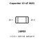
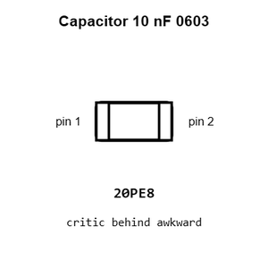
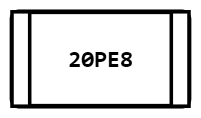
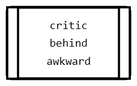
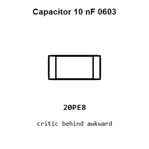
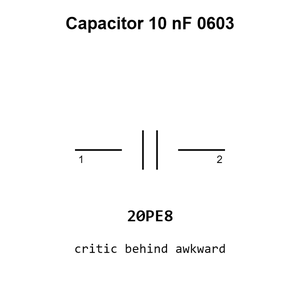

# Capacitor 10 nF 0603

`electronic_capacitor_0603_10_nano_farad`

Capacitor 10 nF 0603 is an OOMP electronic capacitor definition. It uses the 0603 package or form factor. Its nominal drawing size is 1.6 &#x00D7; 0.8 mm.

## At a glance

| Detail | Value |
| --- | --- |
| OOMP ID | `electronic_capacitor_0603_10_nano_farad` |
| Type | Capacitor |
| Package / style | 0603 |
| Nominal size | 1.6 &#x00D7; 0.8 mm |

## Classification

| Level | Value |
| --- | --- |
| 1 | `electronic` |
| 2 | `capacitor` |
| 3 | `0603` |
| 4 | `10_nano_farad` |

## Nominal dimensions

| Measurement | Value |
| --- | ---: |
| Length | 1.6 mm |
| Width | 0.8 mm |

## Identifiers

| Identifier | Value |
| --- | --- |
| Manufacturer part number | `FCC0603B103K500CT` |
| LCSC | [`C5137477`](https://www.lcsc.com/product-detail/C5137477.html) |

## Used in projects

| Project | Quantity | References | Explore |
| --- | ---: | --- | --- |
| [Project adafruit/Adafruit-High-Voltage-UPDI-Friend-PCB Adafruit High Voltage UPDI Friend current](https://github.com/adafruit/Adafruit-High-Voltage-UPDI-Friend-PCB/blob/main/Adafruit%20High%20Voltage%20UPDI%20Friend.brd) | 1 | C8 | [Board explorer](https://oomlout.github.io/oomp_electronic_version_5/parts/oomp_project_github_adafruit_adafruit_high_voltage_updi_friend_pcb_adafruit_high_voltage_updi_friend_current/board_explorer.html) · [OOMP project](https://github.com/oomlout/oomp_electronic_version_5/tree/main/parts/oomp_project_github_adafruit_adafruit_high_voltage_updi_friend_pcb_adafruit_high_voltage_updi_friend_current) |
| [Project adafruit/Adafruit-I2S-Audio-Bonnet-for-Raspberry-Pi-PCB Adafruit I2 S Audio UDA1334 Bonnet current](https://github.com/adafruit/Adafruit-I2S-Audio-Bonnet-for-Raspberry-Pi-PCB/blob/master/Adafruit%20I2S%20Audio%20UDA1334%20Bonnet.brd) | 2 | C7, C8 | [Board explorer](https://oomlout.github.io/oomp_electronic_version_5/parts/oomp_project_github_adafruit_adafruit_i2_s_audio_bonnet_for_raspberry_pi_pcb_adafruit_i2_s_audio_uda1334_bonnet_current/board_explorer.html) · [OOMP project](https://github.com/oomlout/oomp_electronic_version_5/tree/main/parts/oomp_project_github_adafruit_adafruit_i2_s_audio_bonnet_for_raspberry_pi_pcb_adafruit_i2_s_audio_uda1334_bonnet_current) |
| [Project adafruit/Adafruit-MacroPad-RP2040-PCB Adafruit Macro Pad 2040 current](https://github.com/adafruit/Adafruit-MacroPad-RP2040-PCB/blob/main/Adafruit%20MacroPad%202040.brd) | 1 | C30 | [Board explorer](https://oomlout.github.io/oomp_electronic_version_5/parts/oomp_project_github_adafruit_adafruit_macro_pad_rp2040_pcb_adafruit_macro_pad_2040_current/board_explorer.html) · [OOMP project](https://github.com/oomlout/oomp_electronic_version_5/tree/main/parts/oomp_project_github_adafruit_adafruit_macro_pad_rp2040_pcb_adafruit_macro_pad_2040_current) |
| [Project adafruit/Adafruit-MEMENTO-PCB Adafruit MEMENTO Camera Board current](https://github.com/adafruit/Adafruit-MEMENTO-PCB/blob/main/Adafruit%20MEMENTO%20Camera%20Board.brd) | 1 | C21 | [Board explorer](https://oomlout.github.io/oomp_electronic_version_5/parts/oomp_project_github_adafruit_adafruit_memento_pcb_adafruit_memento_camera_board_current/board_explorer.html) · [OOMP project](https://github.com/oomlout/oomp_electronic_version_5/tree/main/parts/oomp_project_github_adafruit_adafruit_memento_pcb_adafruit_memento_camera_board_current) |
| [Project adafruit/Adafruit-NeoTrellis-M4-PCB-and-Enclosure Adafruit Neo Trellis M4 current](https://github.com/adafruit/Adafruit-NeoTrellis-M4-PCB-and-Enclosure/blob/master/Adafruit%20NeoTrellis%20M4.brd) | 1 | C17 | [Board explorer](https://oomlout.github.io/oomp_electronic_version_5/parts/oomp_project_github_adafruit_adafruit_neo_trellis_m4_pcb_and_enclosure_adafruit_neo_trellis_m4_current/board_explorer.html) · [OOMP project](https://github.com/oomlout/oomp_electronic_version_5/tree/main/parts/oomp_project_github_adafruit_adafruit_neo_trellis_m4_pcb_and_enclosure_adafruit_neo_trellis_m4_current) |
| [Project electrolama/TinyReflowController Tiny Reflow Controller current](https://github.com/electrolama/TinyReflowController/tree/master/hardware/Revision%20A1) | 2 | C1, C2 | [Board explorer](https://oomlout.github.io/oomp_electronic_version_5/parts/oomp_project_github_electrolama_tiny_reflow_controller_tiny_reflow_controller_current/board_explorer.html) · [OOMP project](https://github.com/oomlout/oomp_electronic_version_5/tree/main/parts/oomp_project_github_electrolama_tiny_reflow_controller_tiny_reflow_controller_current) |
| [Project soldered_electronics/Accelerometer---Gyroscope---Magnetometer-LSM9DS1TR-breakout-hardware-design LSM9DS1TR IMU current](https://github.com/SolderedElectronics/Accelerometer---Gyroscope---Magnetometer-LSM9DS1TR-breakout-hardware-design) | 1 | C4 | [Board explorer](https://oomlout.github.io/oomp_electronic_version_5/parts/oomp_project_github_soldered_electronics_accelerometer_gyroscope_magnetometer_lsm9_ds1_tr_breakout_hardware_design_sensor_imu_lsm9ds1tr_current/board_explorer.html) · [OOMP project](https://github.com/oomlout/oomp_electronic_version_5/tree/main/parts/oomp_project_github_soldered_electronics_accelerometer_gyroscope_magnetometer_lsm9_ds1_tr_breakout_hardware_design_sensor_imu_lsm9ds1tr_current) |
| [Project soldered_electronics/Capacitive-soil-sensor-hardware-design Capacitive Soil Sensor current](https://github.com/SolderedElectronics/Capacitive-soil-sensor-hardware-design) | 1 | C2 | [Board explorer](https://oomlout.github.io/oomp_electronic_version_5/parts/oomp_project_github_soldered_electronics_capacitive_soil_sensor_hardware_design_sensor_capacitive_soil_current/board_explorer.html) · [OOMP project](https://github.com/oomlout/oomp_electronic_version_5/tree/main/parts/oomp_project_github_soldered_electronics_capacitive_soil_sensor_hardware_design_sensor_capacitive_soil_current) |
| [Project soldered_electronics/Current-sensor-30A-ACS712-breakout-hardware-design ACS712 30A current](https://github.com/SolderedElectronics/Current-sensor-30A-ACS712-breakout-hardware-design) | 1 | C1 | [Board explorer](https://oomlout.github.io/oomp_electronic_version_5/parts/oomp_project_github_soldered_electronics_current_sensor_30_a_acs712_breakout_hardware_design_sensor_current_acs712_30a_current/board_explorer.html) · [OOMP project](https://github.com/oomlout/oomp_electronic_version_5/tree/main/parts/oomp_project_github_soldered_electronics_current_sensor_30_a_acs712_breakout_hardware_design_sensor_current_acs712_30a_current) |
| [Project soldered_electronics/PIR-Movement-sensor-board-hardware-design PIR Movement Sensor current](https://github.com/SolderedElectronics/PIR-Movement-sensor-board-hardware-design) | 1 | C4 | [Board explorer](https://oomlout.github.io/oomp_electronic_version_5/parts/oomp_project_github_soldered_electronics_pir_movement_sensor_board_hardware_design_sensor_pir_movement_current/board_explorer.html) · [OOMP project](https://github.com/oomlout/oomp_electronic_version_5/tree/main/parts/oomp_project_github_soldered_electronics_pir_movement_sensor_board_hardware_design_sensor_pir_movement_current) |
| [Project soldered_electronics/Thermocouple-sensor-AD8495-breakout-hardware-design AD8495 Breakout current](https://github.com/SolderedElectronics/Thermocouple-sensor-AD8495-breakout-hardware-design) | 2 | C1, C3 | [Board explorer](https://oomlout.github.io/oomp_electronic_version_5/parts/oomp_project_github_soldered_electronics_thermocouple_sensor_ad8495_breakout_hardware_design_sensor_thermocouple_ad8495_current/board_explorer.html) · [OOMP project](https://github.com/oomlout/oomp_electronic_version_5/tree/main/parts/oomp_project_github_soldered_electronics_thermocouple_sensor_ad8495_breakout_hardware_design_sensor_thermocouple_ad8495_current) |

## Files

[KiCad symbol, machine-solder and hand-solder footprints](data/kicad/README.md) · [Availability and source masters](data/kicad/manifest.yaml)

[View this part on GitHub](https://github.com/oomlout/oomp_electronic_version_5/tree/main/parts/electronic_capacitor_0603_10_nano_farad)

[Browse this category](../../navigation/electronic/capacitor/0603/README.md)

---

This page is generated from the OOMP part definition by a Roboclick Jinja template. Edit the source taxonomy or template rather than this generated file.