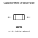
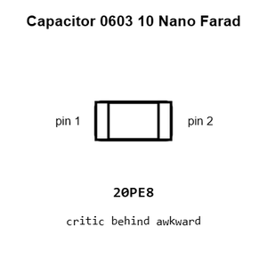
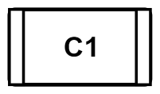
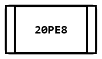
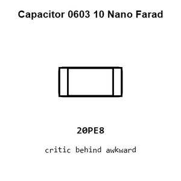
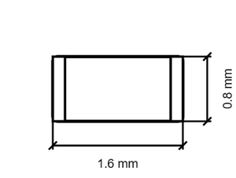

# Capacitor 0603 10 Nano Farad

`electronic_capacitor_0603_10_nano_farad`

Capacitor 0603 10 Nano Farad is an OOMP electronic capacitor definition. It uses the 0603 package or form factor. Its nominal drawing size is 1.6 × 0.8 mm.

## At a glance

| Detail | Value |
| --- | --- |
| OOMP ID | `electronic_capacitor_0603_10_nano_farad` |
| Type | Capacitor |
| Package / style | 0603 |
| Nominal size | 1.6 × 0.8 mm |

## Classification

| Level | Value |
| --- | --- |
| 1 | `electronic` |
| 2 | `capacitor` |
| 3 | `0603` |
| 4 | `10_nano_farad` |

## Nominal dimensions

| Measurement | Value |
| --- | ---: |
| Length | 1.6 mm |
| Width | 0.8 mm |

## Files

[View this part on GitHub](https://github.com/oomlout/oomp_electronic_version_5/tree/main/parts/electronic_capacitor_0603_10_nano_farad)

---

This page is generated from the OOMP part definition by a Roboclick Jinja template. Edit the source taxonomy or template rather than this generated file.
