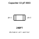
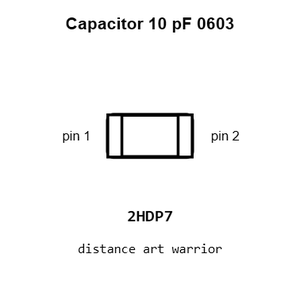
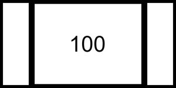
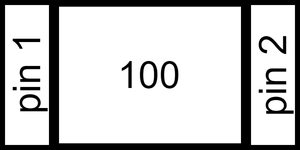
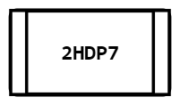
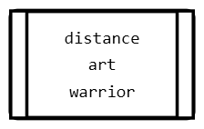
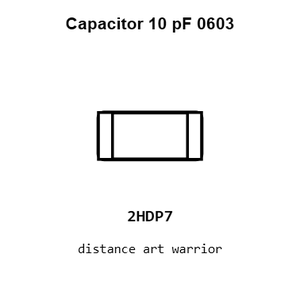
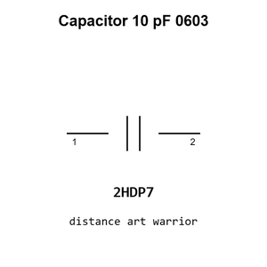

# Capacitor 10 pF 0603

`electronic_capacitor_0603_10_pico_farad`

Capacitor 10 pF 0603 is an OOMP electronic capacitor definition. It uses the 0603 package or form factor. Its nominal drawing size is 1.6 &#x00D7; 0.8 mm.

## At a glance

| Detail | Value |
| --- | --- |
| OOMP ID | `electronic_capacitor_0603_10_pico_farad` |
| Type | Capacitor |
| Package / style | 0603 |
| Nominal size | 1.6 &#x00D7; 0.8 mm |

## Classification

| Level | Value |
| --- | --- |
| 1 | `electronic` |
| 2 | `capacitor` |
| 3 | `0603` |
| 4 | `10_pico_farad` |

## Nominal dimensions

| Measurement | Value |
| --- | ---: |
| Length | 1.6 mm |
| Width | 0.8 mm |

## Used in projects

| Project | Quantity | References | Explore |
| --- | ---: | --- | --- |
| [Project adafruit/Adafruit-FONA-800-GSM-Breakout-PCB Adafruit FONA 800 GSM Breakout current](https://github.com/adafruit/Adafruit-FONA-800-GSM-Breakout-PCB/blob/master/Adafruit-FONA-800-GSM-Breakout.brd) | 2 | C15, C17 | [Board explorer](https://oomlout.github.io/oomp_electronic_version_5/parts/oomp_project_github_adafruit_adafruit_fona_800_gsm_breakout_pcb_adafruit_fona_800_gsm_breakout_current/board_explorer.html) · [OOMP project](https://github.com/oomlout/oomp_electronic_version_5/tree/main/parts/oomp_project_github_adafruit_adafruit_fona_800_gsm_breakout_pcb_adafruit_fona_800_gsm_breakout_current) |
| [Project electrolama/TinyReflowController Tiny Reflow Controller current](https://github.com/electrolama/TinyReflowController/tree/master/hardware/Revision%20A1) | 2 | C15, C16 | [Board explorer](https://oomlout.github.io/oomp_electronic_version_5/parts/oomp_project_github_electrolama_tiny_reflow_controller_tiny_reflow_controller_current/board_explorer.html) · [OOMP project](https://github.com/oomlout/oomp_electronic_version_5/tree/main/parts/oomp_project_github_electrolama_tiny_reflow_controller_tiny_reflow_controller_current) |
| [Project sparkfun/Blynk_Board_ESP8266 Spark Fun Blynk Board ESP8266 current](https://github.com/sparkfun/Blynk_Board_ESP8266/blob/master/Hardware/SparkFun-Blynk-Board-ESP8266.brd) | 2 | C3, C4 | [Board explorer](https://oomlout.github.io/oomp_electronic_version_5/parts/oomp_project_github_sparkfun_blynk_board_esp8266_spark_fun_blynk_board_esp8266_current/board_explorer.html) · [OOMP project](https://github.com/oomlout/oomp_electronic_version_5/tree/main/parts/oomp_project_github_sparkfun_blynk_board_esp8266_spark_fun_blynk_board_esp8266_current) |
| [Project sparkfun/ESP32_Thing esp32 thing current](https://github.com/sparkfun/ESP32_Thing/blob/master/Hardware/esp32-thing.brd) | 2 | C3, C4 | [Board explorer](https://oomlout.github.io/oomp_electronic_version_5/parts/oomp_project_github_sparkfun_esp32_thing_esp32_thing_current/board_explorer.html) · [OOMP project](https://github.com/oomlout/oomp_electronic_version_5/tree/main/parts/oomp_project_github_sparkfun_esp32_thing_esp32_thing_current) |
| [Project sparkfun/ESP8266_Thing_Dev ESP8266 Thing Dev current](https://github.com/sparkfun/ESP8266_Thing_Dev/blob/master/Hardware/ESP8266-Thing-Dev.brd) | 2 | C3, C4 | [Board explorer](https://oomlout.github.io/oomp_electronic_version_5/parts/oomp_project_github_sparkfun_esp8266_thing_dev_esp8266_thing_dev_current/board_explorer.html) · [OOMP project](https://github.com/oomlout/oomp_electronic_version_5/tree/main/parts/oomp_project_github_sparkfun_esp8266_thing_dev_esp8266_thing_dev_current) |
| [Project sparkfun/ESP8266_Thing Spark Fun ESP8266 Thinga current](https://github.com/sparkfun/ESP8266_Thing/blob/master/Hardware/SparkFun_ESP8266_Thing_V10a.brd) | 2 | C3, C4 | [Board explorer](https://oomlout.github.io/oomp_electronic_version_5/parts/oomp_project_github_sparkfun_esp8266_thing_spark_fun_esp8266_thinga_current/board_explorer.html) · [OOMP project](https://github.com/oomlout/oomp_electronic_version_5/tree/main/parts/oomp_project_github_sparkfun_esp8266_thing_spark_fun_esp8266_thinga_current) |
| [Project sparkfun/MicroMod_Function_Ethernet-W5500 Micro Mod Ethernet Function Board W5500 current](https://github.com/sparkfun/MicroMod_Function_Ethernet-W5500/blob/main/Hardware/MicroMod-Ethernet-Function-Board-W5500.brd) | 2 | C5, C6 | [Board explorer](https://oomlout.github.io/oomp_electronic_version_5/parts/oomp_project_github_sparkfun_micro_mod_function_ethernet_w5500_micro_mod_ethernet_function_board_w5500_current/board_explorer.html) · [OOMP project](https://github.com/oomlout/oomp_electronic_version_5/tree/main/parts/oomp_project_github_sparkfun_micro_mod_function_ethernet_w5500_micro_mod_ethernet_function_board_w5500_current) |
| [Project sparkfun/SparkFun_Digi_XBee_Arduino_Shield-USB-C Spark Fun Digi XBee Arduino Shield Qwiic current](https://github.com/sparkfun/SparkFun_Digi_XBee_Arduino_Shield-USB-C/blob/main/Hardware/SparkFun_Digi_XBee_Arduino_Shield_Qwiic.brd) | 1 | C8 | [Board explorer](https://oomlout.github.io/oomp_electronic_version_5/parts/oomp_project_github_sparkfun_spark_fun_digi_xbee_arduino_shield_usb_c_spark_fun_digi_xbee_arduino_shield_qwiic_current/board_explorer.html) · [OOMP project](https://github.com/oomlout/oomp_electronic_version_5/tree/main/parts/oomp_project_github_sparkfun_spark_fun_digi_xbee_arduino_shield_usb_c_spark_fun_digi_xbee_arduino_shield_qwiic_current) |
| [Project sparkfun/SparkFun_Digi_XBee_Development_Board Spark Fun Digi XBee Development Board current](https://github.com/sparkfun/SparkFun_Digi_XBee_Development_Board/blob/main/Hardware/SparkFun_Digi_XBee_Development_Board.brd) | 1 | C12 | [Board explorer](https://oomlout.github.io/oomp_electronic_version_5/parts/oomp_project_github_sparkfun_spark_fun_digi_xbee_development_board_spark_fun_digi_xbee_development_board_current/board_explorer.html) · [OOMP project](https://github.com/oomlout/oomp_electronic_version_5/tree/main/parts/oomp_project_github_sparkfun_spark_fun_digi_xbee_development_board_spark_fun_digi_xbee_development_board_current) |
| [Project sparkfun/SparkFun_Digi_XBee_Explorer_USB-C Spark Fun Digi XBee Explorer USB C current](https://github.com/sparkfun/SparkFun_Digi_XBee_Explorer_USB-C/blob/main/Hardware/SparkFun_Digi_XBee_Explorer_USB-C.brd) | 1 | C8 | [Board explorer](https://oomlout.github.io/oomp_electronic_version_5/parts/oomp_project_github_sparkfun_spark_fun_digi_xbee_explorer_usb_c_spark_fun_digi_xbee_explorer_usb_c_current/board_explorer.html) · [OOMP project](https://github.com/oomlout/oomp_electronic_version_5/tree/main/parts/oomp_project_github_sparkfun_spark_fun_digi_xbee_explorer_usb_c_spark_fun_digi_xbee_explorer_usb_c_current) |
| [Project sparkfun/SparkFun_Digi_XBee_Regulated_Qwiic Spark Fun Digi XBee Regulated Qwiic current](https://github.com/sparkfun/SparkFun_Digi_XBee_Regulated_Qwiic/blob/main/Hardware/SparkFun_Digi_XBee_Regulated_Qwiic.brd) | 1 | C8 | [Board explorer](https://oomlout.github.io/oomp_electronic_version_5/parts/oomp_project_github_sparkfun_spark_fun_digi_xbee_regulated_qwiic_spark_fun_digi_xbee_regulated_qwiic_current/board_explorer.html) · [OOMP project](https://github.com/oomlout/oomp_electronic_version_5/tree/main/parts/oomp_project_github_sparkfun_spark_fun_digi_xbee_regulated_qwiic_spark_fun_digi_xbee_regulated_qwiic_current) |
| [Project sparkfun/SparkFun_MicroMod_Single_Pair_Ethernet_Function_Board_ADIN1110 Spark Fun Micro Mod Function ADIN1110 current](https://github.com/sparkfun/SparkFun_MicroMod_Single_Pair_Ethernet_Function_Board_ADIN1110/blob/main/Hardware/SparkFun_MicroMod_Function_ADIN1110.brd) | 2 | C5, C6 | [Board explorer](https://oomlout.github.io/oomp_electronic_version_5/parts/oomp_project_github_sparkfun_spark_fun_micro_mod_single_pair_ethernet_function_board_adin1110_spark_fun_micro_mod_function_adin1110_current/board_explorer.html) · [OOMP project](https://github.com/oomlout/oomp_electronic_version_5/tree/main/parts/oomp_project_github_sparkfun_spark_fun_micro_mod_single_pair_ethernet_function_board_adin1110_spark_fun_micro_mod_function_adin1110_current) |
| [Project sparkfun/SparkFun_RTK_EVK Spark Fun RTK EVK current](https://github.com/sparkfun/SparkFun_RTK_EVK/blob/main/Hardware/SparkFun_RTK_EVK.brd) | 2 | C27, C28 | [Board explorer](https://oomlout.github.io/oomp_electronic_version_5/parts/oomp_project_github_sparkfun_spark_fun_rtk_evk_spark_fun_rtk_evk_current/board_explorer.html) · [OOMP project](https://github.com/oomlout/oomp_electronic_version_5/tree/main/parts/oomp_project_github_sparkfun_spark_fun_rtk_evk_spark_fun_rtk_evk_current) |
| [Project sparkfun/SparkFun_RTK_Reference_Station Reference Station current](https://github.com/sparkfun/SparkFun_RTK_Reference_Station/blob/main/Hardware/Reference_Station.brd) | 2 | C27, C28 | [Board explorer](https://oomlout.github.io/oomp_electronic_version_5/parts/oomp_project_github_sparkfun_spark_fun_rtk_reference_station_reference_station_current/board_explorer.html) · [OOMP project](https://github.com/oomlout/oomp_electronic_version_5/tree/main/parts/oomp_project_github_sparkfun_spark_fun_rtk_reference_station_reference_station_current) |
| [Project sparkfun/SparkFun_Tsunami_Super_WAV_Trigger_Qwiic Spark Fun Tsunami Qwiic current](https://github.com/sparkfun/SparkFun_Tsunami_Super_WAV_Trigger_Qwiic/blob/main/Hardware/SparkFun_Tsunami_Qwiic.brd) | 1 | C20 | [Board explorer](https://oomlout.github.io/oomp_electronic_version_5/parts/oomp_project_github_sparkfun_spark_fun_tsunami_super_wav_trigger_qwiic_spark_fun_tsunami_qwiic_current/board_explorer.html) · [OOMP project](https://github.com/oomlout/oomp_electronic_version_5/tree/main/parts/oomp_project_github_sparkfun_spark_fun_tsunami_super_wav_trigger_qwiic_spark_fun_tsunami_qwiic_current) |
| [Project sparkfun/tsunami Tapestry current](https://github.com/sparkfun/tsunami/blob/master/Hardware/deprecated/Tapestry.brd) | 1 | C34 | [Board explorer](https://oomlout.github.io/oomp_electronic_version_5/parts/oomp_project_github_sparkfun_tsunami_tapestry_current/board_explorer.html) · [OOMP project](https://github.com/oomlout/oomp_electronic_version_5/tree/main/parts/oomp_project_github_sparkfun_tsunami_tapestry_current) |
| [Project sparkfun/tsunami tsunami current](https://github.com/sparkfun/tsunami/blob/master/Hardware/tsunami.brd) | 1 | C20 | [Board explorer](https://oomlout.github.io/oomp_electronic_version_5/parts/oomp_project_github_sparkfun_tsunami_tsunami_current/board_explorer.html) · [OOMP project](https://github.com/oomlout/oomp_electronic_version_5/tree/main/parts/oomp_project_github_sparkfun_tsunami_tsunami_current) |

## Files

[KiCad symbol, machine-solder and hand-solder footprints](data/kicad/README.md) · [Availability and source masters](data/kicad/manifest.yaml)

[View this part on GitHub](https://github.com/oomlout/oomp_electronic_version_5/tree/main/parts/electronic_capacitor_0603_10_pico_farad)

[Browse this category](../../navigation/electronic/capacitor/0603/README.md)

---

This page is generated from the OOMP part definition by a Roboclick Jinja template. Edit the source taxonomy or template rather than this generated file.