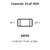
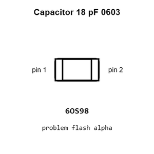
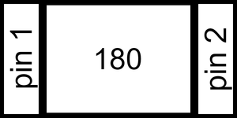
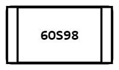
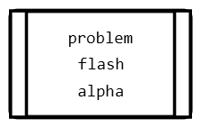
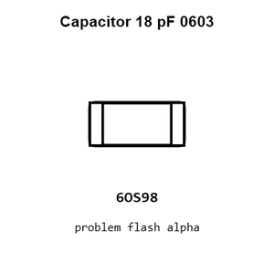
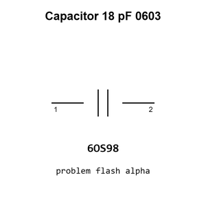

# Capacitor 18 pF 0603

`electronic_capacitor_0603_18_pico_farad`

Capacitor 18 pF 0603 is an OOMP electronic capacitor definition. It uses the 0603 package or form factor. Its nominal drawing size is 1.6 &#x00D7; 0.8 mm.

## At a glance

| Detail | Value |
| --- | --- |
| OOMP ID | `electronic_capacitor_0603_18_pico_farad` |
| Type | Capacitor |
| Package / style | 0603 |
| Nominal size | 1.6 &#x00D7; 0.8 mm |

## Classification

| Level | Value |
| --- | --- |
| 1 | `electronic` |
| 2 | `capacitor` |
| 3 | `0603` |
| 4 | `18_pico_farad` |

## Nominal dimensions

| Measurement | Value |
| --- | ---: |
| Length | 1.6 mm |
| Width | 0.8 mm |

## Identifiers

| Identifier | Value |
| --- | --- |
| Manufacturer part number | `CL10C180JB8NNNC` |
| LCSC | [`C1647`](https://www.lcsc.com/product-detail/C1647.html) |
| JLCPCB | [`C1647`](https://jlcpcb.com/partdetail/1999-CL10C180JB8NNNC/C1647) |

## Used in projects

| Project | Quantity | References | Explore |
| --- | ---: | --- | --- |
| [Project sparkfun/32U4_Breakout_Board 32 U4 Breakout current](https://github.com/sparkfun/32U4_Breakout_Board/blob/master/Hardware/32U4_Breakout.brd) | 2 | C2, C3 | [Board explorer](https://oomlout.github.io/oomp_electronic_version_5/parts/oomp_project_github_sparkfun_32_u4_breakout_board_32_u4_breakout_current/board_explorer.html) · [OOMP project](https://github.com/oomlout/oomp_electronic_version_5/tree/main/parts/oomp_project_github_sparkfun_32_u4_breakout_board_32_u4_breakout_current) |
| [Project sparkfun/Logomatic Logomatic current](https://github.com/sparkfun/Logomatic/blob/master/Hardware/Logomatic.brd) | 2 | C3, C4 | [Board explorer](https://oomlout.github.io/oomp_electronic_version_5/parts/oomp_project_github_sparkfun_logomatic_logomatic_current/board_explorer.html) · [OOMP project](https://github.com/oomlout/oomp_electronic_version_5/tree/main/parts/oomp_project_github_sparkfun_logomatic_logomatic_current) |
| [Project sparkfun/MiniGen Spark Fun Mini Gen current](https://github.com/sparkfun/MiniGen/blob/master/Hardware/SparkFun_MiniGen.brd) | 2 | C9, C10 | [Board explorer](https://oomlout.github.io/oomp_electronic_version_5/parts/oomp_project_github_sparkfun_mini_gen_spark_fun_mini_gen_current/board_explorer.html) · [OOMP project](https://github.com/oomlout/oomp_electronic_version_5/tree/main/parts/oomp_project_github_sparkfun_mini_gen_spark_fun_mini_gen_current) |
| [Project sparkfun/SparkFun_RTK_EVK Spark Fun RTK EVK current](https://github.com/sparkfun/SparkFun_RTK_EVK/blob/main/Hardware/SparkFun_RTK_EVK.brd) | 2 | C63, C64 | [Board explorer](https://oomlout.github.io/oomp_electronic_version_5/parts/oomp_project_github_sparkfun_spark_fun_rtk_evk_spark_fun_rtk_evk_current/board_explorer.html) · [OOMP project](https://github.com/oomlout/oomp_electronic_version_5/tree/main/parts/oomp_project_github_sparkfun_spark_fun_rtk_evk_spark_fun_rtk_evk_current) |
| [Project sparkfun/SparkFun_RTK_Facet Spark Fun RTK Facet L Band Main current](https://github.com/sparkfun/SparkFun_RTK_Facet/blob/main/Hardware/Main-LBand/SparkFun%20RTK%20Facet%20L-Band%20-%20Main.brd) | 2 | C9, C19 | [Board explorer](https://oomlout.github.io/oomp_electronic_version_5/parts/oomp_project_github_sparkfun_spark_fun_rtk_facet_spark_fun_rtk_facet_l_band_main_current/board_explorer.html) · [OOMP project](https://github.com/oomlout/oomp_electronic_version_5/tree/main/parts/oomp_project_github_sparkfun_spark_fun_rtk_facet_spark_fun_rtk_facet_l_band_main_current) |
| [Project sparkfun/SparkFun_RTK_Facet Spark Fun RTK Facet Main current](https://github.com/sparkfun/SparkFun_RTK_Facet/blob/main/Hardware/Main/SparkFun%20RTK%20Facet%20-%20Main.brd) | 2 | C9, C19 | [Board explorer](https://oomlout.github.io/oomp_electronic_version_5/parts/oomp_project_github_sparkfun_spark_fun_rtk_facet_spark_fun_rtk_facet_main_current/board_explorer.html) · [OOMP project](https://github.com/oomlout/oomp_electronic_version_5/tree/main/parts/oomp_project_github_sparkfun_spark_fun_rtk_facet_spark_fun_rtk_facet_main_current) |
| [Project sparkfun/SparkFun_USB-C_Host_Shield USB C Host Shield current](https://github.com/sparkfun/SparkFun_USB-C_Host_Shield/blob/main/Hardware/USB-C_Host_Shield.brd) | 2 | C9, C10 | [Board explorer](https://oomlout.github.io/oomp_electronic_version_5/parts/oomp_project_github_sparkfun_spark_fun_usb_c_host_shield_usb_c_host_shield_current/board_explorer.html) · [OOMP project](https://github.com/oomlout/oomp_electronic_version_5/tree/main/parts/oomp_project_github_sparkfun_spark_fun_usb_c_host_shield_usb_c_host_shield_current) |

## Files

[KiCad symbol, machine-solder and hand-solder footprints](data/kicad/README.md) · [Availability and source masters](data/kicad/manifest.yaml)

[View this part on GitHub](https://github.com/oomlout/oomp_electronic_version_5/tree/main/parts/electronic_capacitor_0603_18_pico_farad)

[Browse this category](../../navigation/electronic/capacitor/0603/README.md)

---

This page is generated from the OOMP part definition by a Roboclick Jinja template. Edit the source taxonomy or template rather than this generated file.