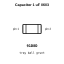
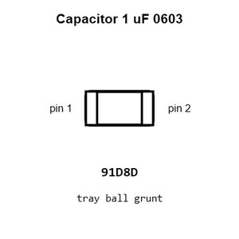
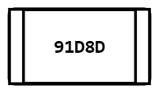
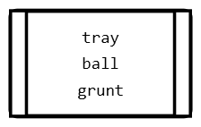
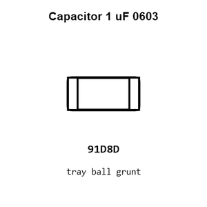

# Capacitor 1 uF 0603

`electronic_capacitor_0603_1_micro_farad`

Capacitor 1 uF 0603 is an OOMP electronic capacitor definition. It uses the 0603 package or form factor. Its nominal drawing size is 1.6 &#x00D7; 0.8 mm.

## At a glance

| Detail | Value |
| --- | --- |
| OOMP ID | `electronic_capacitor_0603_1_micro_farad` |
| Type | Capacitor |
| Package / style | 0603 |
| Nominal size | 1.6 &#x00D7; 0.8 mm |

## Classification

| Level | Value |
| --- | --- |
| 1 | `electronic` |
| 2 | `capacitor` |
| 3 | `0603` |
| 4 | `1_micro_farad` |

## Nominal dimensions

| Measurement | Value |
| --- | ---: |
| Length | 1.6 mm |
| Width | 0.8 mm |

## Used in projects

| Project | Quantity | References | Explore |
| --- | ---: | --- | --- |
| [Project sparkfun/SparkFun_GNSS_DAN-F10N GNSS DAN-F10N current](https://github.com/sparkfun/SparkFun_GNSS_DAN-F10N) | 2 | C7, C9 | [Board explorer](https://oomlout.github.io/oomp_electronic_version_5/parts/oomp_project_github_sparkfun_spark_fun_gnss_dan_f10_n_gnss_dan_f10n_current/board_explorer.html) · [OOMP project](https://github.com/oomlout/oomp_electronic_version_5/tree/main/parts/oomp_project_github_sparkfun_spark_fun_gnss_dan_f10_n_gnss_dan_f10n_current) |
| [Project sparkfun/SparkFun_GNSS_Flex_Breakout GNSS Flex Breakout current](https://github.com/sparkfun/SparkFun_GNSS_Flex_Breakout) | 10 | C5, C9, C10, C12, C13, C14, C16, C17, C20, C21 | [Board explorer](https://oomlout.github.io/oomp_electronic_version_5/parts/oomp_project_github_sparkfun_spark_fun_gnss_flex_breakout_gnss_flex_breakout_current/board_explorer.html) · [OOMP project](https://github.com/oomlout/oomp_electronic_version_5/tree/main/parts/oomp_project_github_sparkfun_spark_fun_gnss_flex_breakout_gnss_flex_breakout_current) |
| [Project sparkfun/SparkFun_GNSS_Flex_Breakout GNSS Flex Breakout v1.0](https://github.com/sparkfun/SparkFun_GNSS_Flex_Breakout) | 10 | C5, C9, C10, C12, C13, C14, C16, C17, C20, C21 | [Board explorer](https://oomlout.github.io/oomp_electronic_version_5/parts/oomp_project_github_sparkfun_spark_fun_gnss_flex_breakout_gnss_flex_breakout_v1_0/board_explorer.html) · [OOMP project](https://github.com/oomlout/oomp_electronic_version_5/tree/main/parts/oomp_project_github_sparkfun_spark_fun_gnss_flex_breakout_gnss_flex_breakout_v1_0) |
| [Project sparkfun/SparkFun_GNSS_Flex_Breakout GNSS Flex Breakout v1.1](https://github.com/sparkfun/SparkFun_GNSS_Flex_Breakout) | 10 | C5, C9, C10, C12, C13, C14, C16, C17, C20, C21 | [Board explorer](https://oomlout.github.io/oomp_electronic_version_5/parts/oomp_project_github_sparkfun_spark_fun_gnss_flex_breakout_gnss_flex_breakout_v1_1/board_explorer.html) · [OOMP project](https://github.com/oomlout/oomp_electronic_version_5/tree/main/parts/oomp_project_github_sparkfun_spark_fun_gnss_flex_breakout_gnss_flex_breakout_v1_1) |
| [Project sparkfun/SparkFun_Qwiic_GNSS_SAM-M8Q Qwiic GNSS SAM-M8Q current](https://github.com/sparkfun/SparkFun_Qwiic_GNSS_SAM-M8Q) | 2 | C1, C9 | [Board explorer](https://oomlout.github.io/oomp_electronic_version_5/parts/oomp_project_github_sparkfun_spark_fun_qwiic_gnss_sam_m8_q_qwiic_gnss_sam_m8q_current/board_explorer.html) · [OOMP project](https://github.com/oomlout/oomp_electronic_version_5/tree/main/parts/oomp_project_github_sparkfun_spark_fun_qwiic_gnss_sam_m8_q_qwiic_gnss_sam_m8q_current) |
| [Project sparkfun/SparkFun_Qwiic_GNSS_SAM-M8Q Qwiic GNSS SAM-M8Q v0.1](https://github.com/sparkfun/SparkFun_Qwiic_GNSS_SAM-M8Q) | 2 | C1, C9 | [Board explorer](https://oomlout.github.io/oomp_electronic_version_5/parts/oomp_project_github_sparkfun_spark_fun_qwiic_gnss_sam_m8_q_qwiic_gnss_sam_m8q_v0_1/board_explorer.html) · [OOMP project](https://github.com/oomlout/oomp_electronic_version_5/tree/main/parts/oomp_project_github_sparkfun_spark_fun_qwiic_gnss_sam_m8_q_qwiic_gnss_sam_m8q_v0_1) |
| [Project sparkfun/SparkFun_u-blox_NEO-F10N u-blox NEO-F10N current](https://github.com/sparkfun/SparkFun_u-blox_NEO-F10N) | 2 | C3, C8 | [Board explorer](https://oomlout.github.io/oomp_electronic_version_5/parts/oomp_project_github_sparkfun_spark_fun_u_blox_neo_f10_n_ublox_neo_f10n_current/board_explorer.html) · [OOMP project](https://github.com/oomlout/oomp_electronic_version_5/tree/main/parts/oomp_project_github_sparkfun_spark_fun_u_blox_neo_f10_n_ublox_neo_f10n_current) |

## Files

[KiCad symbol, machine-solder and hand-solder footprints](data/kicad/README.md) · [Availability and source masters](data/kicad/manifest.yaml)

[View this part on GitHub](https://github.com/oomlout/oomp_electronic_version_5/tree/main/parts/electronic_capacitor_0603_1_micro_farad)

[Browse this category](../../navigation/electronic/capacitor/0603/README.md)

---

This page is generated from the OOMP part definition by a Roboclick Jinja template. Edit the source taxonomy or template rather than this generated file.