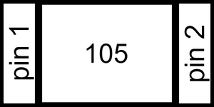
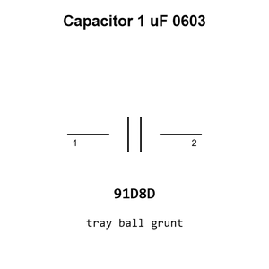

# Capacitor 1 uF 0603

`electronic_capacitor_0603_1_micro_farad`

Capacitor 1 uF 0603 is an OOMP electronic capacitor definition. It uses the 0603 package or form factor. Its nominal drawing size is 1.6 &#x00D7; 0.8 mm.

## At a glance

| Detail | Value |
| --- | --- |
| OOMP ID | `electronic_capacitor_0603_1_micro_farad` |
| Type | Capacitor |
| Package / style | 0603 |
| Nominal size | 1.6 &#x00D7; 0.8 mm |

## Classification

| Level | Value |
| --- | --- |
| 1 | `electronic` |
| 2 | `capacitor` |
| 3 | `0603` |
| 4 | `1_micro_farad` |

## Nominal dimensions

| Measurement | Value |
| --- | ---: |
| Length | 1.6 mm |
| Width | 0.8 mm |

## Identifiers

| Identifier | Value |
| --- | --- |
| Manufacturer part number | `CL10A105KA8NNNC` |
| LCSC | [`C5673`](https://www.lcsc.com/product-detail/C5673.html) |
| LCSC | [`C1592`](https://www.lcsc.com/product-detail/C1592.html) |
| LCSC | [`C5199872`](https://www.lcsc.com/product-detail/C5199872.html) |

## Used in projects

| Project | Quantity | References | Explore |
| --- | ---: | --- | --- |
| [Project adafruit/Adafruit-ADS7128-8-Channel-ADC-and-GPIO-Expander-PCB Adafruit ADS7128 8 Channel ADC and GPIO Expander current](https://github.com/adafruit/Adafruit-ADS7128-8-Channel-ADC-and-GPIO-Expander-PCB/blob/main/Adafruit%20ADS7128%208-Channel%20ADC%20and%20GPIO%20Expander.brd) | 3 | C5, C6, C7 | [Board explorer](https://oomlout.github.io/oomp_electronic_version_5/parts/oomp_project_github_adafruit_adafruit_ads7128_8_channel_adc_and_gpio_expander_pcb_adafruit_ads7128_8_channel_adc_and_gpio_expander_current/board_explorer.html) · [OOMP project](https://github.com/oomlout/oomp_electronic_version_5/tree/main/parts/oomp_project_github_adafruit_adafruit_ads7128_8_channel_adc_and_gpio_expander_pcb_adafruit_ads7128_8_channel_adc_and_gpio_expander_current) |
| [Project adafruit/Adafruit-BH1750-PCB Adafruit BH1750 current](https://github.com/adafruit/Adafruit-BH1750-PCB/blob/main/Adafruit%20BH1750.brd) | 1 | C4 | [Board explorer](https://oomlout.github.io/oomp_electronic_version_5/parts/oomp_project_github_adafruit_adafruit_bh1750_pcb_adafruit_bh1750_current/board_explorer.html) · [OOMP project](https://github.com/oomlout/oomp_electronic_version_5/tree/main/parts/oomp_project_github_adafruit_adafruit_bh1750_pcb_adafruit_bh1750_current) |
| [Project adafruit/Adafruit-Bluefruit-LE-USB-Friend-and-Sniffer-PCB Adafrruit Bluefruit LE USB Friend CP2102 N current](https://github.com/adafruit/Adafruit-Bluefruit-LE-USB-Friend-and-Sniffer-PCB/blob/master/Adafrruit%20Bluefruit%20LE%20USB%20Friend%20CP2102N.brd) | 3 | C1, C2, C8 | [Board explorer](https://oomlout.github.io/oomp_electronic_version_5/parts/oomp_project_github_adafruit_adafruit_bluefruit_le_usb_friend_and_sniffer_pcb_adafrruit_bluefruit_le_usb_friend_cp2102_n_current/board_explorer.html) · [OOMP project](https://github.com/oomlout/oomp_electronic_version_5/tree/main/parts/oomp_project_github_adafruit_adafruit_bluefruit_le_usb_friend_and_sniffer_pcb_adafrruit_bluefruit_le_usb_friend_cp2102_n_current) |
| [Project adafruit/Adafruit_Breadboard_NeoPixel_PCB Adafruit Breadboard Neo Pixel current](https://github.com/adafruit/Adafruit_Breadboard_NeoPixel_PCB/blob/master/Adafruit_Breadboard_NeoPixel.brd) | 1 | C1 | [Board explorer](https://oomlout.github.io/oomp_electronic_version_5/parts/oomp_project_github_adafruit_adafruit_breadboard_neo_pixel_pcb_adafruit_breadboard_neo_pixel_current/board_explorer.html) · [OOMP project](https://github.com/oomlout/oomp_electronic_version_5/tree/main/parts/oomp_project_github_adafruit_adafruit_breadboard_neo_pixel_pcb_adafruit_breadboard_neo_pixel_current) |
| [Project adafruit/Adafruit-CH334F-Breakout-PCB Adafruit CH334 F Mini 2 Port USB Hub Breakout current](https://github.com/adafruit/Adafruit-CH334F-Breakout-PCB/blob/main/Adafruit%20CH334F%20Mini%202-Port%20USB%20Hub%20Breakout.brd) | 1 | C9 | [Board explorer](https://oomlout.github.io/oomp_electronic_version_5/parts/oomp_project_github_adafruit_adafruit_ch334_f_breakout_pcb_adafruit_ch334_f_mini_2_port_usb_hub_breakout_current/board_explorer.html) · [OOMP project](https://github.com/oomlout/oomp_electronic_version_5/tree/main/parts/oomp_project_github_adafruit_adafruit_ch334_f_breakout_pcb_adafruit_ch334_f_mini_2_port_usb_hub_breakout_current) |
| [Project adafruit/Adafruit-CH334F-Breakout-PCB Adafruit CH334 F Mini 4 Port USB Hub Breakout current](https://github.com/adafruit/Adafruit-CH334F-Breakout-PCB/blob/main/Adafruit%20CH334F%20Mini%204-Port%20USB%20Hub%20Breakout.brd) | 1 | C9 | [Board explorer](https://oomlout.github.io/oomp_electronic_version_5/parts/oomp_project_github_adafruit_adafruit_ch334_f_breakout_pcb_adafruit_ch334_f_mini_4_port_usb_hub_breakout_current/board_explorer.html) · [OOMP project](https://github.com/oomlout/oomp_electronic_version_5/tree/main/parts/oomp_project_github_adafruit_adafruit_ch334_f_breakout_pcb_adafruit_ch334_f_mini_4_port_usb_hub_breakout_current) |
| [Project adafruit/Adafruit-Circuit-Playground-Express-PCB Adafruit Circuit Playground Express current](https://github.com/adafruit/Adafruit-Circuit-Playground-Express-PCB/blob/master/Adafruit%20Circuit%20Playground%20Express.brd) | 6 | C1, C2, C3, C5, C6, C10 | [Board explorer](https://oomlout.github.io/oomp_electronic_version_5/parts/oomp_project_github_adafruit_adafruit_circuit_playground_express_pcb_adafruit_circuit_playground_express_current/board_explorer.html) · [OOMP project](https://github.com/oomlout/oomp_electronic_version_5/tree/main/parts/oomp_project_github_adafruit_adafruit_circuit_playground_express_pcb_adafruit_circuit_playground_express_current) |
| [Project adafruit/Adafruit-DRV2605-PCB Adafruit DRV2605 L STEMMA QT current](https://github.com/adafruit/Adafruit-DRV2605-PCB/blob/master/Adafruit%20DRV2605L%20STEMMA%20QT.brd) | 2 | C4, C5 | [Board explorer](https://oomlout.github.io/oomp_electronic_version_5/parts/oomp_project_github_adafruit_adafruit_drv2605_pcb_adafruit_drv2605_l_stemma_qt_current/board_explorer.html) · [OOMP project](https://github.com/oomlout/oomp_electronic_version_5/tree/main/parts/oomp_project_github_adafruit_adafruit_drv2605_pcb_adafruit_drv2605_l_stemma_qt_current) |
| [Project adafruit/Adafruit-E-Paper-Display-Breakout-PCBs Adafruit 2.13in Tri Color e Ink with EYESPI current](https://github.com/adafruit/Adafruit-E-Paper-Display-Breakout-PCBs/blob/master/Adafruit%202.13in%20Tri-Color%20eInk%20with%20EYESPI.brd) | 9 | C1, C2, C3, C4, C6, C16, C22, C23, C24 | [Board explorer](https://oomlout.github.io/oomp_electronic_version_5/parts/oomp_project_github_adafruit_adafruit_e_paper_display_breakout_pcbs_adafruit_2_13in_tri_color_e_ink_with_eyespi_current/board_explorer.html) · [OOMP project](https://github.com/oomlout/oomp_electronic_version_5/tree/main/parts/oomp_project_github_adafruit_adafruit_e_paper_display_breakout_pcbs_adafruit_2_13in_tri_color_e_ink_with_eyespi_current) |
| [Project adafruit/Adafruit-E-Paper-Display-Breakout-PCBs Adafruit 2.7in Tri Color e Ink Display with EYESPI current](https://github.com/adafruit/Adafruit-E-Paper-Display-Breakout-PCBs/blob/master/Adafruit%202.7in%20Tri-Color%20eInk%20Display%20with%20EYESPI.brd) | 10 | C1, C2, C3, C4, C6, C7, C16, C22, C23, C24 | [Board explorer](https://oomlout.github.io/oomp_electronic_version_5/parts/oomp_project_github_adafruit_adafruit_e_paper_display_breakout_pcbs_adafruit_2_7in_tri_color_e_ink_display_with_eyespi_current/board_explorer.html) · [OOMP project](https://github.com/oomlout/oomp_electronic_version_5/tree/main/parts/oomp_project_github_adafruit_adafruit_e_paper_display_breakout_pcbs_adafruit_2_7in_tri_color_e_ink_display_with_eyespi_current) |
| [Project adafruit/Adafruit-ESP32-C6-Feather-PCB Adafruit Feather ESP32 C6 current](https://github.com/adafruit/Adafruit-ESP32-C6-Feather-PCB/blob/main/Adafruit%20Feather%20ESP32-C6.brd) | 2 | C4, C10 | [Board explorer](https://oomlout.github.io/oomp_electronic_version_5/parts/oomp_project_github_adafruit_adafruit_esp32_c6_feather_pcb_adafruit_feather_esp32_c6_current/board_explorer.html) · [OOMP project](https://github.com/oomlout/oomp_electronic_version_5/tree/main/parts/oomp_project_github_adafruit_adafruit_esp32_c6_feather_pcb_adafruit_feather_esp32_c6_current) |
| [Project adafruit/Adafruit-ESP32-Feather-V2-PCB Adafruit ESP32 Feather current](https://github.com/adafruit/Adafruit-ESP32-Feather-V2-PCB/blob/main/Adafruit%20ESP32%20Feather%20V2.brd) | 4 | C4, C5, C9, C10 | [Board explorer](https://oomlout.github.io/oomp_electronic_version_5/parts/oomp_project_github_adafruit_adafruit_esp32_feather_v2_pcb_adafruit_esp32_feather_current/board_explorer.html) · [OOMP project](https://github.com/oomlout/oomp_electronic_version_5/tree/main/parts/oomp_project_github_adafruit_adafruit_esp32_feather_v2_pcb_adafruit_esp32_feather_current) |
| [Project adafruit/Adafruit-ESP32-S2-Reverse-TFT-Feather-PCB Adafruit Feather ESP32 S2rse TFT current](https://github.com/adafruit/Adafruit-ESP32-S2-Reverse-TFT-Feather-PCB/blob/main/Adafruit%20Feather%20ESP32-S2%20Reverse%20TFT.brd) | 4 | C4, C5, C10, C11 | [Board explorer](https://oomlout.github.io/oomp_electronic_version_5/parts/oomp_project_github_adafruit_adafruit_esp32_s2_reverse_tft_feather_pcb_adafruit_feather_esp32_s2rse_tft_current/board_explorer.html) · [OOMP project](https://github.com/oomlout/oomp_electronic_version_5/tree/main/parts/oomp_project_github_adafruit_adafruit_esp32_s2_reverse_tft_feather_pcb_adafruit_feather_esp32_s2rse_tft_current) |
| [Project adafruit/Adafruit-ESP32-S2-TFT-Feather-PCB Adafruit ESP32 S2 TFT Feather current](https://github.com/adafruit/Adafruit-ESP32-S2-TFT-Feather-PCB/blob/main/Adafruit%20ESP32-S2%20TFT%20Feather.brd) | 4 | C4, C5, C10, C11 | [Board explorer](https://oomlout.github.io/oomp_electronic_version_5/parts/oomp_project_github_adafruit_adafruit_esp32_s2_tft_feather_pcb_adafruit_esp32_s2_tft_feather_current/board_explorer.html) · [OOMP project](https://github.com/oomlout/oomp_electronic_version_5/tree/main/parts/oomp_project_github_adafruit_adafruit_esp32_s2_tft_feather_pcb_adafruit_esp32_s2_tft_feather_current) |
| [Project adafruit/Adafruit-ESP32-S3-Reverse-TFT-Feather-PCB Adafruit ESP32 S3rse TFT Feather current](https://github.com/adafruit/Adafruit-ESP32-S3-Reverse-TFT-Feather-PCB/blob/main/Adafruit%20ESP32-S3%20Reverse%20TFT%20Feather.brd) | 4 | C4, C5, C10, C11 | [Board explorer](https://oomlout.github.io/oomp_electronic_version_5/parts/oomp_project_github_adafruit_adafruit_esp32_s3_reverse_tft_feather_pcb_adafruit_esp32_s3rse_tft_feather_current/board_explorer.html) · [OOMP project](https://github.com/oomlout/oomp_electronic_version_5/tree/main/parts/oomp_project_github_adafruit_adafruit_esp32_s3_reverse_tft_feather_pcb_adafruit_esp32_s3rse_tft_feather_current) |
| [Project adafruit/Adafruit-ESP32-S3-TFT-Feather-PCB Adafruit ESP32 S3 TFT Feather current](https://github.com/adafruit/Adafruit-ESP32-S3-TFT-Feather-PCB/blob/main/Adafruit%20ESP32-S3%20TFT%20Feather.brd) | 4 | C4, C5, C10, C11 | [Board explorer](https://oomlout.github.io/oomp_electronic_version_5/parts/oomp_project_github_adafruit_adafruit_esp32_s3_tft_feather_pcb_adafruit_esp32_s3_tft_feather_current/board_explorer.html) · [OOMP project](https://github.com/oomlout/oomp_electronic_version_5/tree/main/parts/oomp_project_github_adafruit_adafruit_esp32_s3_tft_feather_pcb_adafruit_esp32_s3_tft_feather_current) |
| [Project adafruit/Adafruit-Feather-32u4-Basic-Proto-PCB Adafruit Feather 32u4 Basic current](https://github.com/adafruit/Adafruit-Feather-32u4-Basic-Proto-PCB/blob/master/Adafruit%20Feather%2032u4%20Basic%20rev%20B.brd) | 2 | C7, C14 | [Board explorer](https://oomlout.github.io/oomp_electronic_version_5/parts/oomp_project_github_adafruit_adafruit_feather_32u4_basic_proto_pcb_adafruit_feather_32u4_basic_current/board_explorer.html) · [OOMP project](https://github.com/oomlout/oomp_electronic_version_5/tree/main/parts/oomp_project_github_adafruit_adafruit_feather_32u4_basic_proto_pcb_adafruit_feather_32u4_basic_current) |
| [Project adafruit/Adafruit-Feather-32u4-RFM-LoRa-PCB Adafruit Feather 32u4 RFMxx current](https://github.com/adafruit/Adafruit-Feather-32u4-RFM-LoRa-PCB/blob/master/Adafruit%20Feather%2032u4%20RFMxx.brd) | 3 | C7, C9, C14 | [Board explorer](https://oomlout.github.io/oomp_electronic_version_5/parts/oomp_project_github_adafruit_adafruit_feather_32u4_rfm_lo_ra_pcb_adafruit_feather_32u4_rfmxx_current/board_explorer.html) · [OOMP project](https://github.com/oomlout/oomp_electronic_version_5/tree/main/parts/oomp_project_github_adafruit_adafruit_feather_32u4_rfm_lo_ra_pcb_adafruit_feather_32u4_rfmxx_current) |
| [Project adafruit/Adafruit-Feather-ESP32-S2-PCB Adafruit Feather ESP32 S2 current](https://github.com/adafruit/Adafruit-Feather-ESP32-S2-PCB/blob/main/Adafruit%20Feather%20ESP32-S2.brd) | 4 | C4, C5, C10, C11 | [Board explorer](https://oomlout.github.io/oomp_electronic_version_5/parts/oomp_project_github_adafruit_adafruit_feather_esp32_s2_pcb_adafruit_feather_esp32_s2_current/board_explorer.html) · [OOMP project](https://github.com/oomlout/oomp_electronic_version_5/tree/main/parts/oomp_project_github_adafruit_adafruit_feather_esp32_s2_pcb_adafruit_feather_esp32_s2_current) |
| [Project adafruit/Adafruit-Feather-ESP32-S3-PCB Adafruit ESP32 S3 8 MB No PSRAM current](https://github.com/adafruit/Adafruit-Feather-ESP32-S3-PCB/blob/main/Adafruit%20ESP32-S3%208MB%20No%20PSRAM.brd) | 3 | C4, C5, C10 | [Board explorer](https://oomlout.github.io/oomp_electronic_version_5/parts/oomp_project_github_adafruit_adafruit_feather_esp32_s3_pcb_adafruit_esp32_s3_8_mb_no_psram_current/board_explorer.html) · [OOMP project](https://github.com/oomlout/oomp_electronic_version_5/tree/main/parts/oomp_project_github_adafruit_adafruit_feather_esp32_s3_pcb_adafruit_esp32_s3_8_mb_no_psram_current) |
| [Project adafruit/Adafruit-Feather-ESP8266-HUZZAH-PCB Adafruit ESP8266 Feather current](https://github.com/adafruit/Adafruit-Feather-ESP8266-HUZZAH-PCB/blob/master/Adafruit%20ESP8266%20Feather.brd) | 1 | C7 | [Board explorer](https://oomlout.github.io/oomp_electronic_version_5/parts/oomp_project_github_adafruit_adafruit_feather_esp8266_huzzah_pcb_adafruit_esp8266_feather_current/board_explorer.html) · [OOMP project](https://github.com/oomlout/oomp_electronic_version_5/tree/main/parts/oomp_project_github_adafruit_adafruit_feather_esp8266_huzzah_pcb_adafruit_esp8266_feather_current) |
| [Project adafruit/Adafruit-Feather-M0-Express-PCB Adafruit Feather M0 Express current](https://github.com/adafruit/Adafruit-Feather-M0-Express-PCB/blob/master/Adafruit%20Feather%20M0%20Express.brd) | 3 | C1, C7, C14 | [Board explorer](https://oomlout.github.io/oomp_electronic_version_5/parts/oomp_project_github_adafruit_adafruit_feather_m0_express_pcb_adafruit_feather_m0_express_current/board_explorer.html) · [OOMP project](https://github.com/oomlout/oomp_electronic_version_5/tree/main/parts/oomp_project_github_adafruit_adafruit_feather_m0_express_pcb_adafruit_feather_m0_express_current) |
| [Project adafruit/Adafruit-Feather-M0-RFM-LoRa-PCB Adafruit Feather M0 RFMxx current](https://github.com/adafruit/Adafruit-Feather-M0-RFM-LoRa-PCB/blob/master/Adafruit%20Feather%20M0%20RFMxx.brd) | 3 | C1, C7, C14 | [Board explorer](https://oomlout.github.io/oomp_electronic_version_5/parts/oomp_project_github_adafruit_adafruit_feather_m0_rfm_lo_ra_pcb_adafruit_feather_m0_rfmxx_current/board_explorer.html) · [OOMP project](https://github.com/oomlout/oomp_electronic_version_5/tree/main/parts/oomp_project_github_adafruit_adafruit_feather_m0_rfm_lo_ra_pcb_adafruit_feather_m0_rfmxx_current) |
| [Project adafruit/Adafruit-Feather-M4-CAN-PCB Adafruit Feather M4 Express CAN current](https://github.com/adafruit/Adafruit-Feather-M4-CAN-PCB/blob/main/Adafruit%20Feather%20M4%20Express%20CAN.brd) | 6 | C7, C10, C11, C12, C14, C15 | [Board explorer](https://oomlout.github.io/oomp_electronic_version_5/parts/oomp_project_github_adafruit_adafruit_feather_m4_can_pcb_adafruit_feather_m4_express_can_current/board_explorer.html) · [OOMP project](https://github.com/oomlout/oomp_electronic_version_5/tree/main/parts/oomp_project_github_adafruit_adafruit_feather_m4_can_pcb_adafruit_feather_m4_express_can_current) |
| [Project adafruit/Adafruit-Feather-M4-Express-PCB Adafruit Feather M4 Express current](https://github.com/adafruit/Adafruit-Feather-M4-Express-PCB/blob/master/Adafruit%20Feather%20M4%20Express.brd) | 6 | C7, C10, C11, C12, C14, C15 | [Board explorer](https://oomlout.github.io/oomp_electronic_version_5/parts/oomp_project_github_adafruit_adafruit_feather_m4_express_pcb_adafruit_feather_m4_express_current/board_explorer.html) · [OOMP project](https://github.com/oomlout/oomp_electronic_version_5/tree/main/parts/oomp_project_github_adafruit_adafruit_feather_m4_express_pcb_adafruit_feather_m4_express_current) |
| [Project adafruit/Adafruit-Feather-nRF52840-Sense-PCB Adafruit Feather n RF52840 Sense current](https://github.com/adafruit/Adafruit-Feather-nRF52840-Sense-PCB/blob/master/Adafruit%20Feather%20nRF52840%20Sense.brd) | 1 | C4 | [Board explorer](https://oomlout.github.io/oomp_electronic_version_5/parts/oomp_project_github_adafruit_adafruit_feather_n_rf52840_sense_pcb_adafruit_feather_n_rf52840_sense_current/board_explorer.html) · [OOMP project](https://github.com/oomlout/oomp_electronic_version_5/tree/main/parts/oomp_project_github_adafruit_adafruit_feather_n_rf52840_sense_pcb_adafruit_feather_n_rf52840_sense_current) |
| [Project adafruit/Adafruit-Feather-RP2040-PCB Adafruit Feather RP2040 current](https://github.com/adafruit/Adafruit-Feather-RP2040-PCB/blob/main/Adafruit%20Feather%20RP2040.brd) | 2 | C8, C10 | [Board explorer](https://oomlout.github.io/oomp_electronic_version_5/parts/oomp_project_github_adafruit_adafruit_feather_rp2040_pcb_adafruit_feather_rp2040_current/board_explorer.html) · [OOMP project](https://github.com/oomlout/oomp_electronic_version_5/tree/main/parts/oomp_project_github_adafruit_adafruit_feather_rp2040_pcb_adafruit_feather_rp2040_current) |
| [Project adafruit/Adafruit-Feather-RP2040-PCB Adafruit Feather RP2040 Original current](https://github.com/adafruit/Adafruit-Feather-RP2040-PCB/blob/main/Adafruit%20Feather%20RP2040%20Original.brd) | 2 | C8, C10 | [Board explorer](https://oomlout.github.io/oomp_electronic_version_5/parts/oomp_project_github_adafruit_adafruit_feather_rp2040_pcb_adafruit_feather_rp2040_original_current/board_explorer.html) · [OOMP project](https://github.com/oomlout/oomp_electronic_version_5/tree/main/parts/oomp_project_github_adafruit_adafruit_feather_rp2040_pcb_adafruit_feather_rp2040_original_current) |
| [Project adafruit/Adafruit-Feather-STM32F405-Express-PCB Adafruit Feather STM32 F405 Express current](https://github.com/adafruit/Adafruit-Feather-STM32F405-Express-PCB/blob/master/Adafruit%20Feather%20STM32F405%20Express.brd) | 7 | C4, C7, C10, C11, C14, C16, C17 | [Board explorer](https://oomlout.github.io/oomp_electronic_version_5/parts/oomp_project_github_adafruit_adafruit_feather_stm32_f405_express_pcb_adafruit_feather_stm32_f405_express_current/board_explorer.html) · [OOMP project](https://github.com/oomlout/oomp_electronic_version_5/tree/main/parts/oomp_project_github_adafruit_adafruit_feather_stm32_f405_express_pcb_adafruit_feather_stm32_f405_express_current) |
| [Project adafruit/Adafruit_Floppy_FeatherWing_PCB Adafruit Floppy Feather Wing current](https://github.com/adafruit/Adafruit_Floppy_FeatherWing_PCB/blob/main/Adafruit%20Floppy%20FeatherWing.brd) | 3 | C1, C2, C5 | [Board explorer](https://oomlout.github.io/oomp_electronic_version_5/parts/oomp_project_github_adafruit_adafruit_floppy_feather_wing_pcb_adafruit_floppy_feather_wing_current/board_explorer.html) · [OOMP project](https://github.com/oomlout/oomp_electronic_version_5/tree/main/parts/oomp_project_github_adafruit_adafruit_floppy_feather_wing_pcb_adafruit_floppy_feather_wing_current) |
| [Project adafruit/Adafruit-Fruit-Jam-PCB Adafruit Fruit Jam current](https://github.com/adafruit/Adafruit-Fruit-Jam-PCB/blob/main/Adafruit%20Fruit%20Jam.brd) | 7 | C2, C11, C12, C16, C28, C30, C55 | [Board explorer](https://oomlout.github.io/oomp_electronic_version_5/parts/oomp_project_github_adafruit_adafruit_fruit_jam_pcb_adafruit_fruit_jam_current/board_explorer.html) · [OOMP project](https://github.com/oomlout/oomp_electronic_version_5/tree/main/parts/oomp_project_github_adafruit_adafruit_fruit_jam_pcb_adafruit_fruit_jam_current) |
| [Project adafruit/Adafruit-Gemma-M0-PCB Adafruit Gemma M0 current](https://github.com/adafruit/Adafruit-Gemma-M0-PCB/blob/master/Adafruit%20Gemma%20M0.brd) | 2 | C2, C3 | [Board explorer](https://oomlout.github.io/oomp_electronic_version_5/parts/oomp_project_github_adafruit_adafruit_gemma_m0_pcb_adafruit_gemma_m0_current/board_explorer.html) · [OOMP project](https://github.com/oomlout/oomp_electronic_version_5/tree/main/parts/oomp_project_github_adafruit_adafruit_gemma_m0_pcb_adafruit_gemma_m0_current) |
| [Project adafruit/Adafruit-Grand-Central-PCB Adafruit Grand Central M4 Express current](https://github.com/adafruit/Adafruit-Grand-Central-PCB/blob/master/Adafruit%20Grand%20Central%20M4%20Express%20rev%20B.brd) | 1 | C9 | [Board explorer](https://oomlout.github.io/oomp_electronic_version_5/parts/oomp_project_github_adafruit_adafruit_grand_central_pcb_adafruit_grand_central_m4_express_current/board_explorer.html) · [OOMP project](https://github.com/oomlout/oomp_electronic_version_5/tree/main/parts/oomp_project_github_adafruit_adafruit_grand_central_pcb_adafruit_grand_central_m4_express_current) |
| [Project adafruit/Adafruit-HUZZAH32-ESP32-Feather-PCB Adafruit HUZZAH32 ESP32 Feather current](https://github.com/adafruit/Adafruit-HUZZAH32-ESP32-Feather-PCB/blob/master/Adafruit%20HUZZAH32%20ESP32%20Feather.brd) | 2 | C4, C7 | [Board explorer](https://oomlout.github.io/oomp_electronic_version_5/parts/oomp_project_github_adafruit_adafruit_huzzah32_esp32_feather_pcb_adafruit_huzzah32_esp32_feather_current/board_explorer.html) · [OOMP project](https://github.com/oomlout/oomp_electronic_version_5/tree/main/parts/oomp_project_github_adafruit_adafruit_huzzah32_esp32_feather_pcb_adafruit_huzzah32_esp32_feather_current) |
| [Project adafruit/Adafruit-I2C-Quad-Rotary-Encoder-Breakout-PCB Adafruit I2 C Quad Rotary Encoder Breakout current](https://github.com/adafruit/Adafruit-I2C-Quad-Rotary-Encoder-Breakout-PCB/blob/main/Adafruit%20I2C%20Quad%20Rotary%20Encoder%20Breakout.brd) | 4 | C1, C5, C6, C7 | [Board explorer](https://oomlout.github.io/oomp_electronic_version_5/parts/oomp_project_github_adafruit_adafruit_i2_c_quad_rotary_encoder_breakout_pcb_adafruit_i2_c_quad_rotary_encoder_breakout_current/board_explorer.html) · [OOMP project](https://github.com/oomlout/oomp_electronic_version_5/tree/main/parts/oomp_project_github_adafruit_adafruit_i2_c_quad_rotary_encoder_breakout_pcb_adafruit_i2_c_quad_rotary_encoder_breakout_current) |
| [Project adafruit/Adafruit-I2S-MEMS-Microphone-Breakout-PCB Adafruit I2 S MEMS Microphone Breakout ICS 43434 current](https://github.com/adafruit/Adafruit-I2S-MEMS-Microphone-Breakout-PCB/blob/main/Adafruit%20I2S%20MEMS%20Microphone%20Breakout%20-%20ICS-43434.brd) | 1 | C4 | [Board explorer](https://oomlout.github.io/oomp_electronic_version_5/parts/oomp_project_github_adafruit_adafruit_i2_s_mems_microphone_breakout_pcb_adafruit_i2_s_mems_microphone_breakout_ics_43434_current/board_explorer.html) · [OOMP project](https://github.com/oomlout/oomp_electronic_version_5/tree/main/parts/oomp_project_github_adafruit_adafruit_i2_s_mems_microphone_breakout_pcb_adafruit_i2_s_mems_microphone_breakout_ics_43434_current) |
| [Project adafruit/Adafruit-INA260-PCB Adafruit INA260 current](https://github.com/adafruit/Adafruit-INA260-PCB/blob/master/Adafruit%20INA260.brd) | 1 | C1 | [Board explorer](https://oomlout.github.io/oomp_electronic_version_5/parts/oomp_project_github_adafruit_adafruit_ina260_pcb_adafruit_ina260_current/board_explorer.html) · [OOMP project](https://github.com/oomlout/oomp_electronic_version_5/tree/main/parts/oomp_project_github_adafruit_adafruit_ina260_pcb_adafruit_ina260_current) |
| [Project adafruit/Adafruit-IS31FL3741-PCB Adafruit IS31 FL3741 Matrix current](https://github.com/adafruit/Adafruit-IS31FL3741-PCB/blob/main/Adafruit%20IS31FL3741%20Matrix.brd) | 2 | C2, C6 | [Board explorer](https://oomlout.github.io/oomp_electronic_version_5/parts/oomp_project_github_adafruit_adafruit_is31_fl3741_pcb_adafruit_is31_fl3741_matrix_current/board_explorer.html) · [OOMP project](https://github.com/oomlout/oomp_electronic_version_5/tree/main/parts/oomp_project_github_adafruit_adafruit_is31_fl3741_pcb_adafruit_is31_fl3741_matrix_current) |
| [Project adafruit/Adafruit-ISM330DHCX-LIS3MDL-FeatherWing-PCB Adafruit ISM330 DHCX + LIS3 MDL Feather Wing current](https://github.com/adafruit/Adafruit-ISM330DHCX-LIS3MDL-FeatherWing-PCB/blob/master/Adafruit%20ISM330DHCX%20%2B%20LIS3MDL%20FeatherWing.brd) | 1 | C5 | [Board explorer](https://oomlout.github.io/oomp_electronic_version_5/parts/oomp_project_github_adafruit_adafruit_ism330_dhcx_lis3_mdl_feather_wing_pcb_adafruit_ism330_dhcx_lis3_mdl_feather_wing_current/board_explorer.html) · [OOMP project](https://github.com/oomlout/oomp_electronic_version_5/tree/main/parts/oomp_project_github_adafruit_adafruit_ism330_dhcx_lis3_mdl_feather_wing_pcb_adafruit_ism330_dhcx_lis3_mdl_feather_wing_current) |
| [Project adafruit/Adafruit-ItsyBitsy-32u4-PCB Itsy Bitsy 32u4 3 V current](https://github.com/adafruit/Adafruit-ItsyBitsy-32u4-PCB/blob/master/Itsy%20Bitsy%2032u4%203V.brd) | 2 | C7, C14 | [Board explorer](https://oomlout.github.io/oomp_electronic_version_5/parts/oomp_project_github_adafruit_adafruit_itsy_bitsy_32u4_pcb_itsy_bitsy_32u4_3_v_current/board_explorer.html) · [OOMP project](https://github.com/oomlout/oomp_electronic_version_5/tree/main/parts/oomp_project_github_adafruit_adafruit_itsy_bitsy_32u4_pcb_itsy_bitsy_32u4_3_v_current) |
| [Project adafruit/Adafruit-ItsyBitsy-32u4-PCB Itsy Bitsy 32u4 5 V current](https://github.com/adafruit/Adafruit-ItsyBitsy-32u4-PCB/blob/master/Itsy%20Bitsy%2032u4%205V.brd) | 2 | C9, C14 | [Board explorer](https://oomlout.github.io/oomp_electronic_version_5/parts/oomp_project_github_adafruit_adafruit_itsy_bitsy_32u4_pcb_itsy_bitsy_32u4_5_v_current/board_explorer.html) · [OOMP project](https://github.com/oomlout/oomp_electronic_version_5/tree/main/parts/oomp_project_github_adafruit_adafruit_itsy_bitsy_32u4_pcb_itsy_bitsy_32u4_5_v_current) |
| [Project adafruit/Adafruit-ItsyBitsy-ESP32-PCB Adafruit Itsy Bitsy ESP32 current](https://github.com/adafruit/Adafruit-ItsyBitsy-ESP32-PCB/blob/main/Adafruit%20ItsyBitsy%20ESP32.brd) | 4 | C3, C4, C10, C14 | [Board explorer](https://oomlout.github.io/oomp_electronic_version_5/parts/oomp_project_github_adafruit_adafruit_itsy_bitsy_esp32_pcb_adafruit_itsy_bitsy_esp32_current/board_explorer.html) · [OOMP project](https://github.com/oomlout/oomp_electronic_version_5/tree/main/parts/oomp_project_github_adafruit_adafruit_itsy_bitsy_esp32_pcb_adafruit_itsy_bitsy_esp32_current) |
| [Project adafruit/Adafruit-ItsyBitsy-M4-Express-PCB Adafruit Itsy Bitsy M4 current](https://github.com/adafruit/Adafruit-ItsyBitsy-M4-Express-PCB/blob/master/Adafruit%20ItsyBitsy%20M4.brd) | 4 | C1, C5, C7, C14 | [Board explorer](https://oomlout.github.io/oomp_electronic_version_5/parts/oomp_project_github_adafruit_adafruit_itsy_bitsy_m4_express_pcb_adafruit_itsy_bitsy_m4_current/board_explorer.html) · [OOMP project](https://github.com/oomlout/oomp_electronic_version_5/tree/main/parts/oomp_project_github_adafruit_adafruit_itsy_bitsy_m4_express_pcb_adafruit_itsy_bitsy_m4_current) |
| [Project adafruit/Adafruit-ItsyBitsy-RP2040-PCB Adafruit Itsy Bitsy RP2040 current](https://github.com/adafruit/Adafruit-ItsyBitsy-RP2040-PCB/blob/main/Adafruit%20ItsyBitsy%20RP2040.brd) | 2 | C2, C11 | [Board explorer](https://oomlout.github.io/oomp_electronic_version_5/parts/oomp_project_github_adafruit_adafruit_itsy_bitsy_rp2040_pcb_adafruit_itsy_bitsy_rp2040_current/board_explorer.html) · [OOMP project](https://github.com/oomlout/oomp_electronic_version_5/tree/main/parts/oomp_project_github_adafruit_adafruit_itsy_bitsy_rp2040_pcb_adafruit_itsy_bitsy_rp2040_current) |
| [Project adafruit/Adafruit-KB2040-PCB Adafruit KB2040 current](https://github.com/adafruit/Adafruit-KB2040-PCB/blob/main/Adafruit%20KB2040.brd) | 3 | C10, C12, C15 | [Board explorer](https://oomlout.github.io/oomp_electronic_version_5/parts/oomp_project_github_adafruit_adafruit_kb2040_pcb_adafruit_kb2040_current/board_explorer.html) · [OOMP project](https://github.com/oomlout/oomp_electronic_version_5/tree/main/parts/oomp_project_github_adafruit_adafruit_kb2040_pcb_adafruit_kb2040_current) |
| [Project adafruit/Adafruit-LED-Backpacks Adafruit Bicolor 8x8 HT16 K33 STEMMA current](https://github.com/adafruit/Adafruit-LED-Backpacks/blob/master/Adafruit%20Bicolor%208x8%20HT16K33%20STEMMA.brd) | 1 | C3 | [Board explorer](https://oomlout.github.io/oomp_electronic_version_5/parts/oomp_project_github_adafruit_adafruit_led_backpacks_adafruit_bicolor_8x8_ht16_k33_stemma_current/board_explorer.html) · [OOMP project](https://github.com/oomlout/oomp_electronic_version_5/tree/main/parts/oomp_project_github_adafruit_adafruit_led_backpacks_adafruit_bicolor_8x8_ht16_k33_stemma_current) |
| [Project adafruit/Adafruit-LIS2MDL-PCB Adafruit LIS2 MDL current](https://github.com/adafruit/Adafruit-LIS2MDL-PCB/blob/master/Adafruit%20LIS2MDL.brd) | 1 | C5 | [Board explorer](https://oomlout.github.io/oomp_electronic_version_5/parts/oomp_project_github_adafruit_adafruit_lis2_mdl_pcb_adafruit_lis2_mdl_current/board_explorer.html) · [OOMP project](https://github.com/oomlout/oomp_electronic_version_5/tree/main/parts/oomp_project_github_adafruit_adafruit_lis2_mdl_pcb_adafruit_lis2_mdl_current) |
| [Project adafruit/Adafruit-MacroPad-RP2040-PCB Adafruit Macro Pad 2040 current](https://github.com/adafruit/Adafruit-MacroPad-RP2040-PCB/blob/main/Adafruit%20MacroPad%202040.brd) | 5 | C1, C2, C11, C15, C17 | [Board explorer](https://oomlout.github.io/oomp_electronic_version_5/parts/oomp_project_github_adafruit_adafruit_macro_pad_rp2040_pcb_adafruit_macro_pad_2040_current/board_explorer.html) · [OOMP project](https://github.com/oomlout/oomp_electronic_version_5/tree/main/parts/oomp_project_github_adafruit_adafruit_macro_pad_rp2040_pcb_adafruit_macro_pad_2040_current) |
| [Project adafruit/Adafruit_MagTag_PCBs Adafruit Mag Tag 2.9in current](https://github.com/adafruit/Adafruit_MagTag_PCBs/blob/main/Adafruit%20MagTag%202.9in.brd) | 3 | C6, C12, C14 | [Board explorer](https://oomlout.github.io/oomp_electronic_version_5/parts/oomp_project_github_adafruit_adafruit_mag_tag_pcbs_adafruit_mag_tag_2_9in_current/board_explorer.html) · [OOMP project](https://github.com/oomlout/oomp_electronic_version_5/tree/main/parts/oomp_project_github_adafruit_adafruit_mag_tag_pcbs_adafruit_mag_tag_2_9in_current) |
| [Project adafruit/Adafruit-MatrixPortal-M4-PCB Adafruit Matrix Portal M4 current](https://github.com/adafruit/Adafruit-MatrixPortal-M4-PCB/blob/main/Adafruit%20MatrixPortal%20M4.brd) | 1 | C9 | [Board explorer](https://oomlout.github.io/oomp_electronic_version_5/parts/oomp_project_github_adafruit_adafruit_matrix_portal_m4_pcb_adafruit_matrix_portal_m4_current/board_explorer.html) · [OOMP project](https://github.com/oomlout/oomp_electronic_version_5/tree/main/parts/oomp_project_github_adafruit_adafruit_matrix_portal_m4_pcb_adafruit_matrix_portal_m4_current) |
| [Project adafruit/Adafruit-MatrixPortal-S3-PCB Adafruit Matrix Portal S3 current](https://github.com/adafruit/Adafruit-MatrixPortal-S3-PCB/blob/main/Adafruit%20MatrixPortal%20S3.brd) | 3 | C17, C21, C24 | [Board explorer](https://oomlout.github.io/oomp_electronic_version_5/parts/oomp_project_github_adafruit_adafruit_matrix_portal_s3_pcb_adafruit_matrix_portal_s3_current/board_explorer.html) · [OOMP project](https://github.com/oomlout/oomp_electronic_version_5/tree/main/parts/oomp_project_github_adafruit_adafruit_matrix_portal_s3_pcb_adafruit_matrix_portal_s3_current) |
| [Project adafruit/Adafruit-MAX17048-PCB Adafruit MAX17048 STEMMA current](https://github.com/adafruit/Adafruit-MAX17048-PCB/blob/main/Adafruit-MAX17048-STEMMA.brd) | 2 | C1, C2 | [Board explorer](https://oomlout.github.io/oomp_electronic_version_5/parts/oomp_project_github_adafruit_adafruit_max17048_pcb_adafruit_max17048_stemma_current/board_explorer.html) · [OOMP project](https://github.com/oomlout/oomp_electronic_version_5/tree/main/parts/oomp_project_github_adafruit_adafruit_max17048_pcb_adafruit_max17048_stemma_current) |
| [Project adafruit/Adafruit-MCP2221-PCB Adafruit MCP2221 current](https://github.com/adafruit/Adafruit-MCP2221-PCB/blob/master/Adafruit%20MCP2221.brd) | 2 | C2, C6 | [Board explorer](https://oomlout.github.io/oomp_electronic_version_5/parts/oomp_project_github_adafruit_adafruit_mcp2221_pcb_adafruit_mcp2221_current/board_explorer.html) · [OOMP project](https://github.com/oomlout/oomp_electronic_version_5/tree/main/parts/oomp_project_github_adafruit_adafruit_mcp2221_pcb_adafruit_mcp2221_current) |
| [Project adafruit/Adafruit-MEMENTO-PCB Adafruit MEMENTO Camera Board current](https://github.com/adafruit/Adafruit-MEMENTO-PCB/blob/main/Adafruit%20MEMENTO%20Camera%20Board.brd) | 4 | C6, C12, C14, C28 | [Board explorer](https://oomlout.github.io/oomp_electronic_version_5/parts/oomp_project_github_adafruit_adafruit_memento_pcb_adafruit_memento_camera_board_current/board_explorer.html) · [OOMP project](https://github.com/oomlout/oomp_electronic_version_5/tree/main/parts/oomp_project_github_adafruit_adafruit_memento_pcb_adafruit_memento_camera_board_current) |
| [Project adafruit/Adafruit-MEMENTO-PCB Adafruit MEMENTO Camera LED Ring current](https://github.com/adafruit/Adafruit-MEMENTO-PCB/blob/main/Adafruit%20MEMENTO%20Camera%20LED%20Ring.brd) | 3 | C1, C2, C12 | [Board explorer](https://oomlout.github.io/oomp_electronic_version_5/parts/oomp_project_github_adafruit_adafruit_memento_pcb_adafruit_memento_camera_led_ring_current/board_explorer.html) · [OOMP project](https://github.com/oomlout/oomp_electronic_version_5/tree/main/parts/oomp_project_github_adafruit_adafruit_memento_pcb_adafruit_memento_camera_led_ring_current) |
| [Project adafruit/Adafruit-Metro-ESP32-S2-PCB Adafruit Metro ESP32 S2 current](https://github.com/adafruit/Adafruit-Metro-ESP32-S2-PCB/blob/master/Adafruit%20Metro%20ESP32-S2.brd) | 2 | C6, C14 | [Board explorer](https://oomlout.github.io/oomp_electronic_version_5/parts/oomp_project_github_adafruit_adafruit_metro_esp32_s2_pcb_adafruit_metro_esp32_s2_current/board_explorer.html) · [OOMP project](https://github.com/oomlout/oomp_electronic_version_5/tree/main/parts/oomp_project_github_adafruit_adafruit_metro_esp32_s2_pcb_adafruit_metro_esp32_s2_current) |
| [Project adafruit/Adafruit-Metro-ESP32-S3-PCB Adafruit Metro ESP32 S3 current](https://github.com/adafruit/Adafruit-Metro-ESP32-S3-PCB/blob/main/Adafruit%20Metro%20ESP32-S3%20Rev%20B.brd) | 3 | C5, C6, C14 | [Board explorer](https://oomlout.github.io/oomp_electronic_version_5/parts/oomp_project_github_adafruit_adafruit_metro_esp32_s3_pcb_adafruit_metro_esp32_s3_current/board_explorer.html) · [OOMP project](https://github.com/oomlout/oomp_electronic_version_5/tree/main/parts/oomp_project_github_adafruit_adafruit_metro_esp32_s3_pcb_adafruit_metro_esp32_s3_current) |
| [Project adafruit/Adafruit-Metro-M7-with-AirLift-PCB Adafruit Metro M7 i MX RT1011 with Air Lift current](https://github.com/adafruit/Adafruit-Metro-M7-with-AirLift-PCB/blob/main/Adafruit%20Metro%20M7%20iMX%20RT1011%20with%20AirLift.brd) | 6 | C29, C30, C36, C42, C44, C54 | [Board explorer](https://oomlout.github.io/oomp_electronic_version_5/parts/oomp_project_github_adafruit_adafruit_metro_m7_with_air_lift_pcb_adafruit_metro_m7_i_mx_rt1011_with_air_lift_current/board_explorer.html) · [OOMP project](https://github.com/oomlout/oomp_electronic_version_5/tree/main/parts/oomp_project_github_adafruit_adafruit_metro_m7_with_air_lift_pcb_adafruit_metro_m7_i_mx_rt1011_with_air_lift_current) |
| [Project adafruit/Adafruit-Metro-M7-with-microSD-PCB Adafruit Metro M7 with micro SD current](https://github.com/adafruit/Adafruit-Metro-M7-with-microSD-PCB/blob/main/Adafruit%20Metro%20M7%20with%20microSD.brd) | 6 | C29, C30, C36, C42, C44, C54 | [Board explorer](https://oomlout.github.io/oomp_electronic_version_5/parts/oomp_project_github_adafruit_adafruit_metro_m7_with_micro_sd_pcb_adafruit_metro_m7_with_micro_sd_current/board_explorer.html) · [OOMP project](https://github.com/oomlout/oomp_electronic_version_5/tree/main/parts/oomp_project_github_adafruit_adafruit_metro_m7_with_micro_sd_pcb_adafruit_metro_m7_with_micro_sd_current) |
| [Project adafruit/Adafruit-Metro-RP2040-PCB Adafruit Metro RP2040 current](https://github.com/adafruit/Adafruit-Metro-RP2040-PCB/blob/main/Adafruit%20Metro%20RP2040.brd) | 3 | C11, C16, C28 | [Board explorer](https://oomlout.github.io/oomp_electronic_version_5/parts/oomp_project_github_adafruit_adafruit_metro_rp2040_pcb_adafruit_metro_rp2040_current/board_explorer.html) · [OOMP project](https://github.com/oomlout/oomp_electronic_version_5/tree/main/parts/oomp_project_github_adafruit_adafruit_metro_rp2040_pcb_adafruit_metro_rp2040_current) |
| [Project adafruit/Adafruit-Metro-RP2350-PCB Adafruit Metro RP2350 current](https://github.com/adafruit/Adafruit-Metro-RP2350-PCB/blob/main/Adafruit%20Metro%20RP2350.brd) | 5 | C2, C11, C12, C16, C28 | [Board explorer](https://oomlout.github.io/oomp_electronic_version_5/parts/oomp_project_github_adafruit_adafruit_metro_rp2350_pcb_adafruit_metro_rp2350_current/board_explorer.html) · [OOMP project](https://github.com/oomlout/oomp_electronic_version_5/tree/main/parts/oomp_project_github_adafruit_adafruit_metro_rp2350_pcb_adafruit_metro_rp2350_current) |
| [Project adafruit/Adafruit-Mini-PiTFT-240x135-TFT-PCB Adafruit Mini Pi TFT 135x240 Color TFT current](https://github.com/adafruit/Adafruit-Mini-PiTFT-240x135-TFT-PCB/blob/master/Adafruit%20Mini%20PiTFT%20-%20135x240%20Color%20TFT.brd) | 1 | C2 | [Board explorer](https://oomlout.github.io/oomp_electronic_version_5/parts/oomp_project_github_adafruit_adafruit_mini_pi_tft_240x135_tft_pcb_adafruit_mini_pi_tft_135x240_color_tft_current/board_explorer.html) · [OOMP project](https://github.com/oomlout/oomp_electronic_version_5/tree/main/parts/oomp_project_github_adafruit_adafruit_mini_pi_tft_240x135_tft_pcb_adafruit_mini_pi_tft_135x240_color_tft_current) |
| [Project adafruit/Adafruit-Mini-PiTFT-240x135-TFT-PCB Adafruit Pi Mini TFT 240x240 current](https://github.com/adafruit/Adafruit-Mini-PiTFT-240x135-TFT-PCB/blob/master/Adafruit%20PiMiniTFT%20240x240.brd) | 1 | C2 | [Board explorer](https://oomlout.github.io/oomp_electronic_version_5/parts/oomp_project_github_adafruit_adafruit_mini_pi_tft_240x135_tft_pcb_adafruit_pi_mini_tft_240x240_current/board_explorer.html) · [OOMP project](https://github.com/oomlout/oomp_electronic_version_5/tree/main/parts/oomp_project_github_adafruit_adafruit_mini_pi_tft_240x135_tft_pcb_adafruit_pi_mini_tft_240x240_current) |
| [Project adafruit/Adafruit-nRF52-Bluefruit-Feather-PCB Adafruit n RF52 Bluefruit Feather current](https://github.com/adafruit/Adafruit-nRF52-Bluefruit-Feather-PCB/blob/master/Adafruit%20nRF52%20Bluefruit%20Feather.brd) | 1 | C4 | [Board explorer](https://oomlout.github.io/oomp_electronic_version_5/parts/oomp_project_github_adafruit_adafruit_n_rf52_bluefruit_feather_pcb_adafruit_n_rf52_bluefruit_feather_current/board_explorer.html) · [OOMP project](https://github.com/oomlout/oomp_electronic_version_5/tree/main/parts/oomp_project_github_adafruit_adafruit_n_rf52_bluefruit_feather_pcb_adafruit_n_rf52_bluefruit_feather_current) |
| [Project adafruit/Adafruit-NeoKey-CHOC-Breakout-PCB Adafruit Neo Key CHOC Socket Breakout current](https://github.com/adafruit/Adafruit-NeoKey-CHOC-Breakout-PCB/blob/main/Adafruit%20NeoKey%20CHOC%20Socket%20Breakout.brd) | 1 | C1 | [Board explorer](https://oomlout.github.io/oomp_electronic_version_5/parts/oomp_project_github_adafruit_adafruit_neo_key_choc_breakout_pcb_adafruit_neo_key_choc_socket_breakout_current/board_explorer.html) · [OOMP project](https://github.com/oomlout/oomp_electronic_version_5/tree/main/parts/oomp_project_github_adafruit_adafruit_neo_key_choc_breakout_pcb_adafruit_neo_key_choc_socket_breakout_current) |
| [Project adafruit/Adafruit-NeoKey-Trinkey-PCB Adafruit Neo Key Trinkey current](https://github.com/adafruit/Adafruit-NeoKey-Trinkey-PCB/blob/main/Adafruit%20NeoKey%20Trinkey.brd) | 2 | C4, C5 | [Board explorer](https://oomlout.github.io/oomp_electronic_version_5/parts/oomp_project_github_adafruit_adafruit_neo_key_trinkey_pcb_adafruit_neo_key_trinkey_current/board_explorer.html) · [OOMP project](https://github.com/oomlout/oomp_electronic_version_5/tree/main/parts/oomp_project_github_adafruit_adafruit_neo_key_trinkey_pcb_adafruit_neo_key_trinkey_current) |
| [Project adafruit/Adafruit-NeoPixel-Driver-BFF-PCB Adafruit Neo Pixel Driver BFF current](https://github.com/adafruit/Adafruit-NeoPixel-Driver-BFF-PCB/blob/main/Adafruit_NeoPixel_Driver_BFF.brd) | 1 | C4 | [Board explorer](https://oomlout.github.io/oomp_electronic_version_5/parts/oomp_project_github_adafruit_adafruit_neo_pixel_driver_bff_pcb_adafruit_neo_pixel_driver_bff_current/board_explorer.html) · [OOMP project](https://github.com/oomlout/oomp_electronic_version_5/tree/main/parts/oomp_project_github_adafruit_adafruit_neo_pixel_driver_bff_pcb_adafruit_neo_pixel_driver_bff_current) |
| [Project adafruit/Adafruit-NeoPixel-Jewel-7 Adafruit Neo Jewel 7 current](https://github.com/adafruit/Adafruit-NeoPixel-Jewel-7/blob/master/Adafruit%20NeoJewel%207.brd) | 4 | C1, C2, C6, C10 | [Board explorer](https://oomlout.github.io/oomp_electronic_version_5/parts/oomp_project_github_adafruit_adafruit_neo_pixel_jewel_7_adafruit_neo_jewel_7_current/board_explorer.html) · [OOMP project](https://github.com/oomlout/oomp_electronic_version_5/tree/main/parts/oomp_project_github_adafruit_adafruit_neo_pixel_jewel_7_adafruit_neo_jewel_7_current) |
| [Project adafruit/Adafruit-NeoPixel-Jewel-7 Adafruit Neo Jewel 7 SK6812 current](https://github.com/adafruit/Adafruit-NeoPixel-Jewel-7/blob/master/Adafruit%20NeoJewel%207%20SK6812.brd) | 4 | C1, C2, C6, C10 | [Board explorer](https://oomlout.github.io/oomp_electronic_version_5/parts/oomp_project_github_adafruit_adafruit_neo_pixel_jewel_7_adafruit_neo_jewel_7_sk6812_current/board_explorer.html) · [OOMP project](https://github.com/oomlout/oomp_electronic_version_5/tree/main/parts/oomp_project_github_adafruit_adafruit_neo_pixel_jewel_7_adafruit_neo_jewel_7_sk6812_current) |
| [Project adafruit/Adafruit-NeoTrellis-4x4-PCB Adafruit Neo Trellis 4x4 current](https://github.com/adafruit/Adafruit-NeoTrellis-4x4-PCB/blob/master/Adafruit%20NeoTrellis%204x4.brd) | 1 | C7 | [Board explorer](https://oomlout.github.io/oomp_electronic_version_5/parts/oomp_project_github_adafruit_adafruit_neo_trellis_4x4_pcb_adafruit_neo_trellis_4x4_current/board_explorer.html) · [OOMP project](https://github.com/oomlout/oomp_electronic_version_5/tree/main/parts/oomp_project_github_adafruit_adafruit_neo_trellis_4x4_pcb_adafruit_neo_trellis_4x4_current) |
| [Project adafruit/Adafruit-NeoTrellis-M4-PCB-and-Enclosure Adafruit Neo Trellis M4 current](https://github.com/adafruit/Adafruit-NeoTrellis-M4-PCB-and-Enclosure/blob/master/Adafruit%20NeoTrellis%20M4.brd) | 5 | C10, C12, C14, C21, C22 | [Board explorer](https://oomlout.github.io/oomp_electronic_version_5/parts/oomp_project_github_adafruit_adafruit_neo_trellis_m4_pcb_and_enclosure_adafruit_neo_trellis_m4_current/board_explorer.html) · [OOMP project](https://github.com/oomlout/oomp_electronic_version_5/tree/main/parts/oomp_project_github_adafruit_adafruit_neo_trellis_m4_pcb_and_enclosure_adafruit_neo_trellis_m4_current) |
| [Project adafruit/Adafruit-Neo-Trinkey-PCB Adafruit Neo Trinkey current](https://github.com/adafruit/Adafruit-Neo-Trinkey-PCB/blob/main/Adafruit%20Neo%20Trinkey.brd) | 2 | C4, C5 | [Board explorer](https://oomlout.github.io/oomp_electronic_version_5/parts/oomp_project_github_adafruit_adafruit_neo_trinkey_pcb_adafruit_neo_trinkey_current/board_explorer.html) · [OOMP project](https://github.com/oomlout/oomp_electronic_version_5/tree/main/parts/oomp_project_github_adafruit_adafruit_neo_trinkey_pcb_adafruit_neo_trinkey_current) |
| [Project adafruit/Adafruit-OV5640-Camera-Breakout-PCB Adafruit OV5640 Breakout current](https://github.com/adafruit/Adafruit-OV5640-Camera-Breakout-PCB/blob/main/Adafruit%20OV5640%20Breakout.brd) | 1 | C8 | [Board explorer](https://oomlout.github.io/oomp_electronic_version_5/parts/oomp_project_github_adafruit_adafruit_ov5640_camera_breakout_pcb_adafruit_ov5640_breakout_current/board_explorer.html) · [OOMP project](https://github.com/oomlout/oomp_electronic_version_5/tree/main/parts/oomp_project_github_adafruit_adafruit_ov5640_camera_breakout_pcb_adafruit_ov5640_breakout_current) |
| [Project adafruit/Adafruit-pIRKey-PCB Adafruit p IRkeyboard current](https://github.com/adafruit/Adafruit-pIRKey-PCB/blob/master/Adafruit%20pIRkeyboard.brd) | 2 | C4, C5 | [Board explorer](https://oomlout.github.io/oomp_electronic_version_5/parts/oomp_project_github_adafruit_adafruit_p_irkey_pcb_adafruit_p_irkeyboard_current/board_explorer.html) · [OOMP project](https://github.com/oomlout/oomp_electronic_version_5/tree/main/parts/oomp_project_github_adafruit_adafruit_p_irkey_pcb_adafruit_p_irkeyboard_current) |
| [Project soldered_electronics/Capacitive-soil-sensor-hardware-design Capacitive Soil Sensor current](https://github.com/SolderedElectronics/Capacitive-soil-sensor-hardware-design) | 1 | C1 | [Board explorer](https://oomlout.github.io/oomp_electronic_version_5/parts/oomp_project_github_soldered_electronics_capacitive_soil_sensor_hardware_design_sensor_capacitive_soil_current/board_explorer.html) · [OOMP project](https://github.com/oomlout/oomp_electronic_version_5/tree/main/parts/oomp_project_github_soldered_electronics_capacitive_soil_sensor_hardware_design_sensor_capacitive_soil_current) |
| [Project soldered_electronics/Color-and-gesture-sensor-APDS-9960-breakout-hardware-design APDS-9960 Breakout current](https://github.com/SolderedElectronics/Color-and-gesture-sensor-APDS-9960-breakout-hardware-design) | 2 | C1, C3 | [Board explorer](https://oomlout.github.io/oomp_electronic_version_5/parts/oomp_project_github_soldered_electronics_color_and_gesture_sensor_apds_9960_breakout_hardware_design_sensor_color_gesture_apds9960_current/board_explorer.html) · [OOMP project](https://github.com/oomlout/oomp_electronic_version_5/tree/main/parts/oomp_project_github_soldered_electronics_color_and_gesture_sensor_apds_9960_breakout_hardware_design_sensor_color_gesture_apds9960_current) |
| [Project soldered_electronics/Color---gesture-sensor-APDS-9960-breakout-hardware-design APDS-9960 Breakout current](https://github.com/SolderedElectronics/Color---gesture-sensor-APDS-9960-breakout-hardware-design) | 2 | C1, C3 | [Board explorer](https://oomlout.github.io/oomp_electronic_version_5/parts/oomp_project_github_soldered_electronics_color_gesture_sensor_apds_9960_breakout_hardware_design_sensor_color_gesture_apds9960_current/board_explorer.html) · [OOMP project](https://github.com/oomlout/oomp_electronic_version_5/tree/main/parts/oomp_project_github_soldered_electronics_color_gesture_sensor_apds_9960_breakout_hardware_design_sensor_color_gesture_apds9960_current) |
| [Project sparkfun/SparkFun_Audio_Player_Breakout_MY1690X-16S Audio Player Breakout MY1690X-16S current](https://github.com/sparkfun/SparkFun_Audio_Player_Breakout_MY1690X-16S) | 1 | C8 | [Board explorer](https://oomlout.github.io/oomp_electronic_version_5/parts/oomp_project_github_sparkfun_spark_fun_audio_player_breakout_my1690_x_16_s_audio_player_breakout_my1690x_16s_current/board_explorer.html) · [OOMP project](https://github.com/oomlout/oomp_electronic_version_5/tree/main/parts/oomp_project_github_sparkfun_spark_fun_audio_player_breakout_my1690_x_16_s_audio_player_breakout_my1690x_16s_current) |
| [Project sparkfun/SparkFun_Capacitive_Soil_Moisture_Sensor_CY8CMBR3102 Capacitive Soil Moisture Sensor CY8CMBR3102 current](https://github.com/sparkfun/SparkFun_Capacitive_Soil_Moisture_Sensor_CY8CMBR3102) | 1 | C2 | [Board explorer](https://oomlout.github.io/oomp_electronic_version_5/parts/oomp_project_github_sparkfun_spark_fun_capacitive_soil_moisture_sensor_cy8_cmbr3102_capacitive_soil_moisture_cy8cmbr3102_current/board_explorer.html) · [OOMP project](https://github.com/oomlout/oomp_electronic_version_5/tree/main/parts/oomp_project_github_sparkfun_spark_fun_capacitive_soil_moisture_sensor_cy8_cmbr3102_capacitive_soil_moisture_cy8cmbr3102_current) |
| [Project sparkfun/SparkFun_GNSS_DAN-F10N GNSS DAN-F10N current](https://github.com/sparkfun/SparkFun_GNSS_DAN-F10N) | 2 | C7, C9 | [Board explorer](https://oomlout.github.io/oomp_electronic_version_5/parts/oomp_project_github_sparkfun_spark_fun_gnss_dan_f10_n_gnss_dan_f10n_current/board_explorer.html) · [OOMP project](https://github.com/oomlout/oomp_electronic_version_5/tree/main/parts/oomp_project_github_sparkfun_spark_fun_gnss_dan_f10_n_gnss_dan_f10n_current) |
| [Project sparkfun/SparkFun_GNSS_Flex_Breakout GNSS Flex Breakout current](https://github.com/sparkfun/SparkFun_GNSS_Flex_Breakout) | 10 | C5, C9, C10, C12, C13, C14, C16, C17, C20, C21 | [Board explorer](https://oomlout.github.io/oomp_electronic_version_5/parts/oomp_project_github_sparkfun_spark_fun_gnss_flex_breakout_gnss_flex_breakout_current/board_explorer.html) · [OOMP project](https://github.com/oomlout/oomp_electronic_version_5/tree/main/parts/oomp_project_github_sparkfun_spark_fun_gnss_flex_breakout_gnss_flex_breakout_current) |
| [Project sparkfun/SparkFun_Qwiic_GNSS_SAM-M8Q Qwiic GNSS SAM-M8Q current](https://github.com/sparkfun/SparkFun_Qwiic_GNSS_SAM-M8Q) | 2 | C1, C9 | [Board explorer](https://oomlout.github.io/oomp_electronic_version_5/parts/oomp_project_github_sparkfun_spark_fun_qwiic_gnss_sam_m8_q_qwiic_gnss_sam_m8q_current/board_explorer.html) · [OOMP project](https://github.com/oomlout/oomp_electronic_version_5/tree/main/parts/oomp_project_github_sparkfun_spark_fun_qwiic_gnss_sam_m8_q_qwiic_gnss_sam_m8q_current) |
| [Project sparkfun/SparkFun_Qwiic_GNSS_SAM-M8Q Qwiic GNSS SAM-M8Q v0.1](https://github.com/sparkfun/SparkFun_Qwiic_GNSS_SAM-M8Q) | 2 | C1, C9 | [Board explorer](https://oomlout.github.io/oomp_electronic_version_5/parts/oomp_project_github_sparkfun_spark_fun_qwiic_gnss_sam_m8_q_qwiic_gnss_sam_m8q_v0_1/board_explorer.html) · [OOMP project](https://github.com/oomlout/oomp_electronic_version_5/tree/main/parts/oomp_project_github_sparkfun_spark_fun_qwiic_gnss_sam_m8_q_qwiic_gnss_sam_m8q_v0_1) |
| [Project sparkfun/SparkFun_u-blox_NEO-F10N u-blox NEO-F10N current](https://github.com/sparkfun/SparkFun_u-blox_NEO-F10N) | 2 | C3, C8 | [Board explorer](https://oomlout.github.io/oomp_electronic_version_5/parts/oomp_project_github_sparkfun_spark_fun_u_blox_neo_f10_n_ublox_neo_f10n_current/board_explorer.html) · [OOMP project](https://github.com/oomlout/oomp_electronic_version_5/tree/main/parts/oomp_project_github_sparkfun_spark_fun_u_blox_neo_f10_n_ublox_neo_f10n_current) |

## Files

[KiCad symbol, machine-solder and hand-solder footprints](data/kicad/README.md) · [Availability and source masters](data/kicad/manifest.yaml)

[View this part on GitHub](https://github.com/oomlout/oomp_electronic_version_5/tree/main/parts/electronic_capacitor_0603_1_micro_farad)

[Browse this category](../../navigation/electronic/capacitor/0603/README.md)

---

This page is generated from the OOMP part definition by a Roboclick Jinja template. Edit the source taxonomy or template rather than this generated file.