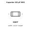
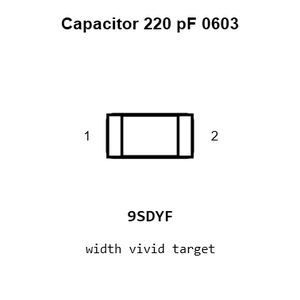
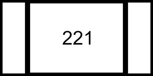
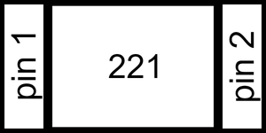
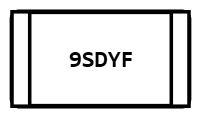
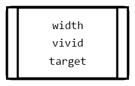
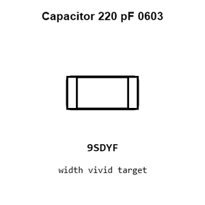
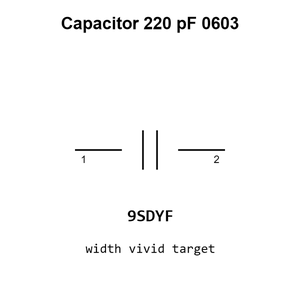
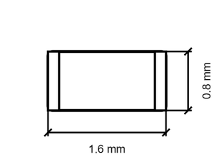
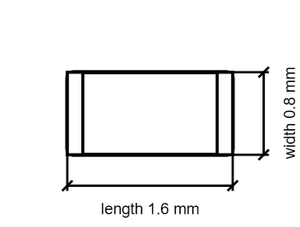

# Capacitor 220 pF 0603

`electronic_capacitor_0603_220_pico_farad`

Capacitor 220 pF 0603 is an OOMP electronic capacitor definition. It uses the 0603 package or form factor. Its nominal drawing size is 1.6 &#x00D7; 0.8 mm.

## At a glance

| Detail | Value |
| --- | --- |
| OOMP ID | `electronic_capacitor_0603_220_pico_farad` |
| Type | Capacitor |
| Package / style | 0603 |
| Nominal size | 1.6 &#x00D7; 0.8 mm |

## Classification

| Level | Value |
| --- | --- |
| 1 | `electronic` |
| 2 | `capacitor` |
| 3 | `0603` |
| 4 | `220_pico_farad` |

## Nominal dimensions

| Measurement | Value |
| --- | ---: |
| Length | 1.6 mm |
| Width | 0.8 mm |

## Identifiers

| Identifier | Value |
| --- | --- |
| Manufacturer part number | `CL10B221KB8NNNC` |
| LCSC | [`C1603`](https://www.lcsc.com/product-detail/C1603.html) |
| JLCPCB | [`C1603`](https://jlcpcb.com/partdetail/1955-CL10B221KB8NNNC/C1603) |

## Used in projects

| Project | Quantity | References | Explore |
| --- | ---: | --- | --- |
| [Project adafruit/Adafruit-BrainCraft-HAT-PCB Adafruit Brain Craft HAT current](https://github.com/adafruit/Adafruit-BrainCraft-HAT-PCB/blob/main/Adafruit%20BrainCraft%20HAT.brd) | 2 | C26, C27 | [Board explorer](https://oomlout.github.io/oomp_electronic_version_5/parts/oomp_project_github_adafruit_adafruit_brain_craft_hat_pcb_adafruit_brain_craft_hat_current/board_explorer.html) · [OOMP project](https://github.com/oomlout/oomp_electronic_version_5/tree/main/parts/oomp_project_github_adafruit_adafruit_brain_craft_hat_pcb_adafruit_brain_craft_hat_current) |

## Files

[KiCad symbol, machine-solder and hand-solder footprints](data/kicad/README.md) · [Availability and source masters](data/kicad/manifest.yaml)

[View this part on GitHub](https://github.com/oomlout/oomp_electronic_version_5/tree/main/parts/electronic_capacitor_0603_220_pico_farad)

[Browse this category](../../navigation/electronic/capacitor/0603/README.md)

---

This page is generated from the OOMP part definition by a Roboclick Jinja template. Edit the source taxonomy or template rather than this generated file.