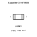
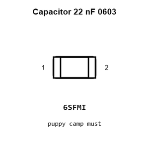
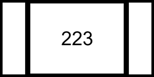
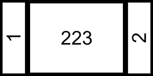
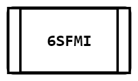
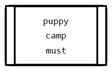
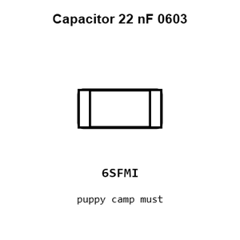
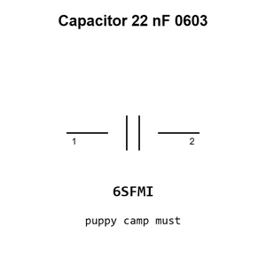

# Capacitor 22 nF 0603

`electronic_capacitor_0603_22_nano_farad_fenghua_adv_tech_0603f223m500nt`

Capacitor 22 nF 0603 is an OOMP electronic capacitor definition. It uses the 0603 package or form factor. Its nominal drawing size is 1.6 &#x00D7; 0.8 mm. The definition includes 2 documented pins.

## At a glance

| Detail | Value |
| --- | --- |
| OOMP ID | `electronic_capacitor_0603_22_nano_farad_fenghua_adv_tech_0603f223m500nt` |
| Type | Capacitor |
| Package / style | 0603 |
| Nominal size | 1.6 &#x00D7; 0.8 mm |
| Documented pins | 2 |

## Classification

| Level | Value |
| --- | --- |
| 1 | `electronic` |
| 2 | `capacitor` |
| 3 | `0603` |
| 4 | `22_nano_farad` |
| 5 | `fenghua_adv_tech` |
| 6 | `0603f223m500nt` |

## Nominal dimensions

| Measurement | Value |
| --- | ---: |
| Height | 0.8 mm |
| Length | 1.6 mm |
| Width | 0.8 mm |

## Identifiers

| Identifier | Value |
| --- | --- |
| Manufacturer part number | `0603F223M500NT` |
| LCSC | [`C1697`](https://www.lcsc.com/product-detail/C1697.html) |
| JLCPCB | [`C1697`](https://jlcpcb.com/partdetail/2049-0603F223M500NT/C1697) |

## Pins

| Pin | Name | Type |
| ---: | --- | --- |
| 1 | 1 | passive |
| 2 | 2 | passive |

## Datasheet

[View the datasheet](data/datasheet.pdf)

## Files

[KiCad symbol, machine-solder and hand-solder footprints](data/kicad/README.md) · [Availability and source masters](data/kicad/manifest.yaml)

[View this part on GitHub](https://github.com/oomlout/oomp_electronic_version_5/tree/main/parts/electronic_capacitor_0603_22_nano_farad_fenghua_adv_tech_0603f223m500nt)

[Browse this category](../../navigation/electronic/capacitor/0603/22_nano_farad/fenghua_adv_tech/README.md)

---

This page is generated from the OOMP part definition by a Roboclick Jinja template. Edit the source taxonomy or template rather than this generated file.