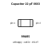
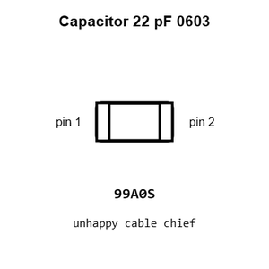
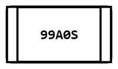
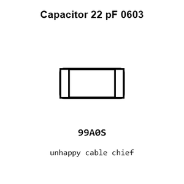
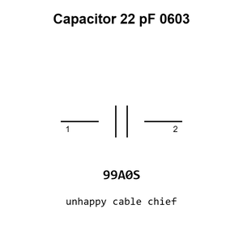

# Capacitor 22 pF 0603

`electronic_capacitor_0603_22_pico_farad`

Capacitor 22 pF 0603 is an OOMP electronic capacitor definition. It uses the 0603 package or form factor. Its nominal drawing size is 1.6 &#x00D7; 0.8 mm.

## At a glance

| Detail | Value |
| --- | --- |
| OOMP ID | `electronic_capacitor_0603_22_pico_farad` |
| Type | Capacitor |
| Package / style | 0603 |
| Nominal size | 1.6 &#x00D7; 0.8 mm |

## Classification

| Level | Value |
| --- | --- |
| 1 | `electronic` |
| 2 | `capacitor` |
| 3 | `0603` |
| 4 | `22_pico_farad` |

## Nominal dimensions

| Measurement | Value |
| --- | ---: |
| Length | 1.6 mm |
| Width | 0.8 mm |

## Identifiers

| Identifier | Value |
| --- | --- |
| Manufacturer part number | `CC0603JRNPO9BN220` |
| LCSC | [`C105620`](https://www.lcsc.com/product-detail/C105620.html) |
| LCSC | [`C1653`](https://www.lcsc.com/product-detail/C1653.html) |
| LCSC | [`C7419421`](https://www.lcsc.com/product-detail/C7419421.html) |

## Used in projects

| Project | Quantity | References | Explore |
| --- | ---: | --- | --- |
| [Project adafruit/Adafruit-BNO055-Breakout-PCB Adafruit BNO055 STEMMA QT current](https://github.com/adafruit/Adafruit-BNO055-Breakout-PCB/blob/master/Adafruit%20BNO055%20STEMMA%20QT.brd) | 2 | C1, C2 | [Board explorer](https://oomlout.github.io/oomp_electronic_version_5/parts/oomp_project_github_adafruit_adafruit_bno055_breakout_pcb_adafruit_bno055_stemma_qt_current/board_explorer.html) · [OOMP project](https://github.com/oomlout/oomp_electronic_version_5/tree/main/parts/oomp_project_github_adafruit_adafruit_bno055_breakout_pcb_adafruit_bno055_stemma_qt_current) |
| [Project adafruit/Adafruit-BNO08x-PCB Adafruit BNO08x current](https://github.com/adafruit/Adafruit-BNO08x-PCB/blob/master/Adafruit_BNO08x.brd) | 2 | C6, C7 | [Board explorer](https://oomlout.github.io/oomp_electronic_version_5/parts/oomp_project_github_adafruit_adafruit_bno08x_pcb_adafruit_bno08x_current/board_explorer.html) · [OOMP project](https://github.com/oomlout/oomp_electronic_version_5/tree/main/parts/oomp_project_github_adafruit_adafruit_bno08x_pcb_adafruit_bno08x_current) |
| [Project adafruit/Adafruit-Feather-M0-Express-PCB Adafruit Feather M0 Express current](https://github.com/adafruit/Adafruit-Feather-M0-Express-PCB/blob/master/Adafruit%20Feather%20M0%20Express.brd) | 2 | C2, C4 | [Board explorer](https://oomlout.github.io/oomp_electronic_version_5/parts/oomp_project_github_adafruit_adafruit_feather_m0_express_pcb_adafruit_feather_m0_express_current/board_explorer.html) · [OOMP project](https://github.com/oomlout/oomp_electronic_version_5/tree/main/parts/oomp_project_github_adafruit_adafruit_feather_m0_express_pcb_adafruit_feather_m0_express_current) |
| [Project adafruit/Adafruit-Feather-M0-RFM-LoRa-PCB Adafruit Feather M0 RFMxx current](https://github.com/adafruit/Adafruit-Feather-M0-RFM-LoRa-PCB/blob/master/Adafruit%20Feather%20M0%20RFMxx.brd) | 2 | C2, C4 | [Board explorer](https://oomlout.github.io/oomp_electronic_version_5/parts/oomp_project_github_adafruit_adafruit_feather_m0_rfm_lo_ra_pcb_adafruit_feather_m0_rfmxx_current/board_explorer.html) · [OOMP project](https://github.com/oomlout/oomp_electronic_version_5/tree/main/parts/oomp_project_github_adafruit_adafruit_feather_m0_rfm_lo_ra_pcb_adafruit_feather_m0_rfmxx_current) |
| [Project adafruit/Adafruit-Feather-M4-CAN-PCB Adafruit Feather M4 Express CAN current](https://github.com/adafruit/Adafruit-Feather-M4-CAN-PCB/blob/main/Adafruit%20Feather%20M4%20Express%20CAN.brd) | 2 | C2, C4 | [Board explorer](https://oomlout.github.io/oomp_electronic_version_5/parts/oomp_project_github_adafruit_adafruit_feather_m4_can_pcb_adafruit_feather_m4_express_can_current/board_explorer.html) · [OOMP project](https://github.com/oomlout/oomp_electronic_version_5/tree/main/parts/oomp_project_github_adafruit_adafruit_feather_m4_can_pcb_adafruit_feather_m4_express_can_current) |
| [Project adafruit/Adafruit-Feather-M4-Express-PCB Adafruit Feather M4 Express current](https://github.com/adafruit/Adafruit-Feather-M4-Express-PCB/blob/master/Adafruit%20Feather%20M4%20Express.brd) | 2 | C2, C4 | [Board explorer](https://oomlout.github.io/oomp_electronic_version_5/parts/oomp_project_github_adafruit_adafruit_feather_m4_express_pcb_adafruit_feather_m4_express_current/board_explorer.html) · [OOMP project](https://github.com/oomlout/oomp_electronic_version_5/tree/main/parts/oomp_project_github_adafruit_adafruit_feather_m4_express_pcb_adafruit_feather_m4_express_current) |
| [Project adafruit/Adafruit-Feather-RP2040-PCB Adafruit Feather RP2040 current](https://github.com/adafruit/Adafruit-Feather-RP2040-PCB/blob/main/Adafruit%20Feather%20RP2040.brd) | 2 | C2, C3 | [Board explorer](https://oomlout.github.io/oomp_electronic_version_5/parts/oomp_project_github_adafruit_adafruit_feather_rp2040_pcb_adafruit_feather_rp2040_current/board_explorer.html) · [OOMP project](https://github.com/oomlout/oomp_electronic_version_5/tree/main/parts/oomp_project_github_adafruit_adafruit_feather_rp2040_pcb_adafruit_feather_rp2040_current) |
| [Project adafruit/Adafruit-Feather-RP2040-PCB Adafruit Feather RP2040 Original current](https://github.com/adafruit/Adafruit-Feather-RP2040-PCB/blob/main/Adafruit%20Feather%20RP2040%20Original.brd) | 2 | C2, C3 | [Board explorer](https://oomlout.github.io/oomp_electronic_version_5/parts/oomp_project_github_adafruit_adafruit_feather_rp2040_pcb_adafruit_feather_rp2040_original_current/board_explorer.html) · [OOMP project](https://github.com/oomlout/oomp_electronic_version_5/tree/main/parts/oomp_project_github_adafruit_adafruit_feather_rp2040_pcb_adafruit_feather_rp2040_original_current) |
| [Project adafruit/Adafruit-Feather-STM32F405-Express-PCB Adafruit Feather STM32 F405 Express current](https://github.com/adafruit/Adafruit-Feather-STM32F405-Express-PCB/blob/master/Adafruit%20Feather%20STM32F405%20Express.brd) | 1 | C2 | [Board explorer](https://oomlout.github.io/oomp_electronic_version_5/parts/oomp_project_github_adafruit_adafruit_feather_stm32_f405_express_pcb_adafruit_feather_stm32_f405_express_current/board_explorer.html) · [OOMP project](https://github.com/oomlout/oomp_electronic_version_5/tree/main/parts/oomp_project_github_adafruit_adafruit_feather_stm32_f405_express_pcb_adafruit_feather_stm32_f405_express_current) |
| [Project adafruit/Adafruit-GP8403-Breakout-Board-PCB Adafruit GP8403 Breakout Board current](https://github.com/adafruit/Adafruit-GP8403-Breakout-Board-PCB/blob/main/Adafruit%20GP8403%20Breakout%20Board%20rev%20B.brd) | 1 | C8 | [Board explorer](https://oomlout.github.io/oomp_electronic_version_5/parts/oomp_project_github_adafruit_adafruit_gp8403_breakout_board_pcb_adafruit_gp8403_breakout_board_current/board_explorer.html) · [OOMP project](https://github.com/oomlout/oomp_electronic_version_5/tree/main/parts/oomp_project_github_adafruit_adafruit_gp8403_breakout_board_pcb_adafruit_gp8403_breakout_board_current) |
| [Project adafruit/Adafruit-Grand-Central-PCB Adafruit Grand Central M4 Express current](https://github.com/adafruit/Adafruit-Grand-Central-PCB/blob/master/Adafruit%20Grand%20Central%20M4%20Express%20rev%20B.brd) | 2 | C5, C7 | [Board explorer](https://oomlout.github.io/oomp_electronic_version_5/parts/oomp_project_github_adafruit_adafruit_grand_central_pcb_adafruit_grand_central_m4_express_current/board_explorer.html) · [OOMP project](https://github.com/oomlout/oomp_electronic_version_5/tree/main/parts/oomp_project_github_adafruit_adafruit_grand_central_pcb_adafruit_grand_central_m4_express_current) |
| [Project adafruit/Adafruit-High-Voltage-UPDI-Friend-PCB Adafruit High Voltage UPDI Friend current](https://github.com/adafruit/Adafruit-High-Voltage-UPDI-Friend-PCB/blob/main/Adafruit%20High%20Voltage%20UPDI%20Friend.brd) | 1 | C7 | [Board explorer](https://oomlout.github.io/oomp_electronic_version_5/parts/oomp_project_github_adafruit_adafruit_high_voltage_updi_friend_pcb_adafruit_high_voltage_updi_friend_current/board_explorer.html) · [OOMP project](https://github.com/oomlout/oomp_electronic_version_5/tree/main/parts/oomp_project_github_adafruit_adafruit_high_voltage_updi_friend_pcb_adafruit_high_voltage_updi_friend_current) |
| [Project adafruit/Adafruit-ItsyBitsy-nRF52840-Express-PCB Adafruit Itsy Bitsy n RF52840 Express current](https://github.com/adafruit/Adafruit-ItsyBitsy-nRF52840-Express-PCB/blob/master/Adafruit%20ItsyBitsy%20nRF52840%20Express.brd) | 2 | C1, C2 | [Board explorer](https://oomlout.github.io/oomp_electronic_version_5/parts/oomp_project_github_adafruit_adafruit_itsy_bitsy_n_rf52840_express_pcb_adafruit_itsy_bitsy_n_rf52840_express_current/board_explorer.html) · [OOMP project](https://github.com/oomlout/oomp_electronic_version_5/tree/main/parts/oomp_project_github_adafruit_adafruit_itsy_bitsy_n_rf52840_express_pcb_adafruit_itsy_bitsy_n_rf52840_express_current) |
| [Project adafruit/Adafruit-MEMENTO-PCB Adafruit MEMENTO Camera Board current](https://github.com/adafruit/Adafruit-MEMENTO-PCB/blob/main/Adafruit%20MEMENTO%20Camera%20Board.brd) | 1 | C26 | [Board explorer](https://oomlout.github.io/oomp_electronic_version_5/parts/oomp_project_github_adafruit_adafruit_memento_pcb_adafruit_memento_camera_board_current/board_explorer.html) · [OOMP project](https://github.com/oomlout/oomp_electronic_version_5/tree/main/parts/oomp_project_github_adafruit_adafruit_memento_pcb_adafruit_memento_camera_board_current) |
| [Project adafruit/Adafruit-Metro-RP2040-PCB Adafruit Metro RP2040 current](https://github.com/adafruit/Adafruit-Metro-RP2040-PCB/blob/main/Adafruit%20Metro%20RP2040.brd) | 2 | C26, C27 | [Board explorer](https://oomlout.github.io/oomp_electronic_version_5/parts/oomp_project_github_adafruit_adafruit_metro_rp2040_pcb_adafruit_metro_rp2040_current/board_explorer.html) · [OOMP project](https://github.com/oomlout/oomp_electronic_version_5/tree/main/parts/oomp_project_github_adafruit_adafruit_metro_rp2040_pcb_adafruit_metro_rp2040_current) |
| [Project adafruit/Adafruit-nRF52-Bluefruit-Feather-PCB Adafruit n RF52840 Bluefruit Feather Express current](https://github.com/adafruit/Adafruit-nRF52-Bluefruit-Feather-PCB/blob/master/Adafruit%20nRF52840%20Bluefruit%20Feather%20Express%20Rev%20E.brd) | 2 | C1, C2 | [Board explorer](https://oomlout.github.io/oomp_electronic_version_5/parts/oomp_project_github_adafruit_adafruit_n_rf52_bluefruit_feather_pcb_adafruit_n_rf52840_bluefruit_feather_express_current/board_explorer.html) · [OOMP project](https://github.com/oomlout/oomp_electronic_version_5/tree/main/parts/oomp_project_github_adafruit_adafruit_n_rf52_bluefruit_feather_pcb_adafruit_n_rf52840_bluefruit_feather_express_current) |
| [Project adafruit/Adafruit-nRF52-Bluefruit-Feather-PCB Adafruit n RF52 Bluefruit Feather current](https://github.com/adafruit/Adafruit-nRF52-Bluefruit-Feather-PCB/blob/master/Adafruit%20nRF52%20Bluefruit%20Feather.brd) | 2 | C1, C2 | [Board explorer](https://oomlout.github.io/oomp_electronic_version_5/parts/oomp_project_github_adafruit_adafruit_n_rf52_bluefruit_feather_pcb_adafruit_n_rf52_bluefruit_feather_current/board_explorer.html) · [OOMP project](https://github.com/oomlout/oomp_electronic_version_5/tree/main/parts/oomp_project_github_adafruit_adafruit_n_rf52_bluefruit_feather_pcb_adafruit_n_rf52_bluefruit_feather_current) |
| [Project adafruit/Adafruit-OV5640-Camera-Breakout-PCB Adafruit OV5640 Breakout current](https://github.com/adafruit/Adafruit-OV5640-Camera-Breakout-PCB/blob/main/Adafruit%20OV5640%20Breakout.brd) | 1 | C6 | [Board explorer](https://oomlout.github.io/oomp_electronic_version_5/parts/oomp_project_github_adafruit_adafruit_ov5640_camera_breakout_pcb_adafruit_ov5640_breakout_current/board_explorer.html) · [OOMP project](https://github.com/oomlout/oomp_electronic_version_5/tree/main/parts/oomp_project_github_adafruit_adafruit_ov5640_camera_breakout_pcb_adafruit_ov5640_breakout_current) |
| [Project hanqaqa/easyduino ATmega328P Arduino Uno current](https://github.com/Hanqaqa/Easyduino/tree/master/Atmega328p%20Arduino%20Uno) | 2 | C8, C9 | [Board explorer](https://oomlout.github.io/oomp_electronic_version_5/parts/oomp_project_github_hanqaqa_easyduino_atmega328p_arduino_uno_current/board_explorer.html) · [OOMP project](https://github.com/oomlout/oomp_electronic_version_5/tree/main/parts/oomp_project_github_hanqaqa_easyduino_atmega328p_arduino_uno_current) |

## Files

[KiCad symbol, machine-solder and hand-solder footprints](data/kicad/README.md) · [Availability and source masters](data/kicad/manifest.yaml)

[View this part on GitHub](https://github.com/oomlout/oomp_electronic_version_5/tree/main/parts/electronic_capacitor_0603_22_pico_farad)

[Browse this category](../../navigation/electronic/capacitor/0603/README.md)

---

This page is generated from the OOMP part definition by a Roboclick Jinja template. Edit the source taxonomy or template rather than this generated file.