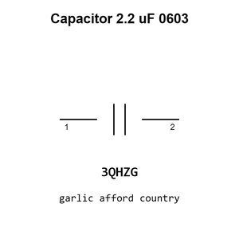

# Capacitor 2.2 uF 0603

`electronic_capacitor_0603_2_2_micro_farad`

Capacitor 2.2 uF 0603 is an OOMP electronic capacitor definition. It uses the 0603 package or form factor. Its nominal drawing size is 1.6 &#x00D7; 0.8 mm.

## At a glance

| Detail | Value |
| --- | --- |
| OOMP ID | `electronic_capacitor_0603_2_2_micro_farad` |
| Type | Capacitor |
| Package / style | 0603 |
| Nominal size | 1.6 &#x00D7; 0.8 mm |

## Classification

| Level | Value |
| --- | --- |
| 1 | `electronic` |
| 2 | `capacitor` |
| 3 | `0603` |
| 4 | `2_2_micro_farad` |

## Nominal dimensions

| Measurement | Value |
| --- | ---: |
| Length | 1.6 mm |
| Width | 0.8 mm |

## Identifiers

| Identifier | Value |
| --- | --- |
| Manufacturer part number | `CL10A225KO8NNNC` |
| LCSC | [`C23630`](https://www.lcsc.com/product-detail/C23630.html) |
| LCSC | [`C57895`](https://www.lcsc.com/product-detail/C57895.html) |
| LCSC | [`C913904`](https://www.lcsc.com/product-detail/C913904.html) |

## Used in projects

| Project | Quantity | References | Explore |
| --- | ---: | --- | --- |
| [Project soldered_electronics/Accelerometer---Gyroscope---Magnetometer-LSM9DS1TR-breakout-hardware-design LSM9DS1TR IMU current](https://github.com/SolderedElectronics/Accelerometer---Gyroscope---Magnetometer-LSM9DS1TR-breakout-hardware-design) | 2 | C6, C7 | [Board explorer](https://oomlout.github.io/oomp_electronic_version_5/parts/oomp_project_github_soldered_electronics_accelerometer_gyroscope_magnetometer_lsm9_ds1_tr_breakout_hardware_design_sensor_imu_lsm9ds1tr_current/board_explorer.html) · [OOMP project](https://github.com/oomlout/oomp_electronic_version_5/tree/main/parts/oomp_project_github_soldered_electronics_accelerometer_gyroscope_magnetometer_lsm9_ds1_tr_breakout_hardware_design_sensor_imu_lsm9ds1tr_current) |
| [Project soldered_electronics/Air-quality-sensor-CCS811-breakout-hardware-design CCS811 Breakout current](https://github.com/SolderedElectronics/Air-quality-sensor-CCS811-breakout-hardware-design) | 2 | C2, C3 | [Board explorer](https://oomlout.github.io/oomp_electronic_version_5/parts/oomp_project_github_soldered_electronics_air_quality_sensor_ccs811_breakout_hardware_design_sensor_air_quality_ccs811_current/board_explorer.html) · [OOMP project](https://github.com/oomlout/oomp_electronic_version_5/tree/main/parts/oomp_project_github_soldered_electronics_air_quality_sensor_ccs811_breakout_hardware_design_sensor_air_quality_ccs811_current) |
| [Project soldered_electronics/Color-and-gesture-sensor-APDS-9960-breakout-hardware-design APDS-9960 Breakout current](https://github.com/SolderedElectronics/Color-and-gesture-sensor-APDS-9960-breakout-hardware-design) | 2 | C4, C5 | [Board explorer](https://oomlout.github.io/oomp_electronic_version_5/parts/oomp_project_github_soldered_electronics_color_and_gesture_sensor_apds_9960_breakout_hardware_design_sensor_color_gesture_apds9960_current/board_explorer.html) · [OOMP project](https://github.com/oomlout/oomp_electronic_version_5/tree/main/parts/oomp_project_github_soldered_electronics_color_and_gesture_sensor_apds_9960_breakout_hardware_design_sensor_color_gesture_apds9960_current) |
| [Project soldered_electronics/Color---gesture-sensor-APDS-9960-breakout-hardware-design APDS-9960 Breakout current](https://github.com/SolderedElectronics/Color---gesture-sensor-APDS-9960-breakout-hardware-design) | 2 | C4, C5 | [Board explorer](https://oomlout.github.io/oomp_electronic_version_5/parts/oomp_project_github_soldered_electronics_color_gesture_sensor_apds_9960_breakout_hardware_design_sensor_color_gesture_apds9960_current/board_explorer.html) · [OOMP project](https://github.com/oomlout/oomp_electronic_version_5/tree/main/parts/oomp_project_github_soldered_electronics_color_gesture_sensor_apds_9960_breakout_hardware_design_sensor_color_gesture_apds9960_current) |
| [Project soldered_electronics/Current-sensor-30A-ACS712-breakout-hardware-design ACS712 30A current](https://github.com/SolderedElectronics/Current-sensor-30A-ACS712-breakout-hardware-design) | 1 | C4 | [Board explorer](https://oomlout.github.io/oomp_electronic_version_5/parts/oomp_project_github_soldered_electronics_current_sensor_30_a_acs712_breakout_hardware_design_sensor_current_acs712_30a_current/board_explorer.html) · [OOMP project](https://github.com/oomlout/oomp_electronic_version_5/tree/main/parts/oomp_project_github_soldered_electronics_current_sensor_30_a_acs712_breakout_hardware_design_sensor_current_acs712_30a_current) |
| [Project soldered_electronics/Digital-light---proximity-sensor-LTR-507ALS-breakout-hardware-design LTR-507ALS Breakout current](https://github.com/SolderedElectronics/Digital-light---proximity-sensor-LTR-507ALS-breakout-hardware-design) | 2 | C3, C4 | [Board explorer](https://oomlout.github.io/oomp_electronic_version_5/parts/oomp_project_github_soldered_electronics_digital_light_proximity_sensor_ltr_507_als_breakout_hardware_design_sensor_light_ltr507als_current/board_explorer.html) · [OOMP project](https://github.com/oomlout/oomp_electronic_version_5/tree/main/parts/oomp_project_github_soldered_electronics_digital_light_proximity_sensor_ltr_507_als_breakout_hardware_design_sensor_light_ltr507als_current) |
| [Project soldered_electronics/GNSS-GPS-L86-M33-breakout-hardware-design L86-M33 GNSS current](https://github.com/SolderedElectronics/GNSS-GPS-L86-M33-breakout-hardware-design) | 2 | C3, C4 | [Board explorer](https://oomlout.github.io/oomp_electronic_version_5/parts/oomp_project_github_soldered_electronics_gnss_gps_l86_m33_breakout_hardware_design_sensor_gnss_l86m33_current/board_explorer.html) · [OOMP project](https://github.com/oomlout/oomp_electronic_version_5/tree/main/parts/oomp_project_github_soldered_electronics_gnss_gps_l86_m33_breakout_hardware_design_sensor_gnss_l86m33_current) |
| [Project soldered_electronics/PIR-Movement-sensor-board-hardware-design PIR Movement Sensor current](https://github.com/SolderedElectronics/PIR-Movement-sensor-board-hardware-design) | 2 | C1, C2 | [Board explorer](https://oomlout.github.io/oomp_electronic_version_5/parts/oomp_project_github_soldered_electronics_pir_movement_sensor_board_hardware_design_sensor_pir_movement_current/board_explorer.html) · [OOMP project](https://github.com/oomlout/oomp_electronic_version_5/tree/main/parts/oomp_project_github_soldered_electronics_pir_movement_sensor_board_hardware_design_sensor_pir_movement_current) |
| [Project soldered_electronics/Pressure---temperature-sensor-BMP388-breakout-hardware-design BMP388 Breakout current](https://github.com/SolderedElectronics/Pressure---temperature-sensor-BMP388-breakout-hardware-design) | 2 | C3, C4 | [Board explorer](https://oomlout.github.io/oomp_electronic_version_5/parts/oomp_project_github_soldered_electronics_pressure_temperature_sensor_bmp388_breakout_hardware_design_sensor_pressure_temp_bmp388_current/board_explorer.html) · [OOMP project](https://github.com/oomlout/oomp_electronic_version_5/tree/main/parts/oomp_project_github_soldered_electronics_pressure_temperature_sensor_bmp388_breakout_hardware_design_sensor_pressure_temp_bmp388_current) |
| [Project sparkfun/SparkFun_Audio_Player_Breakout_MY1690X-16S Audio Player Breakout MY1690X-16S current](https://github.com/sparkfun/SparkFun_Audio_Player_Breakout_MY1690X-16S) | 2 | C1, C7 | [Board explorer](https://oomlout.github.io/oomp_electronic_version_5/parts/oomp_project_github_sparkfun_spark_fun_audio_player_breakout_my1690_x_16_s_audio_player_breakout_my1690x_16s_current/board_explorer.html) · [OOMP project](https://github.com/oomlout/oomp_electronic_version_5/tree/main/parts/oomp_project_github_sparkfun_spark_fun_audio_player_breakout_my1690_x_16_s_audio_player_breakout_my1690x_16s_current) |
| [Project sparkfun/SparkFun_Qwiic_ADC_ADS1219 Qwiic ADC ADS1219 current](https://github.com/sparkfun/SparkFun_Qwiic_ADC_ADS1219) | 2 | C1, C3 | [Board explorer](https://oomlout.github.io/oomp_electronic_version_5/parts/oomp_project_github_sparkfun_spark_fun_qwiic_adc_ads1219_qwiic_adc_ads1219_current/board_explorer.html) · [OOMP project](https://github.com/oomlout/oomp_electronic_version_5/tree/main/parts/oomp_project_github_sparkfun_spark_fun_qwiic_adc_ads1219_qwiic_adc_ads1219_current) |

## Files

[KiCad symbol, machine-solder and hand-solder footprints](data/kicad/README.md) · [Availability and source masters](data/kicad/manifest.yaml)

[View this part on GitHub](https://github.com/oomlout/oomp_electronic_version_5/tree/main/parts/electronic_capacitor_0603_2_2_micro_farad)

[Browse this category](../../navigation/electronic/capacitor/0603/README.md)

---

This page is generated from the OOMP part definition by a Roboclick Jinja template. Edit the source taxonomy or template rather than this generated file.