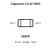
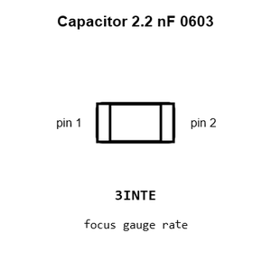
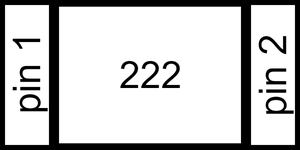
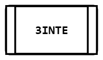
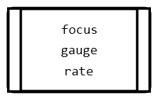
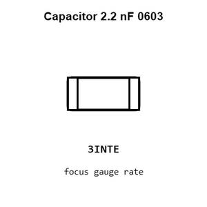
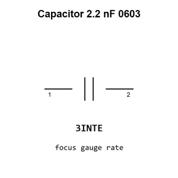

# Capacitor 2.2 nF 0603

`electronic_capacitor_0603_2_2_nano_farad`

Capacitor 2.2 nF 0603 is an OOMP electronic capacitor definition. It uses the 0603 package or form factor. Its nominal drawing size is 1.6 &#x00D7; 0.8 mm.

## At a glance

| Detail | Value |
| --- | --- |
| OOMP ID | `electronic_capacitor_0603_2_2_nano_farad` |
| Type | Capacitor |
| Package / style | 0603 |
| Nominal size | 1.6 &#x00D7; 0.8 mm |

## Classification

| Level | Value |
| --- | --- |
| 1 | `electronic` |
| 2 | `capacitor` |
| 3 | `0603` |
| 4 | `2_2_nano_farad` |

## Nominal dimensions

| Measurement | Value |
| --- | ---: |
| Length | 1.6 mm |
| Width | 0.8 mm |

## Identifiers

| Identifier | Value |
| --- | --- |
| Manufacturer part number | `0603B222K500NT` |
| LCSC | [`C1604`](https://www.lcsc.com/product-detail/C1604.html) |
| JLCPCB | [`C1604`](https://jlcpcb.com/partdetail/1956-0603B222K500NT/C1604) |

## Used in projects

| Project | Quantity | References | Explore |
| --- | ---: | --- | --- |
| [Project adafruit/Adafruit-MPU6050-PCB Adafruit MPU6050 current](https://github.com/adafruit/Adafruit-MPU6050-PCB/blob/master/Adafruit%20MPU6050.brd) | 1 | C1 | [Board explorer](https://oomlout.github.io/oomp_electronic_version_5/parts/oomp_project_github_adafruit_adafruit_mpu6050_pcb_adafruit_mpu6050_current/board_explorer.html) · [OOMP project](https://github.com/oomlout/oomp_electronic_version_5/tree/main/parts/oomp_project_github_adafruit_adafruit_mpu6050_pcb_adafruit_mpu6050_current) |
| [Project adafruit/Adafruit-PCM510x-I2S-DAC-PCB Adafruit PCM510x I2 S DAC current](https://github.com/adafruit/Adafruit-PCM510x-I2S-DAC-PCB/blob/main/Adafruit%20PCM510x%20I2S%20DAC.brd) | 2 | C7, C8 | [Board explorer](https://oomlout.github.io/oomp_electronic_version_5/parts/oomp_project_github_adafruit_adafruit_pcm510x_i2_s_dac_pcb_adafruit_pcm510x_i2_s_dac_current/board_explorer.html) · [OOMP project](https://github.com/oomlout/oomp_electronic_version_5/tree/main/parts/oomp_project_github_adafruit_adafruit_pcm510x_i2_s_dac_pcb_adafruit_pcm510x_i2_s_dac_current) |
| [Project sparkfun/MPU-6050_Breakout Triple Axis Accelerometer Gyro Breakout MPU 6050 current](https://github.com/sparkfun/MPU-6050_Breakout/blob/master/Hardware/Triple_Axis_Accelerometer_-_Gyro_Breakout_-_MPU-6050.brd) | 1 | C2 | [Board explorer](https://oomlout.github.io/oomp_electronic_version_5/parts/oomp_project_github_sparkfun_mpu_6050_breakout_triple_axis_accelerometer_gyro_breakout_mpu_6050_current/board_explorer.html) · [OOMP project](https://github.com/oomlout/oomp_electronic_version_5/tree/main/parts/oomp_project_github_sparkfun_mpu_6050_breakout_triple_axis_accelerometer_gyro_breakout_mpu_6050_current) |
| [Project sparkfun/SparkFun_Capacitive_Soil_Moisture_Sensor_CY8CMBR3102 Capacitive Soil Moisture Sensor CY8CMBR3102 current](https://github.com/sparkfun/SparkFun_Capacitive_Soil_Moisture_Sensor_CY8CMBR3102) | 1 | C3 | [Board explorer](https://oomlout.github.io/oomp_electronic_version_5/parts/oomp_project_github_sparkfun_spark_fun_capacitive_soil_moisture_sensor_cy8_cmbr3102_capacitive_soil_moisture_cy8cmbr3102_current/board_explorer.html) · [OOMP project](https://github.com/oomlout/oomp_electronic_version_5/tree/main/parts/oomp_project_github_sparkfun_spark_fun_capacitive_soil_moisture_sensor_cy8_cmbr3102_capacitive_soil_moisture_cy8cmbr3102_current) |
| [Project sparkfun/WAV_Trigger wavtrigger current](https://github.com/sparkfun/WAV_Trigger/blob/master/hardware/wavtrigger.brd) | 2 | C28, C29 | [Board explorer](https://oomlout.github.io/oomp_electronic_version_5/parts/oomp_project_github_sparkfun_wav_trigger_wavtrigger_current/board_explorer.html) · [OOMP project](https://github.com/oomlout/oomp_electronic_version_5/tree/main/parts/oomp_project_github_sparkfun_wav_trigger_wavtrigger_current) |

## Files

[KiCad symbol, machine-solder and hand-solder footprints](data/kicad/README.md) · [Availability and source masters](data/kicad/manifest.yaml)

[View this part on GitHub](https://github.com/oomlout/oomp_electronic_version_5/tree/main/parts/electronic_capacitor_0603_2_2_nano_farad)

[Browse this category](../../navigation/electronic/capacitor/0603/README.md)

---

This page is generated from the OOMP part definition by a Roboclick Jinja template. Edit the source taxonomy or template rather than this generated file.