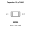
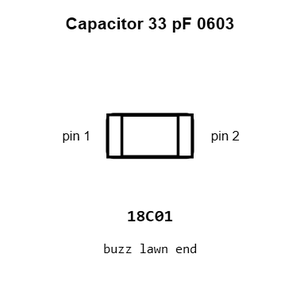
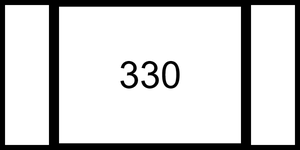
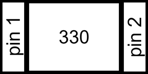
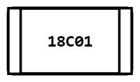
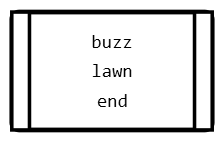
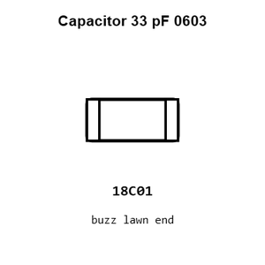
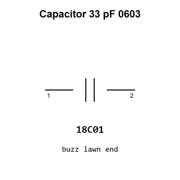

# Capacitor 33 pF 0603

`electronic_capacitor_0603_33_pico_farad`

Capacitor 33 pF 0603 is an OOMP electronic capacitor definition. It uses the 0603 package or form factor. Its nominal drawing size is 1.6 &#x00D7; 0.8 mm.

## At a glance

| Detail | Value |
| --- | --- |
| OOMP ID | `electronic_capacitor_0603_33_pico_farad` |
| Type | Capacitor |
| Package / style | 0603 |
| Nominal size | 1.6 &#x00D7; 0.8 mm |

## Classification

| Level | Value |
| --- | --- |
| 1 | `electronic` |
| 2 | `capacitor` |
| 3 | `0603` |
| 4 | `33_pico_farad` |

## Nominal dimensions

| Measurement | Value |
| --- | ---: |
| Length | 1.6 mm |
| Width | 0.8 mm |

## Identifiers

| Identifier | Value |
| --- | --- |
| Manufacturer part number | `CC0603JRNPO9BN330` |
| LCSC | [`C107047`](https://www.lcsc.com/product-detail/C107047.html) |

## Used in projects

| Project | Quantity | References | Explore |
| --- | ---: | --- | --- |
| [Project adafruit/Adafruit-BrainCraft-HAT-PCB Adafruit Brain Craft HAT current](https://github.com/adafruit/Adafruit-BrainCraft-HAT-PCB/blob/main/Adafruit%20BrainCraft%20HAT.brd) | 4 | C19, C20, C21, C22 | [Board explorer](https://oomlout.github.io/oomp_electronic_version_5/parts/oomp_project_github_adafruit_adafruit_brain_craft_hat_pcb_adafruit_brain_craft_hat_current/board_explorer.html) · [OOMP project](https://github.com/oomlout/oomp_electronic_version_5/tree/main/parts/oomp_project_github_adafruit_adafruit_brain_craft_hat_pcb_adafruit_brain_craft_hat_current) |
| [Project adafruit/Adafruit-FONA-800-GSM-Breakout-PCB Adafruit FONA 800 GSM Breakout current](https://github.com/adafruit/Adafruit-FONA-800-GSM-Breakout-PCB/blob/master/Adafruit-FONA-800-GSM-Breakout.brd) | 2 | C14, C16 | [Board explorer](https://oomlout.github.io/oomp_electronic_version_5/parts/oomp_project_github_adafruit_adafruit_fona_800_gsm_breakout_pcb_adafruit_fona_800_gsm_breakout_current/board_explorer.html) · [OOMP project](https://github.com/oomlout/oomp_electronic_version_5/tree/main/parts/oomp_project_github_adafruit_adafruit_fona_800_gsm_breakout_pcb_adafruit_fona_800_gsm_breakout_current) |
| [Project adafruit/Adafruit-Voice-Bonnet-PCB Adafruit Voice Bonnet current](https://github.com/adafruit/Adafruit-Voice-Bonnet-PCB/blob/master/Adafruit%20Voice%20Bonnet.brd) | 4 | C19, C20, C21, C22 | [Board explorer](https://oomlout.github.io/oomp_electronic_version_5/parts/oomp_project_github_adafruit_adafruit_voice_bonnet_pcb_adafruit_voice_bonnet_current/board_explorer.html) · [OOMP project](https://github.com/oomlout/oomp_electronic_version_5/tree/main/parts/oomp_project_github_adafruit_adafruit_voice_bonnet_pcb_adafruit_voice_bonnet_current) |
| [Project sparkfun/SparkFun_GNSS_DAN-F10N GNSS DAN-F10N current](https://github.com/sparkfun/SparkFun_GNSS_DAN-F10N) | 1 | C17 | [Board explorer](https://oomlout.github.io/oomp_electronic_version_5/parts/oomp_project_github_sparkfun_spark_fun_gnss_dan_f10_n_gnss_dan_f10n_current/board_explorer.html) · [OOMP project](https://github.com/oomlout/oomp_electronic_version_5/tree/main/parts/oomp_project_github_sparkfun_spark_fun_gnss_dan_f10_n_gnss_dan_f10n_current) |
| [Project sparkfun/SparkFun_IoT_Brushless_Motor_Driver ESP32 BLDC Motor Driver current](https://github.com/sparkfun/SparkFun_IoT_Brushless_Motor_Driver/blob/main/Hardware/ESP32_BLDC_Motor_Driver.brd) | 1 | C16 | [Board explorer](https://oomlout.github.io/oomp_electronic_version_5/parts/oomp_project_github_sparkfun_spark_fun_io_t_brushless_motor_driver_esp32_bldc_motor_driver_current/board_explorer.html) · [OOMP project](https://github.com/oomlout/oomp_electronic_version_5/tree/main/parts/oomp_project_github_sparkfun_spark_fun_io_t_brushless_motor_driver_esp32_bldc_motor_driver_current) |
| [Project sparkfun/SparkFun_RTK_EVK Spark Fun RTK EVK current](https://github.com/sparkfun/SparkFun_RTK_EVK/blob/main/Hardware/SparkFun_RTK_EVK.brd) | 2 | C82, C83 | [Board explorer](https://oomlout.github.io/oomp_electronic_version_5/parts/oomp_project_github_sparkfun_spark_fun_rtk_evk_spark_fun_rtk_evk_current/board_explorer.html) · [OOMP project](https://github.com/oomlout/oomp_electronic_version_5/tree/main/parts/oomp_project_github_sparkfun_spark_fun_rtk_evk_spark_fun_rtk_evk_current) |
| [Project sparkfun/WAV_Trigger wavtrigger current](https://github.com/sparkfun/WAV_Trigger/blob/master/hardware/wavtrigger.brd) | 2 | C16, C17 | [Board explorer](https://oomlout.github.io/oomp_electronic_version_5/parts/oomp_project_github_sparkfun_wav_trigger_wavtrigger_current/board_explorer.html) · [OOMP project](https://github.com/oomlout/oomp_electronic_version_5/tree/main/parts/oomp_project_github_sparkfun_wav_trigger_wavtrigger_current) |

## Files

[KiCad symbol, machine-solder and hand-solder footprints](data/kicad/README.md) · [Availability and source masters](data/kicad/manifest.yaml)

[View this part on GitHub](https://github.com/oomlout/oomp_electronic_version_5/tree/main/parts/electronic_capacitor_0603_33_pico_farad)

[Browse this category](../../navigation/electronic/capacitor/0603/README.md)

---

This page is generated from the OOMP part definition by a Roboclick Jinja template. Edit the source taxonomy or template rather than this generated file.