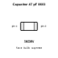
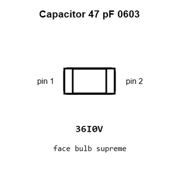
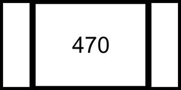
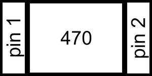
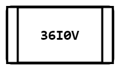
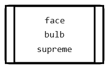
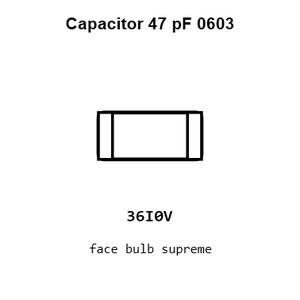
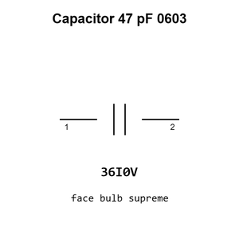

# Capacitor 47 pF 0603

`electronic_capacitor_0603_47_pico_farad`

Capacitor 47 pF 0603 is an OOMP electronic capacitor definition. It uses the 0603 package or form factor. Its nominal drawing size is 1.6 &#x00D7; 0.8 mm.

## At a glance

| Detail | Value |
| --- | --- |
| OOMP ID | `electronic_capacitor_0603_47_pico_farad` |
| Type | Capacitor |
| Package / style | 0603 |
| Nominal size | 1.6 &#x00D7; 0.8 mm |

## Classification

| Level | Value |
| --- | --- |
| 1 | `electronic` |
| 2 | `capacitor` |
| 3 | `0603` |
| 4 | `47_pico_farad` |

## Nominal dimensions

| Measurement | Value |
| --- | ---: |
| Length | 1.6 mm |
| Width | 0.8 mm |

## Identifiers

| Identifier | Value |
| --- | --- |
| Manufacturer part number | `CL10C470JB8NNNC` |
| LCSC | [`C1671`](https://www.lcsc.com/product-detail/C1671.html) |
| LCSC | [`C105622`](https://www.lcsc.com/product-detail/C105622.html) |
| LCSC | [`C94904`](https://www.lcsc.com/product-detail/C94904.html) |
| JLCPCB | [`C1671`](https://jlcpcb.com/partdetail/2023-CL10C470JB8NNNC/C1671) |

## Used in projects

| Project | Quantity | References | Explore |
| --- | ---: | --- | --- |
| [Project adafruit/Adafruit-PiCowbell-CAN-Bus-PCB Adafruit Pi Cowbell CAN Bus current](https://github.com/adafruit/Adafruit-PiCowbell-CAN-Bus-PCB/blob/main/Adafruit%20PiCowbell%20CAN%20Bus.brd) | 2 | C5, C6 | [Board explorer](https://oomlout.github.io/oomp_electronic_version_5/parts/oomp_project_github_adafruit_adafruit_pi_cowbell_can_bus_pcb_adafruit_pi_cowbell_can_bus_current/board_explorer.html) · [OOMP project](https://github.com/oomlout/oomp_electronic_version_5/tree/main/parts/oomp_project_github_adafruit_adafruit_pi_cowbell_can_bus_pcb_adafruit_pi_cowbell_can_bus_current) |
| [Project sparkfun/Blynk_Board_ESP8266 Spark Fun Blynk Board ESP8266 current](https://github.com/sparkfun/Blynk_Board_ESP8266/blob/master/Hardware/SparkFun-Blynk-Board-ESP8266.brd) | 2 | C12, C13 | [Board explorer](https://oomlout.github.io/oomp_electronic_version_5/parts/oomp_project_github_sparkfun_blynk_board_esp8266_spark_fun_blynk_board_esp8266_current/board_explorer.html) · [OOMP project](https://github.com/oomlout/oomp_electronic_version_5/tree/main/parts/oomp_project_github_sparkfun_blynk_board_esp8266_spark_fun_blynk_board_esp8266_current) |
| [Project sparkfun/ESP32_Thing esp32 thing current](https://github.com/sparkfun/ESP32_Thing/blob/master/Hardware/esp32-thing.brd) | 2 | C12, C13 | [Board explorer](https://oomlout.github.io/oomp_electronic_version_5/parts/oomp_project_github_sparkfun_esp32_thing_esp32_thing_current/board_explorer.html) · [OOMP project](https://github.com/oomlout/oomp_electronic_version_5/tree/main/parts/oomp_project_github_sparkfun_esp32_thing_esp32_thing_current) |
| [Project sparkfun/ESP8266_Thing_Dev ESP8266 Thing Dev current](https://github.com/sparkfun/ESP8266_Thing_Dev/blob/master/Hardware/ESP8266-Thing-Dev.brd) | 2 | C9, C11 | [Board explorer](https://oomlout.github.io/oomp_electronic_version_5/parts/oomp_project_github_sparkfun_esp8266_thing_dev_esp8266_thing_dev_current/board_explorer.html) · [OOMP project](https://github.com/oomlout/oomp_electronic_version_5/tree/main/parts/oomp_project_github_sparkfun_esp8266_thing_dev_esp8266_thing_dev_current) |
| [Project sparkfun/LTE_Cat_M1_Shield lte cat m1 shield sara r4 current](https://github.com/sparkfun/LTE_Cat_M1_Shield/blob/main/Hardware/lte_cat_m1_shield_sara-r4.brd) | 4 | C14, C17, C18, C20 | [Board explorer](https://oomlout.github.io/oomp_electronic_version_5/parts/oomp_project_github_sparkfun_lte_cat_m1_shield_lte_cat_m1_shield_sara_r4_current/board_explorer.html) · [OOMP project](https://github.com/oomlout/oomp_electronic_version_5/tree/main/parts/oomp_project_github_sparkfun_lte_cat_m1_shield_lte_cat_m1_shield_sara_r4_current) |
| [Project sparkfun/MicroView_USB_Programmer Spark Fun Micro View USB current](https://github.com/sparkfun/MicroView_USB_Programmer/blob/master/Hardware/SparkFun_MicroViewUSB.brd) | 2 | C2, C3 | [Board explorer](https://oomlout.github.io/oomp_electronic_version_5/parts/oomp_project_github_sparkfun_micro_view_usb_programmer_spark_fun_micro_view_usb_current/board_explorer.html) · [OOMP project](https://github.com/oomlout/oomp_electronic_version_5/tree/main/parts/oomp_project_github_sparkfun_micro_view_usb_programmer_spark_fun_micro_view_usb_current) |
| [Project sparkfun/OpenScale Spark Fun open Scale current](https://github.com/sparkfun/OpenScale/blob/master/hardware/SparkFun_openScale.brd) | 2 | C2, C5 | [Board explorer](https://oomlout.github.io/oomp_electronic_version_5/parts/oomp_project_github_sparkfun_open_scale_spark_fun_open_scale_current/board_explorer.html) · [OOMP project](https://github.com/oomlout/oomp_electronic_version_5/tree/main/parts/oomp_project_github_sparkfun_open_scale_spark_fun_open_scale_current) |
| [Project sparkfun/Purpletooth_Jamboree Purpletooth Jamboree current](https://github.com/sparkfun/Purpletooth_Jamboree/blob/master/Hardware/Purpletooth_Jamboree.brd) | 4 | C7, C9, C12, C14 | [Board explorer](https://oomlout.github.io/oomp_electronic_version_5/parts/oomp_project_github_sparkfun_purpletooth_jamboree_purpletooth_jamboree_current/board_explorer.html) · [OOMP project](https://github.com/oomlout/oomp_electronic_version_5/tree/main/parts/oomp_project_github_sparkfun_purpletooth_jamboree_purpletooth_jamboree_current) |
| [Project sparkfun/RedBoard Red Board current](https://github.com/sparkfun/RedBoard/blob/master/Hardware/RedBoard.brd) | 2 | C9, C13 | [Board explorer](https://oomlout.github.io/oomp_electronic_version_5/parts/oomp_project_github_sparkfun_red_board_red_board_current/board_explorer.html) · [OOMP project](https://github.com/oomlout/oomp_electronic_version_5/tree/main/parts/oomp_project_github_sparkfun_red_board_red_board_current) |
| [Project sparkfun/SparkFun_Digi_XBee_Arduino_Shield-USB-C Spark Fun Digi XBee Arduino Shield Qwiic current](https://github.com/sparkfun/SparkFun_Digi_XBee_Arduino_Shield-USB-C/blob/main/Hardware/SparkFun_Digi_XBee_Arduino_Shield_Qwiic.brd) | 1 | C5 | [Board explorer](https://oomlout.github.io/oomp_electronic_version_5/parts/oomp_project_github_sparkfun_spark_fun_digi_xbee_arduino_shield_usb_c_spark_fun_digi_xbee_arduino_shield_qwiic_current/board_explorer.html) · [OOMP project](https://github.com/oomlout/oomp_electronic_version_5/tree/main/parts/oomp_project_github_sparkfun_spark_fun_digi_xbee_arduino_shield_usb_c_spark_fun_digi_xbee_arduino_shield_qwiic_current) |
| [Project sparkfun/SparkFun_Digi_XBee_Development_Board Spark Fun Digi XBee Development Board current](https://github.com/sparkfun/SparkFun_Digi_XBee_Development_Board/blob/main/Hardware/SparkFun_Digi_XBee_Development_Board.brd) | 1 | C13 | [Board explorer](https://oomlout.github.io/oomp_electronic_version_5/parts/oomp_project_github_sparkfun_spark_fun_digi_xbee_development_board_spark_fun_digi_xbee_development_board_current/board_explorer.html) · [OOMP project](https://github.com/oomlout/oomp_electronic_version_5/tree/main/parts/oomp_project_github_sparkfun_spark_fun_digi_xbee_development_board_spark_fun_digi_xbee_development_board_current) |
| [Project sparkfun/SparkFun_Digi_XBee_Explorer_USB-C Spark Fun Digi XBee Explorer USB C current](https://github.com/sparkfun/SparkFun_Digi_XBee_Explorer_USB-C/blob/main/Hardware/SparkFun_Digi_XBee_Explorer_USB-C.brd) | 1 | C5 | [Board explorer](https://oomlout.github.io/oomp_electronic_version_5/parts/oomp_project_github_sparkfun_spark_fun_digi_xbee_explorer_usb_c_spark_fun_digi_xbee_explorer_usb_c_current/board_explorer.html) · [OOMP project](https://github.com/oomlout/oomp_electronic_version_5/tree/main/parts/oomp_project_github_sparkfun_spark_fun_digi_xbee_explorer_usb_c_spark_fun_digi_xbee_explorer_usb_c_current) |
| [Project sparkfun/SparkFun_Digi_XBee_Regulated_Qwiic Spark Fun Digi XBee Regulated Qwiic current](https://github.com/sparkfun/SparkFun_Digi_XBee_Regulated_Qwiic/blob/main/Hardware/SparkFun_Digi_XBee_Regulated_Qwiic.brd) | 1 | C5 | [Board explorer](https://oomlout.github.io/oomp_electronic_version_5/parts/oomp_project_github_sparkfun_spark_fun_digi_xbee_regulated_qwiic_spark_fun_digi_xbee_regulated_qwiic_current/board_explorer.html) · [OOMP project](https://github.com/oomlout/oomp_electronic_version_5/tree/main/parts/oomp_project_github_sparkfun_spark_fun_digi_xbee_regulated_qwiic_spark_fun_digi_xbee_regulated_qwiic_current) |
| [Project sparkfun/SparkFun_GNSS_Combo_Breakout-ZED-F9P_NEO-D9S ZED F9 P NEO D9 S Combo current](https://github.com/sparkfun/SparkFun_GNSS_Combo_Breakout-ZED-F9P_NEO-D9S/blob/main/Hardware/ZED-F9P_NEO-D9S_Combo.brd) | 2 | C1, C7 | [Board explorer](https://oomlout.github.io/oomp_electronic_version_5/parts/oomp_project_github_sparkfun_spark_fun_gnss_combo_breakout_zed_f9_p_neo_d9_s_zed_f9_p_neo_d9_s_combo_current/board_explorer.html) · [OOMP project](https://github.com/oomlout/oomp_electronic_version_5/tree/main/parts/oomp_project_github_sparkfun_spark_fun_gnss_combo_breakout_zed_f9_p_neo_d9_s_zed_f9_p_neo_d9_s_combo_current) |
| [Project sparkfun/SparkFun_GNSS_DAN-F10N GNSS DAN-F10N current](https://github.com/sparkfun/SparkFun_GNSS_DAN-F10N) | 1 | C2 | [Board explorer](https://oomlout.github.io/oomp_electronic_version_5/parts/oomp_project_github_sparkfun_spark_fun_gnss_dan_f10_n_gnss_dan_f10n_current/board_explorer.html) · [OOMP project](https://github.com/oomlout/oomp_electronic_version_5/tree/main/parts/oomp_project_github_sparkfun_spark_fun_gnss_dan_f10_n_gnss_dan_f10n_current) |
| [Project sparkfun/SparkFun_LTE_GNSS_Breakout_SARA-R510M8S Spark Fun LTE GNSS Breakout SARA R510 M8 S current](https://github.com/sparkfun/SparkFun_LTE_GNSS_Breakout_SARA-R510M8S/blob/main/Hardware/SparkFun_LTE_GNSS_Breakout_SARA-R510M8S.brd) | 5 | C7, C8, C10, C11, C21 | [Board explorer](https://oomlout.github.io/oomp_electronic_version_5/parts/oomp_project_github_sparkfun_spark_fun_lte_gnss_breakout_sara_r510_m8_s_spark_fun_lte_gnss_breakout_sara_r510_m8_s_current/board_explorer.html) · [OOMP project](https://github.com/oomlout/oomp_electronic_version_5/tree/main/parts/oomp_project_github_sparkfun_spark_fun_lte_gnss_breakout_sara_r510_m8_s_spark_fun_lte_gnss_breakout_sara_r510_m8_s_current) |
| [Project sparkfun/SparkFun_MicroMod_LTE_GNSS_Function_Board_u-blox_SARA-R5 Spark Fun Micro Mod Function SARA R5 current](https://github.com/sparkfun/SparkFun_MicroMod_LTE_GNSS_Function_Board_u-blox_SARA-R5/blob/main/Hardware/SparkFun_MicroMod_Function_SARA-R5.brd) | 5 | C3, C37, C38, C39, C40 | [Board explorer](https://oomlout.github.io/oomp_electronic_version_5/parts/oomp_project_github_sparkfun_spark_fun_micro_mod_lte_gnss_function_board_u_blox_sara_r5_spark_fun_micro_mod_function_sara_r5_current/board_explorer.html) · [OOMP project](https://github.com/oomlout/oomp_electronic_version_5/tree/main/parts/oomp_project_github_sparkfun_spark_fun_micro_mod_lte_gnss_function_board_u_blox_sara_r5_spark_fun_micro_mod_function_sara_r5_current) |
| [Project sparkfun/SparkFun_RTK_EVK Spark Fun RTK EVK current](https://github.com/sparkfun/SparkFun_RTK_EVK/blob/main/Hardware/SparkFun_RTK_EVK.brd) | 6 | C11, C13, C71, C72, C73, C74 | [Board explorer](https://oomlout.github.io/oomp_electronic_version_5/parts/oomp_project_github_sparkfun_spark_fun_rtk_evk_spark_fun_rtk_evk_current/board_explorer.html) · [OOMP project](https://github.com/oomlout/oomp_electronic_version_5/tree/main/parts/oomp_project_github_sparkfun_spark_fun_rtk_evk_spark_fun_rtk_evk_current) |
| [Project sparkfun/SparkFun_RTK_Reference_Station Reference Station current](https://github.com/sparkfun/SparkFun_RTK_Reference_Station/blob/main/Hardware/Reference_Station.brd) | 2 | C11, C13 | [Board explorer](https://oomlout.github.io/oomp_electronic_version_5/parts/oomp_project_github_sparkfun_spark_fun_rtk_reference_station_reference_station_current/board_explorer.html) · [OOMP project](https://github.com/oomlout/oomp_electronic_version_5/tree/main/parts/oomp_project_github_sparkfun_spark_fun_rtk_reference_station_reference_station_current) |
| [Project sparkfun/SparkFun_u-blox_NEO-F10N u-blox NEO-F10N current](https://github.com/sparkfun/SparkFun_u-blox_NEO-F10N) | 2 | C6, C7 | [Board explorer](https://oomlout.github.io/oomp_electronic_version_5/parts/oomp_project_github_sparkfun_spark_fun_u_blox_neo_f10_n_ublox_neo_f10n_current/board_explorer.html) · [OOMP project](https://github.com/oomlout/oomp_electronic_version_5/tree/main/parts/oomp_project_github_sparkfun_spark_fun_u_blox_neo_f10_n_ublox_neo_f10n_current) |
| [Project sparkfun/SparkFun_u-blox_NEO-M8U Spark Fun NEO M8 U current](https://github.com/sparkfun/SparkFun_u-blox_NEO-M8U/blob/master/Hardware/SparkFun%20NEO-M8U.brd) | 1 | C3 | [Board explorer](https://oomlout.github.io/oomp_electronic_version_5/parts/oomp_project_github_sparkfun_spark_fun_u_blox_neo_m8_u_spark_fun_neo_m8_u_current/board_explorer.html) · [OOMP project](https://github.com/oomlout/oomp_electronic_version_5/tree/main/parts/oomp_project_github_sparkfun_spark_fun_u_blox_neo_m8_u_spark_fun_neo_m8_u_current) |
| [Project sparkfun/SparkFun_u-Blox_NEO_M9N Spark Fun GPS NEO M9 N u FL current](https://github.com/sparkfun/SparkFun_u-Blox_NEO_M9N/blob/master/Hardware/SparkFun%20GPS%20NEO_M9N_uFL/SparkFun%20GPS%20NEO_M9N_uFL.brd) | 1 | C1 | [Board explorer](https://oomlout.github.io/oomp_electronic_version_5/parts/oomp_project_github_sparkfun_spark_fun_u_blox_neo_m9_n_spark_fun_gps_neo_m9_n_u_fl_current/board_explorer.html) · [OOMP project](https://github.com/oomlout/oomp_electronic_version_5/tree/main/parts/oomp_project_github_sparkfun_spark_fun_u_blox_neo_m9_n_spark_fun_gps_neo_m9_n_u_fl_current) |
| [Project sparkfun/SparkFun_XRP_Controller XRP Controller Beta current](https://github.com/sparkfun/SparkFun_XRP_Controller/blob/main/Hardware%20%28Beta%29/XRP_Controller_Beta.brd) | 1 | C11 | [Board explorer](https://oomlout.github.io/oomp_electronic_version_5/parts/oomp_project_github_sparkfun_spark_fun_xrp_controller_xrp_controller_beta_current/board_explorer.html) · [OOMP project](https://github.com/oomlout/oomp_electronic_version_5/tree/main/parts/oomp_project_github_sparkfun_spark_fun_xrp_controller_xrp_controller_beta_current) |

## Files

[KiCad symbol, machine-solder and hand-solder footprints](data/kicad/README.md) · [Availability and source masters](data/kicad/manifest.yaml)

[View this part on GitHub](https://github.com/oomlout/oomp_electronic_version_5/tree/main/parts/electronic_capacitor_0603_47_pico_farad)

[Browse this category](../../navigation/electronic/capacitor/0603/README.md)

---

This page is generated from the OOMP part definition by a Roboclick Jinja template. Edit the source taxonomy or template rather than this generated file.