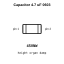
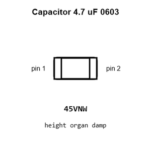
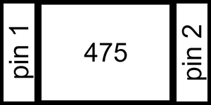
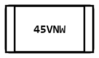
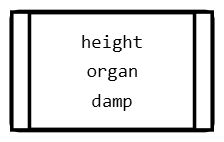
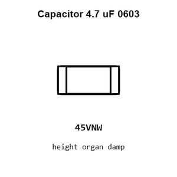
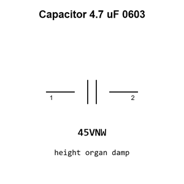

# Capacitor 4.7 uF 0603

`electronic_capacitor_0603_4_7_micro_farad`

Capacitor 4.7 uF 0603 is an OOMP electronic capacitor definition. It uses the 0603 package or form factor. Its nominal drawing size is 1.6 &#x00D7; 0.8 mm.

## At a glance

| Detail | Value |
| --- | --- |
| OOMP ID | `electronic_capacitor_0603_4_7_micro_farad` |
| Type | Capacitor |
| Package / style | 0603 |
| Nominal size | 1.6 &#x00D7; 0.8 mm |

## Classification

| Level | Value |
| --- | --- |
| 1 | `electronic` |
| 2 | `capacitor` |
| 3 | `0603` |
| 4 | `4_7_micro_farad` |

## Nominal dimensions

| Measurement | Value |
| --- | ---: |
| Length | 1.6 mm |
| Width | 0.8 mm |

## Identifiers

| Identifier | Value |
| --- | --- |
| Manufacturer part number | `CL10A475KA8NQNC` |
| LCSC | [`C69335`](https://www.lcsc.com/product-detail/C69335.html) |

## Used in projects

| Project | Quantity | References | Explore |
| --- | ---: | --- | --- |
| [Project soldered_electronics/Air-quality-sensor-MQ135-breakout-qwiic-hardware-design MQ135 Breakout qwiic current](https://github.com/SolderedElectronics/Air-quality-sensor-MQ135-breakout-qwiic-hardware-design) | 1 | C3 | [Board explorer](https://oomlout.github.io/oomp_electronic_version_5/parts/oomp_project_github_soldered_electronics_air_quality_sensor_mq135_breakout_qwiic_hardware_design_sensor_gas_mq135_qwiic_current/board_explorer.html) · [OOMP project](https://github.com/oomlout/oomp_electronic_version_5/tree/main/parts/oomp_project_github_soldered_electronics_air_quality_sensor_mq135_breakout_qwiic_hardware_design_sensor_gas_mq135_qwiic_current) |
| [Project soldered_electronics/Air-quality-sensor-MQ135-breakout-with-easyC-hardware-design MQ135 Breakout easyC current](https://github.com/SolderedElectronics/Air-quality-sensor-MQ135-breakout-with-easyC-hardware-design) | 1 | C3 | [Board explorer](https://oomlout.github.io/oomp_electronic_version_5/parts/oomp_project_github_soldered_electronics_air_quality_sensor_mq135_breakout_with_easy_c_hardware_design_sensor_gas_mq135_easyc_current/board_explorer.html) · [OOMP project](https://github.com/oomlout/oomp_electronic_version_5/tree/main/parts/oomp_project_github_soldered_electronics_air_quality_sensor_mq135_breakout_with_easy_c_hardware_design_sensor_gas_mq135_easyc_current) |
| [Project soldered_electronics/Alcohol--Ethanol-sensor-MQ3-breakout-qwiic-hardware-design MQ3 Breakout qwiic current](https://github.com/SolderedElectronics/Alcohol--Ethanol-sensor-MQ3-breakout-qwiic-hardware-design) | 1 | C3 | [Board explorer](https://oomlout.github.io/oomp_electronic_version_5/parts/oomp_project_github_soldered_electronics_alcohol_ethanol_sensor_mq3_breakout_qwiic_hardware_design_sensor_gas_mq3_qwiic_current/board_explorer.html) · [OOMP project](https://github.com/oomlout/oomp_electronic_version_5/tree/main/parts/oomp_project_github_soldered_electronics_alcohol_ethanol_sensor_mq3_breakout_qwiic_hardware_design_sensor_gas_mq3_qwiic_current) |
| [Project soldered_electronics/Alcohol--Ethanol-sensor-MQ3-breakout-with-easyC-hardware-design MQ3 Breakout easyC current](https://github.com/SolderedElectronics/Alcohol--Ethanol-sensor-MQ3-breakout-with-easyC-hardware-design) | 1 | C3 | [Board explorer](https://oomlout.github.io/oomp_electronic_version_5/parts/oomp_project_github_soldered_electronics_alcohol_ethanol_sensor_mq3_breakout_with_easy_c_hardware_design_sensor_gas_mq3_easyc_current/board_explorer.html) · [OOMP project](https://github.com/oomlout/oomp_electronic_version_5/tree/main/parts/oomp_project_github_soldered_electronics_alcohol_ethanol_sensor_mq3_breakout_with_easy_c_hardware_design_sensor_gas_mq3_easyc_current) |
| [Project soldered_electronics/Ammonia-sensor-MQ137-breakout-qwiic-hardware-design MQ137 Breakout qwiic current](https://github.com/SolderedElectronics/Ammonia-sensor-MQ137-breakout-qwiic-hardware-design) | 1 | C3 | [Board explorer](https://oomlout.github.io/oomp_electronic_version_5/parts/oomp_project_github_soldered_electronics_ammonia_sensor_mq137_breakout_qwiic_hardware_design_sensor_gas_mq137_qwiic_current/board_explorer.html) · [OOMP project](https://github.com/oomlout/oomp_electronic_version_5/tree/main/parts/oomp_project_github_soldered_electronics_ammonia_sensor_mq137_breakout_qwiic_hardware_design_sensor_gas_mq137_qwiic_current) |
| [Project soldered_electronics/Ammonia-sensor-MQ137-breakout-with-easyC-hardware-design MQ137 Breakout easyC current](https://github.com/SolderedElectronics/Ammonia-sensor-MQ137-breakout-with-easyC-hardware-design) | 1 | C3 | [Board explorer](https://oomlout.github.io/oomp_electronic_version_5/parts/oomp_project_github_soldered_electronics_ammonia_sensor_mq137_breakout_with_easy_c_hardware_design_sensor_gas_mq137_easyc_current/board_explorer.html) · [OOMP project](https://github.com/oomlout/oomp_electronic_version_5/tree/main/parts/oomp_project_github_soldered_electronics_ammonia_sensor_mq137_breakout_with_easy_c_hardware_design_sensor_gas_mq137_easyc_current) |
| [Project soldered_electronics/Benzene--Toluene--Acetone--Formaldehyde-sensor-MQ138-breakout-with-easyC-hardware-design MQ138 Breakout easyC current](https://github.com/SolderedElectronics/Benzene--Toluene--Acetone--Formaldehyde-sensor-MQ138-breakout-with-easyC-hardware-design) | 1 | C3 | [Board explorer](https://oomlout.github.io/oomp_electronic_version_5/parts/oomp_project_github_soldered_electronics_benzene_toluene_acetone_formaldehyde_sensor_mq138_breakout_with_easy_c_hardware_design_sensor_gas_mq138_easyc_current/board_explorer.html) · [OOMP project](https://github.com/oomlout/oomp_electronic_version_5/tree/main/parts/oomp_project_github_soldered_electronics_benzene_toluene_acetone_formaldehyde_sensor_mq138_breakout_with_easy_c_hardware_design_sensor_gas_mq138_easyc_current) |
| [Project soldered_electronics/Butane--LPG---Smoke-sensor-MQ2-breakout-qwiic-hardware-design MQ2 Breakout qwiic current](https://github.com/SolderedElectronics/Butane--LPG---Smoke-sensor-MQ2-breakout-qwiic-hardware-design) | 1 | C3 | [Board explorer](https://oomlout.github.io/oomp_electronic_version_5/parts/oomp_project_github_soldered_electronics_butane_lpg_smoke_sensor_mq2_breakout_qwiic_hardware_design_sensor_gas_mq2_qwiic_current/board_explorer.html) · [OOMP project](https://github.com/oomlout/oomp_electronic_version_5/tree/main/parts/oomp_project_github_soldered_electronics_butane_lpg_smoke_sensor_mq2_breakout_qwiic_hardware_design_sensor_gas_mq2_qwiic_current) |
| [Project soldered_electronics/Butane--LPG---Smoke-sensor-MQ2-breakout-with-easyC-hardware-design MQ2 Breakout easyC current](https://github.com/SolderedElectronics/Butane--LPG---Smoke-sensor-MQ2-breakout-qwiic-hardware-design) | 1 | C3 | [Board explorer](https://oomlout.github.io/oomp_electronic_version_5/parts/oomp_project_github_soldered_electronics_butane_lpg_smoke_sensor_mq2_breakout_with_easy_c_hardware_design_sensor_gas_mq2_easyc_current/board_explorer.html) · [OOMP project](https://github.com/oomlout/oomp_electronic_version_5/tree/main/parts/oomp_project_github_soldered_electronics_butane_lpg_smoke_sensor_mq2_breakout_with_easy_c_hardware_design_sensor_gas_mq2_easyc_current) |
| [Project soldered_electronics/CO--flammable-gasses-sensor-MQ9-breakout-qwiic-hardware-design MQ9 Breakout qwiic current](https://github.com/SolderedElectronics/CO--flammable-gasses-sensor-MQ9-breakout-qwiic-hardware-design) | 1 | C3 | [Board explorer](https://oomlout.github.io/oomp_electronic_version_5/parts/oomp_project_github_soldered_electronics_co_flammable_gasses_sensor_mq9_breakout_qwiic_hardware_design_sensor_gas_mq9_qwiic_current/board_explorer.html) · [OOMP project](https://github.com/oomlout/oomp_electronic_version_5/tree/main/parts/oomp_project_github_soldered_electronics_co_flammable_gasses_sensor_mq9_breakout_qwiic_hardware_design_sensor_gas_mq9_qwiic_current) |
| [Project soldered_electronics/CO--flammable-gasses-sensor-MQ9-breakout-with-easyC-hardware-design MQ9 Breakout easyC current](https://github.com/SolderedElectronics/CO--flammable-gasses-sensor-MQ9-breakout-with-easyC-hardware-design) | 1 | C3 | [Board explorer](https://oomlout.github.io/oomp_electronic_version_5/parts/oomp_project_github_soldered_electronics_co_flammable_gasses_sensor_mq9_breakout_with_easy_c_hardware_design_sensor_gas_mq9_easyc_current/board_explorer.html) · [OOMP project](https://github.com/oomlout/oomp_electronic_version_5/tree/main/parts/oomp_project_github_soldered_electronics_co_flammable_gasses_sensor_mq9_breakout_with_easy_c_hardware_design_sensor_gas_mq9_easyc_current) |
| [Project soldered_electronics/CO-sensor-MQ7-breakout-qwiic-hardware-design MQ7 Breakout qwiic current](https://github.com/SolderedElectronics/CO-sensor-MQ7-breakout-qwiic-hardware-design) | 1 | C3 | [Board explorer](https://oomlout.github.io/oomp_electronic_version_5/parts/oomp_project_github_soldered_electronics_co_sensor_mq7_breakout_qwiic_hardware_design_sensor_gas_mq7_qwiic_current/board_explorer.html) · [OOMP project](https://github.com/oomlout/oomp_electronic_version_5/tree/main/parts/oomp_project_github_soldered_electronics_co_sensor_mq7_breakout_qwiic_hardware_design_sensor_gas_mq7_qwiic_current) |
| [Project soldered_electronics/CO-sensor-MQ7-breakout-with-easyC-hardware-design MQ7 Breakout easyC current](https://github.com/SolderedElectronics/CO-sensor-MQ7-breakout-with-easyC-hardware-design) | 1 | C3 | [Board explorer](https://oomlout.github.io/oomp_electronic_version_5/parts/oomp_project_github_soldered_electronics_co_sensor_mq7_breakout_with_easy_c_hardware_design_sensor_gas_mq7_easyc_current/board_explorer.html) · [OOMP project](https://github.com/oomlout/oomp_electronic_version_5/tree/main/parts/oomp_project_github_soldered_electronics_co_sensor_mq7_breakout_with_easy_c_hardware_design_sensor_gas_mq7_easyc_current) |
| [Project soldered_electronics/Digital-light---proximity-sensor-LTR-507ALS-breakout-hardware-design LTR-507ALS Breakout current](https://github.com/SolderedElectronics/Digital-light---proximity-sensor-LTR-507ALS-breakout-hardware-design) | 1 | C1 | [Board explorer](https://oomlout.github.io/oomp_electronic_version_5/parts/oomp_project_github_soldered_electronics_digital_light_proximity_sensor_ltr_507_als_breakout_hardware_design_sensor_light_ltr507als_current/board_explorer.html) · [OOMP project](https://github.com/oomlout/oomp_electronic_version_5/tree/main/parts/oomp_project_github_soldered_electronics_digital_light_proximity_sensor_ltr_507_als_breakout_hardware_design_sensor_light_ltr507als_current) |
| [Project soldered_electronics/Hydrogen-sensor-MQ8-breakout-qwiic-hardware-design MQ8 Breakout qwiic current](https://github.com/SolderedElectronics/Hydrogen-sensor-MQ8-breakout-qwiic-hardware-design) | 1 | C3 | [Board explorer](https://oomlout.github.io/oomp_electronic_version_5/parts/oomp_project_github_soldered_electronics_hydrogen_sensor_mq8_breakout_qwiic_hardware_design_sensor_gas_mq8_qwiic_current/board_explorer.html) · [OOMP project](https://github.com/oomlout/oomp_electronic_version_5/tree/main/parts/oomp_project_github_soldered_electronics_hydrogen_sensor_mq8_breakout_qwiic_hardware_design_sensor_gas_mq8_qwiic_current) |
| [Project soldered_electronics/Hydrogen-sensor-MQ8-breakout-with-easyC-hardware-design MQ8 Breakout easyC current](https://github.com/SolderedElectronics/Hydrogen-sensor-MQ8-breakout-with-easyC-hardware-design) | 1 | C3 | [Board explorer](https://oomlout.github.io/oomp_electronic_version_5/parts/oomp_project_github_soldered_electronics_hydrogen_sensor_mq8_breakout_with_easy_c_hardware_design_sensor_gas_mq8_easyc_current/board_explorer.html) · [OOMP project](https://github.com/oomlout/oomp_electronic_version_5/tree/main/parts/oomp_project_github_soldered_electronics_hydrogen_sensor_mq8_breakout_with_easy_c_hardware_design_sensor_gas_mq8_easyc_current) |
| [Project soldered_electronics/Hydrogen-Sulfide-sensor-MQ136-breakout-with-easyC-hardware-design MQ136 Breakout easyC current](https://github.com/SolderedElectronics/Hydrogen-Sulfide-sensor-MQ136-breakout-with-easyC-hardware-design) | 1 | C3 | [Board explorer](https://oomlout.github.io/oomp_electronic_version_5/parts/oomp_project_github_soldered_electronics_hydrogen_sulfide_sensor_mq136_breakout_with_easy_c_hardware_design_sensor_gas_mq136_easyc_current/board_explorer.html) · [OOMP project](https://github.com/oomlout/oomp_electronic_version_5/tree/main/parts/oomp_project_github_soldered_electronics_hydrogen_sulfide_sensor_mq136_breakout_with_easy_c_hardware_design_sensor_gas_mq136_easyc_current) |
| [Project soldered_electronics/LPG--Butane-sensor-MQ6-breakout-qwiic-hardware-design MQ6 Breakout qwiic current](https://github.com/SolderedElectronics/LPG--Butane-sensor-MQ6-breakout-qwiic-hardware-design) | 1 | C3 | [Board explorer](https://oomlout.github.io/oomp_electronic_version_5/parts/oomp_project_github_soldered_electronics_lpg_butane_sensor_mq6_breakout_qwiic_hardware_design_sensor_gas_mq6_qwiic_current/board_explorer.html) · [OOMP project](https://github.com/oomlout/oomp_electronic_version_5/tree/main/parts/oomp_project_github_soldered_electronics_lpg_butane_sensor_mq6_breakout_qwiic_hardware_design_sensor_gas_mq6_qwiic_current) |
| [Project soldered_electronics/LPG--Butane-sensor-MQ6-breakout-with-easyC-hardware-design MQ6 Breakout easyC current](https://github.com/SolderedElectronics/LPG--Butane-sensor-MQ6-breakout-with-easyC-hardware-design) | 1 | C3 | [Board explorer](https://oomlout.github.io/oomp_electronic_version_5/parts/oomp_project_github_soldered_electronics_lpg_butane_sensor_mq6_breakout_with_easy_c_hardware_design_sensor_gas_mq6_easyc_current/board_explorer.html) · [OOMP project](https://github.com/oomlout/oomp_electronic_version_5/tree/main/parts/oomp_project_github_soldered_electronics_lpg_butane_sensor_mq6_breakout_with_easy_c_hardware_design_sensor_gas_mq6_easyc_current) |
| [Project soldered_electronics/Methane--CNG-sensor-MQ4-breakout-qwiic-hardware-design MQ4 Breakout qwiic current](https://github.com/SolderedElectronics/Methane--CNG-sensor-MQ4-breakout-qwiic-hardware-design) | 1 | C3 | [Board explorer](https://oomlout.github.io/oomp_electronic_version_5/parts/oomp_project_github_soldered_electronics_methane_cng_sensor_mq4_breakout_qwiic_hardware_design_sensor_gas_mq4_qwiic_current/board_explorer.html) · [OOMP project](https://github.com/oomlout/oomp_electronic_version_5/tree/main/parts/oomp_project_github_soldered_electronics_methane_cng_sensor_mq4_breakout_qwiic_hardware_design_sensor_gas_mq4_qwiic_current) |
| [Project soldered_electronics/Methane--CNG-sensor-MQ4-breakout-with-easyC-hardware-design MQ4 Breakout easyC current](https://github.com/SolderedElectronics/Methane--CNG-sensor-MQ4-breakout-with-easyC-hardware-design) | 1 | C3 | [Board explorer](https://oomlout.github.io/oomp_electronic_version_5/parts/oomp_project_github_soldered_electronics_methane_cng_sensor_mq4_breakout_with_easy_c_hardware_design_sensor_gas_mq4_easyc_current/board_explorer.html) · [OOMP project](https://github.com/oomlout/oomp_electronic_version_5/tree/main/parts/oomp_project_github_soldered_electronics_methane_cng_sensor_mq4_breakout_with_easy_c_hardware_design_sensor_gas_mq4_easyc_current) |
| [Project soldered_electronics/Methane--Natural-gas-sensor-MQ214-breakout-with-easyC-hardware-design MQ214 Breakout easyC current](https://github.com/SolderedElectronics/Methane--Natural-gas-sensor-MQ214-breakout-with-easyC-hardware-design) | 1 | C3 | [Board explorer](https://oomlout.github.io/oomp_electronic_version_5/parts/oomp_project_github_soldered_electronics_methane_natural_gas_sensor_mq214_breakout_with_easy_c_hardware_design_sensor_gas_mq214_easyc_current/board_explorer.html) · [OOMP project](https://github.com/oomlout/oomp_electronic_version_5/tree/main/parts/oomp_project_github_soldered_electronics_methane_natural_gas_sensor_mq214_breakout_with_easy_c_hardware_design_sensor_gas_mq214_easyc_current) |
| [Project soldered_electronics/Natural-gas--LPG-sensor-MQ5-breakout-qwiic-hardware-design MQ5 Breakout qwiic current](https://github.com/SolderedElectronics/Natural-gas--LPG-sensor-MQ5-breakout-qwiic-hardware-design) | 1 | C3 | [Board explorer](https://oomlout.github.io/oomp_electronic_version_5/parts/oomp_project_github_soldered_electronics_natural_gas_lpg_sensor_mq5_breakout_qwiic_hardware_design_sensor_gas_mq5_qwiic_current/board_explorer.html) · [OOMP project](https://github.com/oomlout/oomp_electronic_version_5/tree/main/parts/oomp_project_github_soldered_electronics_natural_gas_lpg_sensor_mq5_breakout_qwiic_hardware_design_sensor_gas_mq5_qwiic_current) |
| [Project soldered_electronics/Natural-gas--LPG-sensor-MQ5-breakout-with-easyC-hardware-design MQ5 Breakout easyC current](https://github.com/SolderedElectronics/Natural-gas--LPG-sensor-MQ5-breakout-with-easyC-hardware-design) | 1 | C3 | [Board explorer](https://oomlout.github.io/oomp_electronic_version_5/parts/oomp_project_github_soldered_electronics_natural_gas_lpg_sensor_mq5_breakout_with_easy_c_hardware_design_sensor_gas_mq5_easyc_current/board_explorer.html) · [OOMP project](https://github.com/oomlout/oomp_electronic_version_5/tree/main/parts/oomp_project_github_soldered_electronics_natural_gas_lpg_sensor_mq5_breakout_with_easy_c_hardware_design_sensor_gas_mq5_easyc_current) |
| [Project soldered_electronics/Ozone-sensor-MQ131-breakout-qwiic-hardware-design MQ131 Breakout qwiic current](https://github.com/SolderedElectronics/Ozone-sensor-MQ131-breakout-qwiic-hardware-design) | 1 | C3 | [Board explorer](https://oomlout.github.io/oomp_electronic_version_5/parts/oomp_project_github_soldered_electronics_ozone_sensor_mq131_breakout_qwiic_hardware_design_sensor_gas_mq131_qwiic_current/board_explorer.html) · [OOMP project](https://github.com/oomlout/oomp_electronic_version_5/tree/main/parts/oomp_project_github_soldered_electronics_ozone_sensor_mq131_breakout_qwiic_hardware_design_sensor_gas_mq131_qwiic_current) |
| [Project soldered_electronics/Ozone-sensor-MQ131-breakout-with-easyC-hardware-design MQ131 Breakout easyC current](https://github.com/SolderedElectronics/Ozone-sensor-MQ131-breakout-with-easyC-hardware-design) | 1 | C3 | [Board explorer](https://oomlout.github.io/oomp_electronic_version_5/parts/oomp_project_github_soldered_electronics_ozone_sensor_mq131_breakout_with_easy_c_hardware_design_sensor_gas_mq131_easyc_current/board_explorer.html) · [OOMP project](https://github.com/oomlout/oomp_electronic_version_5/tree/main/parts/oomp_project_github_soldered_electronics_ozone_sensor_mq131_breakout_with_easy_c_hardware_design_sensor_gas_mq131_easyc_current) |
| [Project soldered_electronics/PMS7003-sensor-adapter-hardware-design PMS7003 Adapter current](https://github.com/SolderedElectronics/PMS7003-sensor-adapter-hardware-design) | 1 | C3 | [Board explorer](https://oomlout.github.io/oomp_electronic_version_5/parts/oomp_project_github_soldered_electronics_pms7003_sensor_adapter_hardware_design_sensor_pms7003_adapter_current/board_explorer.html) · [OOMP project](https://github.com/oomlout/oomp_electronic_version_5/tree/main/parts/oomp_project_github_soldered_electronics_pms7003_sensor_adapter_hardware_design_sensor_pms7003_adapter_current) |
| [Project soldered_electronics/Ultrasonic-sensor-qwiic-hardware-design Ultrasonic Sensor qwiic current](https://github.com/SolderedElectronics/Ultrasonic-sensor-qwiic-hardware-design) | 1 | C4 | [Board explorer](https://oomlout.github.io/oomp_electronic_version_5/parts/oomp_project_github_soldered_electronics_ultrasonic_sensor_qwiic_hardware_design_sensor_ultrasonic_qwiic_current/board_explorer.html) · [OOMP project](https://github.com/oomlout/oomp_electronic_version_5/tree/main/parts/oomp_project_github_soldered_electronics_ultrasonic_sensor_qwiic_hardware_design_sensor_ultrasonic_qwiic_current) |
| [Project soldered_electronics/Ultrasonic-sensor-with-easyC-hardware-design Ultrasonic Sensor easyC current](https://github.com/SolderedElectronics/Ultrasonic-sensor-with-easyC-hardware-design) | 1 | C4 | [Board explorer](https://oomlout.github.io/oomp_electronic_version_5/parts/oomp_project_github_soldered_electronics_ultrasonic_sensor_with_easy_c_hardware_design_sensor_ultrasonic_easyc_current/board_explorer.html) · [OOMP project](https://github.com/oomlout/oomp_electronic_version_5/tree/main/parts/oomp_project_github_soldered_electronics_ultrasonic_sensor_with_easy_c_hardware_design_sensor_ultrasonic_easyc_current) |
| [Project sparkfun/9DOF_Razor_IMU sparkfun 9dof razor imu current](https://github.com/sparkfun/9DOF_Razor_IMU/blob/master/Hardware/sparkfun-9dof-razor-imu.brd) | 2 | C3, C4 | [Board explorer](https://oomlout.github.io/oomp_electronic_version_5/parts/oomp_project_github_sparkfun_9_dof_razor_imu_sparkfun_9dof_razor_imu_current/board_explorer.html) · [OOMP project](https://github.com/oomlout/oomp_electronic_version_5/tree/main/parts/oomp_project_github_sparkfun_9_dof_razor_imu_sparkfun_9dof_razor_imu_current) |
| [Project sparkfun/Blynk_Board_ESP8266 Spark Fun Blynk Board ESP8266 current](https://github.com/sparkfun/Blynk_Board_ESP8266/blob/master/Hardware/SparkFun-Blynk-Board-ESP8266.brd) | 3 | C6, C15, C19 | [Board explorer](https://oomlout.github.io/oomp_electronic_version_5/parts/oomp_project_github_sparkfun_blynk_board_esp8266_spark_fun_blynk_board_esp8266_current/board_explorer.html) · [OOMP project](https://github.com/oomlout/oomp_electronic_version_5/tree/main/parts/oomp_project_github_sparkfun_blynk_board_esp8266_spark_fun_blynk_board_esp8266_current) |
| [Project sparkfun/CAN-Bus_Shield Spark Fun CAN Bus Shield current](https://github.com/sparkfun/CAN-Bus_Shield/blob/master/Hardware/SparkFun_CAN-Bus_Shield.brd) | 1 | C4 | [Board explorer](https://oomlout.github.io/oomp_electronic_version_5/parts/oomp_project_github_sparkfun_can_bus_shield_spark_fun_can_bus_shield_current/board_explorer.html) · [OOMP project](https://github.com/oomlout/oomp_electronic_version_5/tree/main/parts/oomp_project_github_sparkfun_can_bus_shield_spark_fun_can_bus_shield_current) |
| [Project sparkfun/Digital_Sandbox Digital Sandbox current](https://github.com/sparkfun/Digital_Sandbox/blob/master/Hardware/DigitalSandbox.brd) | 2 | C2, C5 | [Board explorer](https://oomlout.github.io/oomp_electronic_version_5/parts/oomp_project_github_sparkfun_digital_sandbox_digital_sandbox_current/board_explorer.html) · [OOMP project](https://github.com/oomlout/oomp_electronic_version_5/tree/main/parts/oomp_project_github_sparkfun_digital_sandbox_digital_sandbox_current) |
| [Project sparkfun/ESP32_Thing esp32 thing current](https://github.com/sparkfun/ESP32_Thing/blob/master/Hardware/esp32-thing.brd) | 3 | C6, C15, C19 | [Board explorer](https://oomlout.github.io/oomp_electronic_version_5/parts/oomp_project_github_sparkfun_esp32_thing_esp32_thing_current/board_explorer.html) · [OOMP project](https://github.com/oomlout/oomp_electronic_version_5/tree/main/parts/oomp_project_github_sparkfun_esp32_thing_esp32_thing_current) |
| [Project sparkfun/ESP32_Thing_Plus ESP32 Thing Plus current](https://github.com/sparkfun/ESP32_Thing_Plus/blob/master/Hardware/ESP32_Thing_Plus.brd) | 2 | C6, C19 | [Board explorer](https://oomlout.github.io/oomp_electronic_version_5/parts/oomp_project_github_sparkfun_esp32_thing_plus_esp32_thing_plus_current/board_explorer.html) · [OOMP project](https://github.com/oomlout/oomp_electronic_version_5/tree/main/parts/oomp_project_github_sparkfun_esp32_thing_plus_esp32_thing_plus_current) |
| [Project sparkfun/ESP8266_Thing Spark Fun ESP8266 Thinga current](https://github.com/sparkfun/ESP8266_Thing/blob/master/Hardware/SparkFun_ESP8266_Thing_V10a.brd) | 1 | C5 | [Board explorer](https://oomlout.github.io/oomp_electronic_version_5/parts/oomp_project_github_sparkfun_esp8266_thing_spark_fun_esp8266_thinga_current/board_explorer.html) · [OOMP project](https://github.com/oomlout/oomp_electronic_version_5/tree/main/parts/oomp_project_github_sparkfun_esp8266_thing_spark_fun_esp8266_thinga_current) |
| [Project sparkfun/LCD_TFT_Breakout_1in8_128x160 LCD TFT Breakout 1in8 128x160 current](https://github.com/sparkfun/LCD_TFT_Breakout_1in8_128x160/blob/master/Hardware/LCD_TFT_Breakout_1in8_128x160.brd) | 1 | C3 | [Board explorer](https://oomlout.github.io/oomp_electronic_version_5/parts/oomp_project_github_sparkfun_lcd_tft_breakout_1in8_128x160_lcd_tft_breakout_1in8_128x160_current/board_explorer.html) · [OOMP project](https://github.com/oomlout/oomp_electronic_version_5/tree/main/parts/oomp_project_github_sparkfun_lcd_tft_breakout_1in8_128x160_lcd_tft_breakout_1in8_128x160_current) |
| [Project sparkfun/LilyPad_Arduino_USB Lilypad Arduino USB current](https://github.com/sparkfun/LilyPad_Arduino_USB/blob/master/Hardware/Lilypad_Arduino_USB.brd) | 1 | C6 | [Board explorer](https://oomlout.github.io/oomp_electronic_version_5/parts/oomp_project_github_sparkfun_lily_pad_arduino_usb_lilypad_arduino_usb_current/board_explorer.html) · [OOMP project](https://github.com/oomlout/oomp_electronic_version_5/tree/main/parts/oomp_project_github_sparkfun_lily_pad_arduino_usb_lilypad_arduino_usb_current) |
| [Project sparkfun/Logomatic Logomatic current](https://github.com/sparkfun/Logomatic/blob/master/Hardware/Logomatic.brd) | 2 | C5, C17 | [Board explorer](https://oomlout.github.io/oomp_electronic_version_5/parts/oomp_project_github_sparkfun_logomatic_logomatic_current/board_explorer.html) · [OOMP project](https://github.com/oomlout/oomp_electronic_version_5/tree/main/parts/oomp_project_github_sparkfun_logomatic_logomatic_current) |
| [Project sparkfun/LTC4150_Coulomb_Counter_BOB LTC4150 BOB current](https://github.com/sparkfun/LTC4150_Coulomb_Counter_BOB/blob/master/Hardware/LTC4150_BOB.brd) | 2 | C1, C2 | [Board explorer](https://oomlout.github.io/oomp_electronic_version_5/parts/oomp_project_github_sparkfun_ltc4150_coulomb_counter_bob_ltc4150_bob_current/board_explorer.html) · [OOMP project](https://github.com/oomlout/oomp_electronic_version_5/tree/main/parts/oomp_project_github_sparkfun_ltc4150_coulomb_counter_bob_ltc4150_bob_current) |
| [Project sparkfun/LTE_Cat_M1_Shield lte cat m1 shield sara r4 current](https://github.com/sparkfun/LTE_Cat_M1_Shield/blob/main/Hardware/lte_cat_m1_shield_sara-r4.brd) | 3 | C5, C6, C7 | [Board explorer](https://oomlout.github.io/oomp_electronic_version_5/parts/oomp_project_github_sparkfun_lte_cat_m1_shield_lte_cat_m1_shield_sara_r4_current/board_explorer.html) · [OOMP project](https://github.com/oomlout/oomp_electronic_version_5/tree/main/parts/oomp_project_github_sparkfun_lte_cat_m1_shield_lte_cat_m1_shield_sara_r4_current) |
| [Project sparkfun/LumiDrive Lumi Drive current](https://github.com/sparkfun/LumiDrive/blob/master/HARDWARE/LumiDrive.brd) | 2 | C1, C3 | [Board explorer](https://oomlout.github.io/oomp_electronic_version_5/parts/oomp_project_github_sparkfun_lumi_drive_lumi_drive_current/board_explorer.html) · [OOMP project](https://github.com/oomlout/oomp_electronic_version_5/tree/main/parts/oomp_project_github_sparkfun_lumi_drive_lumi_drive_current) |
| [Project sparkfun/MAX30105_Particle_Sensor_Breakout MAX30105 Breakout current](https://github.com/sparkfun/MAX30105_Particle_Sensor_Breakout/blob/master/Hardware/MAX30105_Breakout.brd) | 1 | C4 | [Board explorer](https://oomlout.github.io/oomp_electronic_version_5/parts/oomp_project_github_sparkfun_max30105_particle_sensor_breakout_max30105_breakout_current/board_explorer.html) · [OOMP project](https://github.com/oomlout/oomp_electronic_version_5/tree/main/parts/oomp_project_github_sparkfun_max30105_particle_sensor_breakout_max30105_breakout_current) |
| [Project sparkfun/MicroMod_Data_Logging_Carrier Micro Mod Datalogging Carrier Board current](https://github.com/sparkfun/MicroMod_Data_Logging_Carrier/blob/master/Hardware/MicroMod-Datalogging-CarrierBoard.brd) | 2 | C3, C4 | [Board explorer](https://oomlout.github.io/oomp_electronic_version_5/parts/oomp_project_github_sparkfun_micro_mod_data_logging_carrier_micro_mod_datalogging_carrier_board_current/board_explorer.html) · [OOMP project](https://github.com/oomlout/oomp_electronic_version_5/tree/main/parts/oomp_project_github_sparkfun_micro_mod_data_logging_carrier_micro_mod_datalogging_carrier_board_current) |
| [Project sparkfun/MicroMod_Function_Ethernet-W5500 Micro Mod Ethernet Function Board W5500 current](https://github.com/sparkfun/MicroMod_Function_Ethernet-W5500/blob/main/Hardware/MicroMod-Ethernet-Function-Board-W5500.brd) | 1 | C18 | [Board explorer](https://oomlout.github.io/oomp_electronic_version_5/parts/oomp_project_github_sparkfun_micro_mod_function_ethernet_w5500_micro_mod_ethernet_function_board_w5500_current/board_explorer.html) · [OOMP project](https://github.com/oomlout/oomp_electronic_version_5/tree/main/parts/oomp_project_github_sparkfun_micro_mod_function_ethernet_w5500_micro_mod_ethernet_function_board_w5500_current) |
| [Project sparkfun/nRF52832_Breakout sparkfun nrf52832 breakout current](https://github.com/sparkfun/nRF52832_Breakout/blob/main/Hardware/sparkfun-nrf52832-breakout.brd) | 1 | C17 | [Board explorer](https://oomlout.github.io/oomp_electronic_version_5/parts/oomp_project_github_sparkfun_n_rf52832_breakout_sparkfun_nrf52832_breakout_current/board_explorer.html) · [OOMP project](https://github.com/oomlout/oomp_electronic_version_5/tree/main/parts/oomp_project_github_sparkfun_n_rf52832_breakout_sparkfun_nrf52832_breakout_current) |
| [Project sparkfun/nRF52840_Breakout_MDBT50Q nrf52840 breakout mdbt50q current](https://github.com/sparkfun/nRF52840_Breakout_MDBT50Q/blob/master/Hardware/nrf52840-breakout-mdbt50q.brd) | 2 | C5, C6 | [Board explorer](https://oomlout.github.io/oomp_electronic_version_5/parts/oomp_project_github_sparkfun_n_rf52840_breakout_mdbt50_q_nrf52840_breakout_mdbt50q_current/board_explorer.html) · [OOMP project](https://github.com/oomlout/oomp_electronic_version_5/tree/main/parts/oomp_project_github_sparkfun_n_rf52840_breakout_mdbt50_q_nrf52840_breakout_mdbt50q_current) |
| [Project sparkfun/Photon_Battery_Shield Photon Battery Shield current](https://github.com/sparkfun/Photon_Battery_Shield/blob/master/Hardware/Photon%20Battery%20Shield.brd) | 2 | C1, C3 | [Board explorer](https://oomlout.github.io/oomp_electronic_version_5/parts/oomp_project_github_sparkfun_photon_battery_shield_photon_battery_shield_current/board_explorer.html) · [OOMP project](https://github.com/oomlout/oomp_electronic_version_5/tree/main/parts/oomp_project_github_sparkfun_photon_battery_shield_photon_battery_shield_current) |
| [Project sparkfun/Purpletooth_Jamboree Purpletooth Jamboree current](https://github.com/sparkfun/Purpletooth_Jamboree/blob/master/Hardware/Purpletooth_Jamboree.brd) | 1 | C4 | [Board explorer](https://oomlout.github.io/oomp_electronic_version_5/parts/oomp_project_github_sparkfun_purpletooth_jamboree_purpletooth_jamboree_current/board_explorer.html) · [OOMP project](https://github.com/oomlout/oomp_electronic_version_5/tree/main/parts/oomp_project_github_sparkfun_purpletooth_jamboree_purpletooth_jamboree_current) |
| [Project sparkfun/Qwiic_Alphanumeric_Display_Breakout Qwiic Alphanumeric Display current](https://github.com/sparkfun/Qwiic_Alphanumeric_Display_Breakout/blob/main/Hardware/Qwiic_Alphanumeric_Display.brd) | 1 | C3 | [Board explorer](https://oomlout.github.io/oomp_electronic_version_5/parts/oomp_project_github_sparkfun_qwiic_alphanumeric_display_breakout_qwiic_alphanumeric_display_current/board_explorer.html) · [OOMP project](https://github.com/oomlout/oomp_electronic_version_5/tree/main/parts/oomp_project_github_sparkfun_qwiic_alphanumeric_display_breakout_qwiic_alphanumeric_display_current) |
| [Project sparkfun/Qwiic_Haptic_Driver_DA7280 Qwiic Haptic Driver DA7280 current](https://github.com/sparkfun/Qwiic_Haptic_Driver_DA7280/blob/main/Hardware/Qwiic_Haptic_Driver_DA7280.brd) | 1 | C2 | [Board explorer](https://oomlout.github.io/oomp_electronic_version_5/parts/oomp_project_github_sparkfun_qwiic_haptic_driver_da7280_qwiic_haptic_driver_da7280_current/board_explorer.html) · [OOMP project](https://github.com/oomlout/oomp_electronic_version_5/tree/main/parts/oomp_project_github_sparkfun_qwiic_haptic_driver_da7280_qwiic_haptic_driver_da7280_current) |
| [Project sparkfun/Qwiic_Transparent_Graphical_OLED Spark Fun Transparent Graphical OLED Breakout current](https://github.com/sparkfun/Qwiic_Transparent_Graphical_OLED/blob/master/Hardware/SparkFun_Transparent_Graphical_OLED_Breakout.brd) | 4 | C1, C4, C6, C7 | [Board explorer](https://oomlout.github.io/oomp_electronic_version_5/parts/oomp_project_github_sparkfun_qwiic_transparent_graphical_oled_spark_fun_transparent_graphical_oled_breakout_current/board_explorer.html) · [OOMP project](https://github.com/oomlout/oomp_electronic_version_5/tree/main/parts/oomp_project_github_sparkfun_qwiic_transparent_graphical_oled_spark_fun_transparent_graphical_oled_breakout_current) |
| [Project sparkfun/RedBoard_Artemis_Nano Red Board Artemis Nano current](https://github.com/sparkfun/RedBoard_Artemis_Nano/blob/master/Hardware/RedBoard-Artemis-Nano.brd) | 2 | C5, C6 | [Board explorer](https://oomlout.github.io/oomp_electronic_version_5/parts/oomp_project_github_sparkfun_red_board_artemis_nano_red_board_artemis_nano_current/board_explorer.html) · [OOMP project](https://github.com/oomlout/oomp_electronic_version_5/tree/main/parts/oomp_project_github_sparkfun_red_board_artemis_nano_red_board_artemis_nano_current) |
| [Project sparkfun/SAMD21_Dev_Breakout sparkfun samd21 pro breakout current](https://github.com/sparkfun/SAMD21_Dev_Breakout/blob/master/Hardware/sparkfun-samd21-pro-breakout.brd) | 2 | C2, C4 | [Board explorer](https://oomlout.github.io/oomp_electronic_version_5/parts/oomp_project_github_sparkfun_samd21_dev_breakout_sparkfun_samd21_pro_breakout_current/board_explorer.html) · [OOMP project](https://github.com/oomlout/oomp_electronic_version_5/tree/main/parts/oomp_project_github_sparkfun_samd21_dev_breakout_sparkfun_samd21_pro_breakout_current) |
| [Project sparkfun/SAMD51_Thing_Plus SAMD51 Thing Plus current](https://github.com/sparkfun/SAMD51_Thing_Plus/blob/master/Hardware/SAMD51_Thing_Plus.brd) | 3 | C6, C13, C19 | [Board explorer](https://oomlout.github.io/oomp_electronic_version_5/parts/oomp_project_github_sparkfun_samd51_thing_plus_samd51_thing_plus_current/board_explorer.html) · [OOMP project](https://github.com/oomlout/oomp_electronic_version_5/tree/main/parts/oomp_project_github_sparkfun_samd51_thing_plus_samd51_thing_plus_current) |
| [Project sparkfun/SparkFun_Artemis_Global_Tracker Spark Fun Artemis Global Tracker current](https://github.com/sparkfun/SparkFun_Artemis_Global_Tracker/blob/main/Hardware/SparkFun_Artemis_Global_Tracker.brd) | 3 | C8, C11, C17 | [Board explorer](https://oomlout.github.io/oomp_electronic_version_5/parts/oomp_project_github_sparkfun_spark_fun_artemis_global_tracker_spark_fun_artemis_global_tracker_current/board_explorer.html) · [OOMP project](https://github.com/oomlout/oomp_electronic_version_5/tree/main/parts/oomp_project_github_sparkfun_spark_fun_artemis_global_tracker_spark_fun_artemis_global_tracker_current) |
| [Project sparkfun/SparkFun_Audio_Codec_Breakout_WM8960 Stereo Audio Codec Breakout WM8960 current](https://github.com/sparkfun/SparkFun_Audio_Codec_Breakout_WM8960/blob/main/Hardware/Stereo_Audio_Codec_Breakout_WM8960.brd) | 2 | C6, C7 | [Board explorer](https://oomlout.github.io/oomp_electronic_version_5/parts/oomp_project_github_sparkfun_spark_fun_audio_codec_breakout_wm8960_stereo_audio_codec_breakout_wm8960_current/board_explorer.html) · [OOMP project](https://github.com/oomlout/oomp_electronic_version_5/tree/main/parts/oomp_project_github_sparkfun_spark_fun_audio_codec_breakout_wm8960_stereo_audio_codec_breakout_wm8960_current) |
| [Project sparkfun/SparkFun_Digi_XBee_Development_Board Spark Fun Digi XBee Development Board current](https://github.com/sparkfun/SparkFun_Digi_XBee_Development_Board/blob/main/Hardware/SparkFun_Digi_XBee_Development_Board.brd) | 2 | C8, C15 | [Board explorer](https://oomlout.github.io/oomp_electronic_version_5/parts/oomp_project_github_sparkfun_spark_fun_digi_xbee_development_board_spark_fun_digi_xbee_development_board_current/board_explorer.html) · [OOMP project](https://github.com/oomlout/oomp_electronic_version_5/tree/main/parts/oomp_project_github_sparkfun_spark_fun_digi_xbee_development_board_spark_fun_digi_xbee_development_board_current) |
| [Project sparkfun/SparkFun_Digi_XBee_Explorer_USB-C Spark Fun Digi XBee Explorer USB C current](https://github.com/sparkfun/SparkFun_Digi_XBee_Explorer_USB-C/blob/main/Hardware/SparkFun_Digi_XBee_Explorer_USB-C.brd) | 1 | C12 | [Board explorer](https://oomlout.github.io/oomp_electronic_version_5/parts/oomp_project_github_sparkfun_spark_fun_digi_xbee_explorer_usb_c_spark_fun_digi_xbee_explorer_usb_c_current/board_explorer.html) · [OOMP project](https://github.com/oomlout/oomp_electronic_version_5/tree/main/parts/oomp_project_github_sparkfun_spark_fun_digi_xbee_explorer_usb_c_spark_fun_digi_xbee_explorer_usb_c_current) |
| [Project sparkfun/SparkFun_ESP32_Thing_Plus_DMX_to_LED_Shield Spark Fun ESP32 Thing Plus DMX to LED Shield current](https://github.com/sparkfun/SparkFun_ESP32_Thing_Plus_DMX_to_LED_Shield/blob/master/Hardware/SparkFun%20ESP32%20Thing%20Plus%20DMX%20to%20LED%20Shield.brd) | 1 | C1 | [Board explorer](https://oomlout.github.io/oomp_electronic_version_5/parts/oomp_project_github_sparkfun_spark_fun_esp32_thing_plus_dmx_to_led_shield_spark_fun_esp32_thing_plus_dmx_to_led_shield_current/board_explorer.html) · [OOMP project](https://github.com/oomlout/oomp_electronic_version_5/tree/main/parts/oomp_project_github_sparkfun_spark_fun_esp32_thing_plus_dmx_to_led_shield_spark_fun_esp32_thing_plus_dmx_to_led_shield_current) |
| [Project sparkfun/SparkFun_LTE_GNSS_Breakout_SARA-R510M8S Spark Fun LTE GNSS Breakout SARA R510 M8 S current](https://github.com/sparkfun/SparkFun_LTE_GNSS_Breakout_SARA-R510M8S/blob/main/Hardware/SparkFun_LTE_GNSS_Breakout_SARA-R510M8S.brd) | 1 | C3 | [Board explorer](https://oomlout.github.io/oomp_electronic_version_5/parts/oomp_project_github_sparkfun_spark_fun_lte_gnss_breakout_sara_r510_m8_s_spark_fun_lte_gnss_breakout_sara_r510_m8_s_current/board_explorer.html) · [OOMP project](https://github.com/oomlout/oomp_electronic_version_5/tree/main/parts/oomp_project_github_sparkfun_spark_fun_lte_gnss_breakout_sara_r510_m8_s_spark_fun_lte_gnss_breakout_sara_r510_m8_s_current) |
| [Project sparkfun/SparkFun_MicroMod_LTE_GNSS_Function_Board_u-blox_SARA-R5 Spark Fun Micro Mod Function SARA R5 current](https://github.com/sparkfun/SparkFun_MicroMod_LTE_GNSS_Function_Board_u-blox_SARA-R5/blob/main/Hardware/SparkFun_MicroMod_Function_SARA-R5.brd) | 1 | C28 | [Board explorer](https://oomlout.github.io/oomp_electronic_version_5/parts/oomp_project_github_sparkfun_spark_fun_micro_mod_lte_gnss_function_board_u_blox_sara_r5_spark_fun_micro_mod_function_sara_r5_current/board_explorer.html) · [OOMP project](https://github.com/oomlout/oomp_electronic_version_5/tree/main/parts/oomp_project_github_sparkfun_spark_fun_micro_mod_lte_gnss_function_board_u_blox_sara_r5_spark_fun_micro_mod_function_sara_r5_current) |
| [Project sparkfun/SparkFun_MicroMod_Main_Board_Double Spark Fun Main Board Double current](https://github.com/sparkfun/SparkFun_MicroMod_Main_Board_Double/blob/main/Hardware/SparkFun_Main_Board_Double_v22.brd) | 3 | C3, C4, C11 | [Board explorer](https://oomlout.github.io/oomp_electronic_version_5/parts/oomp_project_github_sparkfun_spark_fun_micro_mod_main_board_double_spark_fun_main_board_double_current/board_explorer.html) · [OOMP project](https://github.com/oomlout/oomp_electronic_version_5/tree/main/parts/oomp_project_github_sparkfun_spark_fun_micro_mod_main_board_double_spark_fun_main_board_double_current) |
| [Project sparkfun/SparkFun_MicroMod_Main_Board_Single Spark Fun Main Board Single current](https://github.com/sparkfun/SparkFun_MicroMod_Main_Board_Single/blob/main/Hardware/SparkFun_Main_Board_Single_v21.brd) | 3 | C3, C4, C11 | [Board explorer](https://oomlout.github.io/oomp_electronic_version_5/parts/oomp_project_github_sparkfun_spark_fun_micro_mod_main_board_single_spark_fun_main_board_single_current/board_explorer.html) · [OOMP project](https://github.com/oomlout/oomp_electronic_version_5/tree/main/parts/oomp_project_github_sparkfun_spark_fun_micro_mod_main_board_single_spark_fun_main_board_single_current) |
| [Project sparkfun/SparkFun_Qwiic_CO2_Sensor_SCD4X Spark Fun Qwiic CO2 Sensor SCD40 current](https://github.com/sparkfun/SparkFun_Qwiic_CO2_Sensor_SCD4X/blob/main/Hardware/SCD40/SparkFun_Qwiic_CO2_Sensor_SCD40.brd) | 1 | C2 | [Board explorer](https://oomlout.github.io/oomp_electronic_version_5/parts/oomp_project_github_sparkfun_spark_fun_qwiic_co2_sensor_scd4_x_spark_fun_qwiic_co2_sensor_scd40_current/board_explorer.html) · [OOMP project](https://github.com/oomlout/oomp_electronic_version_5/tree/main/parts/oomp_project_github_sparkfun_spark_fun_qwiic_co2_sensor_scd4_x_spark_fun_qwiic_co2_sensor_scd40_current) |
| [Project sparkfun/SparkFun_Qwiic_CO2_Sensor_SCD4X Spark Fun Qwiic CO2 Sensor SCD41 current](https://github.com/sparkfun/SparkFun_Qwiic_CO2_Sensor_SCD4X/blob/main/Hardware/SCD41/SparkFun_Qwiic_CO2_Sensor_SCD41.brd) | 1 | C2 | [Board explorer](https://oomlout.github.io/oomp_electronic_version_5/parts/oomp_project_github_sparkfun_spark_fun_qwiic_co2_sensor_scd4_x_spark_fun_qwiic_co2_sensor_scd41_current/board_explorer.html) · [OOMP project](https://github.com/oomlout/oomp_electronic_version_5/tree/main/parts/oomp_project_github_sparkfun_spark_fun_qwiic_co2_sensor_scd4_x_spark_fun_qwiic_co2_sensor_scd41_current) |
| [Project sparkfun/SparkFun_Qwiic_CO2_Sensor_XENSIV_PAS Spark Fun Qwiic CO2 Sensor XENSIV PAS current](https://github.com/sparkfun/SparkFun_Qwiic_CO2_Sensor_XENSIV_PAS/blob/main/Hardware/SparkFun_Qwiic_CO2_Sensor_XENSIV_PAS.brd) | 2 | C2, C8 | [Board explorer](https://oomlout.github.io/oomp_electronic_version_5/parts/oomp_project_github_sparkfun_spark_fun_qwiic_co2_sensor_xensiv_pas_spark_fun_qwiic_co2_sensor_xensiv_pas_current/board_explorer.html) · [OOMP project](https://github.com/oomlout/oomp_electronic_version_5/tree/main/parts/oomp_project_github_sparkfun_spark_fun_qwiic_co2_sensor_xensiv_pas_spark_fun_qwiic_co2_sensor_xensiv_pas_current) |
| [Project sparkfun/SparkFun_Qwiic_LED_Stick Qwiic LED Stick current](https://github.com/sparkfun/SparkFun_Qwiic_LED_Stick/blob/main/Hardware/Qwiic%20LED%20Stick.brd) | 1 | C1 | [Board explorer](https://oomlout.github.io/oomp_electronic_version_5/parts/oomp_project_github_sparkfun_spark_fun_qwiic_led_stick_qwiic_led_stick_current/board_explorer.html) · [OOMP project](https://github.com/oomlout/oomp_electronic_version_5/tree/main/parts/oomp_project_github_sparkfun_spark_fun_qwiic_led_stick_qwiic_led_stick_current) |
| [Project sparkfun/SparkFun_Red-V_Thing_Plus Red VThing Plus current](https://github.com/sparkfun/SparkFun_Red-V_Thing_Plus/blob/master/Hardware/RedVThingPlus.brd) | 1 | C5 | [Board explorer](https://oomlout.github.io/oomp_electronic_version_5/parts/oomp_project_github_sparkfun_spark_fun_red_v_thing_plus_red_vthing_plus_current/board_explorer.html) · [OOMP project](https://github.com/oomlout/oomp_electronic_version_5/tree/main/parts/oomp_project_github_sparkfun_spark_fun_red_v_thing_plus_red_vthing_plus_current) |
| [Project sparkfun/SparkFun_RTK_EVK Spark Fun RTK EVK current](https://github.com/sparkfun/SparkFun_RTK_EVK/blob/main/Hardware/SparkFun_RTK_EVK.brd) | 1 | C41 | [Board explorer](https://oomlout.github.io/oomp_electronic_version_5/parts/oomp_project_github_sparkfun_spark_fun_rtk_evk_spark_fun_rtk_evk_current/board_explorer.html) · [OOMP project](https://github.com/oomlout/oomp_electronic_version_5/tree/main/parts/oomp_project_github_sparkfun_spark_fun_rtk_evk_spark_fun_rtk_evk_current) |
| [Project sparkfun/SparkFun_RTK_Facet Spark Fun RTK Facet Display SD current](https://github.com/sparkfun/SparkFun_RTK_Facet/blob/main/Hardware/Display/KiCad/SparkFun%20RTK%20Facet%20-%20Display%20SD.kicad_pcb) | 1 | C5 | [Board explorer](https://oomlout.github.io/oomp_electronic_version_5/parts/oomp_project_github_sparkfun_spark_fun_rtk_facet_spark_fun_rtk_facet_display_sd_current/board_explorer.html) · [OOMP project](https://github.com/oomlout/oomp_electronic_version_5/tree/main/parts/oomp_project_github_sparkfun_spark_fun_rtk_facet_spark_fun_rtk_facet_display_sd_current) |
| [Project sparkfun/SparkFun_RTK_Facet Spark Fun RTK Facet L Band Main current](https://github.com/sparkfun/SparkFun_RTK_Facet/blob/main/Hardware/Main-LBand/SparkFun%20RTK%20Facet%20L-Band%20-%20Main.brd) | 2 | C3, C16 | [Board explorer](https://oomlout.github.io/oomp_electronic_version_5/parts/oomp_project_github_sparkfun_spark_fun_rtk_facet_spark_fun_rtk_facet_l_band_main_current/board_explorer.html) · [OOMP project](https://github.com/oomlout/oomp_electronic_version_5/tree/main/parts/oomp_project_github_sparkfun_spark_fun_rtk_facet_spark_fun_rtk_facet_l_band_main_current) |
| [Project sparkfun/SparkFun_RTK_Facet Spark Fun RTK Facet Main current](https://github.com/sparkfun/SparkFun_RTK_Facet/blob/main/Hardware/Main/SparkFun%20RTK%20Facet%20-%20Main.brd) | 2 | C3, C16 | [Board explorer](https://oomlout.github.io/oomp_electronic_version_5/parts/oomp_project_github_sparkfun_spark_fun_rtk_facet_spark_fun_rtk_facet_main_current/board_explorer.html) · [OOMP project](https://github.com/oomlout/oomp_electronic_version_5/tree/main/parts/oomp_project_github_sparkfun_spark_fun_rtk_facet_spark_fun_rtk_facet_main_current) |
| [Project sparkfun/SparkFun_RTK_Reference_Station Reference Station current](https://github.com/sparkfun/SparkFun_RTK_Reference_Station/blob/main/Hardware/Reference_Station.brd) | 1 | C41 | [Board explorer](https://oomlout.github.io/oomp_electronic_version_5/parts/oomp_project_github_sparkfun_spark_fun_rtk_reference_station_reference_station_current/board_explorer.html) · [OOMP project](https://github.com/oomlout/oomp_electronic_version_5/tree/main/parts/oomp_project_github_sparkfun_spark_fun_rtk_reference_station_reference_station_current) |
| [Project sparkfun/SparkFun_RTK_Surveyor Spark Fun GPS RTK Surveyor current](https://github.com/sparkfun/SparkFun_RTK_Surveyor/blob/main/Hardware/SparkFun%20GPS%20RTK%20Surveyor.brd) | 2 | C8, C9 | [Board explorer](https://oomlout.github.io/oomp_electronic_version_5/parts/oomp_project_github_sparkfun_spark_fun_rtk_surveyor_spark_fun_gps_rtk_surveyor_current/board_explorer.html) · [OOMP project](https://github.com/oomlout/oomp_electronic_version_5/tree/main/parts/oomp_project_github_sparkfun_spark_fun_rtk_surveyor_spark_fun_gps_rtk_surveyor_current) |
| [Project sparkfun/SparkFun_Thing_Plus_ESP32_WROOM_C Spark Fun Thing Plus ESP32 WROOM C current](https://github.com/sparkfun/SparkFun_Thing_Plus_ESP32_WROOM_C/blob/main/Hardware/SparkFun_Thing_Plus_ESP32_WROOM_C.brd) | 1 | C19 | [Board explorer](https://oomlout.github.io/oomp_electronic_version_5/parts/oomp_project_github_sparkfun_spark_fun_thing_plus_esp32_wroom_c_spark_fun_thing_plus_esp32_wroom_c_current/board_explorer.html) · [OOMP project](https://github.com/oomlout/oomp_electronic_version_5/tree/main/parts/oomp_project_github_sparkfun_spark_fun_thing_plus_esp32_wroom_c_spark_fun_thing_plus_esp32_wroom_c_current) |
| [Project sparkfun/SparkFun_Thing_Plus_NORA-W306 Spark Fun Thing Plus NORA W306 current](https://github.com/sparkfun/SparkFun_Thing_Plus_NORA-W306/blob/main/Hardware/SparkFun_Thing_Plus_NORA_W306.brd) | 3 | C3, C6, C19 | [Board explorer](https://oomlout.github.io/oomp_electronic_version_5/parts/oomp_project_github_sparkfun_spark_fun_thing_plus_nora_w306_spark_fun_thing_plus_nora_w306_current/board_explorer.html) · [OOMP project](https://github.com/oomlout/oomp_electronic_version_5/tree/main/parts/oomp_project_github_sparkfun_spark_fun_thing_plus_nora_w306_spark_fun_thing_plus_nora_w306_current) |
| [Project sparkfun/tsunami Tapestry current](https://github.com/sparkfun/tsunami/blob/master/Hardware/deprecated/Tapestry.brd) | 1 | C29 | [Board explorer](https://oomlout.github.io/oomp_electronic_version_5/parts/oomp_project_github_sparkfun_tsunami_tapestry_current/board_explorer.html) · [OOMP project](https://github.com/oomlout/oomp_electronic_version_5/tree/main/parts/oomp_project_github_sparkfun_tsunami_tapestry_current) |
| [Project sparkfun/tsunami tsunami current](https://github.com/sparkfun/tsunami/blob/master/Hardware/tsunami.brd) | 1 | C14 | [Board explorer](https://oomlout.github.io/oomp_electronic_version_5/parts/oomp_project_github_sparkfun_tsunami_tsunami_current/board_explorer.html) · [OOMP project](https://github.com/oomlout/oomp_electronic_version_5/tree/main/parts/oomp_project_github_sparkfun_tsunami_tsunami_current) |
| [Project sparkfun/WAV_Trigger wavtrigger current](https://github.com/sparkfun/WAV_Trigger/blob/master/hardware/wavtrigger.brd) | 1 | C12 | [Board explorer](https://oomlout.github.io/oomp_electronic_version_5/parts/oomp_project_github_sparkfun_wav_trigger_wavtrigger_current/board_explorer.html) · [OOMP project](https://github.com/oomlout/oomp_electronic_version_5/tree/main/parts/oomp_project_github_sparkfun_wav_trigger_wavtrigger_current) |

## Files

[KiCad symbol, machine-solder and hand-solder footprints](data/kicad/README.md) · [Availability and source masters](data/kicad/manifest.yaml)

[View this part on GitHub](https://github.com/oomlout/oomp_electronic_version_5/tree/main/parts/electronic_capacitor_0603_4_7_micro_farad)

[Browse this category](../../navigation/electronic/capacitor/0603/README.md)

---

This page is generated from the OOMP part definition by a Roboclick Jinja template. Edit the source taxonomy or template rather than this generated file.