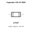
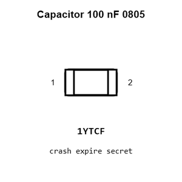
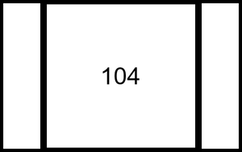
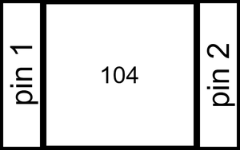
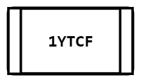
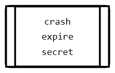
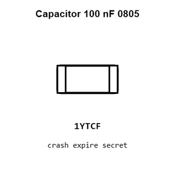
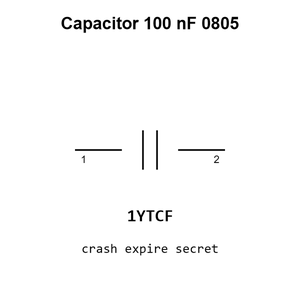

# Capacitor 100 nF 0805

`electronic_capacitor_0805_100_nano_farad`

Capacitor 100 nF 0805 is an OOMP electronic capacitor definition. It uses the 0805 package or form factor. Its nominal drawing size is 2.0 &#x00D7; 1.25 mm.

## At a glance

| Detail | Value |
| --- | --- |
| OOMP ID | `electronic_capacitor_0805_100_nano_farad` |
| Type | Capacitor |
| Package / style | 0805 |
| Nominal size | 2.0 &#x00D7; 1.25 mm |

## Classification

| Level | Value |
| --- | --- |
| 1 | `electronic` |
| 2 | `capacitor` |
| 3 | `0805` |
| 4 | `100_nano_farad` |

## Nominal dimensions

| Measurement | Value |
| --- | ---: |
| Length | 2.0 mm |
| Width | 1.25 mm |

## Identifiers

| Identifier | Value |
| --- | --- |
| Manufacturer part number | `CL21B104KCFNNNE` |
| LCSC | [`C28233`](https://www.lcsc.com/product-detail/C28233.html) |
| JLCPCB | [`C28233`](https://jlcpcb.com/partdetail/28983-CL21B104KCFNNNE/C28233) |

## Used in projects

| Project | Quantity | References | Explore |
| --- | ---: | --- | --- |
| [Project adafruit/2.8-TFT-Breakout-PCB Adafruit 2.8 TFT Breakout current](https://github.com/adafruit/2.8-TFT-Breakout-PCB/blob/master/Adafruit%202.8%20TFT%20Breakout%20v2.brd) | 2 | C1, C4 | [Board explorer](https://oomlout.github.io/oomp_electronic_version_5/parts/oomp_project_github_adafruit_2_8_tft_breakout_pcb_adafruit_2_8_tft_breakout_current/board_explorer.html) · [OOMP project](https://github.com/oomlout/oomp_electronic_version_5/tree/main/parts/oomp_project_github_adafruit_2_8_tft_breakout_pcb_adafruit_2_8_tft_breakout_current) |
| [Project adafruit/2.8-TFT-Breakout-PCB Adafruit tftlcd8bit current](https://github.com/adafruit/2.8-TFT-Breakout-PCB/blob/master/Adafruit_tftlcd8bit.brd) | 3 | C2, C3, C4 | [Board explorer](https://oomlout.github.io/oomp_electronic_version_5/parts/oomp_project_github_adafruit_2_8_tft_breakout_pcb_adafruit_tftlcd8bit_current/board_explorer.html) · [OOMP project](https://github.com/oomlout/oomp_electronic_version_5/tree/main/parts/oomp_project_github_adafruit_2_8_tft_breakout_pcb_adafruit_tftlcd8bit_current) |
| [Project adafruit/Adafruit-0.96-160x80-TFT-Display-Breakout-PCB Adafruit 0.96in 160x80 TFT Display current](https://github.com/adafruit/Adafruit-0.96-160x80-TFT-Display-Breakout-PCB/blob/master/Adafruit%200.96in%20160x80%20TFT%20Display.brd) | 1 | C3 | [Board explorer](https://oomlout.github.io/oomp_electronic_version_5/parts/oomp_project_github_adafruit_adafruit_0_96_160x80_tft_display_breakout_pcb_adafruit_0_96in_160x80_tft_display_current/board_explorer.html) · [OOMP project](https://github.com/oomlout/oomp_electronic_version_5/tree/main/parts/oomp_project_github_adafruit_adafruit_0_96_160x80_tft_display_breakout_pcb_adafruit_0_96in_160x80_tft_display_current) |
| [Project adafruit/Adafruit-128x32-SPI-OLED-breakout-board-PCB Adafruit OLED 128x32 Mono current](https://github.com/adafruit/Adafruit-128x32-SPI-OLED-breakout-board-PCB/blob/master/Adafruit%20OLED%20128x32%20Mono.brd) | 1 | C8 | [Board explorer](https://oomlout.github.io/oomp_electronic_version_5/parts/oomp_project_github_adafruit_adafruit_128x32_spi_oled_breakout_board_pcb_adafruit_oled_128x32_mono_current/board_explorer.html) · [OOMP project](https://github.com/oomlout/oomp_electronic_version_5/tree/main/parts/oomp_project_github_adafruit_adafruit_128x32_spi_oled_breakout_board_pcb_adafruit_oled_128x32_mono_current) |
| [Project adafruit/Adafruit-128x64-Monochrome-OLED-PCB 128x64 Mono OLED PCB current](https://github.com/adafruit/Adafruit-128x64-Monochrome-OLED-PCB/blob/master/Adafruit%20128x64%20Mono%20OLED%20PCB.brd) | 2 | C5, C7 | [Board explorer](https://oomlout.github.io/oomp_electronic_version_5/parts/oomp_project_github_adafruit_adafruit_128x64_monochrome_oled_pcb_128x64_mono_oled_current/board_explorer.html) · [OOMP project](https://github.com/oomlout/oomp_electronic_version_5/tree/main/parts/oomp_project_github_adafruit_adafruit_128x64_monochrome_oled_pcb_128x64_mono_oled_current) |
| [Project adafruit/Adafruit-1.14-inch-240x135-TFT-PCB Adafruit 1.14 inch 240x135 Color TFT current](https://github.com/adafruit/Adafruit-1.14-inch-240x135-TFT-PCB/blob/master/Adafruit%201.14-inch%20240x135%20Color%20TFT.brd) | 1 | C3 | [Board explorer](https://oomlout.github.io/oomp_electronic_version_5/parts/oomp_project_github_adafruit_adafruit_1_14_inch_240x135_tft_pcb_adafruit_1_14_inch_240x135_color_tft_current/board_explorer.html) · [OOMP project](https://github.com/oomlout/oomp_electronic_version_5/tree/main/parts/oomp_project_github_adafruit_adafruit_1_14_inch_240x135_tft_pcb_adafruit_1_14_inch_240x135_color_tft_current) |
| [Project adafruit/Adafruit_1.8_Inch_TFT_Breakout_PCB 1.8 Inch TFT Breakout current](https://github.com/adafruit/Adafruit_1.8_Inch_TFT_Breakout_PCB/blob/master/jdt1800-bob.brd) | 2 | C3, C4 | [Board explorer](https://oomlout.github.io/oomp_electronic_version_5/parts/oomp_project_github_adafruit_adafruit_1_8_inch_tft_breakout_pcb_1_8_inch_tft_breakout_current/board_explorer.html) · [OOMP project](https://github.com/oomlout/oomp_electronic_version_5/tree/main/parts/oomp_project_github_adafruit_adafruit_1_8_inch_tft_breakout_pcb_1_8_inch_tft_breakout_current) |
| [Project adafruit/Adafruit-1.8-TFT-Shield-PCB Adafruit 1.8 TFTshield current](https://github.com/adafruit/Adafruit-1.8-TFT-Shield-PCB/blob/master/Adafruit%201.8%20TFTshield.brd) | 2 | C3, C4 | [Board explorer](https://oomlout.github.io/oomp_electronic_version_5/parts/oomp_project_github_adafruit_adafruit_1_8_tft_shield_pcb_adafruit_1_8_tftshield_current/board_explorer.html) · [OOMP project](https://github.com/oomlout/oomp_electronic_version_5/tree/main/parts/oomp_project_github_adafruit_adafruit_1_8_tft_shield_pcb_adafruit_1_8_tftshield_current) |
| [Project adafruit/Adafruit_2.8_Inch_TFT_Shield_PCB 2.8 Inch TFT Shield current](https://github.com/adafruit/Adafruit_2.8_Inch_TFT_Shield_PCB/blob/master/tfttouchshield.brd) | 3 | C2, C3, C4 | [Board explorer](https://oomlout.github.io/oomp_electronic_version_5/parts/oomp_project_github_adafruit_adafruit_2_8_inch_tft_shield_pcb_2_8_inch_tft_shield_current/board_explorer.html) · [OOMP project](https://github.com/oomlout/oomp_electronic_version_5/tree/main/parts/oomp_project_github_adafruit_adafruit_2_8_inch_tft_shield_pcb_2_8_inch_tft_shield_current) |
| [Project adafruit/Adafruit-2.8-TFT-Shield-v2-PCB Adafruit tftcaptouchshield current](https://github.com/adafruit/Adafruit-2.8-TFT-Shield-v2-PCB/blob/master/Adafruit%20tftcaptouchshield%20rev%20C.brd) | 2 | C2, C3 | [Board explorer](https://oomlout.github.io/oomp_electronic_version_5/parts/oomp_project_github_adafruit_adafruit_2_8_tft_shield_v2_pcb_adafruit_tftcaptouchshield_current/board_explorer.html) · [OOMP project](https://github.com/oomlout/oomp_electronic_version_5/tree/main/parts/oomp_project_github_adafruit_adafruit_2_8_tft_shield_v2_pcb_adafruit_tftcaptouchshield_current) |
| [Project adafruit/Adafruit-2.8-TFT-Shield-v2-PCB Adafruit tfttouchshield current](https://github.com/adafruit/Adafruit-2.8-TFT-Shield-v2-PCB/blob/master/Adafruit%20tfttouchshield%20v2.2.brd) | 2 | C2, C3 | [Board explorer](https://oomlout.github.io/oomp_electronic_version_5/parts/oomp_project_github_adafruit_adafruit_2_8_tft_shield_v2_pcb_adafruit_tfttouchshield_current/board_explorer.html) · [OOMP project](https://github.com/oomlout/oomp_electronic_version_5/tree/main/parts/oomp_project_github_adafruit_adafruit_2_8_tft_shield_v2_pcb_adafruit_tfttouchshield_current) |
| [Project adafruit/Adafruit-40-pin-TFT-Friend Adafruit 40pin TFT friend current](https://github.com/adafruit/Adafruit-40-pin-TFT-Friend/blob/master/Adafruit%2040pin%20TFT%20friend.brd) | 1 | C1 | [Board explorer](https://oomlout.github.io/oomp_electronic_version_5/parts/oomp_project_github_adafruit_adafruit_40_pin_tft_friend_adafruit_40pin_tft_friend_current/board_explorer.html) · [OOMP project](https://github.com/oomlout/oomp_electronic_version_5/tree/main/parts/oomp_project_github_adafruit_adafruit_40_pin_tft_friend_adafruit_40pin_tft_friend_current) |
| [Project adafruit/Adafruit-50pin-to-40pin-TFT-with-AR1100-Adapter-PCB Adafruit 50pin to 40pin TFT with AR1100 Adapter current](https://github.com/adafruit/Adafruit-50pin-to-40pin-TFT-with-AR1100-Adapter-PCB/blob/master/Adafruit%2050pin%20to%2040pin%20TFT%20with%20AR1100%20Adapter.brd) | 1 | C2 | [Board explorer](https://oomlout.github.io/oomp_electronic_version_5/parts/oomp_project_github_adafruit_adafruit_50pin_to_40pin_tft_with_ar1100_adapter_pcb_adafruit_50pin_to_40pin_tft_with_ar1100_adapter_current/board_explorer.html) · [OOMP project](https://github.com/oomlout/oomp_electronic_version_5/tree/main/parts/oomp_project_github_adafruit_adafruit_50pin_to_40pin_tft_with_ar1100_adapter_pcb_adafruit_50pin_to_40pin_tft_with_ar1100_adapter_current) |
| [Project adafruit/Adafruit-5-HDMI-Backpack-PCB Adafruit 5in HDMI Backpack current](https://github.com/adafruit/Adafruit-5-HDMI-Backpack-PCB/blob/master/Adafruit%205in%20HDMI%20Backpack.brd) | 14 | C1, C2, C3, C4, C5, C6, C7, C8, C9, C10, C11, C19, C20, C23 | [Board explorer](https://oomlout.github.io/oomp_electronic_version_5/parts/oomp_project_github_adafruit_adafruit_5_hdmi_backpack_pcb_adafruit_5in_hdmi_backpack_current/board_explorer.html) · [OOMP project](https://github.com/oomlout/oomp_electronic_version_5/tree/main/parts/oomp_project_github_adafruit_adafruit_5_hdmi_backpack_pcb_adafruit_5in_hdmi_backpack_current) |
| [Project adafruit/Adafruit-96x64-RGB-OLED-Breakout-PCB Adafruit 96x64 RGB OLED Breakout current](https://github.com/adafruit/Adafruit-96x64-RGB-OLED-Breakout-PCB/blob/master/Adafruit%2096x64%20RGB%20OLED%20Breakout%20v2.0.brd) | 1 | C2 | [Board explorer](https://oomlout.github.io/oomp_electronic_version_5/parts/oomp_project_github_adafruit_adafruit_96x64_rgb_oled_breakout_pcb_adafruit_96x64_rgb_oled_breakout_current/board_explorer.html) · [OOMP project](https://github.com/oomlout/oomp_electronic_version_5/tree/main/parts/oomp_project_github_adafruit_adafruit_96x64_rgb_oled_breakout_pcb_adafruit_96x64_rgb_oled_breakout_current) |
| [Project adafruit/Adafruit-9-DOF-and-10-DOF-PCBs Adafuit 10 DOF current](https://github.com/adafruit/Adafruit-9-DOF-and-10-DOF-PCBs/blob/master/Adafuit_10DOF.brd) | 2 | C3, C4 | [Board explorer](https://oomlout.github.io/oomp_electronic_version_5/parts/oomp_project_github_adafruit_adafruit_9_dof_and_10_dof_pcbs_adafuit_10_dof_current/board_explorer.html) · [OOMP project](https://github.com/oomlout/oomp_electronic_version_5/tree/main/parts/oomp_project_github_adafruit_adafruit_9_dof_and_10_dof_pcbs_adafuit_10_dof_current) |
| [Project adafruit/Adafruit-9-DOF-and-10-DOF-PCBs Adafuit 9 DOF current](https://github.com/adafruit/Adafruit-9-DOF-and-10-DOF-PCBs/blob/master/Adafuit_9DOF.brd) | 1 | C3 | [Board explorer](https://oomlout.github.io/oomp_electronic_version_5/parts/oomp_project_github_adafruit_adafruit_9_dof_and_10_dof_pcbs_adafuit_9_dof_current/board_explorer.html) · [OOMP project](https://github.com/oomlout/oomp_electronic_version_5/tree/main/parts/oomp_project_github_adafruit_adafruit_9_dof_and_10_dof_pcbs_adafuit_9_dof_current) |
| [Project adafruit/Adafruit-Analog-Accelerometers-PCBs Adafruit ADXL326 current](https://github.com/adafruit/Adafruit-Analog-Accelerometers-PCBs/blob/master/Adafruit%20ADXL326.brd) | 3 | C2, C3, C4 | [Board explorer](https://oomlout.github.io/oomp_electronic_version_5/parts/oomp_project_github_adafruit_adafruit_analog_accelerometers_pcbs_adafruit_adxl326_current/board_explorer.html) · [OOMP project](https://github.com/oomlout/oomp_electronic_version_5/tree/main/parts/oomp_project_github_adafruit_adafruit_analog_accelerometers_pcbs_adafruit_adxl326_current) |
| [Project adafruit/Adafruit-Analog-Accelerometers-PCBs Adafruit ADXL335 current](https://github.com/adafruit/Adafruit-Analog-Accelerometers-PCBs/blob/master/Adafruit%20ADXL335.brd) | 3 | C2, C3, C4 | [Board explorer](https://oomlout.github.io/oomp_electronic_version_5/parts/oomp_project_github_adafruit_adafruit_analog_accelerometers_pcbs_adafruit_adxl335_current/board_explorer.html) · [OOMP project](https://github.com/oomlout/oomp_electronic_version_5/tree/main/parts/oomp_project_github_adafruit_adafruit_analog_accelerometers_pcbs_adafruit_adxl335_current) |
| [Project adafruit/Adafruit_Atmega32u4_Breakout_Board ATmega32u4 Breakout current](https://github.com/adafruit/Adafruit_Atmega32u4_Breakout_Board/blob/master/atmega32u4bb.brd) | 4 | C1, C4, C6, C7 | [Board explorer](https://oomlout.github.io/oomp_electronic_version_5/parts/oomp_project_github_adafruit_adafruit_atmega32u4_breakout_board_atmega32u4_breakout_current/board_explorer.html) · [OOMP project](https://github.com/oomlout/oomp_electronic_version_5/tree/main/parts/oomp_project_github_adafruit_adafruit_atmega32u4_breakout_board_atmega32u4_breakout_current) |
| [Project adafruit/Adafruit-BNO055-Breakout-PCB Adafruit BNO055 current](https://github.com/adafruit/Adafruit-BNO055-Breakout-PCB/blob/master/Adafruit%20BNO055.brd) | 2 | C3, C4 | [Board explorer](https://oomlout.github.io/oomp_electronic_version_5/parts/oomp_project_github_adafruit_adafruit_bno055_breakout_pcb_adafruit_bno055_current/board_explorer.html) · [OOMP project](https://github.com/oomlout/oomp_electronic_version_5/tree/main/parts/oomp_project_github_adafruit_adafruit_bno055_breakout_pcb_adafruit_bno055_current) |
| [Project adafruit/Adafruit-DC-Stepper-Motor-FeatherWing-PCB Adafruit DC+Stepper Wing current](https://github.com/adafruit/Adafruit-DC-Stepper-Motor-FeatherWing-PCB/blob/master/Adafruit%20DC%2BStepper%20Wing.brd) | 1 | C2 | [Board explorer](https://oomlout.github.io/oomp_electronic_version_5/parts/oomp_project_github_adafruit_adafruit_dc_stepper_motor_feather_wing_pcb_adafruit_dc_stepper_wing_current/board_explorer.html) · [OOMP project](https://github.com/oomlout/oomp_electronic_version_5/tree/main/parts/oomp_project_github_adafruit_adafruit_dc_stepper_motor_feather_wing_pcb_adafruit_dc_stepper_wing_current) |
| [Project adafruit/Adafruit-DC-Stepper-Motor-HAT-PCB Adafruit Motor HAT current](https://github.com/adafruit/Adafruit-DC-Stepper-Motor-HAT-PCB/blob/master/Adafruit%20Motor%20HAT%20rev%20A.brd) | 2 | C1, C3 | [Board explorer](https://oomlout.github.io/oomp_electronic_version_5/parts/oomp_project_github_adafruit_adafruit_dc_stepper_motor_hat_pcb_adafruit_motor_hat_current/board_explorer.html) · [OOMP project](https://github.com/oomlout/oomp_electronic_version_5/tree/main/parts/oomp_project_github_adafruit_adafruit_dc_stepper_motor_hat_pcb_adafruit_motor_hat_current) |
| [Project adafruit/Adafruit-DRV8833-Motor-Driver-Breakout-PCB Adafruit DRV8833 current](https://github.com/adafruit/Adafruit-DRV8833-Motor-Driver-Breakout-PCB/blob/master/Adafruit%20DRV8833.brd) | 1 | C3 | [Board explorer](https://oomlout.github.io/oomp_electronic_version_5/parts/oomp_project_github_adafruit_adafruit_drv8833_motor_driver_breakout_pcb_adafruit_drv8833_current/board_explorer.html) · [OOMP project](https://github.com/oomlout/oomp_electronic_version_5/tree/main/parts/oomp_project_github_adafruit_adafruit_drv8833_motor_driver_breakout_pcb_adafruit_drv8833_current) |
| [Project adafruit/Adafruit-DRV8871-Breakout-PCB Adafruit DRV8871 current](https://github.com/adafruit/Adafruit-DRV8871-Breakout-PCB/blob/master/Adafruit%20DRV8871.brd) | 1 | C1 | [Board explorer](https://oomlout.github.io/oomp_electronic_version_5/parts/oomp_project_github_adafruit_adafruit_drv8871_breakout_pcb_adafruit_drv8871_current/board_explorer.html) · [OOMP project](https://github.com/oomlout/oomp_electronic_version_5/tree/main/parts/oomp_project_github_adafruit_adafruit_drv8871_breakout_pcb_adafruit_drv8871_current) |
| [Project adafruit/Adafruit-Flora-TCS34725-Color-Sensor-PCB Adafruit Flora TCS34725 current](https://github.com/adafruit/Adafruit-Flora-TCS34725-Color-Sensor-PCB/blob/master/Adafruit%20Flora%20TCS34725.brd) | 1 | C1 | [Board explorer](https://oomlout.github.io/oomp_electronic_version_5/parts/oomp_project_github_adafruit_adafruit_flora_tcs34725_color_sensor_pcb_adafruit_flora_tcs34725_current/board_explorer.html) · [OOMP project](https://github.com/oomlout/oomp_electronic_version_5/tree/main/parts/oomp_project_github_adafruit_adafruit_flora_tcs34725_color_sensor_pcb_adafruit_flora_tcs34725_current) |
| [Project adafruit/Adafruit-FT232H-Breakout-PCB Adafruit FT232 H Original current](https://github.com/adafruit/Adafruit-FT232H-Breakout-PCB/blob/master/Adafruit%20FT232H%20Original.brd) | 4 | C2, C6, C7, C8 | [Board explorer](https://oomlout.github.io/oomp_electronic_version_5/parts/oomp_project_github_adafruit_adafruit_ft232_h_breakout_pcb_adafruit_ft232_h_original_current/board_explorer.html) · [OOMP project](https://github.com/oomlout/oomp_electronic_version_5/tree/main/parts/oomp_project_github_adafruit_adafruit_ft232_h_breakout_pcb_adafruit_ft232_h_original_current) |
| [Project adafruit/Adafruit_FTDI-Friend-PCB FTDI Friend Rev A current](https://github.com/adafruit/Adafruit_FTDI-Friend-PCB/blob/master/Adafruit%20FTDI%20Friend%20Rev%20A.brd) | 2 | C2, C3 | [Board explorer](https://oomlout.github.io/oomp_electronic_version_5/parts/oomp_project_github_adafruit_adafruit_ftdi_friend_pcb_ftdi_friend_rev_a_current/board_explorer.html) · [OOMP project](https://github.com/oomlout/oomp_electronic_version_5/tree/main/parts/oomp_project_github_adafruit_adafruit_ftdi_friend_pcb_ftdi_friend_rev_a_current) |
| [Project adafruit/Adafruit_FTDI-Friend-PCB FTDI Friend Rev A rev_a](https://github.com/adafruit/Adafruit_FTDI-Friend-PCB/blob/master/Adafruit%20FTDI%20Friend%20Rev%20A.brd) | 2 | C2, C3 | [Board explorer](https://oomlout.github.io/oomp_electronic_version_5/parts/oomp_project_github_adafruit_adafruit_ftdi_friend_pcb_ftdi_friend_rev_a_rev_a/board_explorer.html) · [OOMP project](https://github.com/oomlout/oomp_electronic_version_5/tree/main/parts/oomp_project_github_adafruit_adafruit_ftdi_friend_pcb_ftdi_friend_rev_a_rev_a) |
| [Project adafruit/Adafruit-GUVA-Analog-UV-Sensor-Breakout-PCB Adafruit GUVA UV Sensor Breakout current](https://github.com/adafruit/Adafruit-GUVA-Analog-UV-Sensor-Breakout-PCB/blob/master/Adafruit%20GUVA%20UV%20Sensor%20Breakout.brd) | 2 | C1, C2 | [Board explorer](https://oomlout.github.io/oomp_electronic_version_5/parts/oomp_project_github_adafruit_adafruit_guva_analog_uv_sensor_breakout_pcb_adafruit_guva_uv_sensor_breakout_current/board_explorer.html) · [OOMP project](https://github.com/oomlout/oomp_electronic_version_5/tree/main/parts/oomp_project_github_adafruit_adafruit_guva_analog_uv_sensor_breakout_pcb_adafruit_guva_uv_sensor_breakout_current) |
| [Project adafruit/Adafruit-I2C-SPI-LCD-Backpack-PCB I2C SPI LCD Backpack current](https://github.com/adafruit/Adafruit-I2C-SPI-LCD-Backpack-PCB/blob/master/i2cspilcdbackpack.brd) | 1 | C2 | [Board explorer](https://oomlout.github.io/oomp_electronic_version_5/parts/oomp_project_github_adafruit_adafruit_i2_c_spi_lcd_backpack_pcb_i2c_spi_lcd_backpack_current/board_explorer.html) · [OOMP project](https://github.com/oomlout/oomp_electronic_version_5/tree/main/parts/oomp_project_github_adafruit_adafruit_i2_c_spi_lcd_backpack_pcb_i2c_spi_lcd_backpack_current) |
| [Project adafruit/Adafruit-INA219-Current-Sensor-PCB Adafruit INA219 Cur Power Monitor current](https://github.com/adafruit/Adafruit-INA219-Current-Sensor-PCB/blob/master/Adafruit_INA219_CurPowerMonitor.brd) | 1 | C1 | [Board explorer](https://oomlout.github.io/oomp_electronic_version_5/parts/oomp_project_github_adafruit_adafruit_ina219_current_sensor_pcb_adafruit_ina219_cur_power_monitor_current/board_explorer.html) · [OOMP project](https://github.com/oomlout/oomp_electronic_version_5/tree/main/parts/oomp_project_github_adafruit_adafruit_ina219_current_sensor_pcb_adafruit_ina219_cur_power_monitor_current) |
| [Project adafruit/Adafruit-IS31FL3731-CharliePlex-LED-Breakout-PCB Adafruit IS31 FL3731 Breakout current](https://github.com/adafruit/Adafruit-IS31FL3731-CharliePlex-LED-Breakout-PCB/blob/master/Adafruit%20IS31FL3731%20Breakout.brd) | 2 | C2, C5 | [Board explorer](https://oomlout.github.io/oomp_electronic_version_5/parts/oomp_project_github_adafruit_adafruit_is31_fl3731_charlie_plex_led_breakout_pcb_adafruit_is31_fl3731_breakout_current/board_explorer.html) · [OOMP project](https://github.com/oomlout/oomp_electronic_version_5/tree/main/parts/oomp_project_github_adafruit_adafruit_is31_fl3731_charlie_plex_led_breakout_pcb_adafruit_is31_fl3731_breakout_current) |

## Files

[KiCad symbol, machine-solder and hand-solder footprints](data/kicad/README.md) · [Availability and source masters](data/kicad/manifest.yaml)

[View this part on GitHub](https://github.com/oomlout/oomp_electronic_version_5/tree/main/parts/electronic_capacitor_0805_100_nano_farad)

[Browse this category](../../navigation/electronic/capacitor/0805/README.md)

---

This page is generated from the OOMP part definition by a Roboclick Jinja template. Edit the source taxonomy or template rather than this generated file.