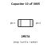
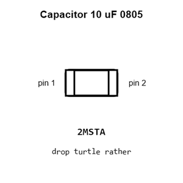
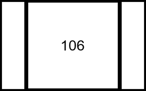
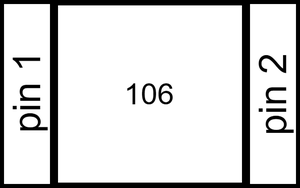
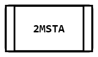
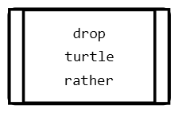
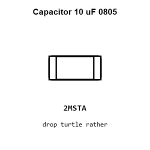
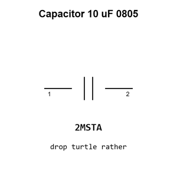

# Capacitor 10 uF 0805

`electronic_capacitor_0805_10_micro_farad`

Capacitor 10 uF 0805 is an OOMP electronic capacitor definition. It uses the 0805 package or form factor. Its nominal drawing size is 2.0 &#x00D7; 1.25 mm.

## At a glance

| Detail | Value |
| --- | --- |
| OOMP ID | `electronic_capacitor_0805_10_micro_farad` |
| Type | Capacitor |
| Package / style | 0805 |
| Nominal size | 2.0 &#x00D7; 1.25 mm |

## Classification

| Level | Value |
| --- | --- |
| 1 | `electronic` |
| 2 | `capacitor` |
| 3 | `0805` |
| 4 | `10_micro_farad` |

## Nominal dimensions

| Measurement | Value |
| --- | ---: |
| Length | 2.0 mm |
| Width | 1.25 mm |

## Used in projects

| Project | Quantity | References | Explore |
| --- | ---: | --- | --- |
| [Project adafruit/2.8-TFT-Breakout-PCB Adafruit 2.8 TFT Breakout current](https://github.com/adafruit/2.8-TFT-Breakout-PCB/blob/master/Adafruit%202.8%20TFT%20Breakout%20v2.brd) | 3 | C2, C3, C5 | [Board explorer](https://oomlout.github.io/oomp_electronic_version_5/parts/oomp_project_github_adafruit_2_8_tft_breakout_pcb_adafruit_2_8_tft_breakout_current/board_explorer.html) · [OOMP project](https://github.com/oomlout/oomp_electronic_version_5/tree/main/parts/oomp_project_github_adafruit_2_8_tft_breakout_pcb_adafruit_2_8_tft_breakout_current) |
| [Project adafruit/Adafruit-0.96-160x80-TFT-Display-Breakout-PCB Adafruit 0.96in 160x80 TFT Display current](https://github.com/adafruit/Adafruit-0.96-160x80-TFT-Display-Breakout-PCB/blob/master/Adafruit%200.96in%20160x80%20TFT%20Display.brd) | 2 | C1, C2 | [Board explorer](https://oomlout.github.io/oomp_electronic_version_5/parts/oomp_project_github_adafruit_adafruit_0_96_160x80_tft_display_breakout_pcb_adafruit_0_96in_160x80_tft_display_current/board_explorer.html) · [OOMP project](https://github.com/oomlout/oomp_electronic_version_5/tree/main/parts/oomp_project_github_adafruit_adafruit_0_96_160x80_tft_display_breakout_pcb_adafruit_0_96in_160x80_tft_display_current) |
| [Project adafruit/Adafruit-128x32-I2C-OLED-Breakout-PCB Adafruit OLED 128x32 Mono I2 C current](https://github.com/adafruit/Adafruit-128x32-I2C-OLED-Breakout-PCB/blob/master/Adafruit%20OLED%20128x32%20Mono%20I2C.brd) | 3 | C5, C6, C7 | [Board explorer](https://oomlout.github.io/oomp_electronic_version_5/parts/oomp_project_github_adafruit_adafruit_128x32_i2_c_oled_breakout_pcb_adafruit_oled_128x32_mono_i2_c_current/board_explorer.html) · [OOMP project](https://github.com/oomlout/oomp_electronic_version_5/tree/main/parts/oomp_project_github_adafruit_adafruit_128x32_i2_c_oled_breakout_pcb_adafruit_oled_128x32_mono_i2_c_current) |
| [Project adafruit/Adafruit-128x32-I2C-OLED-Breakout-PCB Adafruit OLED 128x32 Mono I2 C STEMMA QT current](https://github.com/adafruit/Adafruit-128x32-I2C-OLED-Breakout-PCB/blob/master/Adafruit%20OLED%20128x32%20Mono%20I2C%20STEMMA%20QT%20rev%20B.brd) | 4 | C2, C3, C8, C9 | [Board explorer](https://oomlout.github.io/oomp_electronic_version_5/parts/oomp_project_github_adafruit_adafruit_128x32_i2_c_oled_breakout_pcb_adafruit_oled_128x32_mono_i2_c_stemma_qt_current/board_explorer.html) · [OOMP project](https://github.com/oomlout/oomp_electronic_version_5/tree/main/parts/oomp_project_github_adafruit_adafruit_128x32_i2_c_oled_breakout_pcb_adafruit_oled_128x32_mono_i2_c_stemma_qt_current) |
| [Project adafruit/Adafruit-128x64-Monochrome-OLED-PCB 0.96in 128x64 OLED STEMMA QT current](https://github.com/adafruit/Adafruit-128x64-Monochrome-OLED-PCB/blob/master/Adafruit%200.96in%20128x64%20OLED%20STEMMA%20QT.brd) | 5 | C2, C3, C14, C15, C16 | [Board explorer](https://oomlout.github.io/oomp_electronic_version_5/parts/oomp_project_github_adafruit_adafruit_128x64_monochrome_oled_pcb_0_96in_128x64_oled_stemma_qt_current/board_explorer.html) · [OOMP project](https://github.com/oomlout/oomp_electronic_version_5/tree/main/parts/oomp_project_github_adafruit_adafruit_128x64_monochrome_oled_pcb_0_96in_128x64_oled_stemma_qt_current) |
| [Project adafruit/Adafruit-128x64-Monochrome-OLED-PCB 128x64 Mono OLED PCB v2 current](https://github.com/adafruit/Adafruit-128x64-Monochrome-OLED-PCB/blob/master/Adafruit%20128x64%20Mono%20OLED%20PCB%20v2.brd) | 3 | C1, C2, C5 | [Board explorer](https://oomlout.github.io/oomp_electronic_version_5/parts/oomp_project_github_adafruit_adafruit_128x64_monochrome_oled_pcb_128x64_mono_oled_v2_current/board_explorer.html) · [OOMP project](https://github.com/oomlout/oomp_electronic_version_5/tree/main/parts/oomp_project_github_adafruit_adafruit_128x64_monochrome_oled_pcb_128x64_mono_oled_v2_current) |
| [Project adafruit/Adafruit-128x64-OLED-Bonnet-for-Raspberry-Pi-PCB Adafruit 128x64 OLED Bonnet current](https://github.com/adafruit/Adafruit-128x64-OLED-Bonnet-for-Raspberry-Pi-PCB/blob/master/Adafruit%20128x64%20OLED%20Bonnet.brd) | 2 | C2, C5 | [Board explorer](https://oomlout.github.io/oomp_electronic_version_5/parts/oomp_project_github_adafruit_adafruit_128x64_oled_bonnet_for_raspberry_pi_pcb_adafruit_128x64_oled_bonnet_current/board_explorer.html) · [OOMP project](https://github.com/oomlout/oomp_electronic_version_5/tree/main/parts/oomp_project_github_adafruit_adafruit_128x64_oled_bonnet_for_raspberry_pi_pcb_adafruit_128x64_oled_bonnet_current) |
| [Project adafruit/Adafruit-16-Channel-PWM-Servo-Driver-PCB Adafruit PCA9685 current](https://github.com/adafruit/Adafruit-16-Channel-PWM-Servo-Driver-PCB/blob/master/Adafruit%20PCA9685.brd) | 1 | C1 | [Board explorer](https://oomlout.github.io/oomp_electronic_version_5/parts/oomp_project_github_adafruit_adafruit_16_channel_pwm_servo_driver_pcb_adafruit_pca9685_current/board_explorer.html) · [OOMP project](https://github.com/oomlout/oomp_electronic_version_5/tree/main/parts/oomp_project_github_adafruit_adafruit_16_channel_pwm_servo_driver_pcb_adafruit_pca9685_current) |
| [Project adafruit/Adafruit-16-channel-PWM-Servo-Shield Adafruit PWM Servo Shield current](https://github.com/adafruit/Adafruit-16-channel-PWM-Servo-Shield/blob/master/Adafruit%20PWM%20Servo%20Shield.brd) | 1 | C1 | [Board explorer](https://oomlout.github.io/oomp_electronic_version_5/parts/oomp_project_github_adafruit_adafruit_16_channel_pwm_servo_shield_adafruit_pwm_servo_shield_current/board_explorer.html) · [OOMP project](https://github.com/oomlout/oomp_electronic_version_5/tree/main/parts/oomp_project_github_adafruit_adafruit_16_channel_pwm_servo_shield_adafruit_pwm_servo_shield_current) |
| [Project adafruit/Adafruit-1.14-inch-240x135-TFT-PCB Adafruit 1.14 inch 240x135 Color TFT current](https://github.com/adafruit/Adafruit-1.14-inch-240x135-TFT-PCB/blob/master/Adafruit%201.14-inch%20240x135%20Color%20TFT.brd) | 2 | C1, C2 | [Board explorer](https://oomlout.github.io/oomp_electronic_version_5/parts/oomp_project_github_adafruit_adafruit_1_14_inch_240x135_tft_pcb_adafruit_1_14_inch_240x135_color_tft_current/board_explorer.html) · [OOMP project](https://github.com/oomlout/oomp_electronic_version_5/tree/main/parts/oomp_project_github_adafruit_adafruit_1_14_inch_240x135_tft_pcb_adafruit_1_14_inch_240x135_color_tft_current) |
| [Project adafruit/Adafruit-1.28-240x240-Round-Display-PCB Adafruit 1.28 240x240 Round Display current](https://github.com/adafruit/Adafruit-1.28-240x240-Round-Display-PCB/blob/main/Adafruit%201.28%20240x240%20Round%20Display.brd) | 3 | C1, C2, C4 | [Board explorer](https://oomlout.github.io/oomp_electronic_version_5/parts/oomp_project_github_adafruit_adafruit_1_28_240x240_round_display_pcb_adafruit_1_28_240x240_round_display_current/board_explorer.html) · [OOMP project](https://github.com/oomlout/oomp_electronic_version_5/tree/main/parts/oomp_project_github_adafruit_adafruit_1_28_240x240_round_display_pcb_adafruit_1_28_240x240_round_display_current) |
| [Project adafruit/Adafruit-1.3-inch-240x240-TFT-PCB Adafruit 1.3in 240x240 IPS TFT current](https://github.com/adafruit/Adafruit-1.3-inch-240x240-TFT-PCB/blob/master/Adafruit%201.3in%20240x240%20IPS%20TFT.brd) | 2 | C1, C2 | [Board explorer](https://oomlout.github.io/oomp_electronic_version_5/parts/oomp_project_github_adafruit_adafruit_1_3_inch_240x240_tft_pcb_adafruit_1_3in_240x240_ips_tft_current/board_explorer.html) · [OOMP project](https://github.com/oomlout/oomp_electronic_version_5/tree/main/parts/oomp_project_github_adafruit_adafruit_1_3_inch_240x240_tft_pcb_adafruit_1_3in_240x240_ips_tft_current) |
| [Project adafruit/Adafruit-1.3-inch-240x240-TFT-PCB Adafruit 1.3in 240x240 IPS TFT EYESPI current](https://github.com/adafruit/Adafruit-1.3-inch-240x240-TFT-PCB/blob/master/Adafruit%201.3in%20240x240%20IPS%20TFT%20EYESPI.brd) | 2 | C1, C2 | [Board explorer](https://oomlout.github.io/oomp_electronic_version_5/parts/oomp_project_github_adafruit_adafruit_1_3_inch_240x240_tft_pcb_adafruit_1_3in_240x240_ips_tft_eyespi_current/board_explorer.html) · [OOMP project](https://github.com/oomlout/oomp_electronic_version_5/tree/main/parts/oomp_project_github_adafruit_adafruit_1_3_inch_240x240_tft_pcb_adafruit_1_3in_240x240_ips_tft_eyespi_current) |
| [Project adafruit/Adafruit-1.3in-Color-TFT-Bonnet-PCB Adafruit 1.3in Color TFT Bonnet current](https://github.com/adafruit/Adafruit-1.3in-Color-TFT-Bonnet-PCB/blob/master/Adafruit%201.3in%20Color%20TFT%20Bonnet.brd) | 2 | C1, C10 | [Board explorer](https://oomlout.github.io/oomp_electronic_version_5/parts/oomp_project_github_adafruit_adafruit_1_3in_color_tft_bonnet_pcb_adafruit_1_3in_color_tft_bonnet_current/board_explorer.html) · [OOMP project](https://github.com/oomlout/oomp_electronic_version_5/tree/main/parts/oomp_project_github_adafruit_adafruit_1_3in_color_tft_bonnet_pcb_adafruit_1_3in_color_tft_bonnet_current) |
| [Project adafruit/Adafruit-1.54-inch-240x240-TFT-PCB Adafruit 1.54in 240x240 TFT EYESPI current](https://github.com/adafruit/Adafruit-1.54-inch-240x240-TFT-PCB/blob/master/Adafruit%201.54in%20240x240%20TFT%20EYESPI.brd) | 3 | C1, C2, C4 | [Board explorer](https://oomlout.github.io/oomp_electronic_version_5/parts/oomp_project_github_adafruit_adafruit_1_54_inch_240x240_tft_pcb_adafruit_1_54in_240x240_tft_eyespi_current/board_explorer.html) · [OOMP project](https://github.com/oomlout/oomp_electronic_version_5/tree/main/parts/oomp_project_github_adafruit_adafruit_1_54_inch_240x240_tft_pcb_adafruit_1_54in_240x240_tft_eyespi_current) |
| [Project adafruit/Adafruit-1.54-inch-240x240-TFT-PCB Adafruit 1.54inch 240x240 current](https://github.com/adafruit/Adafruit-1.54-inch-240x240-TFT-PCB/blob/master/Adafruit%201.54inch%20240x240.brd) | 3 | C1, C2, C4 | [Board explorer](https://oomlout.github.io/oomp_electronic_version_5/parts/oomp_project_github_adafruit_adafruit_1_54_inch_240x240_tft_pcb_adafruit_1_54inch_240x240_current/board_explorer.html) · [OOMP project](https://github.com/oomlout/oomp_electronic_version_5/tree/main/parts/oomp_project_github_adafruit_adafruit_1_54_inch_240x240_tft_pcb_adafruit_1_54inch_240x240_current) |
| [Project adafruit/Adafruit-1.69in-280x240-Round-Rectangle-TFT-PCB Adafruit 1.69in 280x240 Round Rectangle TFT current](https://github.com/adafruit/Adafruit-1.69in-280x240-Round-Rectangle-TFT-PCB/blob/main/Adafruit%201.69in%20280x240%20Round%20Rectangle%20TFT.brd) | 3 | C1, C2, C4 | [Board explorer](https://oomlout.github.io/oomp_electronic_version_5/parts/oomp_project_github_adafruit_adafruit_1_69in_280x240_round_rectangle_tft_pcb_adafruit_1_69in_280x240_round_rectangle_tft_current/board_explorer.html) · [OOMP project](https://github.com/oomlout/oomp_electronic_version_5/tree/main/parts/oomp_project_github_adafruit_adafruit_1_69in_280x240_round_rectangle_tft_pcb_adafruit_1_69in_280x240_round_rectangle_tft_current) |
| [Project adafruit/Adafruit_1.8_Inch_TFT_Breakout_PCB 1.8 Inch TFT Breakout current](https://github.com/adafruit/Adafruit_1.8_Inch_TFT_Breakout_PCB/blob/master/jdt1800-bob.brd) | 2 | C1, C2 | [Board explorer](https://oomlout.github.io/oomp_electronic_version_5/parts/oomp_project_github_adafruit_adafruit_1_8_inch_tft_breakout_pcb_1_8_inch_tft_breakout_current/board_explorer.html) · [OOMP project](https://github.com/oomlout/oomp_electronic_version_5/tree/main/parts/oomp_project_github_adafruit_adafruit_1_8_inch_tft_breakout_pcb_1_8_inch_tft_breakout_current) |
| [Project adafruit/Adafruit-1.8-TFT-Shield-PCB Adafruit 1.8 TFTshield current](https://github.com/adafruit/Adafruit-1.8-TFT-Shield-PCB/blob/master/Adafruit%201.8%20TFTshield.brd) | 2 | C1, C2 | [Board explorer](https://oomlout.github.io/oomp_electronic_version_5/parts/oomp_project_github_adafruit_adafruit_1_8_tft_shield_pcb_adafruit_1_8_tftshield_current/board_explorer.html) · [OOMP project](https://github.com/oomlout/oomp_electronic_version_5/tree/main/parts/oomp_project_github_adafruit_adafruit_1_8_tft_shield_pcb_adafruit_1_8_tftshield_current) |
| [Project adafruit/Adafruit-2.0-inch-240x320-TFT-PCB Adafruit 2.0 inch 240x320 IPS TFT current](https://github.com/adafruit/Adafruit-2.0-inch-240x320-TFT-PCB/blob/master/Adafruit%202.0%20inch%20240x320%20IPS%20TFT.brd) | 3 | C1, C2, C3 | [Board explorer](https://oomlout.github.io/oomp_electronic_version_5/parts/oomp_project_github_adafruit_adafruit_2_0_inch_240x320_tft_pcb_adafruit_2_0_inch_240x320_ips_tft_current/board_explorer.html) · [OOMP project](https://github.com/oomlout/oomp_electronic_version_5/tree/main/parts/oomp_project_github_adafruit_adafruit_2_0_inch_240x320_tft_pcb_adafruit_2_0_inch_240x320_ips_tft_current) |
| [Project adafruit/Adafruit-2.0-inch-240x320-TFT-PCB Adafruit EYESPI 2.0 Inch 240x320 IPS TFT current](https://github.com/adafruit/Adafruit-2.0-inch-240x320-TFT-PCB/blob/master/Adafruit%20EYESPI%202.0%20Inch%20240x320%20IPS%20TFT.brd) | 3 | C1, C2, C3 | [Board explorer](https://oomlout.github.io/oomp_electronic_version_5/parts/oomp_project_github_adafruit_adafruit_2_0_inch_240x320_tft_pcb_adafruit_eyespi_2_0_inch_240x320_ips_tft_current/board_explorer.html) · [OOMP project](https://github.com/oomlout/oomp_electronic_version_5/tree/main/parts/oomp_project_github_adafruit_adafruit_2_0_inch_240x320_tft_pcb_adafruit_eyespi_2_0_inch_240x320_ips_tft_current) |
| [Project adafruit/Adafruit-2.4-TFT-FeatherWing-PCB Adafruit 2.4in TFT Feather Wing current](https://github.com/adafruit/Adafruit-2.4-TFT-FeatherWing-PCB/blob/master/Adafruit%202.4in%20TFT%20FeatherWing%20V2.brd) | 3 | C3, C5, C6 | [Board explorer](https://oomlout.github.io/oomp_electronic_version_5/parts/oomp_project_github_adafruit_adafruit_2_4_tft_feather_wing_pcb_adafruit_2_4in_tft_feather_wing_current/board_explorer.html) · [OOMP project](https://github.com/oomlout/oomp_electronic_version_5/tree/main/parts/oomp_project_github_adafruit_adafruit_2_4_tft_feather_wing_pcb_adafruit_2_4in_tft_feather_wing_current) |
| [Project adafruit/Adafruit_2.8_Inch_TFT_Shield_PCB 2.8 Inch TFT Shield current](https://github.com/adafruit/Adafruit_2.8_Inch_TFT_Shield_PCB/blob/master/tfttouchshield.brd) | 2 | C1, C5 | [Board explorer](https://oomlout.github.io/oomp_electronic_version_5/parts/oomp_project_github_adafruit_adafruit_2_8_inch_tft_shield_pcb_2_8_inch_tft_shield_current/board_explorer.html) · [OOMP project](https://github.com/oomlout/oomp_electronic_version_5/tree/main/parts/oomp_project_github_adafruit_adafruit_2_8_inch_tft_shield_pcb_2_8_inch_tft_shield_current) |
| [Project adafruit/Adafruit-2.8-TFT-Shield-v2-PCB Adafruit TFT 2.8in Resistive Touchshield current](https://github.com/adafruit/Adafruit-2.8-TFT-Shield-v2-PCB/blob/master/Adafruit%20TFT%202.8in%20Resistive%20Touchshield%20rev%20E.brd) | 6 | C1, C4, C5, C6, C7, C8 | [Board explorer](https://oomlout.github.io/oomp_electronic_version_5/parts/oomp_project_github_adafruit_adafruit_2_8_tft_shield_v2_pcb_adafruit_tft_2_8in_resistive_touchshield_current/board_explorer.html) · [OOMP project](https://github.com/oomlout/oomp_electronic_version_5/tree/main/parts/oomp_project_github_adafruit_adafruit_2_8_tft_shield_v2_pcb_adafruit_tft_2_8in_resistive_touchshield_current) |
| [Project adafruit/Adafruit-2.8-TFT-Shield-v2-PCB Adafruit tftcaptouchshield current](https://github.com/adafruit/Adafruit-2.8-TFT-Shield-v2-PCB/blob/master/Adafruit%20tftcaptouchshield%20rev%20C.brd) | 3 | C1, C4, C5 | [Board explorer](https://oomlout.github.io/oomp_electronic_version_5/parts/oomp_project_github_adafruit_adafruit_2_8_tft_shield_v2_pcb_adafruit_tftcaptouchshield_current/board_explorer.html) · [OOMP project](https://github.com/oomlout/oomp_electronic_version_5/tree/main/parts/oomp_project_github_adafruit_adafruit_2_8_tft_shield_v2_pcb_adafruit_tftcaptouchshield_current) |
| [Project adafruit/Adafruit-2.8-TFT-with-Capacitive-Touch-PCB Adafruit 2.8 inch TFT w Capacitive Touch current](https://github.com/adafruit/Adafruit-2.8-TFT-with-Capacitive-Touch-PCB/blob/master/Adafruit%202.8%20inch%20TFT%20w%20Capacitive%20Touch.brd) | 4 | C1, C3, C4, C5 | [Board explorer](https://oomlout.github.io/oomp_electronic_version_5/parts/oomp_project_github_adafruit_adafruit_2_8_tft_with_capacitive_touch_pcb_adafruit_2_8_inch_tft_w_capacitive_touch_current/board_explorer.html) · [OOMP project](https://github.com/oomlout/oomp_electronic_version_5/tree/main/parts/oomp_project_github_adafruit_adafruit_2_8_tft_with_capacitive_touch_pcb_adafruit_2_8_inch_tft_w_capacitive_touch_current) |
| [Project adafruit/Adafruit-40-pin-TFT-Friend Adafruit 40pin TFT friend current](https://github.com/adafruit/Adafruit-40-pin-TFT-Friend/blob/master/Adafruit%2040pin%20TFT%20friend.brd) | 2 | C6, C7 | [Board explorer](https://oomlout.github.io/oomp_electronic_version_5/parts/oomp_project_github_adafruit_adafruit_40_pin_tft_friend_adafruit_40pin_tft_friend_current/board_explorer.html) · [OOMP project](https://github.com/oomlout/oomp_electronic_version_5/tree/main/parts/oomp_project_github_adafruit_adafruit_40_pin_tft_friend_adafruit_40pin_tft_friend_current) |
| [Project adafruit/Adafruit-50pin-to-40pin-TFT-with-AR1100-Adapter-PCB Adafruit 50pin to 40pin TFT with AR1100 Adapter current](https://github.com/adafruit/Adafruit-50pin-to-40pin-TFT-with-AR1100-Adapter-PCB/blob/master/Adafruit%2050pin%20to%2040pin%20TFT%20with%20AR1100%20Adapter.brd) | 2 | C1, C3 | [Board explorer](https://oomlout.github.io/oomp_electronic_version_5/parts/oomp_project_github_adafruit_adafruit_50pin_to_40pin_tft_with_ar1100_adapter_pcb_adafruit_50pin_to_40pin_tft_with_ar1100_adapter_current/board_explorer.html) · [OOMP project](https://github.com/oomlout/oomp_electronic_version_5/tree/main/parts/oomp_project_github_adafruit_adafruit_50pin_to_40pin_tft_with_ar1100_adapter_pcb_adafruit_50pin_to_40pin_tft_with_ar1100_adapter_current) |
| [Project adafruit/Adafruit-5-HDMI-Backpack-PCB Adafruit 5in HDMI Backpack current](https://github.com/adafruit/Adafruit-5-HDMI-Backpack-PCB/blob/master/Adafruit%205in%20HDMI%20Backpack.brd) | 5 | C12, C13, C14, C15, C16 | [Board explorer](https://oomlout.github.io/oomp_electronic_version_5/parts/oomp_project_github_adafruit_adafruit_5_hdmi_backpack_pcb_adafruit_5in_hdmi_backpack_current/board_explorer.html) · [OOMP project](https://github.com/oomlout/oomp_electronic_version_5/tree/main/parts/oomp_project_github_adafruit_adafruit_5_hdmi_backpack_pcb_adafruit_5in_hdmi_backpack_current) |
| [Project adafruit/Adafruit_ADXL345_PCB ADXL345 STEMMA QT current](https://github.com/adafruit/Adafruit_ADXL345_PCB/blob/master/ADXL345%20STEMMA%20QT.brd) | 2 | C2, C3 | [Board explorer](https://oomlout.github.io/oomp_electronic_version_5/parts/oomp_project_github_adafruit_adafruit_adxl345_pcb_adxl345_stemma_qt_current/board_explorer.html) · [OOMP project](https://github.com/oomlout/oomp_electronic_version_5/tree/main/parts/oomp_project_github_adafruit_adafruit_adxl345_pcb_adxl345_stemma_qt_current) |
| [Project adafruit/Adafruit-LIS3DH-Breakout-PCB LIS3DH Breakout current](https://github.com/adafruit/Adafruit-LIS3DH-Breakout-PCB/blob/master/Adafruit%20LIS3DH.brd) | 2 | C2, C3 | [Board explorer](https://oomlout.github.io/oomp_electronic_version_5/parts/oomp_project_github_adafruit_adafruit_lis3_dh_breakout_pcb_lis3dh_breakout_current/board_explorer.html) · [OOMP project](https://github.com/oomlout/oomp_electronic_version_5/tree/main/parts/oomp_project_github_adafruit_adafruit_lis3_dh_breakout_pcb_lis3dh_breakout_current) |

## Files

[KiCad symbol, machine-solder and hand-solder footprints](data/kicad/README.md) · [Availability and source masters](data/kicad/manifest.yaml)

[View this part on GitHub](https://github.com/oomlout/oomp_electronic_version_5/tree/main/parts/electronic_capacitor_0805_10_micro_farad)

[Browse this category](../../navigation/electronic/capacitor/0805/README.md)

---

This page is generated from the OOMP part definition by a Roboclick Jinja template. Edit the source taxonomy or template rather than this generated file.