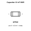
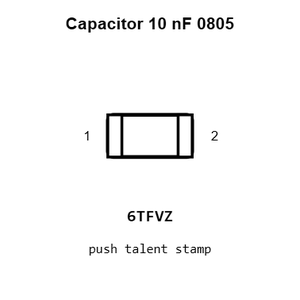
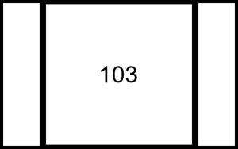
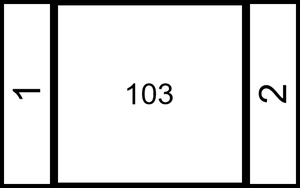
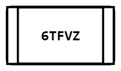
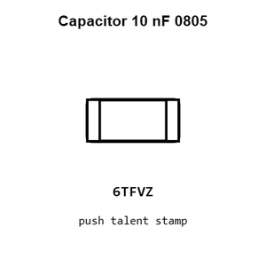
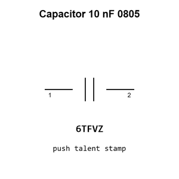

# Capacitor 10 nF 0805

`electronic_capacitor_0805_10_nano_farad`

Capacitor 10 nF 0805 is an OOMP electronic capacitor definition. It uses the 0805 package or form factor. Its nominal drawing size is 2.0 &#x00D7; 1.25 mm.

## At a glance

| Detail | Value |
| --- | --- |
| OOMP ID | `electronic_capacitor_0805_10_nano_farad` |
| Type | Capacitor |
| Package / style | 0805 |
| Nominal size | 2.0 &#x00D7; 1.25 mm |

## Classification

| Level | Value |
| --- | --- |
| 1 | `electronic` |
| 2 | `capacitor` |
| 3 | `0805` |
| 4 | `10_nano_farad` |

## Nominal dimensions

| Measurement | Value |
| --- | ---: |
| Length | 2.0 mm |
| Width | 1.25 mm |

## Identifiers

| Identifier | Value |
| --- | --- |
| Manufacturer part number | `CL21B103KBANNNC` |
| LCSC | [`C1710`](https://www.lcsc.com/product-detail/C1710.html) |
| JLCPCB | [`C1710`](https://jlcpcb.com/partdetail/2062-CL21B103KBANNNC/C1710) |

## Used in projects

| Project | Quantity | References | Explore |
| --- | ---: | --- | --- |
| [Project adafruit/Adafruit-50pin-to-40pin-TFT-with-AR1100-Adapter-PCB Adafruit 50pin to 40pin TFT with AR1100 Adapter current](https://github.com/adafruit/Adafruit-50pin-to-40pin-TFT-with-AR1100-Adapter-PCB/blob/master/Adafruit%2050pin%20to%2040pin%20TFT%20with%20AR1100%20Adapter.brd) | 2 | C4, C6 | [Board explorer](https://oomlout.github.io/oomp_electronic_version_5/parts/oomp_project_github_adafruit_adafruit_50pin_to_40pin_tft_with_ar1100_adapter_pcb_adafruit_50pin_to_40pin_tft_with_ar1100_adapter_current/board_explorer.html) · [OOMP project](https://github.com/oomlout/oomp_electronic_version_5/tree/main/parts/oomp_project_github_adafruit_adafruit_50pin_to_40pin_tft_with_ar1100_adapter_pcb_adafruit_50pin_to_40pin_tft_with_ar1100_adapter_current) |
| [Project adafruit/Adafruit-5-HDMI-Backpack-PCB Adafruit 5in HDMI Backpack current](https://github.com/adafruit/Adafruit-5-HDMI-Backpack-PCB/blob/master/Adafruit%205in%20HDMI%20Backpack.brd) | 2 | C21, C22 | [Board explorer](https://oomlout.github.io/oomp_electronic_version_5/parts/oomp_project_github_adafruit_adafruit_5_hdmi_backpack_pcb_adafruit_5in_hdmi_backpack_current/board_explorer.html) · [OOMP project](https://github.com/oomlout/oomp_electronic_version_5/tree/main/parts/oomp_project_github_adafruit_adafruit_5_hdmi_backpack_pcb_adafruit_5in_hdmi_backpack_current) |
| [Project adafruit/Adafruit-9-DOF-and-10-DOF-PCBs Adafuit 10 DOF current](https://github.com/adafruit/Adafruit-9-DOF-and-10-DOF-PCBs/blob/master/Adafuit_10DOF.brd) | 1 | C1 | [Board explorer](https://oomlout.github.io/oomp_electronic_version_5/parts/oomp_project_github_adafruit_adafruit_9_dof_and_10_dof_pcbs_adafuit_10_dof_current/board_explorer.html) · [OOMP project](https://github.com/oomlout/oomp_electronic_version_5/tree/main/parts/oomp_project_github_adafruit_adafruit_9_dof_and_10_dof_pcbs_adafuit_10_dof_current) |
| [Project adafruit/Adafruit-9-DOF-and-10-DOF-PCBs Adafuit 9 DOF current](https://github.com/adafruit/Adafruit-9-DOF-and-10-DOF-PCBs/blob/master/Adafuit_9DOF.brd) | 1 | C1 | [Board explorer](https://oomlout.github.io/oomp_electronic_version_5/parts/oomp_project_github_adafruit_adafruit_9_dof_and_10_dof_pcbs_adafuit_9_dof_current/board_explorer.html) · [OOMP project](https://github.com/oomlout/oomp_electronic_version_5/tree/main/parts/oomp_project_github_adafruit_adafruit_9_dof_and_10_dof_pcbs_adafuit_9_dof_current) |
| [Project adafruit/Adafruit-Analog-Accelerometers-PCBs Adafruit ADXL377 current](https://github.com/adafruit/Adafruit-Analog-Accelerometers-PCBs/blob/master/Adafruit%20ADXL377.brd) | 3 | C1, C2, C3 | [Board explorer](https://oomlout.github.io/oomp_electronic_version_5/parts/oomp_project_github_adafruit_adafruit_analog_accelerometers_pcbs_adafruit_adxl377_current/board_explorer.html) · [OOMP project](https://github.com/oomlout/oomp_electronic_version_5/tree/main/parts/oomp_project_github_adafruit_adafruit_analog_accelerometers_pcbs_adafruit_adxl377_current) |

## Files

[KiCad symbol, machine-solder and hand-solder footprints](data/kicad/README.md) · [Availability and source masters](data/kicad/manifest.yaml)

[View this part on GitHub](https://github.com/oomlout/oomp_electronic_version_5/tree/main/parts/electronic_capacitor_0805_10_nano_farad)

[Browse this category](../../navigation/electronic/capacitor/0805/README.md)

---

This page is generated from the OOMP part definition by a Roboclick Jinja template. Edit the source taxonomy or template rather than this generated file.