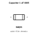
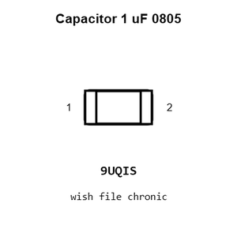
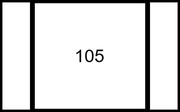
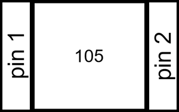
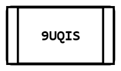
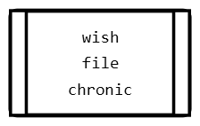
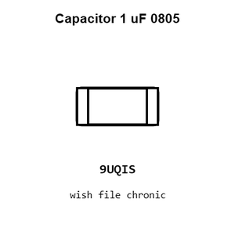
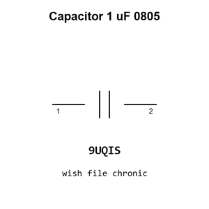
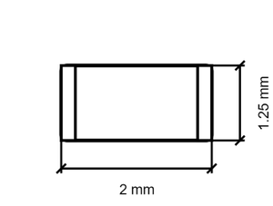

# Capacitor 1 uF 0805

`electronic_capacitor_0805_1_micro_farad`

Capacitor 1 uF 0805 is an OOMP electronic capacitor definition. It uses the 0805 package or form factor. Its nominal drawing size is 2.0 &#x00D7; 1.25 mm.

## At a glance

| Detail | Value |
| --- | --- |
| OOMP ID | `electronic_capacitor_0805_1_micro_farad` |
| Type | Capacitor |
| Package / style | 0805 |
| Nominal size | 2.0 &#x00D7; 1.25 mm |

## Classification

| Level | Value |
| --- | --- |
| 1 | `electronic` |
| 2 | `capacitor` |
| 3 | `0805` |
| 4 | `1_micro_farad` |

## Nominal dimensions

| Measurement | Value |
| --- | ---: |
| Length | 2.0 mm |
| Width | 1.25 mm |

## Identifiers

| Identifier | Value |
| --- | --- |
| Manufacturer part number | `CL21B105KBFNNNE` |
| LCSC | [`C28323`](https://www.lcsc.com/product-detail/C28323.html) |
| JLCPCB | [`C28323`](https://jlcpcb.com/partdetail/29074-CL21B105KBFNNNE/C28323) |

## Used in projects

| Project | Quantity | References | Explore |
| --- | ---: | --- | --- |
| [Project adafruit/Adafruit-128x32-I2C-OLED-Breakout-PCB Adafruit OLED 128x32 Mono I2 C current](https://github.com/adafruit/Adafruit-128x32-I2C-OLED-Breakout-PCB/blob/master/Adafruit%20OLED%20128x32%20Mono%20I2C.brd) | 4 | C1, C2, C3, C4 | [Board explorer](https://oomlout.github.io/oomp_electronic_version_5/parts/oomp_project_github_adafruit_adafruit_128x32_i2_c_oled_breakout_pcb_adafruit_oled_128x32_mono_i2_c_current/board_explorer.html) · [OOMP project](https://github.com/oomlout/oomp_electronic_version_5/tree/main/parts/oomp_project_github_adafruit_adafruit_128x32_i2_c_oled_breakout_pcb_adafruit_oled_128x32_mono_i2_c_current) |
| [Project adafruit/Adafruit-128x32-I2C-OLED-Breakout-PCB Adafruit OLED 128x32 Mono I2 C STEMMA QT current](https://github.com/adafruit/Adafruit-128x32-I2C-OLED-Breakout-PCB/blob/master/Adafruit%20OLED%20128x32%20Mono%20I2C%20STEMMA%20QT%20rev%20B.brd) | 4 | C4, C5, C6, C7 | [Board explorer](https://oomlout.github.io/oomp_electronic_version_5/parts/oomp_project_github_adafruit_adafruit_128x32_i2_c_oled_breakout_pcb_adafruit_oled_128x32_mono_i2_c_stemma_qt_current/board_explorer.html) · [OOMP project](https://github.com/oomlout/oomp_electronic_version_5/tree/main/parts/oomp_project_github_adafruit_adafruit_128x32_i2_c_oled_breakout_pcb_adafruit_oled_128x32_mono_i2_c_stemma_qt_current) |
| [Project adafruit/Adafruit-128x32-SPI-OLED-breakout-board-PCB Adafruit OLED 128x32 Mono current](https://github.com/adafruit/Adafruit-128x32-SPI-OLED-breakout-board-PCB/blob/master/Adafruit%20OLED%20128x32%20Mono.brd) | 4 | C1, C2, C3, C4 | [Board explorer](https://oomlout.github.io/oomp_electronic_version_5/parts/oomp_project_github_adafruit_adafruit_128x32_spi_oled_breakout_board_pcb_adafruit_oled_128x32_mono_current/board_explorer.html) · [OOMP project](https://github.com/oomlout/oomp_electronic_version_5/tree/main/parts/oomp_project_github_adafruit_adafruit_128x32_spi_oled_breakout_board_pcb_adafruit_oled_128x32_mono_current) |
| [Project adafruit/Adafruit-128x64-Monochrome-OLED-PCB 128x64 Mono OLED PCB current](https://github.com/adafruit/Adafruit-128x64-Monochrome-OLED-PCB/blob/master/Adafruit%20128x64%20Mono%20OLED%20PCB.brd) | 3 | C1, C2, C4 | [Board explorer](https://oomlout.github.io/oomp_electronic_version_5/parts/oomp_project_github_adafruit_adafruit_128x64_monochrome_oled_pcb_128x64_mono_oled_current/board_explorer.html) · [OOMP project](https://github.com/oomlout/oomp_electronic_version_5/tree/main/parts/oomp_project_github_adafruit_adafruit_128x64_monochrome_oled_pcb_128x64_mono_oled_current) |
| [Project adafruit/Adafruit-128x64-Monochrome-OLED-PCB 128x64 Mono OLED PCB v2 current](https://github.com/adafruit/Adafruit-128x64-Monochrome-OLED-PCB/blob/master/Adafruit%20128x64%20Mono%20OLED%20PCB%20v2.brd) | 4 | C3, C4, C6, C7 | [Board explorer](https://oomlout.github.io/oomp_electronic_version_5/parts/oomp_project_github_adafruit_adafruit_128x64_monochrome_oled_pcb_128x64_mono_oled_v2_current/board_explorer.html) · [OOMP project](https://github.com/oomlout/oomp_electronic_version_5/tree/main/parts/oomp_project_github_adafruit_adafruit_128x64_monochrome_oled_pcb_128x64_mono_oled_v2_current) |
| [Project adafruit/Adafruit-40-pin-TFT-Friend Adafruit 40pin TFT friend current](https://github.com/adafruit/Adafruit-40-pin-TFT-Friend/blob/master/Adafruit%2040pin%20TFT%20friend.brd) | 2 | C2, C8 | [Board explorer](https://oomlout.github.io/oomp_electronic_version_5/parts/oomp_project_github_adafruit_adafruit_40_pin_tft_friend_adafruit_40pin_tft_friend_current/board_explorer.html) · [OOMP project](https://github.com/oomlout/oomp_electronic_version_5/tree/main/parts/oomp_project_github_adafruit_adafruit_40_pin_tft_friend_adafruit_40pin_tft_friend_current) |
| [Project adafruit/Adafruit-5-HDMI-Backpack-PCB Adafruit 5in HDMI Backpack current](https://github.com/adafruit/Adafruit-5-HDMI-Backpack-PCB/blob/master/Adafruit%205in%20HDMI%20Backpack.brd) | 3 | C17, C18, C25 | [Board explorer](https://oomlout.github.io/oomp_electronic_version_5/parts/oomp_project_github_adafruit_adafruit_5_hdmi_backpack_pcb_adafruit_5in_hdmi_backpack_current/board_explorer.html) · [OOMP project](https://github.com/oomlout/oomp_electronic_version_5/tree/main/parts/oomp_project_github_adafruit_adafruit_5_hdmi_backpack_pcb_adafruit_5in_hdmi_backpack_current) |
| [Project adafruit/Adafruit-Bluefruit-LE-USB-Friend-and-Sniffer-PCB Adafruit Bluefruit LE USB Friend current](https://github.com/adafruit/Adafruit-Bluefruit-LE-USB-Friend-and-Sniffer-PCB/blob/master/Adafruit%20Bluefruit%20LE%20USB%20Friend.brd) | 2 | C1, C2 | [Board explorer](https://oomlout.github.io/oomp_electronic_version_5/parts/oomp_project_github_adafruit_adafruit_bluefruit_le_usb_friend_and_sniffer_pcb_adafruit_bluefruit_le_usb_friend_current/board_explorer.html) · [OOMP project](https://github.com/oomlout/oomp_electronic_version_5/tree/main/parts/oomp_project_github_adafruit_adafruit_bluefruit_le_usb_friend_and_sniffer_pcb_adafruit_bluefruit_le_usb_friend_current) |
| [Project adafruit/Adafruit-BMP085-PCB Adafruit BMP085 current](https://github.com/adafruit/Adafruit-BMP085-PCB/blob/master/Adafruit_BMP085.brd) | 2 | C1, C2 | [Board explorer](https://oomlout.github.io/oomp_electronic_version_5/parts/oomp_project_github_adafruit_adafruit_bmp085_pcb_adafruit_bmp085_current/board_explorer.html) · [OOMP project](https://github.com/oomlout/oomp_electronic_version_5/tree/main/parts/oomp_project_github_adafruit_adafruit_bmp085_pcb_adafruit_bmp085_current) |
| [Project adafruit/Adafruit-CAN-Pal-PCB Adafruit CAN Pal Breakout current](https://github.com/adafruit/Adafruit-CAN-Pal-PCB/blob/main/Adafruit%20CAN%20Pal%20Breakout.brd) | 1 | C18 | [Board explorer](https://oomlout.github.io/oomp_electronic_version_5/parts/oomp_project_github_adafruit_adafruit_can_pal_pcb_adafruit_can_pal_breakout_current/board_explorer.html) · [OOMP project](https://github.com/oomlout/oomp_electronic_version_5/tree/main/parts/oomp_project_github_adafruit_adafruit_can_pal_pcb_adafruit_can_pal_breakout_current) |
| [Project adafruit/Adafruit-DRV2605-PCB Adafruit DRV2605 L current](https://github.com/adafruit/Adafruit-DRV2605-PCB/blob/master/Adafruit%20DRV2605L.brd) | 2 | C1, C2 | [Board explorer](https://oomlout.github.io/oomp_electronic_version_5/parts/oomp_project_github_adafruit_adafruit_drv2605_pcb_adafruit_drv2605_l_current/board_explorer.html) · [OOMP project](https://github.com/oomlout/oomp_electronic_version_5/tree/main/parts/oomp_project_github_adafruit_adafruit_drv2605_pcb_adafruit_drv2605_l_current) |
| [Project adafruit/Adafruit-DS3231-Precision-RTC-Breakout-PCB Adafruit DS3231 RTC Breakout current](https://github.com/adafruit/Adafruit-DS3231-Precision-RTC-Breakout-PCB/blob/master/Adafruit%20DS3231%20RTC%20Breakout.brd) | 1 | C1 | [Board explorer](https://oomlout.github.io/oomp_electronic_version_5/parts/oomp_project_github_adafruit_adafruit_ds3231_precision_rtc_breakout_pcb_adafruit_ds3231_rtc_breakout_current/board_explorer.html) · [OOMP project](https://github.com/oomlout/oomp_electronic_version_5/tree/main/parts/oomp_project_github_adafruit_adafruit_ds3231_precision_rtc_breakout_pcb_adafruit_ds3231_rtc_breakout_current) |
| [Project adafruit/Adafruit-E-Paper-Display-Breakout-PCBs Adafruit 1.54in e Ink Breakout current](https://github.com/adafruit/Adafruit-E-Paper-Display-Breakout-PCBs/blob/master/Adafruit%201.54in%20eInk%20Breakout.brd) | 11 | C1, C2, C3, C4, C6, C7, C8, C16, C22, C23, C24 | [Board explorer](https://oomlout.github.io/oomp_electronic_version_5/parts/oomp_project_github_adafruit_adafruit_e_paper_display_breakout_pcbs_adafruit_1_54in_e_ink_breakout_current/board_explorer.html) · [OOMP project](https://github.com/oomlout/oomp_electronic_version_5/tree/main/parts/oomp_project_github_adafruit_adafruit_e_paper_display_breakout_pcbs_adafruit_1_54in_e_ink_breakout_current) |
| [Project adafruit/Adafruit-E-Paper-Display-Breakout-PCBs Adafruit 1.54in e Ink Breakout with EYESPI current](https://github.com/adafruit/Adafruit-E-Paper-Display-Breakout-PCBs/blob/master/Adafruit%201.54in%20eInk%20Breakout%20with%20EYESPI.brd) | 11 | C1, C2, C3, C4, C6, C7, C8, C16, C22, C23, C24 | [Board explorer](https://oomlout.github.io/oomp_electronic_version_5/parts/oomp_project_github_adafruit_adafruit_e_paper_display_breakout_pcbs_adafruit_1_54in_e_ink_breakout_with_eyespi_current/board_explorer.html) · [OOMP project](https://github.com/oomlout/oomp_electronic_version_5/tree/main/parts/oomp_project_github_adafruit_adafruit_e_paper_display_breakout_pcbs_adafruit_1_54in_e_ink_breakout_with_eyespi_current) |
| [Project adafruit/Adafruit-E-Paper-Display-Breakout-PCBs Adafruit 2.13in Tri Color e Ink Display current](https://github.com/adafruit/Adafruit-E-Paper-Display-Breakout-PCBs/blob/master/Adafruit%202.13in%20Tri-Color%20eInk%20Display.brd) | 7 | C1, C2, C3, C4, C6, C22, C23 | [Board explorer](https://oomlout.github.io/oomp_electronic_version_5/parts/oomp_project_github_adafruit_adafruit_e_paper_display_breakout_pcbs_adafruit_2_13in_tri_color_e_ink_display_current/board_explorer.html) · [OOMP project](https://github.com/oomlout/oomp_electronic_version_5/tree/main/parts/oomp_project_github_adafruit_adafruit_e_paper_display_breakout_pcbs_adafruit_2_13in_tri_color_e_ink_display_current) |
| [Project adafruit/Adafruit-E-Paper-Display-Breakout-PCBs Adafruit 2.13in Tri Color e Ink Feather Wing current](https://github.com/adafruit/Adafruit-E-Paper-Display-Breakout-PCBs/blob/master/Adafruit%202.13in%20Tri-Color%20eInk%20FeatherWing.brd) | 9 | C1, C2, C3, C4, C6, C16, C22, C23, C24 | [Board explorer](https://oomlout.github.io/oomp_electronic_version_5/parts/oomp_project_github_adafruit_adafruit_e_paper_display_breakout_pcbs_adafruit_2_13in_tri_color_e_ink_feather_wing_current/board_explorer.html) · [OOMP project](https://github.com/oomlout/oomp_electronic_version_5/tree/main/parts/oomp_project_github_adafruit_adafruit_e_paper_display_breakout_pcbs_adafruit_2_13in_tri_color_e_ink_feather_wing_current) |
| [Project adafruit/Adafruit-E-Paper-Display-Breakout-PCBs Adafruit 2.7in Tri Color e Ink Display current](https://github.com/adafruit/Adafruit-E-Paper-Display-Breakout-PCBs/blob/master/Adafruit%202.7in%20Tri-Color%20eInk%20Display.brd) | 10 | C1, C2, C3, C4, C6, C7, C16, C22, C23, C24 | [Board explorer](https://oomlout.github.io/oomp_electronic_version_5/parts/oomp_project_github_adafruit_adafruit_e_paper_display_breakout_pcbs_adafruit_2_7in_tri_color_e_ink_display_current/board_explorer.html) · [OOMP project](https://github.com/oomlout/oomp_electronic_version_5/tree/main/parts/oomp_project_github_adafruit_adafruit_e_paper_display_breakout_pcbs_adafruit_2_7in_tri_color_e_ink_display_current) |
| [Project adafruit/Adafruit-E-Paper-Display-Breakout-PCBs Adafruit 2.9in e Ink Display current](https://github.com/adafruit/Adafruit-E-Paper-Display-Breakout-PCBs/blob/master/Adafruit%202.9in%20eInk%20Display.brd) | 10 | C1, C2, C3, C4, C6, C7, C16, C22, C23, C24 | [Board explorer](https://oomlout.github.io/oomp_electronic_version_5/parts/oomp_project_github_adafruit_adafruit_e_paper_display_breakout_pcbs_adafruit_2_9in_e_ink_display_current/board_explorer.html) · [OOMP project](https://github.com/oomlout/oomp_electronic_version_5/tree/main/parts/oomp_project_github_adafruit_adafruit_e_paper_display_breakout_pcbs_adafruit_2_9in_e_ink_display_current) |
| [Project adafruit/Adafruit-E-Paper-Display-Breakout-PCBs Adafruit 2.9in e Ink Feather Wing current](https://github.com/adafruit/Adafruit-E-Paper-Display-Breakout-PCBs/blob/master/Adafruit%202.9in%20eInk%20FeatherWing.brd) | 9 | C1, C2, C3, C4, C6, C16, C22, C23, C24 | [Board explorer](https://oomlout.github.io/oomp_electronic_version_5/parts/oomp_project_github_adafruit_adafruit_e_paper_display_breakout_pcbs_adafruit_2_9in_e_ink_feather_wing_current/board_explorer.html) · [OOMP project](https://github.com/oomlout/oomp_electronic_version_5/tree/main/parts/oomp_project_github_adafruit_adafruit_e_paper_display_breakout_pcbs_adafruit_2_9in_e_ink_feather_wing_current) |
| [Project adafruit/Adafruit-E-Paper-Display-Breakout-PCBs Adafruit e Ink Breakout Friend current](https://github.com/adafruit/Adafruit-E-Paper-Display-Breakout-PCBs/blob/master/Adafruit%20eInk%20Breakout%20Friend.brd) | 10 | C1, C2, C3, C4, C6, C7, C16, C22, C23, C24 | [Board explorer](https://oomlout.github.io/oomp_electronic_version_5/parts/oomp_project_github_adafruit_adafruit_e_paper_display_breakout_pcbs_adafruit_e_ink_breakout_friend_current/board_explorer.html) · [OOMP project](https://github.com/oomlout/oomp_electronic_version_5/tree/main/parts/oomp_project_github_adafruit_adafruit_e_paper_display_breakout_pcbs_adafruit_e_ink_breakout_friend_current) |
| [Project adafruit/Adafruit-E-Paper-Display-Breakout-PCBs Adafruit e Ink Feather Friend current](https://github.com/adafruit/Adafruit-E-Paper-Display-Breakout-PCBs/blob/master/Adafruit%20eInk%20Feather%20Friend.brd) | 9 | C1, C2, C3, C4, C6, C16, C22, C23, C24 | [Board explorer](https://oomlout.github.io/oomp_electronic_version_5/parts/oomp_project_github_adafruit_adafruit_e_paper_display_breakout_pcbs_adafruit_e_ink_feather_friend_current/board_explorer.html) · [OOMP project](https://github.com/oomlout/oomp_electronic_version_5/tree/main/parts/oomp_project_github_adafruit_adafruit_e_paper_display_breakout_pcbs_adafruit_e_ink_feather_friend_current) |
| [Project adafruit/Adafruit-ESP32-HUZZAH-Breakout-PCB Adafruit ESP32 Huzzah Breakout current](https://github.com/adafruit/Adafruit-ESP32-HUZZAH-Breakout-PCB/blob/master/Adafruit%20ESP32%20Huzzah%20Breakout.brd) | 1 | C5 | [Board explorer](https://oomlout.github.io/oomp_electronic_version_5/parts/oomp_project_github_adafruit_adafruit_esp32_huzzah_breakout_pcb_adafruit_esp32_huzzah_breakout_current/board_explorer.html) · [OOMP project](https://github.com/oomlout/oomp_electronic_version_5/tree/main/parts/oomp_project_github_adafruit_adafruit_esp32_huzzah_breakout_pcb_adafruit_esp32_huzzah_breakout_current) |
| [Project adafruit/Adafruit-Feather-M4-CAN-PCB Adafruit Feather M4 Express CAN current](https://github.com/adafruit/Adafruit-Feather-M4-CAN-PCB/blob/main/Adafruit%20Feather%20M4%20Express%20CAN.brd) | 1 | C18 | [Board explorer](https://oomlout.github.io/oomp_electronic_version_5/parts/oomp_project_github_adafruit_adafruit_feather_m4_can_pcb_adafruit_feather_m4_express_can_current/board_explorer.html) · [OOMP project](https://github.com/oomlout/oomp_electronic_version_5/tree/main/parts/oomp_project_github_adafruit_adafruit_feather_m4_can_pcb_adafruit_feather_m4_express_can_current) |
| [Project adafruit/Adafruit-I2C-SPI-LCD-Backpack-PCB I2C SPI LCD STEMMA Backpack current](https://github.com/adafruit/Adafruit-I2C-SPI-LCD-Backpack-PCB/blob/master/Adafruit%20I2C%20SPI%20LCD%20STEMMA%20backpack.brd) | 1 | C6 | [Board explorer](https://oomlout.github.io/oomp_electronic_version_5/parts/oomp_project_github_adafruit_adafruit_i2_c_spi_lcd_backpack_pcb_i2c_spi_lcd_stemma_backpack_current/board_explorer.html) · [OOMP project](https://github.com/oomlout/oomp_electronic_version_5/tree/main/parts/oomp_project_github_adafruit_adafruit_i2_c_spi_lcd_backpack_pcb_i2c_spi_lcd_stemma_backpack_current) |
| [Project adafruit/Adafruit-I2S-Microphone-Breakout-PCB Adafruit I2 S Mic SPK0415 HM4 H current](https://github.com/adafruit/Adafruit-I2S-Microphone-Breakout-PCB/blob/master/Adafruit%20I2S%20Mic%20SPK0415HM4H.brd) | 1 | C4 | [Board explorer](https://oomlout.github.io/oomp_electronic_version_5/parts/oomp_project_github_adafruit_adafruit_i2_s_microphone_breakout_pcb_adafruit_i2_s_mic_spk0415_hm4_h_current/board_explorer.html) · [OOMP project](https://github.com/oomlout/oomp_electronic_version_5/tree/main/parts/oomp_project_github_adafruit_adafruit_i2_s_microphone_breakout_pcb_adafruit_i2_s_mic_spk0415_hm4_h_current) |
| [Project adafruit/Adafruit-INA219-Current-Sensor-PCB INA219 Feather Wing current](https://github.com/adafruit/Adafruit-INA219-Current-Sensor-PCB/blob/master/INA219%20FeatherWing.brd) | 1 | C1 | [Board explorer](https://oomlout.github.io/oomp_electronic_version_5/parts/oomp_project_github_adafruit_adafruit_ina219_current_sensor_pcb_ina219_feather_wing_current/board_explorer.html) · [OOMP project](https://github.com/oomlout/oomp_electronic_version_5/tree/main/parts/oomp_project_github_adafruit_adafruit_ina219_current_sensor_pcb_ina219_feather_wing_current) |

## Files

[KiCad symbol, machine-solder and hand-solder footprints](data/kicad/README.md) · [Availability and source masters](data/kicad/manifest.yaml)

[View this part on GitHub](https://github.com/oomlout/oomp_electronic_version_5/tree/main/parts/electronic_capacitor_0805_1_micro_farad)

[Browse this category](../../navigation/electronic/capacitor/0805/README.md)

---

This page is generated from the OOMP part definition by a Roboclick Jinja template. Edit the source taxonomy or template rather than this generated file.