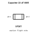
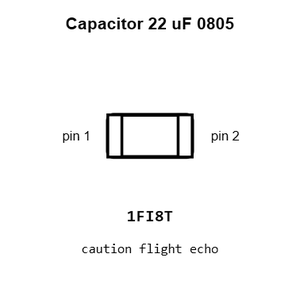
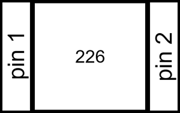
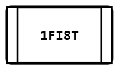
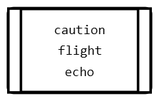
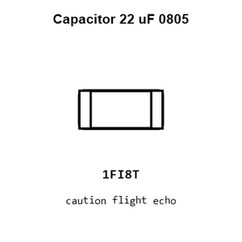
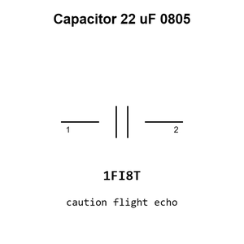

# Capacitor 22 uF 0805

`electronic_capacitor_0805_22_micro_farad`

Capacitor 22 uF 0805 is an OOMP electronic capacitor definition. It uses the 0805 package or form factor. Its nominal drawing size is 2.0 &#x00D7; 1.25 mm.

## At a glance

| Detail | Value |
| --- | --- |
| OOMP ID | `electronic_capacitor_0805_22_micro_farad` |
| Type | Capacitor |
| Package / style | 0805 |
| Nominal size | 2.0 &#x00D7; 1.25 mm |

## Classification

| Level | Value |
| --- | --- |
| 1 | `electronic` |
| 2 | `capacitor` |
| 3 | `0805` |
| 4 | `22_micro_farad` |

## Nominal dimensions

| Measurement | Value |
| --- | ---: |
| Length | 2.0 mm |
| Width | 1.25 mm |

## Used in projects

| Project | Quantity | References | Explore |
| --- | ---: | --- | --- |
| [Project adafruit/Adafruit-bq25185-Charger-Breakout-PCB Adafruit bq25185 Breakout1 current](https://github.com/adafruit/Adafruit-bq25185-Charger-Breakout-PCB/blob/main/Adafruit%20bq25185%20Breakout%20rev%20B1.brd) | 3 | C2, C3, C4 | [Board explorer](https://oomlout.github.io/oomp_electronic_version_5/parts/oomp_project_github_adafruit_adafruit_bq25185_charger_breakout_pcb_adafruit_bq25185_breakout1_current/board_explorer.html) · [OOMP project](https://github.com/oomlout/oomp_electronic_version_5/tree/main/parts/oomp_project_github_adafruit_adafruit_bq25185_charger_breakout_pcb_adafruit_bq25185_breakout1_current) |
| [Project adafruit/Adafruit-bq25185-Charger-Breakout-PCB Adafruit bq25185 Breakout current](https://github.com/adafruit/Adafruit-bq25185-Charger-Breakout-PCB/blob/main/Adafruit%20bq25185%20Breakout.brd) | 3 | C2, C3, C4 | [Board explorer](https://oomlout.github.io/oomp_electronic_version_5/parts/oomp_project_github_adafruit_adafruit_bq25185_charger_breakout_pcb_adafruit_bq25185_breakout_current/board_explorer.html) · [OOMP project](https://github.com/oomlout/oomp_electronic_version_5/tree/main/parts/oomp_project_github_adafruit_adafruit_bq25185_charger_breakout_pcb_adafruit_bq25185_breakout_current) |
| [Project adafruit/Adafruit-bq25185-with-3.3V-Buck-PCB Adafruit bq25185 with 3.3 V Output current](https://github.com/adafruit/Adafruit-bq25185-with-3.3V-Buck-PCB/blob/main/Adafruit%20bq25185%20with%203.3V%20Output.brd) | 5 | C3, C4, C5, C7, C8 | [Board explorer](https://oomlout.github.io/oomp_electronic_version_5/parts/oomp_project_github_adafruit_adafruit_bq25185_with_3_3_v_buck_pcb_adafruit_bq25185_with_3_3_v_output_current/board_explorer.html) · [OOMP project](https://github.com/oomlout/oomp_electronic_version_5/tree/main/parts/oomp_project_github_adafruit_adafruit_bq25185_with_3_3_v_buck_pcb_adafruit_bq25185_with_3_3_v_output_current) |
| [Project adafruit/Adafruit-bq25185-with-5V-Boost-PCB Adafruit bq25185 with 5 V Boost Breakout current](https://github.com/adafruit/Adafruit-bq25185-with-5V-Boost-PCB/blob/main/Adafruit%20bq25185%20with%205V%20Boost%20Breakout.brd) | 5 | C1, C2, C3, C7, C8 | [Board explorer](https://oomlout.github.io/oomp_electronic_version_5/parts/oomp_project_github_adafruit_adafruit_bq25185_with_5_v_boost_pcb_adafruit_bq25185_with_5_v_boost_breakout_current/board_explorer.html) · [OOMP project](https://github.com/oomlout/oomp_electronic_version_5/tree/main/parts/oomp_project_github_adafruit_adafruit_bq25185_with_5_v_boost_pcb_adafruit_bq25185_with_5_v_boost_breakout_current) |
| [Project adafruit/Adafruit-Feather-RP2040-USB-Host-PCB Adafruit Feather RP2040 USB Host current](https://github.com/adafruit/Adafruit-Feather-RP2040-USB-Host-PCB/blob/main/Adafruit%20Feather%20RP2040%20USB%20Host.brd) | 3 | C19, C21, C22 | [Board explorer](https://oomlout.github.io/oomp_electronic_version_5/parts/oomp_project_github_adafruit_adafruit_feather_rp2040_usb_host_pcb_adafruit_feather_rp2040_usb_host_current/board_explorer.html) · [OOMP project](https://github.com/oomlout/oomp_electronic_version_5/tree/main/parts/oomp_project_github_adafruit_adafruit_feather_rp2040_usb_host_pcb_adafruit_feather_rp2040_usb_host_current) |
| [Project adafruit/Adafruit-LM3671-Buck-Converter-PCB Adafruit LM3671 Buck current](https://github.com/adafruit/Adafruit-LM3671-Buck-Converter-PCB/blob/master/Adafruit%20LM3671%20Buck.brd) | 1 | C1 | [Board explorer](https://oomlout.github.io/oomp_electronic_version_5/parts/oomp_project_github_adafruit_adafruit_lm3671_buck_converter_pcb_adafruit_lm3671_buck_current/board_explorer.html) · [OOMP project](https://github.com/oomlout/oomp_electronic_version_5/tree/main/parts/oomp_project_github_adafruit_adafruit_lm3671_buck_converter_pcb_adafruit_lm3671_buck_current) |
| [Project adafruit/Adafruit-Metro-M7-with-AirLift-PCB Adafruit Metro M7 i MX RT1011 with Air Lift current](https://github.com/adafruit/Adafruit-Metro-M7-with-AirLift-PCB/blob/main/Adafruit%20Metro%20M7%20iMX%20RT1011%20with%20AirLift.brd) | 1 | C34 | [Board explorer](https://oomlout.github.io/oomp_electronic_version_5/parts/oomp_project_github_adafruit_adafruit_metro_m7_with_air_lift_pcb_adafruit_metro_m7_i_mx_rt1011_with_air_lift_current/board_explorer.html) · [OOMP project](https://github.com/oomlout/oomp_electronic_version_5/tree/main/parts/oomp_project_github_adafruit_adafruit_metro_m7_with_air_lift_pcb_adafruit_metro_m7_i_mx_rt1011_with_air_lift_current) |
| [Project adafruit/Adafruit-Metro-M7-with-microSD-PCB Adafruit Metro M7 with micro SD current](https://github.com/adafruit/Adafruit-Metro-M7-with-microSD-PCB/blob/main/Adafruit%20Metro%20M7%20with%20microSD.brd) | 1 | C34 | [Board explorer](https://oomlout.github.io/oomp_electronic_version_5/parts/oomp_project_github_adafruit_adafruit_metro_m7_with_micro_sd_pcb_adafruit_metro_m7_with_micro_sd_current/board_explorer.html) · [OOMP project](https://github.com/oomlout/oomp_electronic_version_5/tree/main/parts/oomp_project_github_adafruit_adafruit_metro_m7_with_micro_sd_pcb_adafruit_metro_m7_with_micro_sd_current) |
| [Project adafruit/Adafruit-Mini-Sparkle-Motion-PCB Adafruit Mini Sparkle Motion current](https://github.com/adafruit/Adafruit-Mini-Sparkle-Motion-PCB/blob/main/Adafruit%20Mini%20Sparkle%20Motion.brd) | 3 | C3, C5, C7 | [Board explorer](https://oomlout.github.io/oomp_electronic_version_5/parts/oomp_project_github_adafruit_adafruit_mini_sparkle_motion_pcb_adafruit_mini_sparkle_motion_current/board_explorer.html) · [OOMP project](https://github.com/oomlout/oomp_electronic_version_5/tree/main/parts/oomp_project_github_adafruit_adafruit_mini_sparkle_motion_pcb_adafruit_mini_sparkle_motion_current) |
| [Project adafruit/Adafruit-MPM3610-PCB Adafruit MPM3610 current](https://github.com/adafruit/Adafruit-MPM3610-PCB/blob/master/Adafruit%20MPM3610.brd) | 2 | C1, C2 | [Board explorer](https://oomlout.github.io/oomp_electronic_version_5/parts/oomp_project_github_adafruit_adafruit_mpm3610_pcb_adafruit_mpm3610_current/board_explorer.html) · [OOMP project](https://github.com/oomlout/oomp_electronic_version_5/tree/main/parts/oomp_project_github_adafruit_adafruit_mpm3610_pcb_adafruit_mpm3610_current) |

## Files

[KiCad symbol, machine-solder and hand-solder footprints](data/kicad/README.md) · [Availability and source masters](data/kicad/manifest.yaml)

[View this part on GitHub](https://github.com/oomlout/oomp_electronic_version_5/tree/main/parts/electronic_capacitor_0805_22_micro_farad)

[Browse this category](../../navigation/electronic/capacitor/0805/README.md)

---

This page is generated from the OOMP part definition by a Roboclick Jinja template. Edit the source taxonomy or template rather than this generated file.