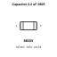
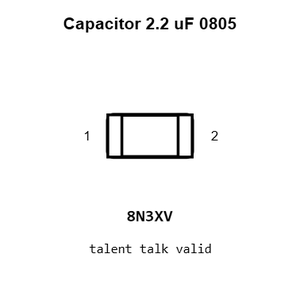
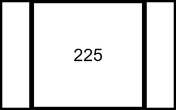
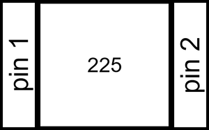
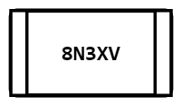
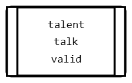
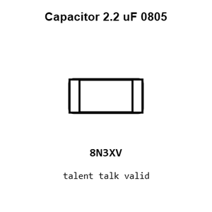
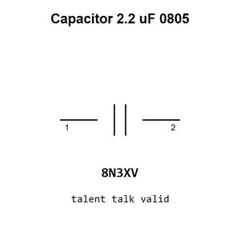
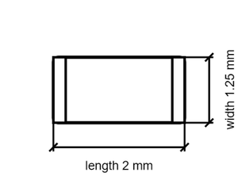

# Capacitor 2.2 uF 0805

`electronic_capacitor_0805_2_2_micro_farad`

Capacitor 2.2 uF 0805 is an OOMP electronic capacitor definition. It uses the 0805 package or form factor. Its nominal drawing size is 2.0 &#x00D7; 1.25 mm. The definition includes 2 documented pins.

## At a glance

| Detail | Value |
| --- | --- |
| OOMP ID | `electronic_capacitor_0805_2_2_micro_farad` |
| Type | Capacitor |
| Package / style | 0805 |
| Nominal size | 2.0 &#x00D7; 1.25 mm |
| Documented pins | 2 |

## Classification

| Level | Value |
| --- | --- |
| 1 | `electronic` |
| 2 | `capacitor` |
| 3 | `0805` |
| 4 | `2_2_micro_farad` |

## Nominal dimensions

| Measurement | Value |
| --- | ---: |
| Height | 1.25 mm |
| Length | 2.0 mm |
| Width | 1.25 mm |

## Identifiers

| Identifier | Value |
| --- | --- |
| Manufacturer part number | `CL21A225KBQNNNE` |
| LCSC | [`C377773`](https://www.lcsc.com/product-detail/C377773.html) |
| JLCPCB | [`C377773`](https://jlcpcb.com/partdetail/350246-CL21A225KBQNNNE/C377773) |

## Pins

| Pin | Name | Type |
| ---: | --- | --- |
| 1 | 1 | passive |
| 2 | 2 | passive |

## Datasheet

[View the datasheet](data/datasheet.pdf)

## Used in projects

| Project | Quantity | References | Explore |
| --- | ---: | --- | --- |
| [Project adafruit/2.8-TFT-Breakout-PCB Adafruit tftlcd8bit current](https://github.com/adafruit/2.8-TFT-Breakout-PCB/blob/master/Adafruit_tftlcd8bit.brd) | 2 | C1, C5 | [Board explorer](https://oomlout.github.io/oomp_electronic_version_5/parts/oomp_project_github_adafruit_2_8_tft_breakout_pcb_adafruit_tftlcd8bit_current/board_explorer.html) · [OOMP project](https://github.com/oomlout/oomp_electronic_version_5/tree/main/parts/oomp_project_github_adafruit_2_8_tft_breakout_pcb_adafruit_tftlcd8bit_current) |
| [Project adafruit/Adafruit-128x32-SPI-OLED-breakout-board-PCB Adafruit OLED 128x32 Mono current](https://github.com/adafruit/Adafruit-128x32-SPI-OLED-breakout-board-PCB/blob/master/Adafruit%20OLED%20128x32%20Mono.brd) | 3 | C5, C6, C7 | [Board explorer](https://oomlout.github.io/oomp_electronic_version_5/parts/oomp_project_github_adafruit_adafruit_128x32_spi_oled_breakout_board_pcb_adafruit_oled_128x32_mono_current/board_explorer.html) · [OOMP project](https://github.com/oomlout/oomp_electronic_version_5/tree/main/parts/oomp_project_github_adafruit_adafruit_128x32_spi_oled_breakout_board_pcb_adafruit_oled_128x32_mono_current) |
| [Project adafruit/Adafruit-128x64-Monochrome-OLED-PCB 0.96in 128x64 OLED STEMMA QT current](https://github.com/adafruit/Adafruit-128x64-Monochrome-OLED-PCB/blob/master/Adafruit%200.96in%20128x64%20OLED%20STEMMA%20QT.brd) | 2 | C12, C13 | [Board explorer](https://oomlout.github.io/oomp_electronic_version_5/parts/oomp_project_github_adafruit_adafruit_128x64_monochrome_oled_pcb_0_96in_128x64_oled_stemma_qt_current/board_explorer.html) · [OOMP project](https://github.com/oomlout/oomp_electronic_version_5/tree/main/parts/oomp_project_github_adafruit_adafruit_128x64_monochrome_oled_pcb_0_96in_128x64_oled_stemma_qt_current) |
| [Project adafruit/Adafruit-128x64-Monochrome-OLED-PCB 128x64 Mono OLED PCB current](https://github.com/adafruit/Adafruit-128x64-Monochrome-OLED-PCB/blob/master/Adafruit%20128x64%20Mono%20OLED%20PCB.brd) | 2 | C3, C6 | [Board explorer](https://oomlout.github.io/oomp_electronic_version_5/parts/oomp_project_github_adafruit_adafruit_128x64_monochrome_oled_pcb_128x64_mono_oled_current/board_explorer.html) · [OOMP project](https://github.com/oomlout/oomp_electronic_version_5/tree/main/parts/oomp_project_github_adafruit_adafruit_128x64_monochrome_oled_pcb_128x64_mono_oled_current) |
| [Project adafruit/Adafruit-128x64-Monochrome-OLED-PCB 128x64 Mono OLED PCB v2 current](https://github.com/adafruit/Adafruit-128x64-Monochrome-OLED-PCB/blob/master/Adafruit%20128x64%20Mono%20OLED%20PCB%20v2.brd) | 1 | C8 | [Board explorer](https://oomlout.github.io/oomp_electronic_version_5/parts/oomp_project_github_adafruit_adafruit_128x64_monochrome_oled_pcb_128x64_mono_oled_v2_current/board_explorer.html) · [OOMP project](https://github.com/oomlout/oomp_electronic_version_5/tree/main/parts/oomp_project_github_adafruit_adafruit_128x64_monochrome_oled_pcb_128x64_mono_oled_v2_current) |
| [Project adafruit/Adafruit-128x64-OLED-Bonnet-for-Raspberry-Pi-PCB Adafruit 128x64 OLED Bonnet current](https://github.com/adafruit/Adafruit-128x64-OLED-Bonnet-for-Raspberry-Pi-PCB/blob/master/Adafruit%20128x64%20OLED%20Bonnet.brd) | 5 | C3, C4, C6, C7, C8 | [Board explorer](https://oomlout.github.io/oomp_electronic_version_5/parts/oomp_project_github_adafruit_adafruit_128x64_oled_bonnet_for_raspberry_pi_pcb_adafruit_128x64_oled_bonnet_current/board_explorer.html) · [OOMP project](https://github.com/oomlout/oomp_electronic_version_5/tree/main/parts/oomp_project_github_adafruit_adafruit_128x64_oled_bonnet_for_raspberry_pi_pcb_adafruit_128x64_oled_bonnet_current) |

## Files

[KiCad symbol, machine-solder and hand-solder footprints](data/kicad/README.md) · [Availability and source masters](data/kicad/manifest.yaml)

[View this part on GitHub](https://github.com/oomlout/oomp_electronic_version_5/tree/main/parts/electronic_capacitor_0805_2_2_micro_farad)

[Browse this category](../../navigation/electronic/capacitor/0805/README.md)

---

This page is generated from the OOMP part definition by a Roboclick Jinja template. Edit the source taxonomy or template rather than this generated file.