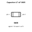
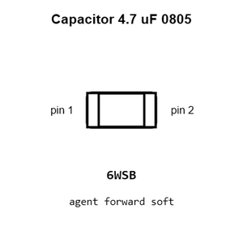
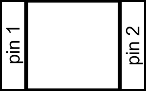
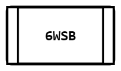
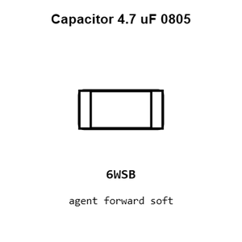
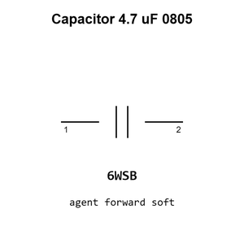

# Capacitor 4.7 uF 0805

`electronic_capacitor_0805_4_7_micro_farad`

Capacitor 4.7 uF 0805 is an OOMP electronic capacitor definition. It uses the 0805 package or form factor. Its nominal drawing size is 2.0 &#x00D7; 1.25 mm.

## At a glance

| Detail | Value |
| --- | --- |
| OOMP ID | `electronic_capacitor_0805_4_7_micro_farad` |
| Type | Capacitor |
| Package / style | 0805 |
| Nominal size | 2.0 &#x00D7; 1.25 mm |

## Classification

| Level | Value |
| --- | --- |
| 1 | `electronic` |
| 2 | `capacitor` |
| 3 | `0805` |
| 4 | `4_7_micro_farad` |

## Nominal dimensions

| Measurement | Value |
| --- | ---: |
| Length | 2.0 mm |
| Width | 1.25 mm |

## Used in projects

| Project | Quantity | References | Explore |
| --- | ---: | --- | --- |
| [Project adafruit/Adafruit-9-DOF-and-10-DOF-PCBs Adafuit 10 DOF current](https://github.com/adafruit/Adafruit-9-DOF-and-10-DOF-PCBs/blob/master/Adafuit_10DOF.brd) | 1 | C6 | [Board explorer](https://oomlout.github.io/oomp_electronic_version_5/parts/oomp_project_github_adafruit_adafruit_9_dof_and_10_dof_pcbs_adafuit_10_dof_current/board_explorer.html) · [OOMP project](https://github.com/oomlout/oomp_electronic_version_5/tree/main/parts/oomp_project_github_adafruit_adafruit_9_dof_and_10_dof_pcbs_adafuit_10_dof_current) |
| [Project adafruit/Adafruit-9-DOF-and-10-DOF-PCBs Adafuit 9 DOF current](https://github.com/adafruit/Adafruit-9-DOF-and-10-DOF-PCBs/blob/master/Adafuit_9DOF.brd) | 1 | C6 | [Board explorer](https://oomlout.github.io/oomp_electronic_version_5/parts/oomp_project_github_adafruit_adafruit_9_dof_and_10_dof_pcbs_adafuit_9_dof_current/board_explorer.html) · [OOMP project](https://github.com/oomlout/oomp_electronic_version_5/tree/main/parts/oomp_project_github_adafruit_adafruit_9_dof_and_10_dof_pcbs_adafuit_9_dof_current) |
| [Project adafruit/Adafruit-E-Paper-Display-Breakout-PCBs Adafruit 1.54in e Ink Breakout current](https://github.com/adafruit/Adafruit-E-Paper-Display-Breakout-PCBs/blob/master/Adafruit%201.54in%20eInk%20Breakout.brd) | 1 | C5 | [Board explorer](https://oomlout.github.io/oomp_electronic_version_5/parts/oomp_project_github_adafruit_adafruit_e_paper_display_breakout_pcbs_adafruit_1_54in_e_ink_breakout_current/board_explorer.html) · [OOMP project](https://github.com/oomlout/oomp_electronic_version_5/tree/main/parts/oomp_project_github_adafruit_adafruit_e_paper_display_breakout_pcbs_adafruit_1_54in_e_ink_breakout_current) |
| [Project adafruit/Adafruit-E-Paper-Display-Breakout-PCBs Adafruit 1.54in e Ink Breakout with EYESPI current](https://github.com/adafruit/Adafruit-E-Paper-Display-Breakout-PCBs/blob/master/Adafruit%201.54in%20eInk%20Breakout%20with%20EYESPI.brd) | 1 | C5 | [Board explorer](https://oomlout.github.io/oomp_electronic_version_5/parts/oomp_project_github_adafruit_adafruit_e_paper_display_breakout_pcbs_adafruit_1_54in_e_ink_breakout_with_eyespi_current/board_explorer.html) · [OOMP project](https://github.com/oomlout/oomp_electronic_version_5/tree/main/parts/oomp_project_github_adafruit_adafruit_e_paper_display_breakout_pcbs_adafruit_1_54in_e_ink_breakout_with_eyespi_current) |
| [Project adafruit/Adafruit-E-Paper-Display-Breakout-PCBs Adafruit 2.13in Tri Color e Ink Display current](https://github.com/adafruit/Adafruit-E-Paper-Display-Breakout-PCBs/blob/master/Adafruit%202.13in%20Tri-Color%20eInk%20Display.brd) | 1 | C5 | [Board explorer](https://oomlout.github.io/oomp_electronic_version_5/parts/oomp_project_github_adafruit_adafruit_e_paper_display_breakout_pcbs_adafruit_2_13in_tri_color_e_ink_display_current/board_explorer.html) · [OOMP project](https://github.com/oomlout/oomp_electronic_version_5/tree/main/parts/oomp_project_github_adafruit_adafruit_e_paper_display_breakout_pcbs_adafruit_2_13in_tri_color_e_ink_display_current) |
| [Project adafruit/Adafruit-E-Paper-Display-Breakout-PCBs Adafruit 2.7in Tri Color e Ink Display current](https://github.com/adafruit/Adafruit-E-Paper-Display-Breakout-PCBs/blob/master/Adafruit%202.7in%20Tri-Color%20eInk%20Display.brd) | 1 | C5 | [Board explorer](https://oomlout.github.io/oomp_electronic_version_5/parts/oomp_project_github_adafruit_adafruit_e_paper_display_breakout_pcbs_adafruit_2_7in_tri_color_e_ink_display_current/board_explorer.html) · [OOMP project](https://github.com/oomlout/oomp_electronic_version_5/tree/main/parts/oomp_project_github_adafruit_adafruit_e_paper_display_breakout_pcbs_adafruit_2_7in_tri_color_e_ink_display_current) |
| [Project adafruit/Adafruit-E-Paper-Display-Breakout-PCBs Adafruit 2.9in e Ink Display current](https://github.com/adafruit/Adafruit-E-Paper-Display-Breakout-PCBs/blob/master/Adafruit%202.9in%20eInk%20Display.brd) | 1 | C5 | [Board explorer](https://oomlout.github.io/oomp_electronic_version_5/parts/oomp_project_github_adafruit_adafruit_e_paper_display_breakout_pcbs_adafruit_2_9in_e_ink_display_current/board_explorer.html) · [OOMP project](https://github.com/oomlout/oomp_electronic_version_5/tree/main/parts/oomp_project_github_adafruit_adafruit_e_paper_display_breakout_pcbs_adafruit_2_9in_e_ink_display_current) |
| [Project adafruit/Adafruit_MagTag_PCBs Adafruit Mag Tag 2.9in current](https://github.com/adafruit/Adafruit_MagTag_PCBs/blob/main/Adafruit%20MagTag%202.9in.brd) | 1 | C29 | [Board explorer](https://oomlout.github.io/oomp_electronic_version_5/parts/oomp_project_github_adafruit_adafruit_mag_tag_pcbs_adafruit_mag_tag_2_9in_current/board_explorer.html) · [OOMP project](https://github.com/oomlout/oomp_electronic_version_5/tree/main/parts/oomp_project_github_adafruit_adafruit_mag_tag_pcbs_adafruit_mag_tag_2_9in_current) |

## Files

[KiCad symbol, machine-solder and hand-solder footprints](data/kicad/README.md) · [Availability and source masters](data/kicad/manifest.yaml)

[View this part on GitHub](https://github.com/oomlout/oomp_electronic_version_5/tree/main/parts/electronic_capacitor_0805_4_7_micro_farad)

[Browse this category](../../navigation/electronic/capacitor/0805/README.md)

---

This page is generated from the OOMP part definition by a Roboclick Jinja template. Edit the source taxonomy or template rather than this generated file.