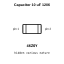
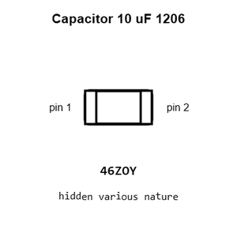
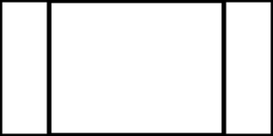
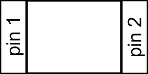
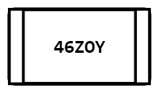
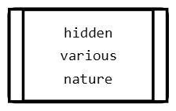
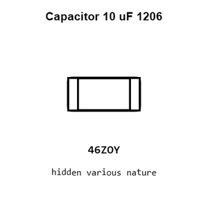
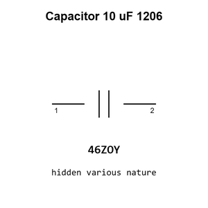

# Capacitor 10 uF 1206

`electronic_capacitor_1206_10_micro_farad`

Capacitor 10 uF 1206 is an OOMP electronic capacitor definition. It uses the 1206 package or form factor. Its nominal drawing size is 3.2 &#x00D7; 1.6 mm.

## At a glance

| Detail | Value |
| --- | --- |
| OOMP ID | `electronic_capacitor_1206_10_micro_farad` |
| Type | Capacitor |
| Package / style | 1206 |
| Nominal size | 3.2 &#x00D7; 1.6 mm |

## Classification

| Level | Value |
| --- | --- |
| 1 | `electronic` |
| 2 | `capacitor` |
| 3 | `1206` |
| 4 | `10_micro_farad` |

## Nominal dimensions

| Measurement | Value |
| --- | ---: |
| Length | 3.2 mm |
| Width | 1.6 mm |

## Used in projects

| Project | Quantity | References | Explore |
| --- | ---: | --- | --- |
| [Project soldered_electronics/Accelerometer---Gyroscope---Magnetometer-LSM9DS1TR-breakout-hardware-design LSM9DS1TR IMU current](https://github.com/SolderedElectronics/Accelerometer---Gyroscope---Magnetometer-LSM9DS1TR-breakout-hardware-design) | 1 | C3 | [Board explorer](https://oomlout.github.io/oomp_electronic_version_5/parts/oomp_project_github_soldered_electronics_accelerometer_gyroscope_magnetometer_lsm9_ds1_tr_breakout_hardware_design_sensor_imu_lsm9ds1tr_current/board_explorer.html) · [OOMP project](https://github.com/oomlout/oomp_electronic_version_5/tree/main/parts/oomp_project_github_soldered_electronics_accelerometer_gyroscope_magnetometer_lsm9_ds1_tr_breakout_hardware_design_sensor_imu_lsm9ds1tr_current) |
| [Project soldered_electronics/Air-quality-sensor-CCS811-breakout-hardware-design CCS811 Breakout current](https://github.com/SolderedElectronics/Air-quality-sensor-CCS811-breakout-hardware-design) | 1 | C1 | [Board explorer](https://oomlout.github.io/oomp_electronic_version_5/parts/oomp_project_github_soldered_electronics_air_quality_sensor_ccs811_breakout_hardware_design_sensor_air_quality_ccs811_current/board_explorer.html) · [OOMP project](https://github.com/oomlout/oomp_electronic_version_5/tree/main/parts/oomp_project_github_soldered_electronics_air_quality_sensor_ccs811_breakout_hardware_design_sensor_air_quality_ccs811_current) |
| [Project soldered_electronics/GNSS-GPS-L86-M33-breakout-hardware-design L86-M33 GNSS current](https://github.com/SolderedElectronics/GNSS-GPS-L86-M33-breakout-hardware-design) | 1 | C2 | [Board explorer](https://oomlout.github.io/oomp_electronic_version_5/parts/oomp_project_github_soldered_electronics_gnss_gps_l86_m33_breakout_hardware_design_sensor_gnss_l86m33_current/board_explorer.html) · [OOMP project](https://github.com/oomlout/oomp_electronic_version_5/tree/main/parts/oomp_project_github_soldered_electronics_gnss_gps_l86_m33_breakout_hardware_design_sensor_gnss_l86m33_current) |
| [Project soldered_electronics/GNSS-GPS-L86-M33-breakout-with-easyC-hardware-design L86-M33 GNSS easyC current](https://github.com/SolderedElectronics/GNSS-GPS-L86-M33-breakout-with-easyC-hardware-design) | 1 | C3 | [Board explorer](https://oomlout.github.io/oomp_electronic_version_5/parts/oomp_project_github_soldered_electronics_gnss_gps_l86_m33_breakout_with_easy_c_hardware_design_sensor_gnss_l86m33_easyc_current/board_explorer.html) · [OOMP project](https://github.com/oomlout/oomp_electronic_version_5/tree/main/parts/oomp_project_github_soldered_electronics_gnss_gps_l86_m33_breakout_with_easy_c_hardware_design_sensor_gnss_l86m33_easyc_current) |
| [Project soldered_electronics/Load-cell-ampfilier-HX711-board-hardware-design HX711 Load Cell current](https://github.com/SolderedElectronics/Load-cell-ampfilier-HX711-board-hardware-design) | 2 | C2, C6 | [Board explorer](https://oomlout.github.io/oomp_electronic_version_5/parts/oomp_project_github_soldered_electronics_load_cell_ampfilier_hx711_board_hardware_design_sensor_load_cell_hx711_current/board_explorer.html) · [OOMP project](https://github.com/oomlout/oomp_electronic_version_5/tree/main/parts/oomp_project_github_soldered_electronics_load_cell_ampfilier_hx711_board_hardware_design_sensor_load_cell_hx711_current) |
| [Project soldered_electronics/Load-cell-ampfilier-HX711-board-qwiic-hardware-design HX711 Load Cell qwiic current](https://github.com/SolderedElectronics/Load-cell-amplifier-HX711-board-qwiic-hardware-design) | 2 | C2, C6 | [Board explorer](https://oomlout.github.io/oomp_electronic_version_5/parts/oomp_project_github_soldered_electronics_load_cell_ampfilier_hx711_board_qwiic_hardware_design_sensor_load_cell_hx711_qwiic_current/board_explorer.html) · [OOMP project](https://github.com/oomlout/oomp_electronic_version_5/tree/main/parts/oomp_project_github_soldered_electronics_load_cell_ampfilier_hx711_board_qwiic_hardware_design_sensor_load_cell_hx711_qwiic_current) |
| [Project soldered_electronics/Load-cell-ampfilier-HX711-board-with-easy-C-hardware-design HX711 Load Cell easyC current](https://github.com/SolderedElectronics/Load-cell-ampfilier-HX711-board-with-easy-C-hardware-design) | 2 | C2, C6 | [Board explorer](https://oomlout.github.io/oomp_electronic_version_5/parts/oomp_project_github_soldered_electronics_load_cell_ampfilier_hx711_board_with_easy_c_hardware_design_sensor_load_cell_hx711_easyc_current/board_explorer.html) · [OOMP project](https://github.com/oomlout/oomp_electronic_version_5/tree/main/parts/oomp_project_github_soldered_electronics_load_cell_ampfilier_hx711_board_with_easy_c_hardware_design_sensor_load_cell_hx711_easyc_current) |

## Files

[KiCad symbol, machine-solder and hand-solder footprints](data/kicad/README.md) · [Availability and source masters](data/kicad/manifest.yaml)

[View this part on GitHub](https://github.com/oomlout/oomp_electronic_version_5/tree/main/parts/electronic_capacitor_1206_10_micro_farad)

[Browse this category](../../navigation/electronic/capacitor/1206/README.md)

---

This page is generated from the OOMP part definition by a Roboclick Jinja template. Edit the source taxonomy or template rather than this generated file.