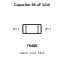
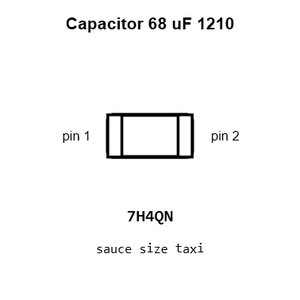
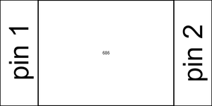
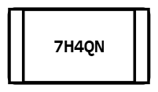
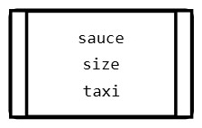
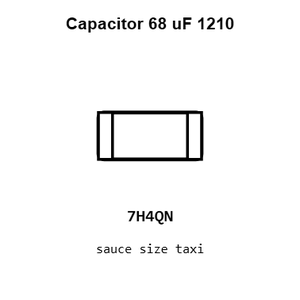
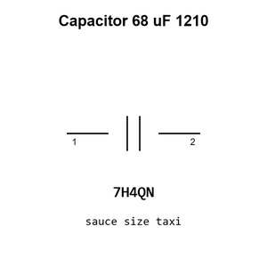
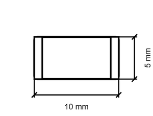
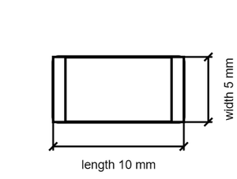

# Capacitor 68 uF 1210

`electronic_capacitor_1210_68_micro_farad`

Capacitor 68 uF 1210 is an OOMP electronic capacitor definition. It uses the 1210 package or form factor. Its nominal drawing size is 10.0 &#x00D7; 5.0 mm.

## At a glance

| Detail | Value |
| --- | --- |
| OOMP ID | `electronic_capacitor_1210_68_micro_farad` |
| Type | Capacitor |
| Package / style | 1210 |
| Nominal size | 10.0 &#x00D7; 5.0 mm |

## Classification

| Level | Value |
| --- | --- |
| 1 | `electronic` |
| 2 | `capacitor` |
| 3 | `1210` |
| 4 | `68_micro_farad` |

## Nominal dimensions

| Measurement | Value |
| --- | ---: |
| Length | 10.0 mm |
| Width | 5.0 mm |

## Used in projects

| Project | Quantity | References | Explore |
| --- | ---: | --- | --- |
| [Project soldered_electronics/Color-and-gesture-sensor-APDS-9960-breakout-hardware-design APDS-9960 Breakout current](https://github.com/SolderedElectronics/Color-and-gesture-sensor-APDS-9960-breakout-hardware-design) | 1 | C2 | [Board explorer](https://oomlout.github.io/oomp_electronic_version_5/parts/oomp_project_github_soldered_electronics_color_and_gesture_sensor_apds_9960_breakout_hardware_design_sensor_color_gesture_apds9960_current/board_explorer.html) · [OOMP project](https://github.com/oomlout/oomp_electronic_version_5/tree/main/parts/oomp_project_github_soldered_electronics_color_and_gesture_sensor_apds_9960_breakout_hardware_design_sensor_color_gesture_apds9960_current) |
| [Project soldered_electronics/Color---gesture-sensor-APDS-9960-breakout-hardware-design APDS-9960 Breakout current](https://github.com/SolderedElectronics/Color---gesture-sensor-APDS-9960-breakout-hardware-design) | 1 | C2 | [Board explorer](https://oomlout.github.io/oomp_electronic_version_5/parts/oomp_project_github_soldered_electronics_color_gesture_sensor_apds_9960_breakout_hardware_design_sensor_color_gesture_apds9960_current/board_explorer.html) · [OOMP project](https://github.com/oomlout/oomp_electronic_version_5/tree/main/parts/oomp_project_github_soldered_electronics_color_gesture_sensor_apds_9960_breakout_hardware_design_sensor_color_gesture_apds9960_current) |

## Files

[KiCad symbol, machine-solder and hand-solder footprints](data/kicad/README.md) · [Availability and source masters](data/kicad/manifest.yaml)

[View this part on GitHub](https://github.com/oomlout/oomp_electronic_version_5/tree/main/parts/electronic_capacitor_1210_68_micro_farad)

[Browse this category](../../navigation/electronic/capacitor/1210/README.md)

---

This page is generated from the OOMP part definition by a Roboclick Jinja template. Edit the source taxonomy or template rather than this generated file.