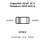
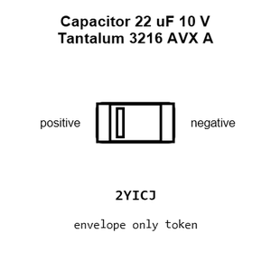
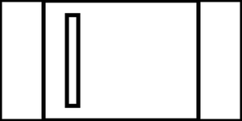
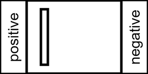
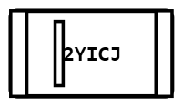
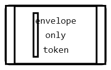
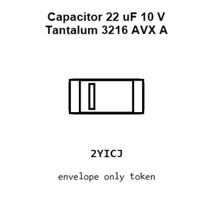
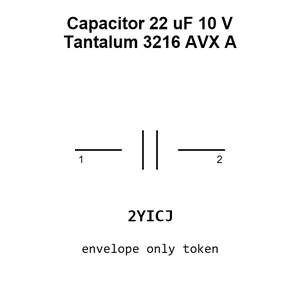
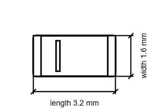

# Capacitor 22 uF 10 V Tantalum 3216 AVX A

`electronic_capacitor_3216_avx_a_tantalum_22_micro_farad_10_volt`

Capacitor 22 uF 10 V Tantalum 3216 AVX A is an OOMP electronic capacitor definition. It uses the 3216 avx a package or form factor. Its nominal drawing size is 3.2 &#x00D7; 1.6 mm. The definition includes 2 documented pins.

## At a glance

| Detail | Value |
| --- | --- |
| OOMP ID | `electronic_capacitor_3216_avx_a_tantalum_22_micro_farad_10_volt` |
| Type | Capacitor |
| Package / style | 3216 avx a |
| Nominal size | 3.2 &#x00D7; 1.6 mm |
| Documented pins | 2 |

## Classification

| Level | Value |
| --- | --- |
| 1 | `electronic` |
| 2 | `capacitor` |
| 3 | `3216_avx_a` |
| 4 | `tantalum` |
| 5 | `22_micro_farad` |
| 6 | `10_volt` |

## Nominal dimensions

| Measurement | Value |
| --- | ---: |
| Length | 3.2 mm |
| Width | 1.6 mm |

## Identifiers

| Identifier | Value |
| --- | --- |
| Manufacturer part number | `TAJA226K010RNJ` |
| LCSC | [`C11366`](https://www.lcsc.com/product-detail/C11366.html) |

## Pins

| Pin | Name | Type |
| ---: | --- | --- |
| 1 | positive | passive |
| 2 | negative | passive |

## Used in projects

| Project | Quantity | References | Explore |
| --- | ---: | --- | --- |
| [Project hanqaqa/easyduino ATmega328P Arduino Uno current](https://github.com/Hanqaqa/Easyduino/tree/master/Atmega328p%20Arduino%20Uno) | 3 | C10, C11, C12 | [Board explorer](https://oomlout.github.io/oomp_electronic_version_5/parts/oomp_project_github_hanqaqa_easyduino_atmega328p_arduino_uno_current/board_explorer.html) · [OOMP project](https://github.com/oomlout/oomp_electronic_version_5/tree/main/parts/oomp_project_github_hanqaqa_easyduino_atmega328p_arduino_uno_current) |
| [Project hanqaqa/easyduino ESP32 current](https://github.com/Hanqaqa/Easyduino/tree/master/ESP32) | 3 | C5, C7, C8 | [Board explorer](https://oomlout.github.io/oomp_electronic_version_5/parts/oomp_project_github_hanqaqa_easyduino_esp32_current/board_explorer.html) · [OOMP project](https://github.com/oomlout/oomp_electronic_version_5/tree/main/parts/oomp_project_github_hanqaqa_easyduino_esp32_current) |
| [Project hanqaqa/easyduino ESP32S3 current](https://github.com/Hanqaqa/Easyduino/tree/master/ESP32S3) | 3 | C6, C7, C10 | [Board explorer](https://oomlout.github.io/oomp_electronic_version_5/parts/oomp_project_github_hanqaqa_easyduino_esp32s3_current/board_explorer.html) · [OOMP project](https://github.com/oomlout/oomp_electronic_version_5/tree/main/parts/oomp_project_github_hanqaqa_easyduino_esp32s3_current) |

## Files

[KiCad symbol, machine-solder and hand-solder footprints](data/kicad/README.md) · [Availability and source masters](data/kicad/manifest.yaml)

[View this part on GitHub](https://github.com/oomlout/oomp_electronic_version_5/tree/main/parts/electronic_capacitor_3216_avx_a_tantalum_22_micro_farad_10_volt)

[Browse this category](../../navigation/electronic/capacitor/3216_avx_a/tantalum/22_micro_farad/README.md)

---

This page is generated from the OOMP part definition by a Roboclick Jinja template. Edit the source taxonomy or template rather than this generated file.