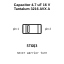
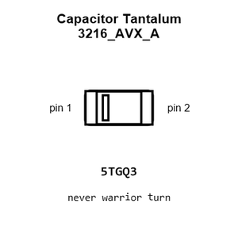
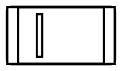
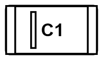
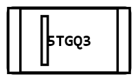
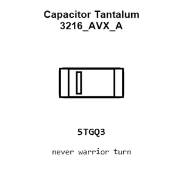
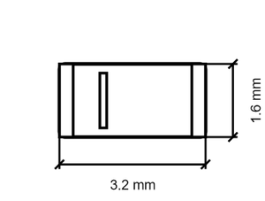

# Capacitor 4.7 uF 16 V Tantalum 3216 AVX A

`electronic_capacitor_3216_avx_a_tantalum_4_7_micro_farad_16_volt`

Capacitor 4.7 uF 16 V Tantalum 3216 AVX A is an OOMP electronic capacitor definition. It uses the 3216 avx a package or form factor. Its nominal drawing size is 3.2 &#x00D7; 1.6 mm.

## At a glance

| Detail | Value |
| --- | --- |
| OOMP ID | `electronic_capacitor_3216_avx_a_tantalum_4_7_micro_farad_16_volt` |
| Type | Capacitor |
| Package / style | 3216 avx a |
| Nominal size | 3.2 &#x00D7; 1.6 mm |

## Classification

| Level | Value |
| --- | --- |
| 1 | `electronic` |
| 2 | `capacitor` |
| 3 | `3216_avx_a` |
| 4 | `tantalum` |
| 5 | `4_7_micro_farad` |
| 6 | `16_volt` |

## Nominal dimensions

| Measurement | Value |
| --- | ---: |
| Length | 3.2 mm |
| Width | 1.6 mm |

## Files

[KiCad symbol, machine-solder and hand-solder footprints](data/kicad/README.md) · [Availability and source masters](data/kicad/manifest.yaml)

[View this part on GitHub](https://github.com/oomlout/oomp_electronic_version_5/tree/main/parts/electronic_capacitor_3216_avx_a_tantalum_4_7_micro_farad_16_volt)

[Browse this category](../../navigation/electronic/capacitor/3216_avx_a/tantalum/4_7_micro_farad/README.md)

---

This page is generated from the OOMP part definition by a Roboclick Jinja template. Edit the source taxonomy or template rather than this generated file.