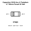
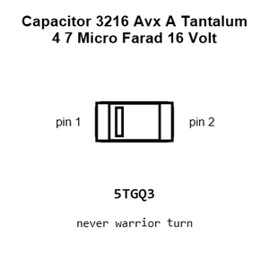
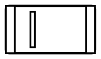
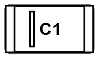
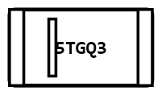
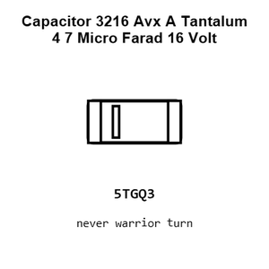
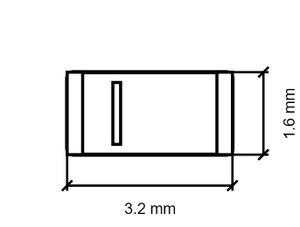
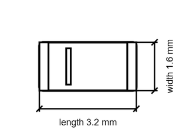

# Capacitor 3216 Avx A Tantalum 4 7 Micro Farad 16 Volt

`electronic_capacitor_3216_avx_a_tantalum_4_7_micro_farad_16_volt`

Capacitor 3216 Avx A Tantalum 4 7 Micro Farad 16 Volt is an OOMP electronic capacitor definition. It uses the 3216 avx a package or form factor. Its nominal drawing size is 3.2 × 1.6 mm.

## At a glance

| Detail | Value |
| --- | --- |
| OOMP ID | `electronic_capacitor_3216_avx_a_tantalum_4_7_micro_farad_16_volt` |
| Type | Capacitor |
| Package / style | 3216 avx a |
| Nominal size | 3.2 × 1.6 mm |

## Classification

| Level | Value |
| --- | --- |
| 1 | `electronic` |
| 2 | `capacitor` |
| 3 | `3216_avx_a` |
| 4 | `tantalum` |
| 5 | `4_7_micro_farad` |
| 6 | `16_volt` |

## Nominal dimensions

| Measurement | Value |
| --- | ---: |
| Length | 3.2 mm |
| Width | 1.6 mm |

## Files

[View this part on GitHub](https://github.com/oomlout/oomp_electronic_version_5/tree/main/parts/electronic_capacitor_3216_avx_a_tantalum_4_7_micro_farad_16_volt)

---

This page is generated from the OOMP part definition by a Roboclick Jinja template. Edit the source taxonomy or template rather than this generated file.
