# Capacitor 4.7 uF 25 V Tantalum 3216 AVX A

`electronic_capacitor_3216_avx_a_tantalum_4_7_micro_farad_25_volt_avx_taja475k025rnej`

Capacitor 4.7 uF 25 V Tantalum 3216 AVX A is an OOMP electronic capacitor definition. It uses the 3216 avx a package or form factor. Its nominal drawing size is 3.2 &#x00D7; 1.6 mm. The definition includes 2 documented pins.

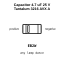

## At a glance

| Detail | Value |
| --- | --- |
| OOMP ID | `electronic_capacitor_3216_avx_a_tantalum_4_7_micro_farad_25_volt_avx_taja475k025rnej` |
| Type | Capacitor |
| Package / style | 3216 avx a |
| Nominal size | 3.2 &#x00D7; 1.6 mm |
| Documented pins | 2 |

## Classification

| Level | Value |
| --- | --- |
| 1 | `electronic` |
| 2 | `capacitor` |
| 3 | `3216_avx_a` |
| 4 | `tantalum` |
| 5 | `4_7_micro_farad` |
| 6 | `25_volt` |
| 14 | `avx` |
| 15 | `taja475k025rnej` |

## Nominal dimensions

| Measurement | Value |
| --- | ---: |
| Height | 1.8 mm |
| Length | 3.2 mm |
| Width | 1.6 mm |

## Identifiers

| Identifier | Value |
| --- | --- |
| Manufacturer part number | `TAJA475K025RNJ` |
| LCSC | [`C7189`](https://www.lcsc.com/product-detail/C7189.html) |
| JLCPCB | [`C7189`](https://jlcpcb.com/partdetail/-TAJA475K025RNJ/C7189) |

## Pins

| Pin | Name | Type |
| ---: | --- | --- |
| 1 | positive | passive |
| 2 | negative | passive |

## Datasheet

[View the datasheet](data/datasheet.pdf)

## Files

[KiCad symbol, machine-solder and hand-solder footprints](data/kicad/README.md) · [Availability and source masters](data/kicad/manifest.yaml)

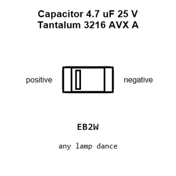

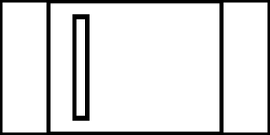

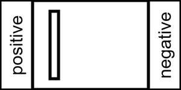

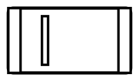

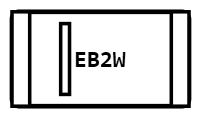

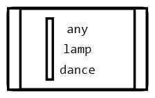

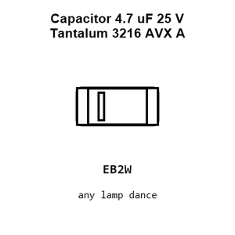

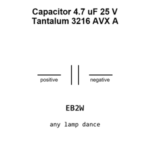

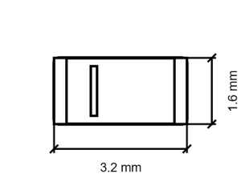

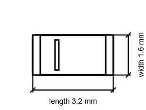

[View this part on GitHub](https://github.com/oomlout/oomp_electronic_version_5/tree/main/parts/electronic_capacitor_3216_avx_a_tantalum_4_7_micro_farad_25_volt_avx_taja475k025rnej)

[Browse this category](../../navigation/electronic/capacitor/3216_avx_a/tantalum/4_7_micro_farad/25_volt/avx/README.md)

---

This page is generated from the OOMP part definition by a Roboclick Jinja template. Edit the source taxonomy or template rather than this generated file.