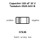
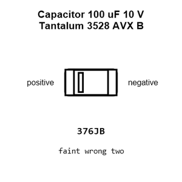
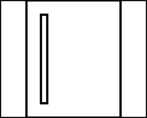
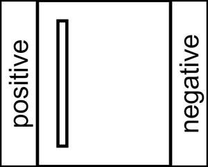
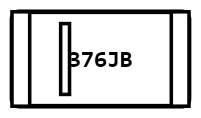
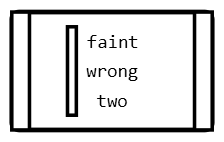
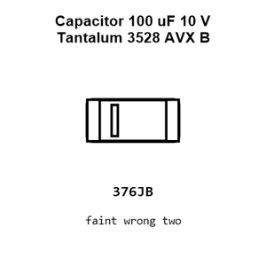
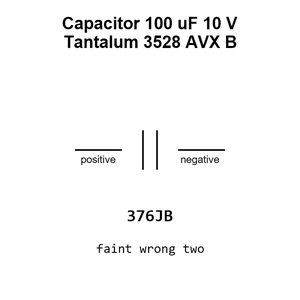
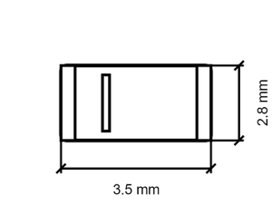
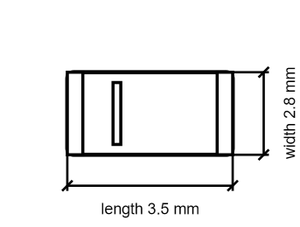

# Capacitor 100 uF 10 V Tantalum 3528 AVX B

`electronic_capacitor_3528_avx_b_tantalum_100_micro_farad_10_volt_avx_tajb107m010rnej`

Capacitor 100 uF 10 V Tantalum 3528 AVX B is an OOMP electronic capacitor definition. It uses the 3528 avx b package or form factor. Its nominal drawing size is 3.5 &#x00D7; 2.8 mm. The definition includes 2 documented pins.

## At a glance

| Detail | Value |
| --- | --- |
| OOMP ID | `electronic_capacitor_3528_avx_b_tantalum_100_micro_farad_10_volt_avx_tajb107m010rnej` |
| Type | Capacitor |
| Package / style | 3528 avx b |
| Nominal size | 3.5 &#x00D7; 2.8 mm |
| Documented pins | 2 |

## Classification

| Level | Value |
| --- | --- |
| 1 | `electronic` |
| 2 | `capacitor` |
| 3 | `3528_avx_b` |
| 4 | `tantalum` |
| 5 | `100_micro_farad` |
| 6 | `10_volt` |
| 14 | `avx` |
| 15 | `tajb107m010rnej` |

## Nominal dimensions

| Measurement | Value |
| --- | ---: |
| Height | 2.1 mm |
| Length | 3.5 mm |
| Width | 2.8 mm |

## Identifiers

| Identifier | Value |
| --- | --- |
| Manufacturer part number | `TAJB107M010RNJ` |
| LCSC | [`C7196`](https://www.lcsc.com/product-detail/C7196.html) |
| JLCPCB | [`C7196`](https://jlcpcb.com/partdetail/-TAJB107M010RNJ/C7196) |

## Pins

| Pin | Name | Type |
| ---: | --- | --- |
| 1 | positive | passive |
| 2 | negative | passive |

## Datasheet

[View the datasheet](data/datasheet.pdf)

## Files

[KiCad symbol, machine-solder and hand-solder footprints](data/kicad/README.md) · [Availability and source masters](data/kicad/manifest.yaml)

[View this part on GitHub](https://github.com/oomlout/oomp_electronic_version_5/tree/main/parts/electronic_capacitor_3528_avx_b_tantalum_100_micro_farad_10_volt_avx_tajb107m010rnej)

[Browse this category](../../navigation/electronic/capacitor/3528_avx_b/tantalum/100_micro_farad/10_volt/avx/README.md)

---

This page is generated from the OOMP part definition by a Roboclick Jinja template. Edit the source taxonomy or template rather than this generated file.