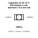
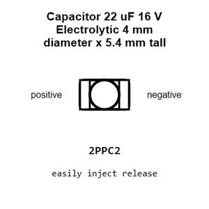
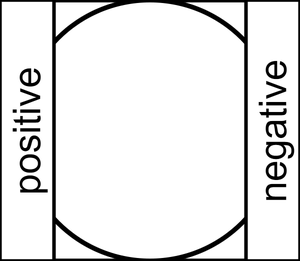
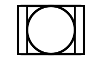
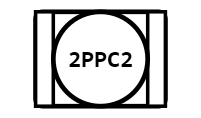
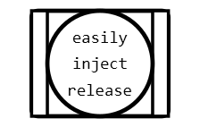
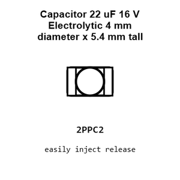
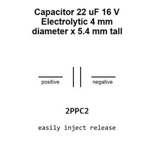
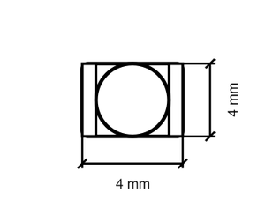

# Capacitor 22 uF 16 V Electrolytic 4 mm diameter x 5.4 mm tall

`electronic_capacitor_4_mm_diameter_5_4_mm_tall_electrolytic_22_micro_farad_16_volt`

Capacitor 22 uF 16 V Electrolytic 4 mm diameter x 5.4 mm tall is an OOMP electronic capacitor definition. It uses the 4 mm diameter 5 4 mm tall package or form factor. Its nominal drawing size is 4.0 &#x00D7; 4.0 mm. The definition includes 2 documented pins.

## At a glance

| Detail | Value |
| --- | --- |
| OOMP ID | `electronic_capacitor_4_mm_diameter_5_4_mm_tall_electrolytic_22_micro_farad_16_volt` |
| Type | Capacitor |
| Package / style | 4 mm diameter 5 4 mm tall |
| Nominal size | 4.0 &#x00D7; 4.0 mm |
| Documented pins | 2 |

## Classification

| Level | Value |
| --- | --- |
| 1 | `electronic` |
| 2 | `capacitor` |
| 3 | `4_mm_diameter_5_4_mm_tall` |
| 4 | `electrolytic` |
| 5 | `22_micro_farad` |
| 6 | `16_volt` |

## Nominal dimensions

| Measurement | Value |
| --- | ---: |
| Height | 5.4 mm |
| Length | 4.0 mm |
| Width | 4.0 mm |

## Identifiers

| Identifier | Value |
| --- | --- |
| Manufacturer part number | `RVT1C220M0405` |
| LCSC | [`C3356`](https://www.lcsc.com/product-detail/C3356.html) |
| JLCPCB | [`C3356`](https://jlcpcb.com/partdetail/HonorElec-RVT1C220M0405/C3356) |

## Pins

| Pin | Name | Type |
| ---: | --- | --- |
| 1 | positive | passive |
| 2 | negative | passive |

## Datasheet

[View the datasheet](data/datasheet.pdf)

## Files

[KiCad symbol, machine-solder and hand-solder footprints](data/kicad/README.md) · [Availability and source masters](data/kicad/manifest.yaml)

[View this part on GitHub](https://github.com/oomlout/oomp_electronic_version_5/tree/main/parts/electronic_capacitor_4_mm_diameter_5_4_mm_tall_electrolytic_22_micro_farad_16_volt)

[Browse this category](../../navigation/electronic/capacitor/4_mm_diameter_5_4_mm_tall/electrolytic/22_micro_farad/README.md)

---

This page is generated from the OOMP part definition by a Roboclick Jinja template. Edit the source taxonomy or template rather than this generated file.