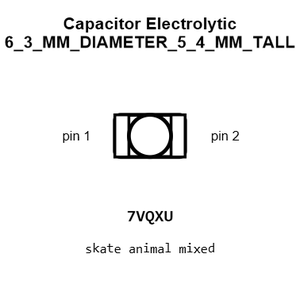
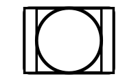
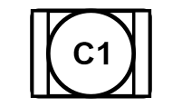
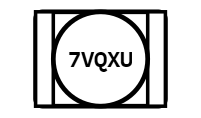
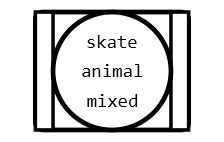
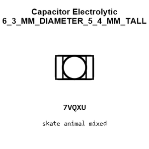
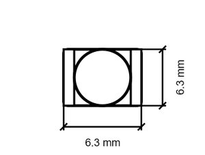
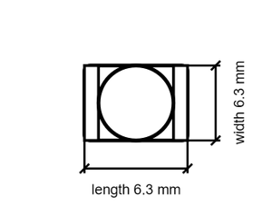

# Capacitor 220 uF 10 V Electrolytic 6.3 mm diameter x 5.4 mm tall

`electronic_capacitor_6_3_mm_diameter_5_4_mm_tall_electrolytic_220_micro_farad_10_volt`

Capacitor 220 uF 10 V Electrolytic 6.3 mm diameter x 5.4 mm tall is an OOMP electronic capacitor definition. It uses the 6 3 mm diameter 5 4 mm tall package or form factor. Its nominal drawing size is 6.3 &#x00D7; 6.3 mm.

## At a glance

| Detail | Value |
| --- | --- |
| OOMP ID | `electronic_capacitor_6_3_mm_diameter_5_4_mm_tall_electrolytic_220_micro_farad_10_volt` |
| Type | Capacitor |
| Package / style | 6 3 mm diameter 5 4 mm tall |
| Nominal size | 6.3 &#x00D7; 6.3 mm |

## Classification

| Level | Value |
| --- | --- |
| 1 | `electronic` |
| 2 | `capacitor` |
| 3 | `6_3_mm_diameter_5_4_mm_tall` |
| 4 | `electrolytic` |
| 5 | `220_micro_farad` |
| 6 | `10_volt` |

## Nominal dimensions

| Measurement | Value |
| --- | ---: |
| Length | 6.3 mm |
| Width | 6.3 mm |

## Files

[KiCad symbol, machine-solder and hand-solder footprints](data/kicad/README.md) · [Availability and source masters](data/kicad/manifest.yaml)

[View this part on GitHub](https://github.com/oomlout/oomp_electronic_version_5/tree/main/parts/electronic_capacitor_6_3_mm_diameter_5_4_mm_tall_electrolytic_220_micro_farad_10_volt)

[Browse this category](../../navigation/electronic/capacitor/6_3_mm_diameter_5_4_mm_tall/electrolytic/220_micro_farad/README.md)

---

This page is generated from the OOMP part definition by a Roboclick Jinja template. Edit the source taxonomy or template rather than this generated file.