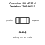
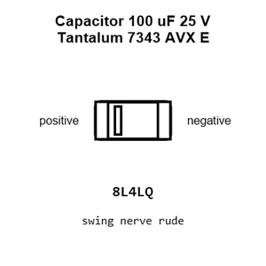
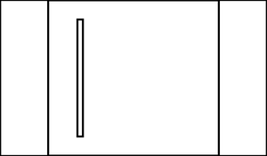
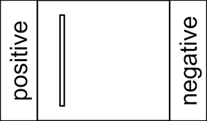
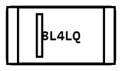
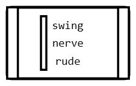
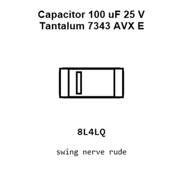
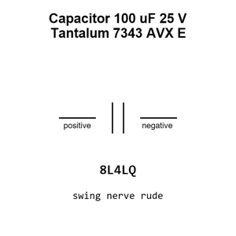
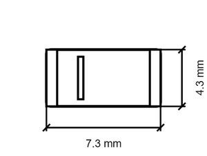
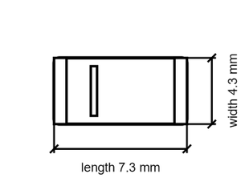

# Capacitor 100 uF 25 V Tantalum 7343 AVX E

`electronic_capacitor_7343_avx_e_tantalum_100_micro_farad_25_volt_avx_taje107m025rnej`

Capacitor 100 uF 25 V Tantalum 7343 AVX E is an OOMP electronic capacitor definition. It uses the 7343 avx e package or form factor. Its nominal drawing size is 7.3 &#x00D7; 4.3 mm. The definition includes 2 documented pins.

## At a glance

| Detail | Value |
| --- | --- |
| OOMP ID | `electronic_capacitor_7343_avx_e_tantalum_100_micro_farad_25_volt_avx_taje107m025rnej` |
| Type | Capacitor |
| Package / style | 7343 avx e |
| Nominal size | 7.3 &#x00D7; 4.3 mm |
| Documented pins | 2 |

## Classification

| Level | Value |
| --- | --- |
| 1 | `electronic` |
| 2 | `capacitor` |
| 3 | `7343_avx_e` |
| 4 | `tantalum` |
| 5 | `100_micro_farad` |
| 6 | `25_volt` |
| 14 | `avx` |
| 15 | `taje107m025rnej` |

## Nominal dimensions

| Measurement | Value |
| --- | ---: |
| Height | 4.3 mm |
| Length | 7.3 mm |
| Width | 4.3 mm |

## Identifiers

| Identifier | Value |
| --- | --- |
| Manufacturer part number | `TAJE107M025RNJ` |
| LCSC | [`C7230`](https://www.lcsc.com/product-detail/C7230.html) |
| JLCPCB | [`C7230`](https://jlcpcb.com/partdetail/-TAJE107M025RNJ/C7230) |

## Pins

| Pin | Name | Type |
| ---: | --- | --- |
| 1 | positive | passive |
| 2 | negative | passive |

## Datasheet

[View the datasheet](data/datasheet.pdf)

## Files

[KiCad symbol, machine-solder and hand-solder footprints](data/kicad/README.md) · [Availability and source masters](data/kicad/manifest.yaml)

[View this part on GitHub](https://github.com/oomlout/oomp_electronic_version_5/tree/main/parts/electronic_capacitor_7343_avx_e_tantalum_100_micro_farad_25_volt_avx_taje107m025rnej)

[Browse this category](../../navigation/electronic/capacitor/7343_avx_e/tantalum/100_micro_farad/25_volt/avx/README.md)

---

This page is generated from the OOMP part definition by a Roboclick Jinja template. Edit the source taxonomy or template rather than this generated file.