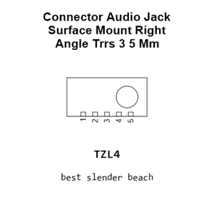
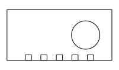
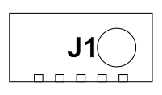
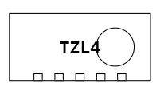
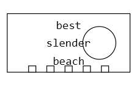
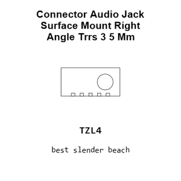
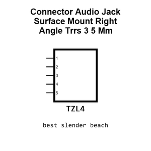
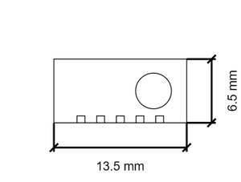
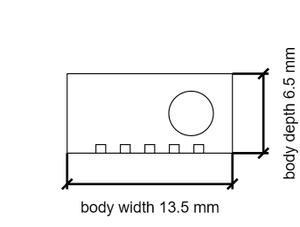
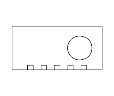

# Connector Audio Jack Surface Mount Right Angle Trrs 3 5 Mm Audio Jack 3 5 Mm Trrs

`electronic_connector_audio_jack_surface_mount_right_angle_trrs_3_5_mm_audio_jack_3_5_mm_trrs`

Connector Audio Jack Surface Mount Right Angle Trrs 3 5 Mm Audio Jack 3 5 Mm Trrs is an OOMP electronic connector definition. It uses the audio jack package or form factor. Its nominal drawing size is 13.5 &#x00D7; 6.5 mm. The definition includes 5 documented pins.

## At a glance

| Detail | Value |
| --- | --- |
| OOMP ID | `electronic_connector_audio_jack_surface_mount_right_angle_trrs_3_5_mm_audio_jack_3_5_mm_trrs` |
| Type | Connector |
| Package / style | audio jack |
| Nominal size | 13.5 &#x00D7; 6.5 mm |
| Documented pins | 5 |

## Classification

| Level | Value |
| --- | --- |
| 1 | `electronic` |
| 2 | `connector` |
| 3 | `audio_jack` |
| 5 | `surface_mount_right_angle` |
| 7 | `trrs` |
| 8 | `3_5_mm` |
| 15 | `audio_jack_3_5_mm_trrs` |

## Nominal dimensions

| Measurement | Value |
| --- | ---: |
| Length | 13.5 mm |
| Width | 6.5 mm |

## Pins

| Pin | Name | Type |
| ---: | --- | --- |
| 1 | 1 | signal |
| 2 | 2 | signal |
| 3 | 3 | signal |
| 4 | 4 | signal |
| 5 | 5 | signal |

## Used in projects

| Project | Quantity | References | Explore |
| --- | ---: | --- | --- |
| [Project sparkfun/SparkFun_Audio_Player_Breakout_MY1690X-16S Audio Player Breakout MY1690X-16S current](https://github.com/sparkfun/SparkFun_Audio_Player_Breakout_MY1690X-16S) | 1 | J1 | [Board explorer](https://oomlout.github.io/oomp_electronic_version_5/parts/oomp_project_github_sparkfun_spark_fun_audio_player_breakout_my1690_x_16_s_audio_player_breakout_my1690x_16s_current/board_explorer.html) · [OOMP project](https://github.com/oomlout/oomp_electronic_version_5/tree/main/parts/oomp_project_github_sparkfun_spark_fun_audio_player_breakout_my1690_x_16_s_audio_player_breakout_my1690x_16s_current) |
| [Project sparkfun/SparkFun_Qwiic_Current_Sensor_ADE7953 Qwiic Current Sensor ADE7953 current](https://github.com/sparkfun/SparkFun_Qwiic_Current_Sensor_ADE7953) | 1 | J5 | [Board explorer](https://oomlout.github.io/oomp_electronic_version_5/parts/oomp_project_github_sparkfun_spark_fun_qwiic_current_sensor_ade7953_qwiic_current_sensor_ade7953_current/board_explorer.html) · [OOMP project](https://github.com/oomlout/oomp_electronic_version_5/tree/main/parts/oomp_project_github_sparkfun_spark_fun_qwiic_current_sensor_ade7953_qwiic_current_sensor_ade7953_current) |

## Files

[KiCad symbol, machine-solder and hand-solder footprints](data/kicad/README.md) · [Availability and source masters](data/kicad/manifest.yaml)

[View this part on GitHub](https://github.com/oomlout/oomp_electronic_version_5/tree/main/parts/electronic_connector_audio_jack_surface_mount_right_angle_trrs_3_5_mm_audio_jack_3_5_mm_trrs)

[Browse this category](../../navigation/electronic/connector/audio_jack/surface_mount_right_angle/trrs/3_5_mm/README.md)

---

This page is generated from the OOMP part definition by a Roboclick Jinja template. Edit the source taxonomy or template rather than this generated file.