# Connector Easyc 1.25 mm pitch Surface Mount Right Angle 4 pin JST

`electronic_connector_easyc_1_25_mm_pitch_surface_mount_right_angle_4_pin_jst_sm04b_gh_tf`

Connector Easyc 1.25 mm pitch Surface Mount Right Angle 4 pin JST is an OOMP electronic connector definition. It uses the easyc package or form factor. Its nominal drawing size is 10.0 &#x00D7; 5.0 mm.

## At a glance

| Detail | Value |
| --- | --- |
| OOMP ID | `electronic_connector_easyc_1_25_mm_pitch_surface_mount_right_angle_4_pin_jst_sm04b_gh_tf` |
| Type | Connector |
| Package / style | easyc |
| Nominal size | 10.0 &#x00D7; 5.0 mm |

## Classification

| Level | Value |
| --- | --- |
| 1 | `electronic` |
| 2 | `connector` |
| 3 | `easyc` |
| 4 | `1_25_mm_pitch` |
| 5 | `surface_mount_right_angle` |
| 6 | `4_pin` |
| 14 | `jst` |
| 15 | `sm04b_gh_tf` |

## Nominal dimensions

| Measurement | Value |
| --- | ---: |
| Length | 10.0 mm |
| Width | 5.0 mm |

## Files

[KiCad symbol, machine-solder and hand-solder footprints](data/kicad/README.md) · [Availability and source masters](data/kicad/manifest.yaml)

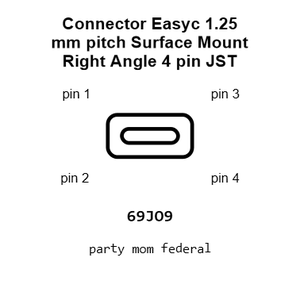

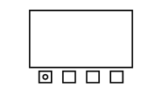

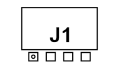

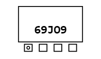

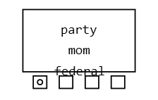

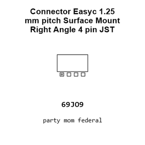

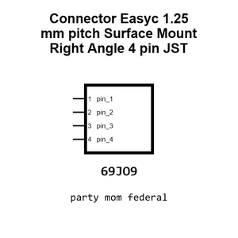

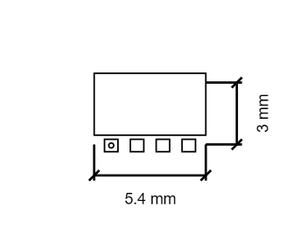

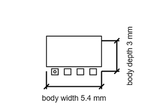

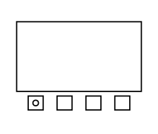

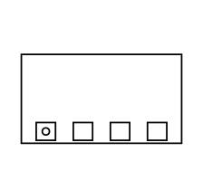

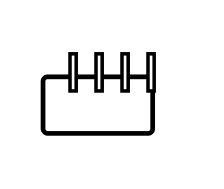

[View this part on GitHub](https://github.com/oomlout/oomp_electronic_version_5/tree/main/parts/electronic_connector_easyc_1_25_mm_pitch_surface_mount_right_angle_4_pin_jst_sm04b_gh_tf)

[Browse this category](../../navigation/electronic/connector/easyc/1_25_mm_pitch/surface_mount_right_angle/4_pin/jst/README.md)

---

This page is generated from the OOMP part definition by a Roboclick Jinja template. Edit the source taxonomy or template rather than this generated file.