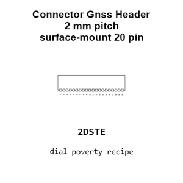
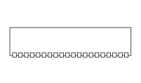
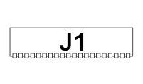
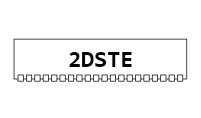
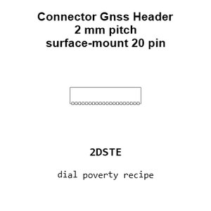
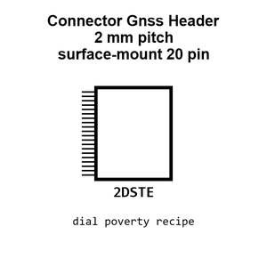
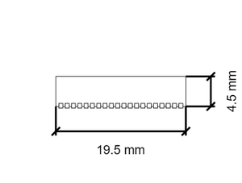
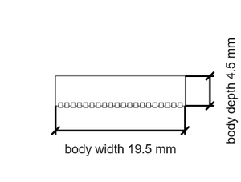
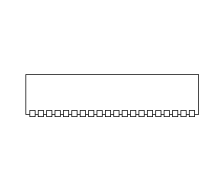

# Connector Gnss Header 2 mm pitch surface-mount 20 pin Plug In

`electronic_connector_gnss_header_2_mm_pitch_surface_mount_20_pin_plug_in_conn_02x10_gnss_plug_in_header`

Connector Gnss Header 2 mm pitch surface-mount 20 pin Plug In is an OOMP electronic connector definition. It uses the gnss header package or form factor. Its nominal drawing size is 20.0 &#x00D7; 5.0 mm. The definition includes 20 documented pins.

## At a glance

| Detail | Value |
| --- | --- |
| OOMP ID | `electronic_connector_gnss_header_2_mm_pitch_surface_mount_20_pin_plug_in_conn_02x10_gnss_plug_in_header` |
| Type | Connector |
| Package / style | gnss header |
| Nominal size | 20.0 &#x00D7; 5.0 mm |
| Documented pins | 20 |

## Classification

| Level | Value |
| --- | --- |
| 1 | `electronic` |
| 2 | `connector` |
| 3 | `gnss_header` |
| 4 | `2_mm_pitch` |
| 5 | `surface_mount` |
| 6 | `20_pin` |
| 7 | `plug_in` |
| 15 | `conn_02x10_gnss_plug_in_header` |

## Nominal dimensions

| Measurement | Value |
| --- | ---: |
| Length | 20.0 mm |
| Width | 5.0 mm |

## Pins

| Pin | Name | Type |
| ---: | --- | --- |
| 1 | 1 | signal |
| 2 | 2 | signal |
| 3 | 3 | signal |
| 4 | 4 | signal |
| 5 | 5 | signal |
| 6 | 6 | signal |
| 7 | 7 | signal |
| 8 | 8 | signal |
| 9 | 9 | signal |
| 10 | 10 | signal |
| 11 | 11 | signal |
| 12 | 12 | signal |
| 13 | 13 | signal |
| 14 | 14 | signal |
| 15 | 15 | signal |
| 16 | 16 | signal |
| 17 | 17 | signal |
| 18 | 18 | signal |
| 19 | 19 | signal |
| 20 | 20 | signal |

## Used in projects

| Project | Quantity | References | Explore |
| --- | ---: | --- | --- |
| [Project sparkfun/SparkFun_GNSS_Flex_Breakout GNSS Flex Breakout current](https://github.com/sparkfun/SparkFun_GNSS_Flex_Breakout) | 2 | J11, J12 | [Board explorer](https://oomlout.github.io/oomp_electronic_version_5/parts/oomp_project_github_sparkfun_spark_fun_gnss_flex_breakout_gnss_flex_breakout_current/board_explorer.html) · [OOMP project](https://github.com/oomlout/oomp_electronic_version_5/tree/main/parts/oomp_project_github_sparkfun_spark_fun_gnss_flex_breakout_gnss_flex_breakout_current) |

## Files

[KiCad symbol, machine-solder and hand-solder footprints](data/kicad/README.md) · [Availability and source masters](data/kicad/manifest.yaml)

[View this part on GitHub](https://github.com/oomlout/oomp_electronic_version_5/tree/main/parts/electronic_connector_gnss_header_2_mm_pitch_surface_mount_20_pin_plug_in_conn_02x10_gnss_plug_in_header)

[Browse this category](../../navigation/electronic/connector/gnss_header/2_mm_pitch/surface_mount/20_pin/plug_in/README.md)

---

This page is generated from the OOMP part definition by a Roboclick Jinja template. Edit the source taxonomy or template rather than this generated file.